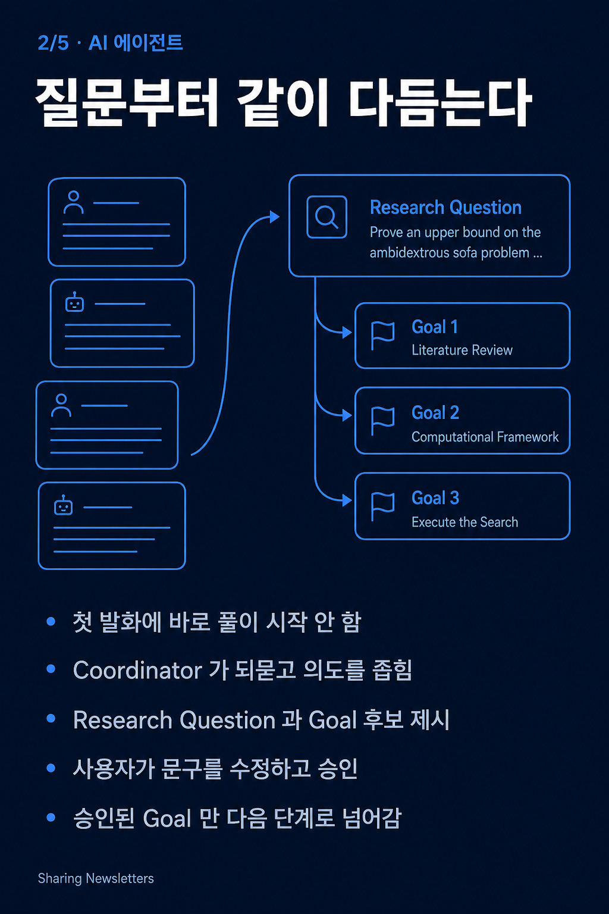
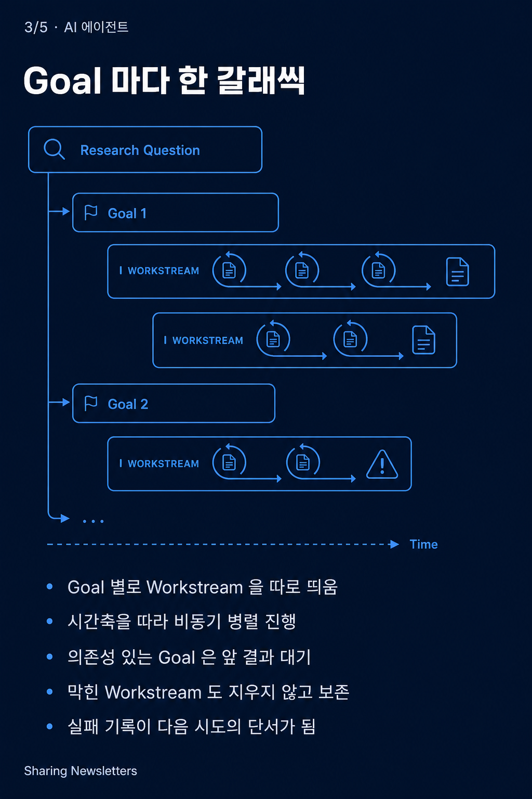
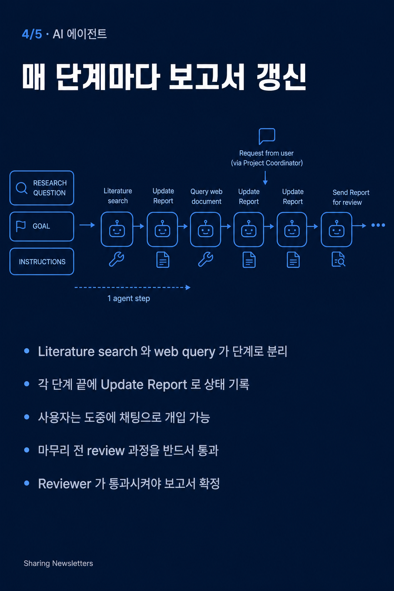
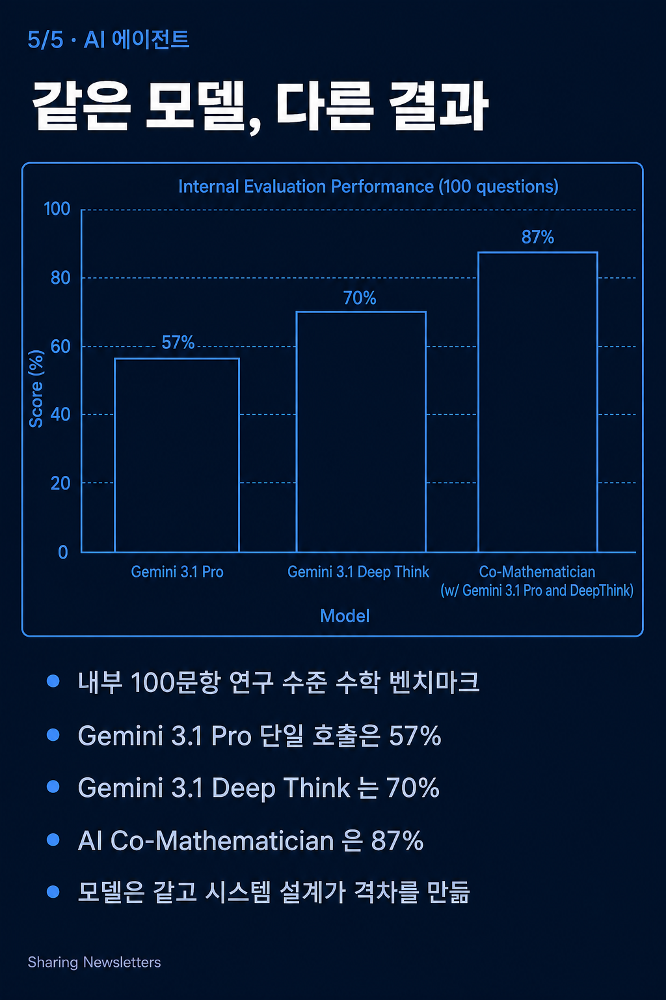

# AI Co-Mathematician — 시스템 한눈에 보기

논문의 핵심 그림 5장을 인포그래픽 카드로 재해석. 카드 한 장 = 정보 한 단위.

*Project Coordinator 가 Workstream Coordinator 를 거느리는 4계층 에이전트 조직.*

*사용자 발화를 Research Question 과 Goal 들로 다듬는 Initial Exploration 단계.*

*Goal 별 Workstream 을 병렬로 돌리고 막힘은 일급 시민으로 기록한다.*

*한 Workstream 안에서는 Update Report 와 리뷰가 강제되며 사용자가 도중에 끼어들 수 있다.*

*내부 100문항 벤치마크에서 같은 모델군 위에 시스템 디자인만으로 격차가 벌어진다.*

자세한 내용은 [한 페이지 요약](..) 또는 [상세 시리즈](../details/01-overview-and-context/) 참고.

## 출처

- https://arxiv.org/html/2605.06651
