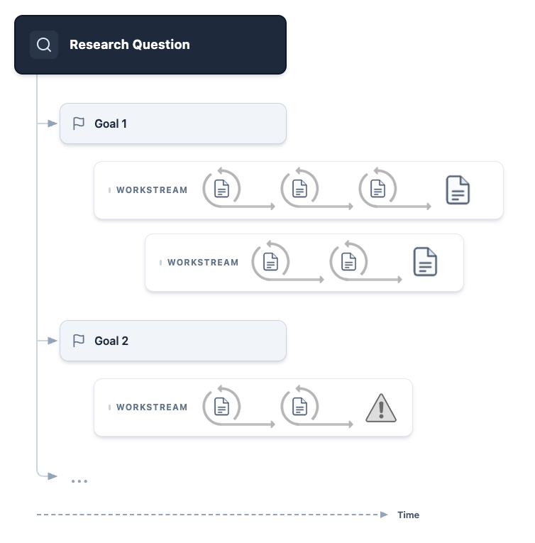

# 실제 사용 흐름

> 원본: [arxiv.org/abs/2605.06651](https://arxiv.org/abs/2605.06651)

[3편](03-architecture/) 의 4계층 + 메시징 + 파일시스템 위에서 사용자가 한 프로젝트를 어떻게 굴리는지를 단계별로. 논문이 walkthrough 챕터 (Section 3) 로 풀어둔 흐름을 따라간다.

## 단계 0. 사용자의 첫 발화

walkthrough 의 출발점은 *"sofa problem 의 변형 — 변형 두 개의 upper bound 가 미해결인데 — 에 대해 작업을 시작하고 싶다"* 같은 사용자 발화. 시스템이 여기서 바로 일을 시작하지 않는 것이 핵심.

## 단계 1. Initial Exploration — 의도를 좁히기

Project Coordinator 가 사용자 발화를 받아 *대화* 를 연다. 즉시 작업 위임 안 함.

논문이 인용한 실제 응답 예:

> "From the text, Baek has already proved that Gerver's lower bound is sharp for the classic sofa problem. However, the upper bounds for the other two variants are still open: ... Would you like to focus on one in particular, or both? And are you aiming to prove that a specific lower bound is sharp, or simply establish any new, rigorous upper bound?"

사용자가 의도를 추가로 좁히면, Project Coordinator 는 그것을 Research Question 과 여러 Goal 로 형식화해 사용자에게 다시 보여준다.

*USER ↔ COORDINATOR AGENT 채팅에서 Research Question ("Prove an upper bound on the ambidextrous sofa problem...") 이 도출되고, 그 아래 Goal 1 (Literature Review), Goal 2 (Computational Framework), Goal 3 (Execute the Search) 로 분해.*

흐름.

1. 사용자 발화
2. Coordinator 의 되묻기 (의도 명료화)
3. 사용자가 의도 추가 명시
4. Coordinator 가 Research Question + Goals 로 형식화 → 사용자에게 보여줌
5. 사용자가 wording 손보고 승인
6. 다음 단계로

이 과정이 인터페이스 안에 명시적으로 끼어 있다는 점이 단발 LLM 호출과 가장 큰 차이.

## 단계 2. Branching the Research — 워크스트림 분기

Goal 이 정해지면 Project Coordinator 가 각 Goal 에 워크스트림 코디네이터를 붙여 병렬로 돌림.

*Research Question 이 Goal 1·2·... 로 갈라지고, 각 Goal 안에서 여러 워크스트림이 시간축을 따라 진행. 한 워크스트림은 막힐 수 있고 (warning 아이콘), 시스템은 그걸 일급으로 기록.*

분기 패턴.

- **1 Goal → 1 Workstream**: 기본
- **1 Goal → N Workstreams**: 같은 골을 다른 접근으로 동시 탐색
- **의존이 있는 Goal**: 의존 푸려는 다른 Goal 결과가 나올 때까지 워크스트림 안 띄움 가능

각 워크스트림 코디네이터가 받는 입력.

- 승인된 Research Question 의 statement
- 자기가 책임지는 Goal 의 statement
- Project Coordinator 가 추가하는 specific instructions (있는 경우)

워크스트림이 다양한 활동을 할 수 있다는 점이 강조됨 — 한 워크스트림은 정리 증명, 다른 워크스트림은 코드로 수치 실험, 또 다른 워크스트림은 문헌 연구. 이 다양성이 [원칙 1 (정리 증명 외 영역)](02-design-principles/#원칙-1-정리-증명으로-환원하지-않는다) 의 직접 결과.

## 단계 3. Workstream Execution — 한 워크스트림 안에서

워크스트림 코디네이터는 자기 안에서 직선 시퀀스로 일을 진행.

*Goal + Instructions 를 받은 워크스트림이 Literature search → Update Report → Query web document → Update Report → 사용자 요청 처리 → Update Report → Send Report for review 식으로 step-by-step 진행. 각 단계는 1 agent step.*

한 워크스트림이 보여주는 패턴.

- 매 step 마다 *Update Report* — 결과물 (working paper) 이 점진적으로 자라남, 마지막 한 번에 토해지는 게 아님
- 도구 사용 (wrench 아이콘) 과 자체 추론 (보고서 갱신) 이 번갈아 나옴
- 사용자가 *Project Coordinator 를 통해* 워크스트림 한복판에 요청을 던질 수 있음 — 그게 다음 step 의 입력 ("Request from user (via Project Coordinator)")
- 마지막에 *Send Report for review* 가 강제됨 — 리뷰어 에이전트가 한 번 더 점검하지 않으면 워크스트림 종료 안 됨

**핵심**: "비동기 협업" 이 추상 슬로건이 아니라 step 단위로 사용자 입력을 받아들일 수 있는 구체적 인터페이스.

## 단계 4. Interactive Steering + Hard Constraints (논문 §3.3)

walkthrough 챕터에서 가장 기술적으로 두드러지는 부분. *standard AI 에이전트는 어려운 문제에서 invalid shortcut 을 찾거나 lemma 를 환각하거나 디테일을 hand-wave 하거나 너무 일찍 success 를 claim* 하는데, 이 시스템은 그 실패 모드를 *hard programmatic constraints + active human steering* 으로 막음.

### Hard Constraints — sub-agent 에 거는 강한 제약

코드 sub-agent 예시 (논문 인용):

- 코드를 *finished* 로 마킹할 수 없음, 다음 둘이 모두 충족될 때까지:
    1. 테스트 통과
    2. 리뷰어 에이전트가 코드와 골든 값의 valid 함을 승인
- 리뷰어가 거듭 거절하면 워크스트림 코디네이터가 *blocked* 상태로 정지
- *조용히 재시작하지 않음* — 실패한 시도는 공유 파일시스템에 영구 기록 (원칙 7)
- Project Coordinator 가 그 기록을 읽고 사용자에게 alert

### Active Human Steering — 사용자가 끼어들기

위 시나리오의 alert 인용:

> "Our initial implementation of the search is not efficient enough to find the result that we need, and there aren't many other examples in the literature. Do you have a mathematical intuition for a better pruning strategy we can apply? More details on the current approach can be found in the following document."

사용자가 채팅에서 응답 가능한 행동.

- 메시지로 직관 제공 (예: *topological pruning heuristic*)
- 새 워크스트림을 추가로 띄우라고 Coordinator 에 지시 (다른 bounding strategy 동시 탐색)
- 현재 워크스트림은 그대로 진행되게 두기

**핵심**: Hard constraint 가 *조용히 잘못된 방향으로 빠지는* 실패 모드를 막고, Active steering 이 *잠겨 있는* 실패 모드를 막음. 두 메커니즘이 함께 작동.

## 단계 5. The Final Output — Working Paper (논문 §3.4)

워크스트림이 자기 골을 끝내면 결과물은 *transient chat message* 가 아닌 *compiled and reviewed LaTeX write-up*. 사용자가 워크스트림을 열면 prominent 하게 노출됨.

논문이 명시한 working paper 의 4가지 요건.

| 요건 | 내용 |
| --- | --- |
| Exposition | 최종 결과뿐 아니라 결과에 이른 *연구 과정* 도 본문에 포함. 어떤 시도를 거쳐 왔는지 |
| Margin Annotations | 마진 노트로 추가 정보 명시. 예: *"[Pruning heuristic derived from user suggestion; baseline bound of 2.2195 sourced from paper at arxiv.org/abs/…]"* |
| Internal Linking | 외부 문헌 인용뿐 아니라 에이전트들이 만든 *내부 문서들* 에도 링크. 사용자가 공유 파일시스템 audit 진입점 |
| Review Process | 리포트가 *finalized* 마킹되기 전 여러 AI 리뷰어 에이전트의 paper review 통과 강제. 리뷰어들은 reference·코드 출력·논리적 정확성 cross-check 도구를 가짐 |

리뷰 프로세스의 디테일.

- 리뷰어 에이전트는 review round 사이에 *persist* — 같은 리뷰어가 반복적으로 보면서 리포트가 다듬어짐
- 모든 리뷰어가 formally approve 해야 종료
- 무한 루프 방지: 워크스트림 코디네이터가 review 를 통과 못 하면 Project Coordinator 에 escalate. 이 경우 워크스트림은 *unfinished* 로 마킹되고, escalation 메시지가 사용자에게 surfaced — 사용자가 *"이 리포트엔 미해결 이슈가 있을 수 있다"* 를 즉시 알 수 있게.

이 마지막 메커니즘이 [원칙 6 (불확실성 라이프사이클)](02-design-principles/#원칙-6-불확실성-라이프사이클-추적관리소통) 의 *communicate* 단계의 구현.

## 흐름 요약

| 단계 | 누가 | 무엇을 | 핵심 메커니즘 |
| --- | --- | --- | --- |
| 0 | 사용자 | 첫 발화 | — |
| 1 (Initial Exploration) | Project Coordinator + 사용자 | 의도 → Research Question + Goals | 되묻기, 형식화, 사용자 승인 |
| 2 (Branching) | Project Coordinator | Goals → 워크스트림들 | 병렬 분기, instructions 전달 |
| 3 (Execution) | Workstream Coordinator + sub-agents | step-by-step 진행 | working paper 점진 갱신, 사용자 끼어들기, 리뷰 강제 |
| 4 (Steering + Constraints) | 사용자 + Project Coordinator | 막힌 곳 surface, 사용자 개입 | hard constraints, alert, active steering |
| 5 (Final Output) | Workstream Coordinator + 리뷰어 | LaTeX working paper 완성 | exposition, margin notes, internal links, review process |

## 다음 편

이 흐름 위에서 시스템이 실제로 어떤 결과를 내고 어디서 무너지는지 — 평가 결과 (내부 100문항, FrontierMath Tier 4, 실제 미해결 문제), 한계, 시스템 차원 위험, 사내 적용 시사점. 다음 편 → [평가, 한계, 시사점](05-results-and-limits/).

## 출처

- https://arxiv.org/html/2605.06651
