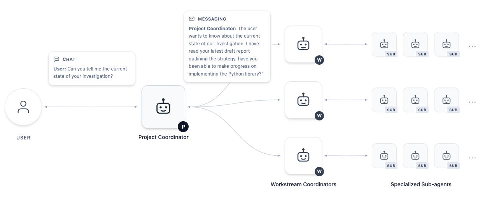
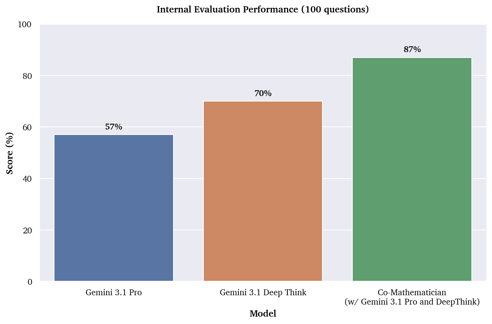

# AI Co-Mathematician — 수학자와 비동기로 협업하는 에이전트 워크벤치

> 원본: [arxiv.org/abs/2605.06651](https://arxiv.org/abs/2605.06651)

수학자가 풀려는 열린 문제를 옆에서 돕는 에이전트 워크벤치. 자율 실행이 아니라 사용자와 비동기로 협업하는 상태 보존 환경이 핵심이다. FrontierMath Tier 4에서 48%로 평가된 시스템 중 가장 높은 점수, 내부 100문항 벤치마크에선 Gemini Deep Think 대비 +17%p.

## 핵심 포인트

- **자율 실행이 아니라 협업 워크벤치**. 끝까지 혼자 푸는 에이전트가 아니라 사용자가 늘 옆에 있는 비동기 워크스페이스. 가설을 던졌다가 회수하고, 워크스트림 여러 개를 병렬로 굴리는 흐름.
- **계층형 멀티 에이전트**. User → Project Coordinator → 워크스트림 코디네이터 → 전문 서브 에이전트의 4계층. 통신은 비동기 메시징과 공유 파일시스템.
- **실패한 시도를 버리지 않는다**. 실패 가설과 마진 노트를 남겨 사용자가 진행 상황과 불확실성을 볼 수 있게 한다. 잘 조판된 LaTeX가 만드는 가짜 엄밀성을 견제.
- **벤치마크 SOTA**. FrontierMath Tier 4에서 48% (48문제 중 23개). 내부 100문항 벤치마크에서 Gemini 3.1 Pro 57% / Deep Think 70% 대비 87%.
- **실제 연구 성과**. Kourovka 문제 21.10 해결, Stirling 계수 추측 증명, Hamiltonian 시스템 보조정리 증명 등 실제 미해결 문제·추측에 대한 결과.

## 한 페이지 요약

기존 수학용 AI 시도는 두 갈래였다. 한쪽은 Lean·Coq 같은 정형 증명 시스템으로 정확성을 잡으려 했고, 다른 한쪽은 단발 LLM 으로 자연어 풀이를 시켰다. 이 논문은 그 사이에 친 "워크벤치" 라 부를 만한 형태를 제시한다. 수학자의 실제 워크플로우가 직선이 아니라 ideation → 문헌 탐색 → 계산 실험 → 정리 증명 → 이론 구성이 뒤섞이고 되풀이되는 구조라는 관찰에서 출발한다.

이 구조를 받치는 것이 4계층 에이전트 조직이다. 사용자는 Project Coordinator 와만 대화하고, 그 아래로 일이 위임된다.

*User → Project Coordinator → 워크스트림 코디네이터 → 전문 서브 에이전트. 모든 통신은 비동기 메시징과 공유 파일시스템 위에서. 사용자는 채팅으로만 끼어든다.*

내부 100문항 벤치마크 (전문 수학자가 만든, 코드 검증 가능한 연구급 문제) 에서 단발 호출 대비 격차가 두드러진다.

*내부 벤치마크 100문항. Gemini 3.1 Pro 57%, Gemini 3.1 Deep Think 70%, AI Co-Mathematician 87%.*

같은 시스템이 FrontierMath Tier 4 에서도 48% 로 평가된 AI 중 최고 점수. 단발 모델 호출에서 에이전트 구조로 넘어가며 점수가 두드러지게 뛴 점이 핵심이다.

"에이전트가 끝까지 혼자 푼다" 보다 "사람이 늘 옆에 있는 비동기 워크벤치" 가 더 멀리 갔다는 점이 흥미롭다. 사내 LLM 도구를 만들 때 자동화 수준을 무조건 높이는 게 답은 아닐 수 있다는 신호. 또 실패한 시도·중간 가설을 일급 시민으로 남기는 설계는 수학뿐 아니라 코드·문서 작업에서도 차용할 만하다.

## 자세히 보기

<!-- VERSIONS_START -->
1. [왜 또 다른 수학용 AI 인가](details/01-overview-and-context/) — 수학 워크플로우의 본성과 기존 AI 접근 (formal proof, zero-shot LLM) 의 한계, 그리고 이 논문이 그 사이에 친 "워크벤치" 라는 자리.
2. [7가지 설계 원칙](details/02-design-principles/) — 시스템 전반을 관통하는 7가지 원칙 — 정리 증명 외 영역, 의도의 좁힘, 네이티브 인공물, 비동기 협업, 단계별 노출, 불확실성 라이프사이클, 실패 보존.
3. [4계층 에이전트 아키텍처](details/03-architecture/) — 사용자 → Project Coordinator → 워크스트림 코디네이터 → 전문 서브 에이전트의 4계층 구조와 그 위에 깔린 비동기 메시징·공유 파일시스템.
4. [실제 사용 흐름](details/04-walkthrough/) — Initial Exploration → Branching the Research → Workstream Execution → Interactive Steering 과 Hard Constraints, 그리고 Final Output (working paper) 의 5단계 흐름.
5. [평가, 한계, 시사점](details/05-results-and-limits/) — 내부 100문항 / FrontierMath Tier 4 결과, 실제 미해결 문제 케이스, 4가지 한계와 3가지 시스템 위험, 사내 LLM 도구 디자인에의 시사점.

- [AI Co-Mathematician — 시스템 한눈에 보기 (카드 5장)](cards/) (카드 뉴스) — 4계층 에이전트, 의도 형식화, 워크스트림 분기, step-by-step 보고서 갱신, 벤치마크 결과를 카드 5장으로.
<!-- VERSIONS_END -->

## 출처

- https://arxiv.org/html/2605.06651
