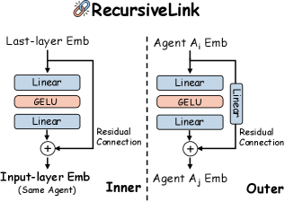

# 디자인 원칙 — RecursiveLink 의 안과 밖

> 원본: [arxiv.org/abs/2604.25917](https://arxiv.org/abs/2604.25917)

직전 편에서 RecursiveMAS 가 "에이전트들을 RLM 의 한 레이어처럼 보고, 텍스트를 거치지 않는 latent 루프로 묶는다" 는 큰 그림을 깔았다. 이 편에서는 그 루프를 실제로 가능하게 만드는 단 하나의 학습 가능한 부품, RecursiveLink 자체를 뜯어본다. 시스템 루프 구조나 학습 절차는 잠시 미뤄두고, 모듈 단위 설계 원칙에 집중한다.

## 왜 임베딩 공간 사이를 잇는 부품이 따로 필요한가

언어 모델의 마지막 레이어 hidden state 는 모델이 지금까지 만들어낸 의미를 가장 잘 압축한 벡터로 볼 수 있다. RecursiveMAS 가 텍스트를 거치지 않고 그 의미를 다음 forward 또는 다음 에이전트에 직접 전달하려면, 이 hidden state 를 "다음 단의 입력 임베딩이 사는 공간" 으로 옮겨주는 일종의 어댑터가 필요하다.

원문이 이 어댑터가 필요한 상황을 두 가지로 정리한다.

- Dense-to-Shallow Transition: 한 에이전트 안에서 직전 step 의 last-layer 임베딩을 다음 step 의 입력 임베딩으로 다시 집어넣는 경우. 마지막 레이어의 "꽉 찬" 표현을 입력 임베딩 레이어가 기대하는 "얕은" 표현 분포로 되돌려야 한다.
- Cross-Model Transition: 한 모델이 만든 latent 표현을 다른 모델의 입력으로 넘기는 경우. 모델마다 hidden dimension 도 다르고, 같은 차원이라도 임베딩 공간의 좌표계가 다르다.

두 transition 모두 공통적으로 "원본 의미는 최대한 보존하고, 두 공간 사이의 분포 차이만 흡수해야" 한다. 의미를 새로 학습하는 것이 아니라, 이미 만들어진 의미를 통역만 해주는 자리다. RecursiveLink 의 모든 설계 선택은 이 한 줄에서 따라 나온다.

*Figure 3. Inner Link 는 같은 에이전트 안에서 last-layer 임베딩을 다음 step 의 input 임베딩 공간으로 되돌린다. Outer Link 는 한 에이전트의 출력 임베딩을 다음 에이전트의 입력 임베딩 공간으로 옮기며, 차원이 다르면 residual 분기에 추가 linear 를 둔다.*

## Inner Link — 같은 에이전트 안의 통역사

Inner Link $g^{\text{in}}$ 는 한 에이전트가 auto-regressive 하게 latent thought 를 만들 때, 직전 step 의 last-layer 출력을 다음 step 의 입력으로 되돌리는 역할을 한다. 정의는 다음과 같다.

$$h_{\text{new}} = h + W_2 \, \text{GELU}(W_1 \, h)$$

여기서 $W_1, W_2$ 는 두 개의 standard linear layer, $\text{GELU}$ 는 활성화 함수, 그리고 $h + (\cdot)$ 의 residual connection 이 원래의 latent 의미를 그대로 보존한다. 식의 모양만 보면 흔한 transformer feed-forward block 의 축소판이지만, 역할은 전혀 다르다.

세 가지 요소를 하나씩 풀어 보면 의도가 분명해진다.

- **두 개의 linear 와 GELU 비선형성**: $W_1$ 으로 한 번 사영해 hidden 공간에 풀어둔 다음, GELU 를 한 번 거치고, $W_2$ 로 다시 원 차원으로 압축한다. 단일 linear 만 두면 affine 변환밖에 못 하므로, last-layer 분포와 input-embedding 분포 사이의 비선형적인 미스매치 (예: 둘 사이의 두꺼운 꼬리, 클러스터링 정도의 차이) 를 흡수할 수 없다.
- **Residual connection**: 학습 초기에 $W_1, W_2$ 가 작은 값으로 초기화되면 $h_{\text{new}} \approx h$ 가 된다. 즉, 학습 전 모듈은 거의 항등 함수이고, 학습이 진행되면서 "$h$ 에 더해야 할 분포 보정량" 만 점진적으로 학습한다. 이렇게 하면 원본 의미가 통째로 망가질 위험이 줄고, 학습 신호가 거의 0 인 단계에서도 시스템이 무너지지 않는다.
- **항등으로의 자연스러운 후퇴**: 위와 같은 이유로 RecursiveLink 가 잘 학습되지 않은 영역에서도 시스템은 "원본 hidden 을 그대로 다음 단에 흘려보낸" 보수적 동작으로 수렴한다.

그 결과 $h_{\text{new}}$ 는 다음 forward 의 입력으로 들어가 에이전트가 또 한 step 의 latent thought 를 만들고, 그 출력이 다시 Inner Link 를 통과한다. 텍스트 디코딩 없이 한 에이전트가 latent 공간에서 자신만의 사고를 연장할 수 있는 구조다.

## Outer Link — 이종 에이전트 사이의 통역사

Outer Link $g^{\text{out}}_{ij}$ 는 에이전트 $i$ 의 latent 출력을 에이전트 $j$ 의 입력 임베딩 공간으로 옮긴다. 두 에이전트가 같은 hidden dimension 을 쓰면 식은 Inner Link 와 거의 동일하다. 문제는 서로 다른 hidden dimension 을 가진 모델 (예: 1.7B Qwen 과 8B Llama) 을 연결해야 할 때다.

원문은 residual 분기 쪽에 추가 linear 를 하나 둬서 이 문제를 푼다. 개념적으로 쓰면 다음과 같다.

$$h^{j}_{\text{new}} = W_r \, h^{i} + W_2 \, \text{GELU}(W_1 \, h^{i})$$

여기서 $h^{i} \in \mathbb{R}^{d_i}$ 는 에이전트 $i$ 의 last-layer 임베딩이고, $W_r \in \mathbb{R}^{d_j \times d_i}$ 는 residual 분기에 추가된 차원 정렬용 linear, $W_1, W_2$ 는 비선형 분기의 두 linear 다. 차원이 같은 경우 ($d_i = d_j$) 에는 $W_r = I$ 로 두면 그대로 Inner Link 식이 된다.

이 한 곳의 추가 linear 덕분에 RecursiveLink 는 다음 두 조건을 동시에 만족한다.

- Heterogeneous 에이전트 — 모델 패밀리, 파라미터 수, hidden dim 이 모두 다른 LLM 들을 한 루프에 묶을 수 있다.
- 단일 학습 가능한 부품 — 모든 base LLM 의 파라미터는 동결하고, RecursiveLink 만 학습한다. 학습 비용이 시스템 전체에 대해 sub-1% 수준에 머무는 이유가 여기에 있다 (이 부분 수치는 4편에서 다룬다).

## 같은 식을 두 번 — 안과 밖이 모양을 공유하는 이유

Inner Link 와 Outer Link 는 사실상 같은 모양이다. 두 linear + 비선형 + residual. 차이는 residual 쪽에 차원 정렬용 linear 가 한 번 더 들어가느냐뿐이다.

이 형태 통일에는 두 가지 실용적 효과가 있다.

- 구현·학습 파이프라인이 단순해진다. 동일한 모듈 클래스 하나를 차원 인자만 바꿔 끼우면 된다.
- 학습 동학이 일관된다. 다음 편에서 살펴볼 inner-outer loop 학습은 같은 형태의 모듈을 두 단계로 나눠 풀므로, gradient 흐름을 분석할 때도 같은 가정을 그대로 재사용할 수 있다.

요약하면 RecursiveLink 는 "latent 의미를 새로 만드는 부품이 아니라, 이미 있는 의미를 옆 공간으로 통역해주는 부품" 이며, Inner / Outer 는 그 통역이 일어나는 두 종류의 다리다.

## 디자인 검증 — Residual + 2-Layer 가 왜 베스트인가

설계 의도가 그럴듯해도 직접 실험으로 받쳐주지 않으면 설득력이 없다. 원문은 §6 의 ablation 에서 RecursiveLink 의 네 가지 변형을 같은 학습/평가 setup 으로 비교했다.

| RecursiveLink 변형 | Math500 | GPQA-D | LiveCodeBench |
| --- | --- | --- | --- |
| 1-Layer | 84.4 | 63.2 | 40.1 |
| Res + 1-Layer | 86.7 | 65.3 | 41.4 |
| 2-Layer | 85.6 | 64.5 | 40.5 |
| **Res + 2-Layer (제안)** | **88.0** | **66.2** | **42.9** |

표에서 읽히는 패턴은 두 가지다.

- **Residual 자체의 효과**: 같은 1-layer 구조에서 residual 만 더해도 Math500 84.4 -> 86.7, GPQA-D 63.2 -> 65.3 로 일관되게 오른다. residual 이 그냥 "있어도 그만" 인 장식이 아니라, 학습 가능한 부분이 처음부터 작은 보정량으로 시작하도록 잡아주는 기둥임을 보여준다. 특히 GPQA-D 에서는 Res + 1-Layer (65.3) 가 plain 2-Layer (64.5) 보다도 높다. 단순히 파라미터를 늘리는 것보다 "원본을 보존" 하는 구조가 더 중요했다는 뜻이다.
- **두 번째 linear 의 효과**: residual 이 있다는 가정 위에서 1-layer -> 2-layer 로 가면 Math500 86.7 -> 88.0, GPQA-D 65.3 -> 66.2 로 한 번 더 오른다. 비선형 분기에 표현력을 한 단계 더 줘야 last-layer 와 input embedding 사이의 분포 미스매치를 충분히 흡수할 수 있다는 신호다.

두 효과는 곱하는 관계가 아니라 더하는 관계에 가깝지만, 어쨌든 둘 다 있어야 모든 벤치마크에서 최고치가 나온다. 원문이 명시하듯 이 패턴은 "latent semantics 를 보존하면서 분포 shift 만 학습한다" 는 설계 직관과 정확히 들어맞는다.

## 한 줄로 요약하는 설계 의도

RecursiveLink 의 모든 선택은 한 문장으로 회수된다. **"이미 모델이 만들어낸 의미를 망가뜨리지 않고, 옆 공간이 그것을 알아들을 수 있게 분포만 살짝 비틀어 준다."**

- Residual 은 의미 보존을 책임진다. 학습 가능한 부분이 처음부터 작은 보정량으로 시작하고, 학습이 끝나도 원본 $h$ 가 식 안에 그대로 남는다.
- 두 linear + GELU 는 분포 shift 만 학습한다. 비선형 한 번을 사이에 끼워 affine 으로는 못 잡는 미스매치까지 흡수한다.
- Inner 와 Outer 는 같은 형태를 공유한다. Outer 만 차원 정렬용 linear 가 추가될 뿐, 두 다리의 정신은 같다.

이 모듈 하나로 단일 에이전트 안의 latent thought 사슬과 이종 에이전트 사이의 hidden state 사슬이 동시에 가능해지고, 시스템 전체는 텍스트 디코딩 없이 한 덩어리의 latent 루프로 묶인다. 다음 편에서는 이 부품들을 실제로 어떻게 연결해 "에이전트들을 잠재 루프로 묶은 시스템" 이 작동하는지, 그 루프의 펼침과 닫힘을 따라간다.

다음 편: [아키텍처 — 에이전트를 잠재 루프로 묶기](03-architecture-and-loop.md)

## 출처

- https://arxiv.org/abs/2604.25917
