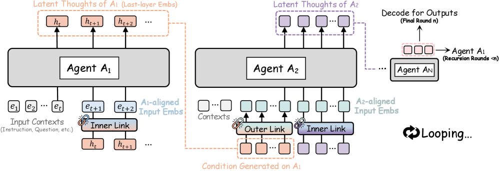

# 아키텍처 — 에이전트를 잠재 루프로 묶기

> 원본: [arxiv.org/abs/2604.25917](https://arxiv.org/abs/2604.25917)

앞 편에서 본 RecursiveLink — inner link 와 outer link — 는 두 개의 작은 부품일 뿐이다. 그것만으로는 멀티에이전트 시스템이 되지 않는다. 이 편에서는 그 부품들을 실제로 어떻게 끼워 넣어 *시스템 전체가 하나의 재귀 함수처럼 동작하는지* 를 따라간다. 핵심 관점은 단순하다. **각 에이전트를 RLM 의 한 layer 로 간주한다.** 그러면 트랜스포머 안에서 layer 가 hidden 을 흘려 보내듯, 에이전트들 사이에서도 같은 방식으로 latent thought 가 흐른다.

기존 멀티에이전트 시스템과의 차이를 한 가지만 더 미리 짚어 두자. 통상의 MAS 에서 각 에이전트는 *완성된 문장* 을 출력 단위로 삼는다. 즉, 한 에이전트의 생각은 어휘 격자 위의 한 점 — 토큰 시퀀스 — 으로 양자화돼야만 다음 에이전트에게 전달된다. RecursiveMAS 는 이 양자화를 시스템의 *마지막 라운드 한 번* 으로 미룬다. 중간에서는 연속 벡터 그대로 흐른다. 이 작은 결정이 잠시 뒤 복잡도 분석에서 한 자릿수의 비용 차이를 만들고, 다음 편에서 다룰 그래디언트 안정성에서도 핵심 원인이 된다.

## 관점 — 에이전트는 RLM 의 한 layer

Recursive language model 은 트랜스포머의 layer 들을 잔차 스트림 (residual stream) 으로 잇고, 그 스트림을 반복적으로 돌려 추론 깊이를 키운다. 한 줄로 요약하면, layer 의 출력 hidden 이 layer 의 입력 hidden 으로 다시 들어오는 구조다. RecursiveMAS 는 이 그림을 **에이전트 단위로 한 차원 위로 끌어올린다**.

- 트랜스포머 layer ↔ 에이전트 $A_i$ (각자 다른 모델, 다른 hidden 차원이어도 무방)
- layer 간 residual stream ↔ 에이전트 간 latent thought sequence
- residual loop ↔ 마지막 에이전트의 latent 출력이 첫 에이전트로 되돌아가는 시스템 루프

이 매핑이 성립하는 순간, 멀티에이전트 시스템은 더 이상 "텍스트 메시지를 주고받는 정치 조직" 이 아니라 **잠재 공간을 공유하는 하나의 거대한 RLM** 이 된다. 그림 2 가 그 전체 그림을 보여준다.

이 관점이 단순한 비유가 아닌 이유는, 트랜스포머 layer 가 hidden stream 을 받아 변형 후 다시 hidden stream 으로 내놓는 구조와, RecursiveMAS 의 에이전트가 input embedding 을 받아 자기 안에서 $m$ step 의 latent thoughts 를 만든 뒤 다음 에이전트의 input embedding 으로 정렬해 넘기는 구조가 **타입이 동일** 하기 때문이다. 둘 다 입력과 출력이 *같은 종류의 연속 벡터 공간* 에 속한다 (혹은 outer link 로 정렬 가능하다). 그래서 layer 깊이를 키우듯 에이전트 깊이를 키울 수 있고, residual stream 을 layer 사이로 흘리듯 latent thought 를 에이전트 사이로 흘릴 수 있다. 이 일관성 덕분에 후술할 학습은 트랜스포머 학습과 거의 같은 backprop 으로 풀린다.

*Figure 2. 시스템 전체가 하나의 재귀 루프로 닫힌다. 중간 round 는 모두 latent 만 흐르고, 마지막 round 에서만 텍스트로 디코드된다.*

## Latent Thoughts Generation — 에이전트 내부의 inner loop

먼저 *한 에이전트 안* 에서 무슨 일이 벌어지는지 본다. 에이전트 $A_i$ 는 질문과 자기 시스템 인스트럭션을 input embedding 으로 받는다. 트랜스포머를 한 번 forward 해서 마지막 layer 의 hidden 벡터 $h^A_t$ 를 얻는다.

여기서 텍스트로 풀려나가는 통상의 디코딩 — vocab 공간 projection → argmax/sampling → 재토크나이즈 → 다시 embedding — 을 **하지 않는다**. 대신 inner link $\phi^A$ 가 $h^A_t$ 를 곧장 input embedding 공간으로 되돌린다.

$$
e^A_{t+1} = \phi^A(h^A_t).
$$

이 $e^A_{t+1}$ 가 다음 step 의 입력 embedding 으로 들어간다. 같은 절차를 $m$ step 반복하면 에이전트 한 명의 사고 흐름이 다음과 같이 latent thought 시퀀스로 누적된다.

$$
H^A_i = (h^A_1, h^A_2, \dots, h^A_m).
$$

요점은 두 가지다.

- 각 step 의 "출력" 은 토큰이 아니라 hidden 벡터다. 의미는 보존되지만 어휘 격자 (lattice) 에 끌려가지 않는다.
- inner link 의 잔차 분기가 원래 의미를 살려 두기 때문에, $m$ step 을 늘려도 표현이 한 점으로 붕괴하지 않는다 (이건 다음 편의 그래디언트 안정성 논의와 연결된다).
- $m$ 은 하이퍼파라미터다. 너무 짧으면 에이전트가 충분히 "곱씹지" 못하고, 너무 길면 inner loop 비용이 선형으로 쌓인다. 논문 부록 D.2 의 ablation 은 태스크 난이도에 따라 적절한 $m$ 이 다르다는 것을 보여 준다 — 5절·다음 편의 실험 해석에서 다시 언급된다.

## Interaction across Heterogeneous Agents — outer link 로 다음 에이전트 잇기

에이전트 $A_i$ 가 $m$ step 의 latent thought $H^A_i$ 를 끝내면, 그 출력은 다음 에이전트 $A_{i+1}$ 에 전달돼야 한다. 문제는 두 에이전트가 서로 다른 모델 — 예를 들어 Qwen3 와 Llama, hidden 차원도 다를 수 있다 — 라는 점이다.

outer link $\psi^{A \to A'}$ 가 이 차원·공간 차이를 흡수한다. $H^A_i$ 의 각 hidden 벡터를 $A_{i+1}$ 의 input embedding 공간으로 선형 정렬하면 다음과 같이 쓸 수 있다.

$$
\tilde{e}^{A_{i+1}}_{1:m} = \psi^{A_i \to A_{i+1}}(H^A_i).
$$

$A_{i+1}$ 은 자기 시스템 인스트럭션과 질문 embedding 옆에 $\tilde{e}^{A_{i+1}}_{1:m}$ 을 *추가 conditioning context* 로 붙여서 다시 자기만의 $m$ step latent thoughts 생성을 시작한다. 이렇게 inner loop (한 에이전트 안의 $m$ step) 와 outer transition (에이전트 간 hand-off) 가 번갈아 일어나며 시퀀셜·믹스처·증류·숙고형 등 어떤 collaboration 패턴도 동일한 뼈대 위에서 표현된다.

inner-outer 의 분업을 한 줄로 정리하면 이렇다.

- **inner link**: "한 에이전트가 자기 생각을 다음 step 으로 잇는 다리." 같은 모델 내 dense → shallow 전이.
- **outer link**: "한 에이전트의 생각을 다른 에이전트의 입력 언어로 번역하는 다리." 모델 간 cross-model 전이.

이 분리 덕분에 시스템은 *이종 모델 조합* 을 비교적 자유롭게 받아들인다. 한 시스템 안에서 Qwen / Llama / Gemma / Mistral 처럼 hidden 차원이 다른 백본을 섞어도, 모델 본체는 손대지 않고 둘을 잇는 outer link 의 작은 선형 + GELU + 잔차 파라미터만 더 학습하면 된다. 논문 5절의 collaboration 패턴 다양성 — Sequential / Mixture / Distillation / Deliberation — 도 같은 뼈대 위에서 표현된다는 점이 이 모듈화 덕이다.

## 루프 닫기 — 마지막 에이전트에서 첫 에이전트로

여기까지는 일방향 파이프라인이다. RecursiveMAS 가 *recursive* 라는 이름을 얻는 지점은 마지막 에이전트의 출력이 다시 첫 에이전트로 되돌아가는 데 있다.

시스템에 $N$ 개 에이전트가 있고 총 $r$ 라운드의 재귀를 돈다고 하자. 라운드 $\rho$ 에서 마지막 에이전트 $A_N$ 의 latent 출력 $H^{A_N}_\rho$ 는 시스템이 그 시점에 가진 "잠재 답안" 이다. 이를 inner-outer RecursiveLink 의 합성으로 다음 라운드의 첫 에이전트 $A_1$ 의 입력 공간으로 사상해 다시 conditioning 으로 붙인다.

$$
\tilde{e}^{A_1}_{1:m}\big|_{\rho+1} = \psi^{A_N \to A_1}(H^{A_N}_\rho).
$$

각 라운드의 $A_1$ 은 원래의 질문·인스트럭션에 더해, *직전 라운드 시스템 전체가 도달한 잠재 답* 을 보면서 자기 추론을 다시 시작한다. 시스템 차원의 reflection 이 자연스럽게 일어나는 구조다. 그리고 중요한 운영 규칙 하나.

**중간 라운드는 전부 latent only, 텍스트 디코딩은 마지막 라운드에서 단 한 번만 일어난다.**

vocab projection 이 라운드마다 사라진다는 것은 단순한 미적 결정이 아니라 다음 절의 복잡도 우위로 이어진다. 동시에 이는 시스템의 "출력 인터페이스" 를 인간이 보는 마지막 한 점으로 모아 두는 효과도 있다. 중간 라운드에서 임의로 토큰을 디코딩하지 않으니, 텍스트 문맥을 라운드마다 짜깁기·정렬·재토크나이즈 하느라 의미가 손상될 일도 없다. 시스템 입장에서 라운드란 단지 "잠재 벡터들을 한 번 더 돌리는 횟수" 일 뿐이다.

## Proposition 3.1 — 왜 latent 가 운영 비용에서 우월한가

논문의 Proposition 3.1 (Appendix A.1 에 증명) 은 다음과 같다. 같은 collaboration 구조를 가졌지만 (a) 텍스트 매개로 통신하는 *Recursive-TextMAS* 와 (b) RecursiveLink 로 latent 매개 통신하는 *RecursiveMAS* 의 end-to-end 런타임을 비교한다.

- 텍스트 기반 재귀 MAS:
  $$
  O\!\left(r \cdot N \cdot \big( m^2 \cdot d + m \cdot d^2 + m \cdot |V| \cdot d \big)\right).
  $$
- RecursiveMAS:
  $$
  O\!\left(r \cdot N \cdot \big( m^2 \cdot d + m \cdot d^2 \big)\right).
  $$

여기서 $r$ 은 재귀 라운드 수, $N$ 은 에이전트 수, $m$ 은 latent thought 길이, $d$ 는 hidden 차원, $|V|$ 는 어휘 크기다.

증명의 핵심은 단순하다. 트랜스포머 한 번 forward 의 self-attention $O(m^2 \cdot d)$ 와 feed-forward $O(m \cdot d^2)$ 는 두 방식 공통이다. 차이는 **생성된 hidden 을 어떻게 처리하느냐** 한 곳에서만 갈린다.

- 텍스트 매개: 매 step 마다 hidden 을 $|V|$ 차원으로 projection 해 logits 을 만들고, 다음 step 입력을 위해 다시 토큰을 embedding 으로 되돌린다. 비용: $O(m \cdot |V| \cdot d)$.
- latent 매개: hidden 에 RecursiveLink (선형 + GELU + 잔차) 한 번을 통과시킨다. 비용: $O(m \cdot d^2)$.

실무 모델에서 $|V|$ 와 $d$ 의 격차는 결코 작지 않다. Qwen3 같은 최근 모델은 어휘가 약 $150{,}000$ 토큰 규모인 반면 hidden 차원은 $2{,}048$–$8{,}192$ 정도다. 즉 어휘 projection 항이 latent 변환 항보다 한 자릿수 이상 무겁다.

Remark 3.2 가 이 비교를 다음과 같이 정리한다.

> 일반적인 운영 조건에서 $|V| \gg d$ 가 성립하므로, RecursiveMAS 는 매 step 의 비싼 vocab 공간 디코딩 $O(|V| \cdot d)$ 를 훨씬 가벼운 latent 공간 변환 $O(d^2)$ 로 치환한다.

여기에 곱해지는 $r \cdot N \cdot m$ 이 모두 1 이 아니라는 점이 효과를 키운다. 재귀가 깊어질수록 ($r$ 증가), 에이전트 수가 많을수록 ($N$ 증가), 한 에이전트가 더 많은 잠재 생각을 풀어낼수록 ($m$ 증가), 절약되는 vocab 디코딩 비용이 곱셈으로 누적된다. 5절의 실측 결과 — 재귀 라운드 1 에서 $1.2\times$, 라운드 3 에서 $2.4\times$ 의 end-to-end 속도 우위, 출력 토큰 약 $75\%$ 감소 — 가 이 직관을 그대로 따라온다.

또 하나, 텍스트 매개 방식에는 복잡도 식에 잘 안 들어오지만 실측에 묵직하게 박히는 *상수 비용* 이 있다. 매 step 의 sampling/argmax, KV 캐시 재배치, tokenizer 호출, 토큰 시퀀스의 재정렬 등이다. RecursiveMAS 는 이 모든 단계를 *한 번의 작은 linear-GELU-residual* 로 치환하므로 GPU 입장에서 메모리 대역폭과 커널 호출 수가 함께 줄어든다. 그래서 실측 speedup 이 비대칭 (asymptotic) 분석이 약속하는 비율을 충분히 따라온다.

다른 시각으로 같은 결과를 정리하면, **텍스트 기반 재귀 MAS 는 매 step 마다 "어휘 차원으로 한 번 내려갔다 다시 hidden 차원으로 올라오는" 왕복 비용을 부담한다**. RecursiveMAS 는 그 왕복을 지워 버리고 hidden 공간 안에서만 머문다. 토큰화가 본질적으로 필요한 곳은 사용자에게 답을 보여 줄 때뿐인데, 그 한 번만 남긴 셈이다.

## 직관 — 한 줄로 정리하면

이 편의 메시지를 한 문장으로 요약하면 다음과 같다.

> 에이전트를 RLM layer 로 보는 순간, 멀티에이전트 시스템은 "텍스트 라우터" 가 아니라 **layer 들이 hidden 을 공유하며 재귀하는 하나의 큰 트랜스포머** 가 되고, 매 라운드의 어휘 정렬 비용이 사라지면서 비용은 latent 차원 $d$ 만 따라간다.

이 구조 위에서 남는 질문은 두 가지다. 첫째, RecursiveLink 를 어떻게 *훈련* 해야 inner-outer 루프 전체가 안정적으로 학습되는가. 둘째, 잠재로만 흐르는 중간 라운드의 그래디언트가 정말로 살아남는가 — 사라지지 않는가. 다음 편에서 inner-loop / outer-loop 두 단계 학습 알고리즘과 Theorem 4.1 의 그래디언트 안정성 결과를 다룬다.

다음 편: [학습 — Inner-Outer Loop 와 그래디언트 안정성](04-learning-to-recur.md)

## 출처

- https://arxiv.org/abs/2604.25917
