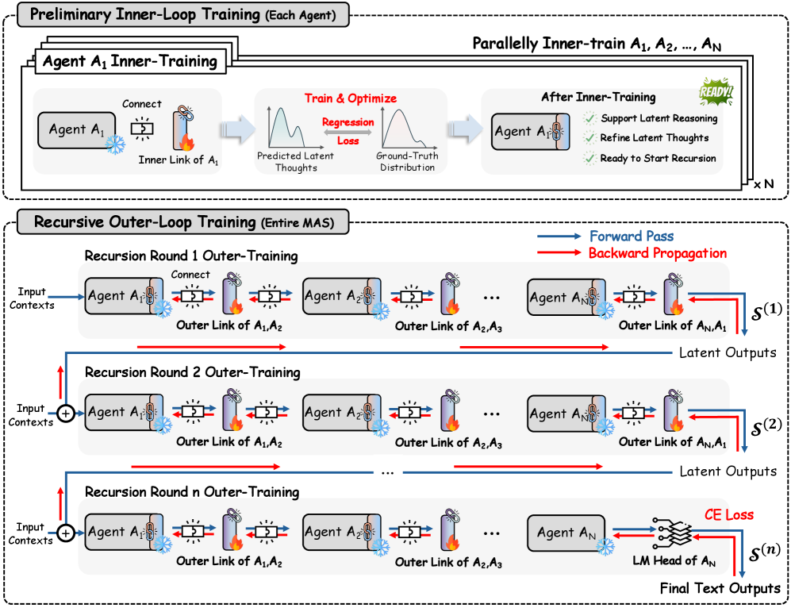

# 학습 — Inner-Outer Loop 와 그래디언트 안정성

> 원본: [arxiv.org/abs/2604.25917](https://arxiv.org/abs/2604.25917)

앞 편에서 RecursiveLink 와 시스템 루프 구조를 정의했다. 구조가 있어도 학습을 못 하면 lookup table 과 다를 게 없다. 이 편은 RecursiveMAS 가 어떻게 학습되는지, 그리고 왜 그 학습이 텍스트 매개 SFT 보다 안정적인지를 다룬다. 핵심은 두 가지. 첫째, inner-outer 두 단계로 학습을 쪼개 모델 수준 warm start 와 시스템 수준 공진화를 분리한다. 둘째, latent 경로를 따라 그래디언트가 사라지지 않도록 만든 구조 자체가 학습 신호를 살린다.

*Figure 4. Inner-loop 은 각 에이전트의 inner link 를 cosine regression 으로 워밍업하고, outer-loop 은 시스템을 $r$ 라운드 펼친 뒤 마지막 라운드 텍스트 예측에 CE loss 를 걸어 모든 outer link 에 글로벌 credit 을 흘려준다.*

## 두 단계로 쪼개는 이유

전체 시스템을 한 번에 end-to-end 로 학습하려고 하면 곤란한 점이 둘 있다. 하나는 각 에이전트가 처음부터 latent thought 라는 새 출력 분포에 적응해야 한다는 점이다. 사전학습된 LLM 은 텍스트 토큰을 뽑도록 분포가 맞춰져 있다. RecursiveLink 가 last-layer hidden 을 입력 임베딩 분포로 다시 매핑하긴 하지만, 초기에는 이 정렬이 거의 무작위에 가깝다. 워밍업 없이 시스템 손실로 곧장 밀어붙이면 신호가 너무 노이즈하다.

다른 하나는 시스템 손실이 글로벌하다는 점이다. 마지막 라운드의 한 토큰 예측 손실로부터 모든 outer link 와 inner link 에 책임을 배분해야 한다. 모델이 latent thought 를 그럴듯하게 만들기 전에는 이 credit 이 의미 없는 곳에 쏠린다.

저자들은 그래서 두 단계 — 모델 수준 inner-loop 워밍업, 그 다음 시스템 수준 outer-loop 공진화 — 로 학습을 분리한다. 모든 백본 파라미터는 frozen 이고 inner / outer RecursiveLink 만 업데이트된다. 따로 떼어 보면 단순하지만, 단계 순서가 곧 학습 안정성이다.

## Inner-loop — 모델 수준 워밍업

목표는 각 에이전트의 inner link $f^{(i)}$ 가 last-layer latent thought 를 같은 에이전트의 input embedding 공간에 정렬되도록 만드는 것이다. 즉, latent 가 "다음 step 의 입력으로 자연스럽게 먹히는 토큰 임베딩의 분포" 와 비슷해지면, 디코딩-재인코딩이라는 우회로 없이 latent 만으로 auto-regressive 가 흘러간다.

학습 신호는 cosine similarity regression 이다. 학습 예제 $(x, y)$ 가 주어지면, ground-truth 텍스트 $y$ 를 에이전트 $i$ 의 standard input embedding layer 에 통과시켜 타깃 latent 분포 $\tilde{h}^{(i)}$ 를 얻는다. 그러면 inner link 의 손실은:

$$
\mathcal{L}_{\text{inner}}^{(i)} = 1 - \text{cos}\big(f^{(i)}(h^{(i)}),\, \tilde{h}^{(i)}\big)
$$

여기서 $h^{(i)}$ 는 에이전트 $i$ 가 생성한 last-layer latent thought, $\text{cos}(\cdot,\cdot)$ 는 표준 코사인 유사도다. 손실은 $1$ 에서 코사인 유사도를 뺀 형태라 같은 방향을 가리키도록 정렬되는 것이 목표다.

세 가지 디자인 포인트가 있다.

- **임베딩 분포에 맞춘다, 토큰을 맞추는 게 아니다.** 라벨 토큰을 직접 예측하려면 vocabulary 로 사영하고 cross-entropy 를 걸어야 한다. 그건 곧 매 step 마다 디코딩하라는 얘기다. 입력 임베딩 분포에 맞추면 latent 가 곧장 다음 step 의 입력이 되므로 vocab projection 을 우회한다.
- **코사인이지 L2 가 아니다.** Latent 의 절대 크기는 모델마다 다르고 step 마다 변한다. 방향만 맞추면 residual 연결이 크기를 보존해주므로 충분하다.
- **back-prop 은 inner link 만.** 백본은 frozen 이라 사실상 link 의 2-layer projection 파라미터만 학습한다. 워밍업이 가볍게 끝나는 이유다.

워밍업이 끝나면 각 에이전트는 "latent thought 를 다음 step 입력으로 흘려보내는 데 큰 손실이 없는" 상태가 된다. 이 상태에서 다음 단계로 넘어간다.

## Outer-loop — 시스템 수준 공진화

이제 inner link 가 정렬됐다는 가정 아래 outer link $g^{(i\to j)}$ 들을 함께 학습한다. 목적은 단순하다. 시스템을 $r$ 라운드 풀어서 마지막 라운드의 텍스트 예측이 ground-truth 와 맞도록 만든다.

학습은 다음 순서로 진행된다.

1. 시스템 상태 $S_t$ 를 $t = 0$ 에서 $t = r$ 까지 펼친다. 라운드마다 모든 에이전트가 inner-outer link 를 통해 latent 를 주고 받는다.
2. 마지막 라운드 $t = r$ 에서만 텍스트로 디코딩한다. 그 외 모든 라운드는 latent 로만 흐른다.
3. 마지막 라운드 텍스트 예측 $\hat{y}$ 에 대해 cross-entropy 손실을 건다.

$$
\mathcal{L}_{\text{outer}} = -\log p(y \mid S_r)
$$

여기서 $S_r$ 은 $r$ 라운드 펼침 후 시스템이 합의한 latent state, $p(y \mid S_r)$ 은 마지막 에이전트가 그것을 받아 디코딩한 토큰 확률이다.

핵심은 손실이 마지막 라운드 하나에서만 발생한다는 것이다. 그런데 computation graph 는 $r$ 라운드 전체에 걸쳐 보존된다. 따라서 back-prop 이 $r$ 단계의 outer link 모두를 거슬러 올라가면서, 각 link 가 최종 예측에 기여한 정도에 비례한 shared credit 을 받는다. 라운드 $t = 1$ 의 outer link 도 라운드 $t = r$ 의 텍스트 손실로부터 신호를 받는다는 얘기다.

이게 "공진화" 라고 부르는 이유다. 각 outer link 는 자기가 다음 라운드에 던질 latent 가 후속 라운드들의 정제 흐름에 어떻게 영향을 미치는지를 글로벌 신호로 배운다. 텍스트 매개 MAS 에서 각 에이전트를 따로 SFT 하는 방식과는 완전히 다른 결의 학습이다.

## 텍스트 매개 SFT 가 왜 죽는가 — Theorem 4.1

직관적으로는 "텍스트로 주고받으나 latent 로 주고받으나 라운드만 같으면 신호 세기는 비슷할 것" 같다. 그런데 잘 학습된 LLM 의 토큰 분포는 매우 sharp 하다. 다음 토큰의 entropy 가 $\epsilon$ 단위로 작은 경우, softmax 가 거의 one-hot 에 가깝게 saturate 한다. Saturate 한 softmax 의 Jacobian 은 거의 0 행렬이다. 텍스트 매개 recursion 은 매 라운드마다 이 softmax-그리고-argmax(혹은 sampling) 를 거치므로, back-prop 신호가 한 라운드 지날 때마다 거의 0 에 가까운 행렬을 곱하게 된다.

Theorem 4.1 은 이 직관을 정량화한다. 실현 가능한 가정(자세한 형식은 Appendix A.2) 아래, 토큰이 confident 해서 entropy $H \le \epsilon$ 이면 — 보통 $\epsilon < 0.01$ 정도 — 다음이 성립한다.

- **Text-based SFT 의 recursive 학습**은 그래디언트 소실을 겪는다. 즉 $\|\nabla \mathcal{L}_{\text{SFT}}\| \to 0$.
- **RecursiveMAS 의 RecursiveLink 경로**는 그래디언트 norm 이 $1$ 에 가깝게 안정적으로 유지된다. $\|\nabla \mathcal{L}_{\text{outer}}\| \approx 1$.

이는 확률 $1 - \delta$ 로 성립한다 (정확한 진술과 증명은 Appendix A.3). 본문에서 강조되는 결론은 "텍스트 매개 recursion 은 라운드 깊이가 깊어질수록 학습이 사실상 불가능해진다" 는 점이다. 이는 단순히 비효율이 아니라 학습 자체가 막힌다는 얘기다.

직관 한 줄. 텍스트 토큰은 분포를 한 점으로 collapse 시키는 비선형 게이트고, latent 는 안 그렇다. RecursiveLink 의 residual connection 은 거기에 더해 identity 경로를 보장하므로 그래디언트가 라운드를 통과해도 죽지 않는다. ResNet 의 skip connection 이 깊은 네트워크의 학습을 가능하게 만들었던 것과 같은 원리가, 여기서는 라운드 축을 따라 작동한다.

조금 더 풀어 쓰면 다음과 같다. 텍스트 매개 SFT 에서 라운드 $t$ 에서 라운드 $t+1$ 로 전달되는 신호는 softmax 출력의 함수다. Confident 한 분포에서 softmax 의 Jacobian 은 $\text{diag}(p) - pp^\top$ 인데, $p$ 가 거의 one-hot 이면 이 행렬의 spectral norm 이 매우 작다. 라운드 수 $r$ 에 대해 이 작은 norm 이 곱해지면 신호는 지수적으로 감쇠한다. 반면 RecursiveLink 는 $h_{out} = h_{in} + \text{MLP}(h_{in})$ 형태의 residual 경로라 Jacobian 에 항상 단위 행렬 성분이 남아있어 norm 이 $1$ 근처에서 보존된다.

상세 증명은 appendix 에 있다. 본문에서는 "왜 latent 매개 recursion 이 어쩔 수 없는 선택인가" 를 정당화하는 논거로 쓰인다. Proposition 3.1 의 runtime 효율성과 Theorem 4.1 의 학습 안정성, 두 보조 결과가 합쳐져서 latent 매개 디자인의 동기가 된다. 다시 말해 "latent 가 더 효율적이고 더 잘 학습된다" 가 우연한 실험 결과가 아니라 구조적 귀결이라는 점을 저자들은 강조하고 싶어 한다.

## 학습-추론 scaling 의 상보 효과

Outer-loop 학습에서 $r$ 을 얼마나 깊이 펼칠지는 하이퍼파라미터다. 추론 시에는 $r$ 을 더 깊게 줄 수도, 더 얕게 줄 수도 있다. 흥미로운 점은 학습 시 $r$ 과 추론 시 $r$ 사이에 상보적인 관계가 있다는 것이다. 학습할 때 더 깊은 라운드까지 펼쳐 본 모델일수록, 추론에서 라운드를 더 깊게 줘도 성능 이득이 잘 누적된다.

본문은 이를 "training recursion 이 시스템에 refinement-ready latent state 를 형성하도록 가르치고, inference recursion 은 그 학습된 재귀 구조를 test-time 이득으로 번역한다" 고 정리한다. 학습 시 얕은 $r$ 만 본 모델은 추론 시 $r$ 을 늘려도 plateau 가 빨리 온다. 학습 시 깊은 $r$ 까지 본 모델은 추론 시 더 깊게 줘도 계속 개선이 나온다. 자세한 곡선은 다음 편 평가 파트에서 다룬다.

실무적으로 보면 이 효과는 "test-time scaling 을 위해 train-time 에 미리 학습을 깊게 풀어둬야 한다" 는 가이드로 번역된다. 추론 budget 을 늘릴 계획이 있다면 학습에서도 그에 상응하는 $r$ 을 본 적이 있어야 한다는 얘기다. Chain-of-thought 의 학습-추론 간 mismatch 이슈와 비슷한 결의 현상으로 볼 수 있다.

## 학습 비용 — Table 5

다른 학습 방식과 비교하면 RecursiveMAS 가 어디서 이득을 보는지가 명확하다. 같은 데이터, 같은 백본, 동일한 sequential-style 셋업에서 측정한 학습 비용은 다음과 같다.

| 방법 | GPU 메모리 (GB) | Trainable Param. | 비용 ($) | 평균 정확도 |
|---|---|---|---|---|
| LoRA Training | 21.67 | 15.92M (0.37%) | 6.64 | 66.9 |
| Full-SFT | 41.40 | 4.21B (100%) | 9.67 | 68.6 |
| RecursiveMAS | **15.29** | **13.12M (0.31%)** | **4.27** | **74.9** |

세 축 모두에서 가장 가볍다.

- GPU 메모리는 Full-SFT 의 약 $37\%$, LoRA 의 $70\%$ 수준.
- Trainable parameter 는 LoRA 보다도 적은 $0.31\%$.
- 추정 비용은 Full-SFT 대비 $44\%$, LoRA 대비 $64\%$.

그러면서 정확도는 가장 높다 ($74.9$). Full-SFT 가 모든 파라미터를 다 흔드는데도 RecursiveMAS 보다 $6$ 포인트 이상 낮은 점이 인상적이다. 이는 단순히 "더 많이 학습한다고 더 잘 푸는 게 아니다" 라는 얘기를 넘어, **개별 에이전트를 더 잘 튜닝하는 것보다 시스템 전체의 협업 흐름을 튜닝하는 것이 더 효과적** 이라는 본문의 주장을 정량적으로 뒷받침한다.

비용이 낮은 이유는 단순하다. 백본은 frozen, 학습 대상은 두 개의 작은 projection 으로 구성된 RecursiveLink 뿐이다. 메모리 측면에서는 옵티마이저 상태 (Adam moments) 가 link 파라미터에 대해서만 잡힌다. Compute 측면에서도 inner-loop 의 cosine regression 은 forward 한 번 + 작은 projection 한 번이고, outer-loop 은 라운드 펼침 비용이 있지만 그래도 백본 그래디언트 갱신이 없어 단가가 낮다.

## 정리

이 편의 요지를 다섯 줄로.

- Inner-loop 은 각 에이전트의 inner link 를 cosine regression 으로 워밍업해 latent thought 를 input embedding 분포에 정렬시킨다.
- Outer-loop 은 시스템을 $r$ 라운드 펼친 뒤 마지막 라운드 텍스트 예측 CE 손실로 모든 outer link 를 함께 학습한다. 그래디언트가 전 라운드에 글로벌 credit 으로 흐른다.
- Theorem 4.1 은 confident token 환경에서 텍스트 매개 SFT 가 그래디언트 소실을 겪는 반면 RecursiveLink 경로는 norm 이 $1$ 근처에 머문다는 결과. Latent 매개 디자인의 이론적 근거다.
- 학습 $r$ 이 깊을수록 추론 $r$ 에서 얻는 이득이 더 커진다. 학습과 추론이 상보적으로 scaling.
- 학습 비용은 LoRA / Full-SFT 대비 메모리·파라미터·달러 모두 최저. 정확도는 최고. RecursiveLink 만 만지는 학습이 그만큼 효율적이다.

다음 편에서는 이렇게 학습된 RecursiveMAS 가 9 개 벤치마크에서 어떻게 작동하는지, 추론 효율과 토큰 절감이 라운드 깊이에 따라 어떻게 변하는지, 그리고 다양한 협업 패턴(Mixture / Distillation / Deliberation)에서도 같은 이득을 가져가는지 본다.

다음 편: [평가 — 벤치, 효율, 일반화, 시사점](05-evaluation-and-takeaways.md)

## 출처

- https://arxiv.org/abs/2604.25917
