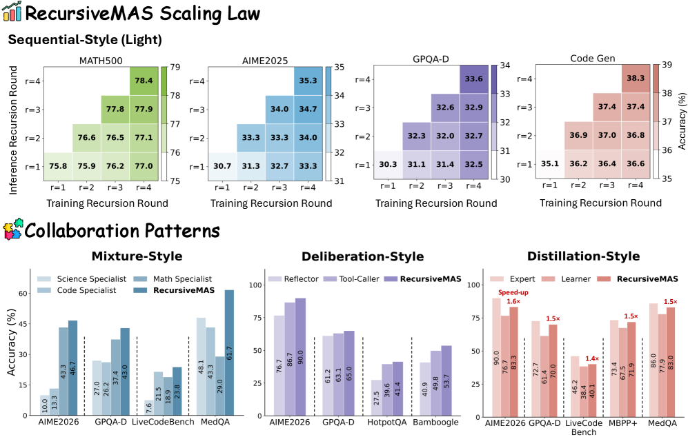
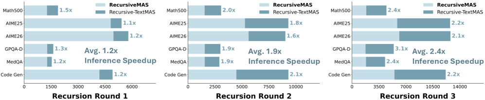
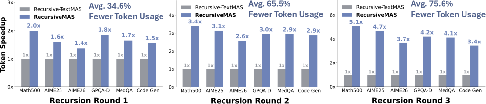

# 평가 — 벤치, 효율, 일반화, 시사점

> 원본: [arxiv.org/abs/2604.25917](https://arxiv.org/abs/2604.25917)

앞선 네 편에서 RecursiveMAS 의 동기, 정의, 학습 방법, recursion 횟수 $r$ 에 따른 학습 동역학을 정리했다. 이번 편은 실제 숫자다. 9개 벤치마크와 네 가지 협업 패턴에서 어떤 성능을 보이는지, 속도·토큰 측면에서 얼마나 효율적인지, latent thoughts 길이 $m$ 같은 내부 파라미터가 결과를 얼마나 좌우하는지를 본다. 마지막으로 시스템 전체를 latent recursion 으로 보는 접근이 실무 관점에서 무엇을 의미하는지 짧게 짚는다.

## 실험 설정 한 장 요약

평가 축은 네 가지로 정리된다.

- 벤치마크 9종.
    - 수학: MATH500, AIME2025, AIME2026 (AIME 계열은 Pass@10).
    - 과학·의료: GPQA-Diamond, MedQA.
    - 코드: LiveCodeBench-v6, MBPP Plus.
    - Search QA: HotpotQA, Bamboogle.
- 모델 패밀리. Qwen3/3.5, Llama-3, Gemma3, Mistral 을 섞어 sequential / mixture / distillation / deliberation 네 가지 협업 패턴 각각의 역할에 배치한다. 즉 단일 백본이 아닌 heterogeneous 구성에서 검증한다.
- 베이스라인 세 그룹.
    - 단일 에이전트 (off-the-shelf, LoRA SFT, Full-SFT).
    - 재귀형 방법 (LoopLM, Recursive-TextMAS — 같은 토폴로지에서 latent 대신 텍스트로 통신).
    - 대표 MAS 프레임워크 (TextGrad, Mixture-of-Agents).
- 학습. 모든 LLM 파라미터는 freeze, 학습되는 것은 inner/outer RecursiveLink 뿐. 데이터는 s1K (수학), m1k (의료·과학), OpenCodeReasoning (코드), ARPO-SFT (툴) 를 섞는다. AdamW, $\mathrm{lr}=5\times 10^{-4}$, cosine 스케줄러.

이 설정 자체가 한 가지 메시지를 담고 있다. 베이스 LLM 을 건드리지 않고도, 시스템 단위 협업을 얼마나 끌어올릴 수 있느냐를 묻는 실험이다.

## Round 별 스케일링 — Recursive-TextMAS 와의 직접 비교

원문 Table 2 의 표는 가로로 매우 길지만, 우리가 보고 싶은 것은 사실 세 줄이다. 같은 협업 토폴로지 위에서 latent (RecursiveMAS) 와 텍스트 (Recursive-TextMAS) 만 갈아끼웠을 때, recursion round $r \in \{1, 2, 3\}$ 에서 어떤 추세가 보이는가.

| $r$ | 정확도 개선 | 추론 속도 | 토큰 감소 |
| --- | --- | --- | --- |
| 1 | $+8.1\%$p | $1.2\times$ | $-34.6\%$ |
| 2 | $+19.6\%$p | $1.9\times$ | $-65.5\%$ |
| 3 | $+20.2\%$p | $2.4\times$ | $-75.6\%$ |

(7개 task 평균, RecursiveMAS vs. Recursive-TextMAS.)

세 가지가 동시에 일어난다는 점이 중요하다. 정확도 격차가 round 가 깊어질수록 더 벌어지고, 그러는 동안 추론 시간과 토큰은 오히려 줄어든다. 텍스트 기반 재귀는 라운드마다 중간 답안을 다시 디코딩하므로 길이가 누적되지만, latent recursion 은 hidden state 만 갱신한다. 결과적으로 깊이를 늘리는 것이 비용이 아니라 이득이 된다.

세부 숫자에서도 같은 흐름이 보인다. 예를 들어 AIME2025 (scaled 세팅) 에서 Recursive-TextMAS 는 $r=1 \to 3$ 에서 71.3% → 73.3% 로 거의 정체하지만, RecursiveMAS 는 80.0% → 86.7% 로 단조 증가한다. AIME2026 도 76.7% → 74.7% (텍스트 ver.) 대 82.7% → 86.0% (latent ver.) 로 같은 패턴이다. 텍스트로 깊은 추론을 쌓으면 누적 오차와 컨텍스트 부담이 정확도를 깎는데, latent 로 옮기면 그 손실이 사라진다.

## 다른 아키텍처 / 학습 프레임워크와의 비교

Table 3 은 시점을 옮긴다. 같은 백본·같은 학습 데이터 조건에서, 시스템 전체로 봤을 때 RecursiveMAS 가 어디에 위치하는가.

| Method | MATH500 | AIME2025 | AIME2026 | GPQA-D | LiveCodeBench | MedQA |
| --- | --- | --- | --- | --- | --- | --- |
| Single (LoRA) | 83.1 | 70.0 | 73.3 | 62.0 | 37.4 | 76.1 |
| Single (Full-SFT) | 83.2 | 73.3 | 76.7 | 62.8 | 38.6 | 77.0 |
| Mixture-of-Agents | 79.8 | 60.0 | 63.3 | 47.6 | 27.0 | 57.5 |
| TextGrad | 84.9 | 73.3 | 76.7 | 62.5 | 39.8 | 77.2 |
| LoopLM | 84.6 | 66.7 | 63.3 | 48.1 | 24.9 | 56.4 |
| Recursive-TextMAS | 85.8 | 73.3 | 73.3 | 61.6 | 38.7 | 77.0 |
| RecursiveMAS | 88.0 | 86.7 | 86.7 | 66.2 | 42.9 | 79.3 |

평균으로 정리하면 RecursiveMAS 는 각 벤치마크에서 가장 강한 베이스라인 대비 $+8.3\%$p 의 개선을 보인다. 더 의미 있는 것은 분포다. MATH500 같은 비교적 쉬운 (≥80%) 영역에서는 차이가 $+2{\sim}3\%$p 정도지만, 어려운 추론 (AIME2025 $+18.1\%$p, AIME2026 $+13.0\%$p, GPQA-Diamond $+5.4\%$p) 으로 갈수록 격차가 커진다. 즉 단일 모델을 더 잘 튜닝하는 것 (Full-SFT) 보다, 시스템 단의 협업 구조를 학습하는 것이 hard reasoning 에서 더 많은 헤드룸을 가진다는 뜻이다.

또 한 가지. 같은 "recursion 으로 깊이 키운다" 카테고리에 있는 LoopLM 은 의외로 어려운 task 에서 약하다 (AIME2026 63.3%, GPQA-D 48.1%, LiveCodeBench 24.9%). 모델 한 대를 더 깊게 도는 것보다, 서로 다른 역할의 여러 agent 사이를 latent 로 도는 것이 — 같은 "재귀" 라는 단어 안에서도 — 다른 효과를 낸다는 점이 보인다.

## 네 가지 협업 패턴으로의 일반화

Figure 1 (Down) 은 RecursiveMAS 가 sequential 한 가지 토폴로지에 의존하지 않음을 보여준다. 같은 inner/outer RecursiveLink 학습 방식을 그대로 두고, 네 가지 협업 패턴 각각에 instantiate 한다.

*RecursiveMAS 가 sequential / mixture / distillation / deliberation 네 가지 패턴에서 보이는 정확도 향상 요약. 출처: 원문 Figure 1.*

- Mixture style. 여러 도메인 전문가가 병렬로 추론하고 그 결과를 합치는 구성. 가장 강한 단일 도메인 전문가 대비 평균 $+6.2\%$p. 단일 전문가를 고르는 것보다 latent 공간에서의 cross-domain 결합이 더 낫다는 신호.
- Deliberation style. 외부 툴 (Python 실행, 검색 API) 을 사용하는 에이전트와 reflector 의 반복적 상호작용. 원래의 툴 호출 에이전트 대비 $+4.8\%$p. 툴 기반 환경에서도 latent coordination 이 유지된다는 점이 중요하다.
- Distillation style. expert 의 능력을 학습자 (learner) 가 받아오는 구성. RecursiveMAS 에서는 learner 가 $+8.0\%$p 향상되면서도 expert 대비 $1.5\times$ 빠른 추론을 유지한다. 즉 단순한 distillation 이 아니라, 더 작은 모델을 latent recursion 으로 capacity 보강하는 형태.

세 패턴 모두에서 — sequential 까지 합쳐 네 패턴 모두에서 — 공통의 RecursiveLink 가 작동한다는 점이, 이 프레임워크가 특정 토폴로지에 종속된 트릭이 아니라는 가장 직관적인 증거다.

## 효율 — 속도와 토큰

정확도가 올라가는데도 비용이 줄어든다는 것은 reasoning 시스템 평가에서 흔치 않은 조합이다. Figure 5/6 은 round 별로 이 두 축을 분해해 보여준다.

*RecursiveMAS 와 Recursive-TextMAS 의 round 별 end-to-end 추론 시간. round 가 깊어질수록 격차가 더 벌어진다. 출처: 원문 Figure 5.*

추론 시간은 $r=1$ 에서 평균 $1.2\times$ 빠르고, $r=2$ 에서 $1.9\times$, $r=3$ 에서 $2.4\times$ 로 늘어난다. Recursive-TextMAS 가 round 마다 중간 답안을 텍스트로 다시 만들어야 하는 반면, RecursiveMAS 는 latent 만 갱신하기 때문에, 깊이를 늘려도 추가 cost 의 기울기가 훨씬 완만하다.

*round 별 출력 토큰 사용량. 텍스트 기반은 round 에 비례해 토큰이 폭증하지만, latent 기반은 거의 평탄하다. 출처: 원문 Figure 6.*

토큰 사용량은 더 극단적이다. $r=1$ 에서 $-34.6\%$, $r=2$ 에서 $-65.5\%$, $r=3$ 에서 $-75.6\%$. Recursive-TextMAS 는 round 마다 답안 전체를 다시 디코딩하므로 누적되지만, RecursiveMAS 는 마지막 round 에서만 한 번 표면 텍스트를 만들면 된다. 비용 단위 (토큰) 와 latency 단위 (초) 가 서로 다른 방향으로 절약된다는 점이, 단일 LLM 의 "더 길게 생각시키기" 와 latent recursion 이 본질적으로 다른 자원을 쓴다는 것을 잘 보여준다.

## In-depth — 무엇이 결과를 좌우하나

§6 의 ablation 들은 "어디까지 줄여도 되는가" 를 따로 묻는다.

- Latent thoughts length $m$. round 사이를 흐르는 latent 의 길이다. Figure 8 의 ablation 에 따르면 $m$ 을 늘리면 초반에는 단조 증가하지만, $m \approx 64{\sim}80$ 부근에서 모든 벤치마크가 평탄해진다. 즉 각 에이전트의 내부 추론을 다 표면화해 전달할 필요는 없고, 적당한 budget 만 있어도 협업이 성립한다. 텍스트 CoT 가 종종 수천 토큰을 요구하던 것과 대비된다.
- Semantic distribution (PCA). Figure 7 은 round 가 깊어질수록 모델이 만들어내는 답안 임베딩 분포가 정답 임베딩 분포로 점진적으로 정렬됨을 보여준다. $r=1$ 에서는 분포가 시각적으로 떨어져 있다가, $r=3$ 부근에서 대부분 겹친다. 정성적 case study 와 종합하면, RecursiveMAS 가 초기 라운드의 오답을 후속 라운드에서 정정하는 양상이 일관되게 관찰된다.
- RecursiveLink 구조. 2층 + residual 디자인의 우위는 part 2 에서 이미 다뤘다. 핵심은 "원본 latent 의미를 보존하고 distributional shift 만 학습한다" 는 설계 의도가 ablation 으로도 검증된다는 점.
- Training cost. RecursiveMAS 는 per-agent GPU 메모리 15.29GB, 학습 파라미터 13.12M (0.31%), 추정 비용 $\$4.27$ 로, LoRA ($\$6.64$) 와 Full-SFT ($\$9.67$) 보다 모두 낮다. 그러면서 평균 정확도는 가장 높다. 백본 자체를 건드리지 않는다는 가정이 성능에서 손해를 보지 않는다는, 그리고 오히려 cost-performance 곡선을 위로 미는, 직접적 근거다.

## 시사점과 한계

여기까지의 결과를 정리하면 세 가지 메시지로 좁힐 수 있다.

- 시스템 단위 학습이 단일 모델 학습을 추월한다. 같은 학습 데이터, 같은 추정 비용 안에서, Full-SFT 보다 cross-agent latent 협업을 학습하는 쪽이 더 큰 이득을 준다. 특히 어려운 reasoning 영역에서 그렇다.
- Latent 가 그냥 "텍스트의 압축" 이 아니다. 같은 토폴로지에서 텍스트만 latent 로 바꿔도 round 별로 $+20\%$p 가까운 정확도 차가 누적되고 동시에 비용이 줄어든다. recursion 의 매개체를 바꾼다는 결정이 효율과 성능 양쪽을 좌우한다는 점은 단순한 구현 디테일 이상이다.
- 깊이가 cost 가 아니라 lever 가 된다. round 를 늘리는 것이 단조 증가 곡선을 그리고, 그러는 동안 token/time 곡선이 함께 내려간다. test-time scaling 의 한 축으로 system-level recursion 을 다룰 여지가 생긴다.

물론 한계도 분명히 있다.

- Off-the-shelf 에이전트 freeze 라는 가정. agent 자체를 학습하지 않는다는 디자인 선택은 비용 면에서는 장점이지만, agent 가 본래 그 도메인에서 충분히 강하지 않으면 RecursiveLink 만으로 끌어올릴 수 있는 한계가 있다. 적정 백본 풀이 전제다.
- Latent transport 의 해석성. recursion 사이로 흐르는 hidden 은 텍스트로 풀어 보기 어렵다. 디버깅·감사가 중요한 도메인에서는 텍스트 기반 협업 대비 trace 가 떨어진다. 원문도 case study 에서 "round 가 깊어지며 답이 바뀐다" 정도까지만 보여준다.
- 평가가 정형 reasoning 에 쏠려 있다. AIME, GPQA, LiveCodeBench, HotpotQA 같은 정답 단일 (또는 단순 매칭) 환경이 중심이고, open-ended 생성·창작·다중 turn 대화 같은 환경에서의 RecursiveMAS 행동은 별도로 검증해야 한다.

실무 관점에서 짧게. 사내에서 이미 잘 짜둔 multi-agent pipeline (sequential, mixture, tool-use 등) 이 있다면, 그 위에 inner/outer RecursiveLink 를 얹어 latent recursion 만 학습하는 형태로 비교적 가벼운 검증이 가능하다. 백본을 새로 fine-tune 하지 않아도 되니, 모델 라이선스나 vendor lock-in 측면의 마찰이 적다. 다만 $r$ 과 $m$ 은 task 난이도에 따라 따로 튜닝되어야 하고, latent 통신을 도입한 만큼 trace·로그 설계는 별도로 신경 써야 한다.

전체적으로 RecursiveMAS 는 "MAS 를 시스템 단위의 미분 가능한 latent 회로로 본다" 는 시각 자체가 새 평가축을 만든다는 것을 보여준 작업이다. 깊이를 늘리는 것이 비용이 아니라 성능 lever 가 되는 구조 — 이 한 줄이 다섯 편의 시리즈를 관통하는 메시지였다.

## 출처

- https://arxiv.org/abs/2604.25917
