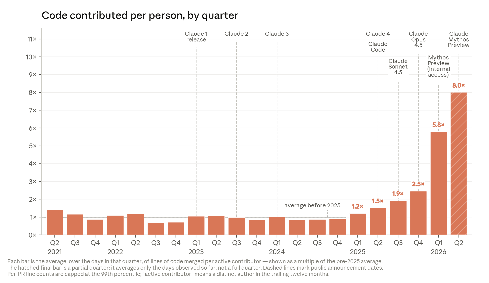

# 재귀적 자기개선은 어디까지 왔나

> 원본: [Anthropic Institute](https://www.anthropic.com/institute/recursive-self-improvement)

Anthropic Institute 글의 출발점은 단순하다. 지금까지 AI 개발의 거의 모든 단계는 사람이 주도했다. 사람이 아이디어를 내고, 코드를 쓰고, 실험을 설계하고, 훈련 인프라를 붙이고, 결과를 해석했다. 그런데 Anthropic 안에서는 이 루프의 점점 더 많은 부분이 Claude 같은 AI 시스템에게 넘어가고 있으며, 그 결과 AI 개발 자체가 빨라지고 있다는 것이다.

이 글이 말하는 "recursive self-improvement"는 여기서 한 걸음 더 간다. 충분한 능력과 충분한 컴퓨트가 주어졌을 때, 어떤 AI 시스템이 자기 후속 모델을 스스로 설계하고 개발하는 상태다. Anthropic은 현재가 그런 상태라고 주장하지 않는다. 재귀적 자기개선이 필연적이라고도 말하지 않는다. 다만 외부 벤치마크와 내부 생산성 데이터를 함께 보면, AI가 AI 개발을 가속하는 초기 단계는 이미 관찰되고 있으며, 준비가 부족한 제도권보다 빠르게 진전될 수 있다고 경고한다.

핵심은 "완전 자동화"가 아니라 "병목의 이동"이다. 과거에는 사람이 직접 코드를 쓰고 실험을 돌리는 시간이 병목이었다. 지금은 Claude가 실행 가능한 코드를 만들고, 장시간 작업을 맡고, 실험 루프를 반복하면서 이 병목을 줄이고 있다. 그러면 남는 문제는 무엇을 시킬지, 어떤 결과를 믿을지, 어느 방향이 중요할지를 판단하는 일이다. 이 시리즈의 1편은 그 변화가 어디까지 왔는지, 특히 외부 지표와 Anthropic 내부 지표가 무엇을 보여주는지에 초점을 맞춘다.

## 개발 루프의 짧은 타임라인

원문은 Anthropic 내부의 AI 개발 방식을 2021년부터 2026년까지의 단계 변화로 압축한다. 이 타임라인은 기술사라기보다, 사람이 맡던 작업이 어떤 순서로 모델에게 넘어갔는지를 보여주는 운영상의 변화에 가깝다.

| 시기 | Anthropic이 묘사한 상태 | 개발 루프에서의 의미 |
| --- | --- | --- |
| 2021-2023 | 첫 Claude 구축 | 사람은 일반 테크 회사처럼 노트북에서 코드와 문서를 직접 작성했다. |
| 2023-2025 | 챗봇 활용 | 초기 챗봇은 짧은 코드 조각을 제안했고, 사람은 그 결과를 복사해 편집기에 붙였다. |
| 2025-2026 | 코딩 에이전트 | 에이전트가 직접 코드를 작성하고 수정하기 시작했으며, 때로는 파일 전체를 다뤘다. |
| Today | 자율 에이전트 | 에이전트가 코드를 직접 실행하고, 다른 에이전트에게 몇 시간짜리 작업을 위임할 수 있게 됐다. |
| 20XX? | 루프 닫기 | 미래에는 에이전트가 모델을 직접 만들고 훈련해, Claude가 Claude의 후속 버전을 개선할 수 있다. |

이 표에서 중요한 전환점은 "제안"에서 "실행"으로의 이동이다. 2023-2025년의 챗봇은 사람의 손을 보조했다. 2025-2026년의 코딩 에이전트는 코드베이스 안에서 직접 행동했다. 그리고 현재의 자율 에이전트는 단일 코드 변경을 넘어, 실행, 검증, 위임까지 포함한 작업 단위를 처리하기 시작했다. 재귀적 자기개선은 이 흐름의 끝에 있는 가능성이다. 아직 도달한 상태가 아니라, 개발 루프의 점유율이 계속 이동할 경우 열릴 수 있는 다음 단계다.

## 외부 세계에서 보이는 증거

Anthropic이 먼저 드는 외부 증거는 모델이 스스로 안정적으로 처리할 수 있는 작업 길이의 증가다. METR의 time horizon 측정에서 AI가 혼자 처리할 수 있는 작업 시간은 과거에는 약 7개월마다 두 배가 되는 추세였고, 최근에는 약 4개월마다 두 배가 되는 추세로 빨라졌다고 원문은 설명한다. 2024년 3월 Claude Opus 3는 사람이 약 4분 걸리는 소프트웨어 작업을 처리할 수 있었다. 1년 뒤 Claude Sonnet 3.7은 약 1시간 30분짜리 작업을, 또 1년 뒤 Claude Opus 4.6은 12시간짜리 작업을 처리했다는 것이 Anthropic의 요약이다.

이 수치가 그대로 유지된다면 의미는 크다. Anthropic은 올해 안에 숙련된 사람이 며칠 걸리는 작업이 모델의 범위에 들어올 수 있고, 2027년에는 사람이 몇 주 걸리는 작업도 가능해질 수 있다고 전망한다. 여기서 주의할 점은 이것이 확정적 예측이 아니라 추세선에 기반한 전망이라는 점이다. 하지만 개발 자동화 관점에서는 작업 시간이 몇 분에서 몇 시간, 다시 반나절 이상으로 늘어나는 것만으로도 역할 배분이 달라진다. 사람은 더 이상 "한 단계씩 지시하고 확인하는 사용자"에 머물지 않고, 더 긴 작업 패키지를 넘긴 뒤 결과를 검토하는 감독자에 가까워진다.

같은 패턴은 코딩과 연구 벤치마크에서도 나타난다. SWE-bench는 실제 오픈소스 코드베이스와 버그 리포트를 주고, 모델이 프로젝트 테스트를 통과하는 수정안을 만들 수 있는지 본다. 원문에 따르면 모델들은 2년 사이 낮은 한 자릿수 점수에서 벤치마크 포화에 가까운 수준까지 올라갔다. CORE-Bench는 공개 논문의 코드와 데이터를 주고, 모델이 논문 결과를 재현할 수 있는지 평가한다. AI 시스템은 2024년에 약 20%의 재현 성공률을 보이다가 15개월 뒤 포화 수준에 도달했다고 한다.

외부 지표를 요약하면 다음과 같다.

- 장시간 작업: 약 7개월마다 두 배였던 추세가 최근 약 4개월마다 두 배로 빨라졌다는 Anthropic의 해석이 있다.
- 소프트웨어 작업: 2024년의 4분급 작업에서, 2026년의 12시간급 작업으로 범위가 늘었다.
- SWE-bench: 실제 코드 수정 벤치마크에서 낮은 한 자릿수에서 포화에 가까운 성능으로 이동했다.
- CORE-Bench: 연구 재현 과제에서 2024년 약 20% 성공률에서 15개월 뒤 포화 수준으로 올라갔다.
- 2027년 전망: 추세가 지속되면 사람이 몇 주 걸리는 작업도 모델의 범위에 들어올 수 있다는 것이 원문의 전망이다.

다만 이 자료만으로는 AI가 AI 개발 자체를 얼마나 빠르게 만드는지 알기 어렵다. 공개 벤치마크는 능력을 보여주지만, AI 회사 내부에서 연구자와 엔지니어의 작업 방식이 어떻게 바뀌는지는 보여주지 못한다. 그래서 원문은 Anthropic 내부 데이터로 넘어간다.

## Anthropic 내부에서 보이는 증거

Anthropic은 frontier model 개발을 크게 두 부류로 나눈다. 하나는 engineering이다. 코드를 쓰고, 인프라를 세우고, 훈련을 운영하는 일이다. 다른 하나는 research다. 어떤 실험을 할지 정하고, 결과를 해석하고, 다음 아이디어를 고르는 일이다.

원문이 그리는 현재 상태는 비대칭적이다. engineering에서는 Claude가 점점 더 덜 명세화된 문제를 받아 해결 방법을 스스로 찾을 수 있다. 사람은 목표를 주지만, 방법을 일일이 지시하지 않아도 되는 경우가 늘었다. research에서는 Claude가 이미 잘 정의된 실험을 실행하는 데 능숙하고, 일부 조건에서는 숙련된 사람보다 빠르게 결과를 만든다. 그러나 목표 자체를 고르고, 무엇이 중요한지 판단하고, 연구 방향을 정하는 영역에는 아직 큰 격차가 남아 있다. 바로 이 격차가 "오늘의 AI 개발 자동화"와 "완전한 재귀적 자기개선"을 가르는 경계다.

Anthropic은 직원의 성장 단계에 빗대어 이 차이를 설명한다. 초급자는 "export 버튼이 동작하지 않으니 고쳐라"처럼 이미 정의된 작업을 수행한다. 더 경험이 쌓이면 "부하가 클 때 네트워크가 느려지는 이유를 조사하라"처럼 목표만 받고 접근법을 설계한다. 최상위 수준에서는 "다음 분기에 팀이 무엇을 만들어야 하는가"를 결정한다. Claude가 어디까지 왔는지를 보려면, 이 세 단계 중 어느 단계까지 안정적으로 맡길 수 있는지를 봐야 한다.

## 코드 생산량이 보여주는 전환

*Figure 1. Anthropic이 제시한 2021년 2분기부터 2026년 2분기까지의 인당 코드 기여량 추이. Claude Code와 장시간 자율 에이전트 도입 이후 기울기가 커졌다는 주장을 담고 있다.*

가장 직접적인 내부 지표는 코드 생산량이다. Anthropic은 2026년 5월 기준으로 Anthropic 코드베이스에 merge되는 코드의 80% 이상이 Claude가 작성한 것이라고 주장한다. Claude Code가 2025년 2월 research preview로 출시되기 전에는 이 수치가 낮은 한 자릿수였다고 한다. 즉 1년 남짓한 기간에 "사람이 대부분 쓰고 모델은 보조"하던 상태에서, "모델이 대부분 쓰고 사람이 지시하고 검토"하는 상태로 옮겨간 셈이다.

인당 merge 코드량도 같은 방향을 가리킨다. 원문에 따르면 Anthropic의 첫 4년, 즉 2021-2024년 동안 엔지니어 1인당 하루 merge 코드 라인은 대체로 일정했다. 2025년 Claude가 단순 제안을 넘어 코드를 직접 실행하기 시작하면서 증가했고, 2026년 모델이 더 긴 시간 범위에서 자율적으로 일하기 시작하면서 기울기가 다시 가팔라졌다. 2026년 2분기에는 전형적인 엔지니어가 2024년 대비 하루 8x의 코드를 merge하고 있다는 것이 Anthropic의 주장이다.

여기에는 분명한 한계가 있다. 코드 라인은 품질보다 양을 재는 지표다. 8x라는 수치가 곧 생산성 8배를 의미하지는 않는다. Anthropic도 이를 인정한다. 더 많은 라인이 항상 더 좋은 시스템을 뜻하지 않고, 생성 코드에는 중복, 장황함, 이후 유지보수 비용이 섞일 수 있다. 그래서 이 지표는 "정확한 생산성 배율"보다는 "작업 방식이 달라졌다는 강한 신호"로 읽는 편이 안전하다.

그럼에도 이 변화가 무시하기 어려운 이유는 두 가지다. 첫째, Anthropic은 코드 라인 수로 사람을 보상하지 않는다고 밝힌다. 따라서 증가분은 KPI 최적화라기보다 도구 사용 방식 변화의 부산물일 가능성이 크다. 둘째, 내부 설문도 비슷한 방향을 보인다. 2026년 3월 Anthropic 연구 조직의 130명을 대상으로 한 설문에서, 응답자의 중앙값은 Mythos Preview를 사용할 때 AI 모델이 없을 때보다 약 4x의 산출물을 만든다고 추정했다. 원문은 이 자기보고가 과대평가됐을 수 있다고 조심스럽게 말하지만, 핵심 업무를 여러 배 빠르게 수행하는 기술 인력이 상당수 있다는 해석 자체는 그들의 다른 관찰과 부합한다고 본다.

또 다른 예시는 그동안 미뤄졌거나 사람이 하기 어려운 정리 작업이다. 2026년 4월 Claude는 특정 API 오류 유형을 1000분의 1로 줄이는 800개 이상의 수정 사항을 shipped했다고 원문은 설명한다. 이를 감독한 엔지니어는 사람이 했다면 4년이 걸렸을 일이라고 추정했다. 다른 사람의 버그를 고치는 일은 느리고, 낯선 컨텍스트를 오래 들고 있어야 하며, 보통 우선순위에서 밀린다. 이런 종류의 작업이 모델에게 넘어가면 단순히 기존 업무가 빨라지는 것 이상으로, 원래는 수행되지 않았을 작업이 새로 수행된다.

## 아직 "닫힌 루프"는 아니다

이 편에서 확인할 수 있는 결론은 조심스럽지만 중요하다. 외부 벤치마크는 모델이 더 긴 시간 범위의 코딩 및 연구 관련 작업을 처리하고 있음을 보여준다. 내부 데이터는 Anthropic의 엔지니어링 작업에서 Claude가 코드 작성의 큰 비중을 차지하고, 인당 코드 산출량이 크게 늘었음을 보여준다. 두 종류의 증거는 서로 다른 것을 측정하지만, 같은 방향을 가리킨다. AI가 AI 개발의 실행 부분을 빠르게 흡수하고 있다.

그러나 이것이 곧 완전한 재귀적 자기개선은 아니다. 아직 사람은 목표를 정하고, 결과를 해석하고, 무엇이 중요한지 판단한다. 특히 연구 taste와 judgement는 원문이 인정하는 현재의 핵심 병목이다. 다만 병목이 "코드를 직접 쓰는 시간"에서 "무엇을 시키고 무엇을 믿을지 판단하는 시간"으로 이동하고 있다면, AI 개발 조직의 속도와 구조는 이미 크게 바뀌고 있다.

다음 편에서는 이 병목을 더 좁혀 본다. Claude가 코드를 잘 쓰는지, 실험을 얼마나 잘 실행하는지, 그리고 연구 판단에서 어떤 초기 신호를 보이는지를 원문 후반부의 내부 평가 중심으로 정리한다.

다음 편: [코드, 실험, 연구 판단으로 좁혀지는 병목](02-code-experiments-research-judgment.md)

## 출처

- https://www.anthropic.com/institute/recursive-self-improvement
