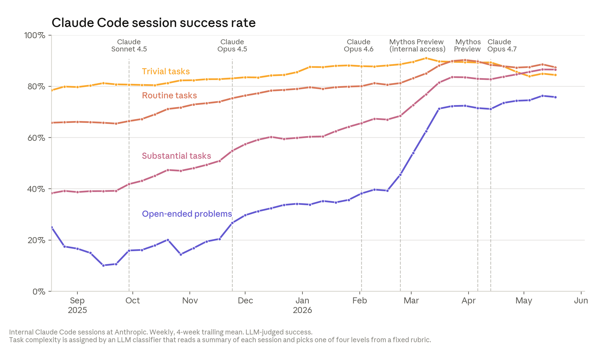

# 코드, 실험, 연구 판단으로 좁혀지는 병목

> 원본: [Anthropic Institute](https://www.anthropic.com/institute/recursive-self-improvement)

1편의 핵심은 Anthropic이 recursive self-improvement를 이미 완성된 사건이 아니라, AI 개발 사이클에서 인간이 맡던 단계가 하나씩 줄어드는 추세로 보고 있다는 점이었다. 2편에서는 그 추세가 실제 업무의 어디까지 들어왔는지를 좁혀 본다. 초점은 코드 작성, 코드 품질, 자동 리뷰, 실험 실행, 그리고 연구 세션에서 다음 행동을 고르는 판단이다.

Anthropic의 설명에서 중요한 구분은 "일을 한다"와 "어떤 일을 할지 정한다" 사이에 있다. Claude는 이미 상당한 양의 실행 작업을 맡고 있다. 코드를 쓰고, 테스트하고, 실험을 반복하고, 문제를 좁혀 간다. 하지만 이 모든 사례에서 아직 인간은 목표를 주거나, 평가 기준을 정하거나, 문제 자체를 고른다. 병목은 타이핑과 구현에서 점점 연구 취향, 검증, 우선순위 판단으로 이동하고 있다.

## 코드 작성량보다 중요한 것은 성공률이다

원문은 2026년 5월 기준 Anthropic 코드베이스에 merge되는 코드의 80% 이상이 Claude가 작성한 것으로 추정한다. Claude Code가 연구 preview로 나온 2025년 2월 이전에는 이 비율이 낮은 한 자릿수였다고 한다. 동시에 2026년 2분기에는 엔지니어 1인당 하루 merge line이 2024년 대비 8배 수준으로 늘었다.

다만 이 숫자는 곧바로 생산성 8배를 뜻하지 않는다. line of code는 품질을 보지 않고, generated code나 cleanup 작업처럼 사람이 예전에는 하지 않았을 일도 함께 늘어난다. Anthropic도 이 점을 인정한다. 그래서 2편에서 더 중요한 지표는 "Claude가 쓴 코드가 실제로 일을 끝내는가"다.

*Figure 2. Claude Code 세션 성공률은 trivial, routine, substantial, open-ended problem 같은 난이도별 작업에서 모델이 사용자 과제를 명확히 완수했는지를 Claude judge로 평가한 결과다.*

그래프의 독해 포인트는 단순한 상승 추세가 아니다. 가장 눈에 띄는 것은 open-ended problem, 즉 명세가 덜 분명하고 엔지니어도 정답 모양을 처음부터 모르는 작업에서의 개선이다. 원문에 따르면 2026년 5월 가장 개방적인 작업군에서 Claude의 성공률은 76%에 이르렀고, 6개월 전보다 50%p 올랐다.

이 작업군은 "버튼이 동작하지 않는다"처럼 작은 버그를 고치는 수준이 아니다. 예컨대 training job 수만 개가 routine upgrade 뒤 crash하는 상황에서, 엔지니어가 Claude에게 텍스트 컨텍스트와 cluster access 정도만 주고 조사를 맡긴 사례가 나온다. Claude는 실행 중인 job을 훑고, 환경 설정을 하나씩 바꿔 보며, crash를 유발한 obscure debugging flag를 찾아내고 재현 가능한 fix를 확인했다. 원문은 이 작업을 약 2시간으로 설명하며, 보통 인간에게는 2~3일짜리 조사였을 것이라고 본다.

여기서 성공률의 의미는 자동완성의 정확도와 다르다. Claude Code 세션은 문제를 읽고, 파일을 수정하고, 코드를 실행하고, 실패를 되짚고, 다시 고치는 연속 작업이다. 즉 한 번의 completion이 아니라 작은 개발 루프 전체를 평가한다. 이 루프가 안정될수록 인간의 역할은 "어떻게 고칠지"에서 "무엇을 맡길지, 결과를 믿어도 되는지"로 이동한다.

## 코드 품질과 자동 리뷰의 결합

코드가 작동하는 것만으로는 충분하지 않다. 좋은 코드는 다른 엔지니어가 이해하고, 유지하고, 그 위에 다음 변경을 쌓을 수 있어야 한다. Anthropic 내부 의견에는 완전한 합의가 없지만, 원문은 2025년 말 Claude-written code가 인간이 쓴 코드보다 다소 낮은 품질이었다고 보고, 2026년 현재는 대체로 parity에 가까워졌으며, 1년 안에 더 나아질 것으로 예상한다.

이 변화는 리뷰 프로세스에도 반영된다. Anthropic의 코드 변경은 merge 전에 자동 Claude reviewer가 읽고, 버그, 보안 결함, 기타 defect를 찾는다. 원문은 과거 claude.ai incident를 retrospective로 분석했을 때, 모든 변경에 자동 Claude review를 적용했다면 production에 도달하기 전에 약 3분의 1의 incident 원인 버그를 잡았을 것이라고 말한다.

이 지점은 recursive self-improvement 논의에서 특히 중요하다. 코드 작성자가 Claude이고, 1차 리뷰어도 Claude가 되면, 인간은 모든 diff를 line-by-line으로 검토하는 사람이 아니라 리뷰 체계를 설계하고, false positive와 false negative를 관리하고, 위험도가 높은 변경을 선별하는 사람이 된다. 속도가 빨라질수록 병목은 "코드를 생성하는 능력"이 아니라 "생성된 코드를 충분히 빠르고 정확하게 검증하는 능력"이 된다.

다음 표처럼 업무 표면이 재배치된다.

| 영역 | Claude가 이미 맡는 쪽 | 아직 인간 쪽에 남은 병목 |
|---|---|---|
| 구현 | 파일 수정, 테스트 실행, 반복 디버깅 | 목표 설정, 위험도 높은 결정 |
| 품질 | 작동하는 코드 작성, 자동 리뷰 | 장기 유지보수성 판단, 책임 있는 승인 |
| 사고 대응 | 로그와 실행 환경을 탐색하며 원인 좁히기 | 어떤 incident가 더 중요한지 정하기 |
| 연구 실험 | 정해진 metric을 최적화하는 반복 | 어떤 metric이 의미 있는지 정하기 |

## 정해진 목표를 향한 실험 실행은 이미 강하다

연구에서도 같은 패턴이 보인다. Anthropic은 모델을 release할 때마다 작은 AI 모델을 train하는 코드를 Claude에게 주고, 같은 correctness check를 통과하는 조건에서 최대한 빠르게 만들라고 시킨다. 목표와 성공 metric은 고정되어 있다. Claude의 일은 코드를 고치고, 실행하고, 시간을 재고, 실패를 분석하고, 다시 고치는 것이다.

이 setup은 실제 frontier training의 축소판은 아니지만, 연구 루프의 중요한 일부를 분리해 측정한다. 원문에 따르면 2025년 5월 Claude Opus 4는 시작 코드 대비 평균 약 3배 speedup을 냈고, 2026년 4월 Claude Mythos Preview는 약 52배 speedup을 냈다. 비교 기준으로 숙련된 인간 연구자는 같은 과제에서 4~8시간 동안 약 4배에 도달한다고 한다.

절대 배수를 그대로 현실 training speedup으로 읽으면 안 된다. 원문도 시작 코드에 개선 여지가 얼마나 남아 있는지에 따라 배수가 크게 달라진다고 주석을 단다. 하지만 같은 실험 setup에서 3배에서 52배로 오른 것은 의미가 있다. "아이디어는 사람이 내고, 구현과 실험 반복은 모델이 훨씬 빠르게 수행한다"는 업무 형태가 이미 연구 현장에서 성립하고 있다는 신호다.

## weak-to-strong 자동화는 방향 설정의 경계를 보여준다

좀 더 개방적인 연구 사례도 있다. 2026년 4월 Anthropic은 Claude-powered agent가 weak-to-strong supervision 문제를 end-to-end로 다룬 실험을 공개했다. 문제는 대략 "약한 모델이 강한 모델을 안정적으로 감독할 수 있는가"다. 에이전트들은 가설을 세우고, 실험을 설계하고, 병렬 에이전트와 결과를 공유하고, 다시 반복했다.

성과만 보면 강하다. 원문은 두 명의 인간 연구자가 약 1주일 동안 weak supervisor와 oracle-like upper bound 사이 gap의 약 23%를 회복한 반면, 에이전트들은 누적 800시간과 약 18,000달러의 compute로 97%를 회복했다고 설명한다.

하지만 이 사례는 동시에 한계를 분명히 한다.

- 사람은 문제를 골랐다.
- 사람은 scoring rubric을 만들었다.
- 결과는 production-scale model로 깔끔하게 transfer되지 않았다.
- 에이전트가 많은 compute와 병렬 시간을 썼기 때문에 인간 시간과 단순 비교하기 어렵다.

따라서 이 결과를 "Claude가 AI safety 연구자를 대체했다"로 읽기는 이르다. 더 정확한 해석은, 사람이 문제와 평가 프레임을 정해 주면 Claude agent가 그 안에서 상당히 넓은 실험 공간을 스스로 탐색할 수 있다는 것이다. 방향 설정은 여전히 인간 쪽에 있고, 방향 안의 탐색은 점점 모델 쪽으로 넘어간다.

## 다음 행동 판단: 51%에서 64%로

가장 흥미로운 부분은 연구 판단을 직접 겨냥한 실험이다. Anthropic은 2026년 1월부터 3월 사이 실제 Claude Code 세션 중, 연구자가 open-ended investigative problem을 다루던 사례를 골랐다. 예시는 training run이 계속 crash하는 이유를 찾거나, model benchmark score가 낮은 원인을 조사하는 상황이다.

각 세션에서 연구자가 한때 샛길로 빠졌고 나중에 다시 본류로 돌아온 순간을 찾았다. 그런 다음 모델에게는 샛길로 빠지기 전까지의 정보만 보여 주고, 다음에 무엇을 할지 묻게 했다. 별도의 Claude judge는 전체 세션 결과를 볼 수 있는 상태에서, 인간의 실제 next step과 모델의 제안을 비교해 어느 쪽이 더 나았는지 평가했다.

*Figure 3. 모델이 인간 연구자의 다음 선택보다 더 나은 next step을 제안할 수 있는지 비교한 결과다. practical ceiling은 전체 세션을 볼 수 있는 모델이 작성한 이상적 답변을 기준으로 삼는다.*

결과는 2025년 11월 Opus 4.5가 인간 선택을 51% 이긴 수준에서, 2026년 4월 Mythos Preview가 64% 이긴 수준으로 올라간 것이다. 이 수치는 연구 전체를 자동화했다는 증거라기보다, 연구 판단의 일부가 측정 가능한 능력으로 이동하고 있음을 보여준다. 연구는 거대한 한 번의 통찰보다 "다음에 무엇을 확인할지"를 계속 고르는 과정에 가깝기 때문이다.

다만 이 실험은 비교 설계상 조심해서 봐야 한다. Anthropic은 의도적으로 인간의 선택에 개선 여지가 있었던 순간 129개를 골랐다. 따라서 "평균적인 인간 연구자보다 모델이 낫다"는 결론은 아니다. 또 성공 여부를 Claude judge가 판단했고, 세션 선택도 내부 Anthropic 업무에서 나온다. 원문은 별도의 bias check로 인간 선택이 이미 강했던 127개 순간에서는 모델 제안이 약 20%만 더 낫게 평가되었다고 덧붙인다. 즉 모델은 아직 인간의 모든 판단을 압도하지 않는다. 다만 인간이 흔들리는 특정 구간에서 더 나은 next step을 제안할 가능성이 빠르게 커지고 있다.

## 내부 데이터가 말하는 것과 말하지 않는 것

이번 편의 수치들은 설득력이 있지만, 대부분 Anthropic 내부 데이터다. production code attribution, Claude Code session success, 자동 리뷰 retrospective, 연구 세션 next-step 평가는 모두 자체 측정과 내부 workflow에 기대고 있다. 특히 session success와 next-step 비교에는 Claude judge가 들어가며, 연구 세션 표본은 무작위 전체 업무가 아니라 분석 가능한 특정 순간들이다.

그래서 이 데이터는 외부 benchmark처럼 독립 검증된 일반 성능 지표라기보다, frontier lab 안에서 실제 업무 병목이 어떻게 재배치되는지 보여주는 관찰로 읽는 편이 안전하다. 결론도 그만큼 좁게 잡아야 한다. Claude가 모든 연구 판단을 대체했다는 것이 아니라, 코드 작성과 실험 실행의 인간 시간 비용을 크게 낮추면서 인간의 비교우위가 목표 선택, 평가 기준, 검증 체계, 큰 그림의 연구 취향 쪽으로 밀려나고 있다는 것이다.

이 병목 이동이 바로 recursive self-improvement 논의의 중간 단계다. AI가 자신의 후속 모델을 완전히 설계하고 개발하는 루프는 아직 닫히지 않았다. 그러나 루프의 많은 실행 구간은 이미 자동화되고 있다. 남은 질문은 실행 속도가 아니라, 어떤 방향으로 실행해야 하는지를 모델이 얼마나 잘 판단하게 될 것인가다. 3편에서는 이 추세가 멈출 때, 복합 효율화로 이어질 때, 혹은 완전한 자기개선으로 넘어갈 때 각각 어떤 미래가 열리는지 살펴본다.

이전 편: [재귀적 자기개선은 어디까지 왔나](01-where-recursive-self-improvement-stands.md) · 다음 편: [세 가지 미래와 조율의 문제](03-futures-and-coordination.md)

## 출처

- https://www.anthropic.com/institute/recursive-self-improvement
