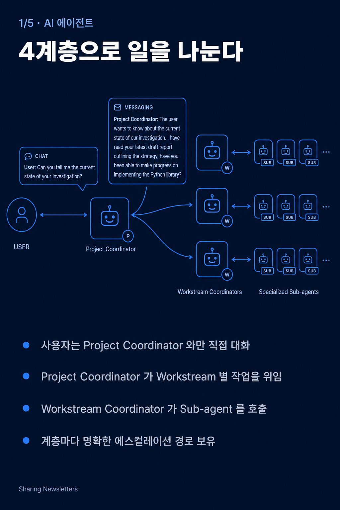

# Sharing Newsletters

내부 동료와 외부 기여자가 함께 모이는 AI 기술 공유 뉴스레터.

push 한 번으로 글이 올라가고, 정리는 Claude Code 가 도와준다. 작성 가이드는 레포 루트의 `README.md` 참조.

## 최근 카드 뉴스

<!-- CARDS_START -->

- 

  **[AI Co-Mathematician — 수학자와 비동기로 협업하는 에이전트 워크벤치](agents/2026-05-10-ai-co-mathematician/)** · 2026-05-10 · _TrainToGPB_

<!-- CARDS_END -->

## 최신 글

<!-- LATEST_START -->
- **2026-05-10** [AI Co-Mathematician — 수학자와 비동기로 협업하는 에이전트 워크벤치](agents/2026-05-10-ai-co-mathematician/) · _TrainToGPB_ — 수학자가 옆에 앉아 가설을 주고받는 비동기·상태 보존 에이전트 워크벤치. FrontierMath Tier 4에서 48%로 새 SOTA, 내부 100문항 벤치마크에서 Gemini Deep Think 대비 +17%p. `agents` `math` `frontiermath` `multi-agent`
- **2026-05-10** [TurboQuant — 학습 없는 KV 캐시·벡터 압축의 새 기준](inference/2026-05-10-turboquant/) · _Claude_ — 랜덤 회전으로 좌표 분포를 알려진 모양으로 만들고, MSE 양자화에 1-bit QJL 잔차 보정을 더해 KV 캐시를 6배 압축하면서 정확도 손실 없이 H100 에서 키 어텐션을 8배 가속하는 학습·데이터 비의존 양자화 (Google Research, ICLR 2026). `inference` `quantization` `kv-cache` `vector-search` `turboquant` `qjl` `polarquant`
<!-- LATEST_END -->

## 토픽

- [에이전트](agents/) — 에이전트, MCP, 도구 사용
- [모델](models/) — 신규 모델 출시·아키텍처
- [학습](training/) — 사전·사후학습, 파인튜닝, 데이터
- [추론](inference/) — 서빙·경량화·양자화 등 추론 기술
- [벤치마크](benchmark/) — 평가, 리더보드, 비교
- [인프라](infra/) — 클러스터·MLOps·비용
- [도구](tools/) — IDE, CLI, 개발 도구
- [모음](digest/) — 주간·월간 디제스트

## 기여하기

1. 이 레포 클론
2. Claude Code 에서 `/share-news <URL_or_PDF>` 실행
3. 생성된 파일을 검토하고 main 으로 push

수동 작성도 가능. 자세한 컨벤션은 `README.md` 와 `CLAUDE.md`.
