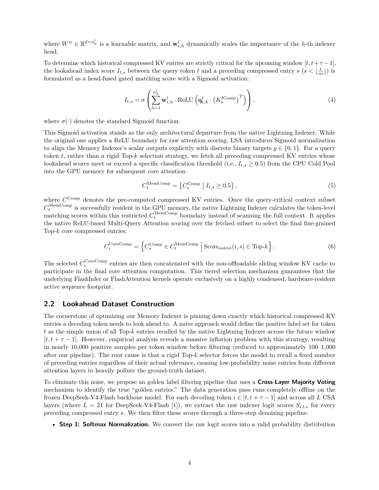

# Lookahead Sparse Attention은 무엇을 바꾸나

> 원본: [arxiv.org/abs/2606.09079](https://arxiv.org/abs/2606.09079)

첫 편에서 본 병목은 단순했다. 긴 컨텍스트를 지원하려면 과거 토큰의 KV cache를 붙잡아야 하고, 그 KV cache가 GPU HBM을 선형으로 먹는다. 그런데 실제 생성 단계에서 모든 과거 정보가 매 토큰마다 필요하지는 않다. 많은 요청은 최근 구간만으로도 충분하고, 일부 요청만 아주 먼 과거의 세부 정보를 다시 불러와야 한다. 이 차이를 구분하지 못하면 시스템은 늘 최악의 경우를 기준으로 메모리를 예약한다.

Lookahead Sparse Attention, 줄여서 LSA가 바꾸는 지점은 여기에 있다. LSA는 모델의 장기 문맥 능력을 버리지 않으면서도, fine-grained KV chunk 전체를 GPU에 상주시켜야 한다는 전제를 끊는다. 과거의 compressed KV entry는 CPU cold pool에 두고, 디코딩 중 일정 간격마다 Memory Indexer가 다음 짧은 구간에서 필요할 가능성이 높은 chunk만 골라 GPU로 가져온다. 그 다음 DeepSeek-V4가 원래 쓰던 Lightning Indexer가 가져온 후보 안에서 다시 token-level Top-k를 고른다.

즉 LSA는 attention 연산 자체를 새로 발명하기보다, "무엇을 GPU 위에 올려둘 것인가"를 예측 문제로 바꾼다. GPU는 모든 history를 들고 대기하는 장치가 아니라, 곧 쓸 subset만 유지하는 active memory가 된다.

## CSA가 하던 일과 LSA가 바꾸는 일

DeepSeek-V4 계열의 Compressed Sparse Attention, 즉 CSA pipeline은 이미 full attention보다 훨씬 효율적인 구조다. 과거 KV token을 compressed entry로 만들고, Lightning Indexer가 현재 query와 관련 있는 core compressed entry를 Top-k로 고른다. 이 방식은 FLOPs를 줄이는 데 효과적이다. 모든 token에 dense attention을 하지 않고, 압축된 후보 위에서 sparse하게 접근하기 때문이다.

하지만 메모리 관점에서는 문제가 남는다. CSA가 어떤 entry를 고를지 매 step 판단하려면, 적어도 선택 대상이 되는 compressed KV entry가 GPU에서 접근 가능해야 한다. 긴 history가 커질수록 GPU 위에 유지해야 하는 compressed KV도 같이 늘어난다. CSA는 계산량을 줄였지만, 긴 문맥 serving에서 GPU memory footprint를 충분히 분리하지는 못한다.

Figure 2가 대비하는 것도 이 지점이다. 검은 선으로 표현된 DS-V4 CSA pipeline은 매 디코딩 step마다 Lightning Indexer가 전체 compressed history를 보고 core entry를 고른다. 반면 빨간 선으로 표시된 LSA 경로는 Memory Indexer를 앞단에 둔다. Memory Indexer는 매 step 동작하지 않고, 고정 간격마다 다음 구간에 필요한 compressed KV subset을 예측한다. 이 subset만 CPU에서 GPU로 recall한 뒤, 기존 Lightning Indexer가 그 내부에서 다시 세밀하게 고른다.

| 구분 | DS-V4 CSA pipeline | LSA pipeline |
| --- | --- | --- |
| 선택 단위 | 매 token step의 Top-k 선택 | 고정 구간마다 lookahead subset 선택 후 매 token 재선택 |
| GPU 상주 대상 | 전체 또는 큰 범위의 compressed history | Memory Indexer가 가져온 compressed KV subset |
| 1차 선택기 | native Lightning Indexer | Memory Indexer |
| 2차 선택기 | 없음 또는 동일 단계의 Top-k | fetched subset 위 native Lightning Indexer |
| 핵심 효과 | attention 계산량 감소 | GPU memory footprint와 full history를 분리 |

여기서 중요한 점은 LSA가 native Lightning Indexer를 제거하지 않는다는 것이다. 오히려 마지막 token-level selection은 기존 구조를 그대로 살린다. LSA의 역할은 Lightning Indexer가 볼 후보 공간을 줄여서, full history scan이 아니라 fetched subset scan이 되게 만드는 것이다.

## Memory Indexer는 왜 별도 모듈인가

논문은 DeepSeek-V4의 기존 능력을 최대한 보존하는 것을 설계 원칙으로 둔다. 그래서 Memory Indexer는 native Lightning Indexer와 거의 같은 구조를 따른다. historical context의 dense representation으로는 기존 compressed indexer key인 $K_s^{\mathrm{IComp}}$를 재사용한다. 바뀌는 것은 출력의 의미와 선택 방식이다.

native Lightning Indexer의 score는 attention scoring에 가까운 값이다. ReLU boundary를 거친 raw matching score를 만들고, Top-k selector로 항상 정해진 개수의 entry를 고른다. 반면 Memory Indexer는 다음 구간에서 필요한지 아닌지를 맞히는 retrieval classifier처럼 동작한다. score를 $0$과 $1$ 사이로 해석할 수 있어야 하므로 마지막에 Sigmoid를 붙인다. 선택도 Top-k가 아니라 threshold 기반이다.

이 차이는 작아 보이지만 운영 의미가 크다. Top-k는 관련 entry가 거의 없어도 무조건 $k$개를 고른다. 반대로 관련 entry가 많아도 $k$개 이상은 버린다. long-context serving에서는 이 고정 개수가 어색하다. 어떤 생성 구간은 최근 문맥만으로 충분하고, 어떤 구간은 문서 앞부분의 여러 chunk를 동시에 되살려야 한다. LSA는 score $I_{t,s}$가 기준 이상인지 보는 방식으로, recall 개수가 query와 상황에 따라 달라지게 만든다.

## 고정 간격 $\tau = 64$의 의미

LSA는 매 token마다 CPU cold pool을 조회하지 않는다. 디코딩 step $t$가 고정 간격을 만족할 때만 Memory Indexer가 실행된다. 논문이 예시이자 실험 설정으로 쓰는 값은 $\tau = 64$다. 조건은 $t \bmod \tau = 0$로 표현된다. 이 시점에 현재 query token의 hidden state $h_t$를 보고, 앞으로의 window $[t, t + \tau - 1]$에서 필요할 historical compressed KV entry를 미리 고른다.

이 설계는 두 가지 균형을 잡는다.

- 매 step 예측하지 않아 Memory Indexer 호출 비용과 CPU-GPU transfer 빈도를 낮춘다.
- 너무 긴 구간을 한 번에 예측하지 않아, 현재 hidden state가 대표할 수 있는 미래 범위를 제한한다.
- fetched subset을 $\tau$ step 동안 재사용하므로, prefetch overhead를 여러 token에 나눠 상각한다.

다시 말해 $\tau$는 단순한 hyperparameter가 아니라 LSA의 시간 단위다. LSA는 "지금 token 하나에 필요한 memory"를 맞히는 방식이 아니라, "곧 생성할 block에 필요한 memory"를 맞힌다. 그래서 이름도 lookahead다. 현재 시점에서 미래의 짧은 구간을 보고, 그 구간의 sparse attention 후보를 미리 GPU에 준비한다.

## Score는 binary recall 확률처럼 해석된다

Memory Indexer는 현재 hidden state $h_t$를 low-rank query representation으로 투영한다. 논문에서는 down-projection과 up-projection을 거쳐 여러 indexer head의 query $q_{t,h}^{l}$를 만들고, 동시에 head별 중요도 weight $w_{t,h}^{l}$도 계산한다. 이때 historical entry $s$는 compressed indexer key $K_s^{\mathrm{IComp}}$로 표현된다.

핵심 score는 head별 matching 값을 가중합한 뒤 Sigmoid를 통과시킨 값이다.

$$
I_{t,s}
= \sigma \left(
\sum_{h=1}^{n_h^{l}}
w_{t,h}^{l}
\cdot
\mathrm{ReLU}
\left(
q_{t,h}^{l} \cdot \left(K_s^{\mathrm{IComp}}\right)^T
\right)
\right)
$$

여기서 $I_{t,s}$는 query step $t$에서 historical compressed entry $s$가 다음 lookahead window에 필요할지를 나타내는 점수다. $\sigma(\cdot)$는 Sigmoid이고, 출력 범위는 $(0, 1)$이다. 논문은 이 Sigmoid가 native Lightning Indexer와의 유일한 architectural departure라고 설명한다. 구조는 거의 같게 유지하되, output semantics를 binary target $y \in \{0, 1\}$에 맞춘 것이다.

*Memory Indexer는 head-fused matching score를 Sigmoid로 정규화하고, $I_{t,s} \ge 0.5$인 compressed KV entry를 GPU로 recall한다.*

이렇게 하면 score는 "Top-k 안에 들었는가"가 아니라 "다음 block에 필요한가"에 가까운 의미를 갖는다. 실무적으로는 이 차이가 중요하다. Top-k는 ranking 문제이고, threshold는 classification 문제다. ranking은 항상 상대 순위를 만든다. classification은 아무것도 필요하지 않은 구간에서 거의 아무것도 가져오지 않는 선택을 허용한다.

## Threshold selector와 CPU cold pool

LSA의 memory 절감은 threshold selector와 CPU cold pool이 결합될 때 나온다. historical compressed KV entry $C_s^{\mathrm{Comp}}$는 미리 계산되어 있지만, 전부 GPU에 있을 필요는 없다. CPU cold pool에 저장해 두고, Memory Indexer가 critical하다고 판단한 entry만 GPU로 가져온다. 논문에서 selector는 다음처럼 표현된다.

$$
C_t^{\mathrm{MemComp}}
=
\left\{
C_s^{\mathrm{Comp}}
\mid
I_{t,s} \ge 0.5
\right\}
$$

여기서 $C_t^{\mathrm{MemComp}}$는 step $t$에서 GPU에 올릴 query-critical compressed KV subset이다. 기준값은 $0.5$다. score가 $0.5$ 이상이면 다음 $\tau$ step window에서 필요할 수 있다고 보고 recall한다. score가 낮으면 CPU cold pool에 남긴다.

이 구조는 sliding-window attention과 다르다. sliding window는 오래된 history를 규칙적으로 버린다. 그래서 대부분 요청에서는 효율적이지만, 먼 과거의 특정 사실이 필요한 순간에는 실패할 수 있다. LSA는 오래된 history를 버리는 것이 아니라 cold storage로 내려놓는다. 그리고 필요할 때 subset만 다시 올린다. 따라서 memory policy는 "age-based eviction"이 아니라 "query-conditioned recall"에 가깝다.

운영 관점에서 이 차이는 다음처럼 정리할 수 있다.

- 최근 KV는 non-offloadable sliding window로 계속 GPU에 남긴다.
- 오래된 compressed KV는 CPU cold pool에 저장한다.
- Memory Indexer가 lookahead window 기준으로 필요한 오래된 entry를 고른다.
- 선택된 entry만 GPU에 fetch되어 active attention footprint에 들어온다.

즉 LSA는 local context와 global memory를 서로 다른 방식으로 다룬다. 최근 문맥은 항상 빠르게 접근 가능해야 하므로 GPU에 둔다. 먼 문맥은 드물게 필요하므로, 예측 가능한 시점에만 GPU로 가져온다.

## 가져온 subset 위에서 다시 Lightning Indexer가 고른다

Memory Indexer가 고른 $C_t^{\mathrm{MemComp}}$가 곧 최종 attention 대상은 아니다. 이 subset은 "다음 구간에서 필요할 가능성이 있는 후보"다. 실제 token $i$를 생성할 때는 native Lightning Indexer가 이 제한된 boundary 안에서 다시 matching score를 계산한다. 논문은 이를 native ReLU 기반 Multi-Query Attention scoring으로 설명한다.

최종 core compressed entry는 다음처럼 고른다.

$$
C_i^{\mathrm{CoreComp}}
=
\left\{
C_s^{\mathrm{Comp}} \in C_t^{\mathrm{MemComp}}
\mid
\mathrm{Score}_{\mathrm{native}}(i, s) \in \mathrm{Top}\text{-}k
\right\}
$$

이 2단계 구조가 LSA의 안전장치다. Memory Indexer는 coarse retrieval을 맡는다. 넓은 historical pool에서 다음 block에 관련 있을 subset을 가져온다. Lightning Indexer는 fine selection을 맡는다. 이미 GPU에 resident한 subset 안에서, 각 token이 실제로 attend할 core entry를 고른다. 따라서 기존 DeepSeek-V4의 token-level sparse attention 동작을 크게 흔들지 않으면서, 그 앞의 memory residency만 바꿀 수 있다.

최종적으로 선택된 $C_i^{\mathrm{CoreComp}}$는 GPU에 남아 있는 sliding window KV cache와 concat된다. attention kernel이 보는 active sequence footprint는 두 부분의 결합이다. 하나는 최근 token의 dense local memory이고, 다른 하나는 Memory Indexer가 불러온 historical compressed memory 중 native Lightning Indexer가 다시 고른 core memory다.

## 왜 "lookahead"가 memory 문제를 푸는가

긴 문맥 inference에서 까다로운 점은 정보가 필요해지는 시점과 정보를 GPU에 준비하는 시점이 같으면 늦다는 것이다. 매 token마다 CPU에서 필요한 chunk를 즉석에서 찾고 가져오면 latency가 커진다. 반대로 모든 chunk를 미리 GPU에 두면 memory가 터진다. LSA는 이 사이에서 block-level prefetch를 선택한다.

현재 hidden state $h_t$는 지금까지의 생성 상태를 요약한다. LSA는 이 표현을 사용해 앞으로 $\tau$ step 동안 필요할 historical chunk를 예측한다. 예측이 맞으면, 이후 token들은 GPU에 이미 올라온 subset 위에서 빠르게 native selection을 수행한다. 예측이 너무 넓으면 memory 절감이 줄고, 너무 좁으면 정확도가 떨어진다. 그래서 Sigmoid score, threshold $0.5$, $\tau = 64$는 모두 같은 trade-off를 다룬다.

이 관점에서 LSA는 단순한 sparse attention이 아니다. sparse attention은 보통 "어떤 token을 볼 것인가"의 문제로 설명된다. LSA는 여기에 "그 token의 compressed KV를 어느 memory tier에 둘 것인가"를 추가한다. GPU HBM, CPU cold pool, sliding window KV, fetched compressed subset이 하나의 pipeline 안에서 역할을 나눠 갖는다.

## 이번 편의 핵심 정리

LSA의 변화는 모델 구조 전체를 갈아엎는 데 있지 않다. DeepSeek-V4의 native Lightning Indexer와 compressed KV representation을 최대한 유지하면서, full history를 항상 GPU에 올려두는 운영 방식을 바꾼다. Memory Indexer는 기존 indexer와 유사한 구조를 쓰되 Sigmoid score를 내고, $I_{t,s} \ge 0.5$인 entry만 CPU cold pool에서 GPU로 가져온다.

그 다음 단계에서는 native Lightning Indexer가 fetched subset 안에서 다시 Top-k core entry를 고른다. 마지막 attention에는 이 core compressed entry와 sliding window KV가 concat되어 들어간다. 이 tiered selection 덕분에 LSA는 긴 문맥을 완전히 버리지 않으면서도, 대부분의 디코딩 구간에서 GPU가 들고 있어야 하는 active memory를 크게 줄일 수 있다.

다음 편: [backbone 없이 Memory Indexer를 어떻게 학습하나](03-backbone-free-indexer-training.md)

## 출처

- https://arxiv.org/abs/2606.09079
