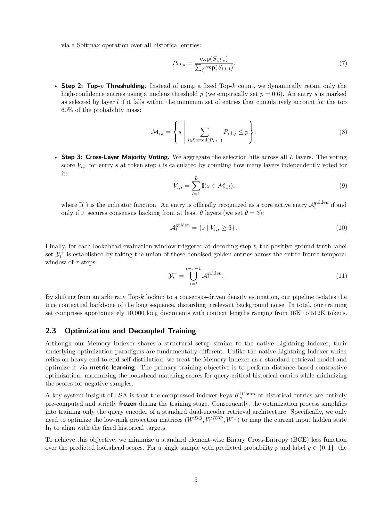

# backbone 없이 Memory Indexer를 어떻게 학습하나

> 원본: [arxiv.org/abs/2606.09079](https://arxiv.org/abs/2606.09079)

앞 편에서는 Lookahead Sparse Attention이 디코딩 시점 $t$ 에서 미래 구간 $[t, t+\tau-1]$ 을 미리 보고, 필요한 compressed KV chunk만 CPU Cold Pool에서 GPU로 끌어오는 구조를 봤다. 이 편의 질문은 더 실무적이다. 그런 indexer를 학습하려면 DeepSeek-V4-Flash 같은 거대 backbone을 매번 GPU에 올려 end-to-end distillation을 해야 할까?

FlashMemory의 답은 아니다. 논문은 Memory Indexer를 거대 LLM의 일부로 계속 붙잡고 있지 않고, retrieval 모델처럼 떼어내서 학습한다. backbone으로부터 미리 hidden state, compressed indexer key, golden chunk label을 추출해 두고, 실제 최적화 단계에서는 query encoder에 해당하는 작은 projection matrix만 업데이트한다. 덕분에 전체 학습은 한 장의 H20 GPU에서 약 1시간 안에 수렴하고, 8장 H20 클러스터 기준으로 일주일에 약 500개의 실험을 돌릴 수 있었다고 보고한다.

## 왜 label 만들기가 핵심인가

Memory Indexer의 출력은 단순하다. 현재 token hidden state $h_t$ 를 query로 바꾸고, 과거 compressed entry $s$ 와의 score $I_{t,s}$ 를 계산한 뒤, $I_{t,s} \ge 0.5$ 인 entry를 GPU로 가져온다. 학습 관점에서는 결국 각 $(t, s)$ 쌍에 대해 $y_{t,s} \in \{0, 1\}$ label을 붙이는 binary classification 문제가 된다.

문제는 이 label이 원래 데이터셋에 들어 있지 않다는 점이다. 문서에는 "이 chunk는 미래 64 token에서 꼭 필요하다" 같은 정답이 없다. 그래서 논문은 frozen DeepSeek-V4-Flash backbone을 오프라인으로 한 번 통과시켜, native Lightning Indexer가 각 layer에서 어떤 compressed entry를 중요하게 보는지 관찰한다. 이 관찰값을 그대로 쓰면 안 된다. native indexer의 Top-$k$ 선택은 relevance가 낮아도 정해진 개수만큼 반드시 고르기 때문에, noise가 대량으로 label에 섞인다.

논문이 제시한 수치가 이 문제의 크기를 잘 보여준다. 단순히 미래 window 안의 모든 Top-$k$ 결과를 union하면 token window 하나당 positive sample이 거의 10,000개까지 부풀어 오른다. 반면 필터링 후에는 대략 100개에서 1,000개 수준으로 줄어든다. 즉 FlashMemory의 학습 성패는 "무엇을 positive로 볼 것인가"를 얼마나 깔끔하게 정의하느냐에 걸려 있다.

## Lookahead dataset construction

데이터 생성은 완전히 오프라인에서 수행된다. 디코딩 step $t$ 에서 lookahead window 길이를 $\tau$ 라고 두면, 학습 label은 현재 token 하나가 아니라 미래 구간 전체 $[t, t+\tau-1]$ 를 대상으로 만든다. 논문에서는 $\tau = 64$ 를 사용한다.

각 미래 token $i \in [t, t+\tau-1]$ 에 대해, 모든 CSA layer $l$ 에서 과거 compressed entry $s$ 의 raw indexer logit $S_{i,l,s}$ 를 추출한다. DeepSeek-V4-Flash 기준으로 이 CSA layer 수는 $L = 21$ 이다. 이후 세 단계의 denoising을 거친다.

1. **Softmax normalization**: layer별 raw logit을 과거 entry 전체에 대한 확률분포로 바꾼다.

$$
P_{i,l,s} = \frac{\exp(S_{i,l,s})}{\sum_j \exp(S_{i,l,j})}
$$

2. **Top-$p$ thresholding**: 고정된 Top-$k$ 개수를 버리고, 확률질량 상위 $p$ 만큼만 남긴다. 논문은 경험적으로 $p = 0.6$ 을 사용한다. 즉 정렬된 entry를 높은 확률부터 누적했을 때, 전체 확률질량의 60%를 설명하는 최소 집합을 layer $l$ 의 후보 집합 $M_{i,l}$ 로 본다.

$$
M_{i,l} = \left\{s \mid \sum_{j \in \mathrm{Sorted}(P_{i,l,:})} P_{i,l,j} \le p \right\}
$$

3. **Cross-layer majority voting**: 각 entry $s$ 가 몇 개 layer에서 후보로 뽑혔는지 센다.

$$
V_{i,s} = \sum_{l=1}^{L} \mathbf{1}(s \in M_{i,l})
$$

entry $s$ 가 golden active entry가 되려면 최소 $\theta$ 개 layer의 동의를 받아야 한다. 논문은 $\theta = 3$ 을 사용한다.

$$
A_i^{\mathrm{golden}} = \{s \mid V_{i,s} \ge 3\}
$$

마지막으로 디코딩 step $t$ 의 positive label set은 미래 window 안에서 얻은 golden entry들의 union이다.

$$
Y_t^{+} = \bigcup_{i=t}^{t+\tau-1} A_i^{\mathrm{golden}}
$$

이 union이 중요한 이유는 lookahead의 목적과 맞닿아 있다. indexer는 지금 당장 token $t$ 하나가 쓸 chunk만 가져오는 장치가 아니다. 다음 $\tau$ token 동안 필요할 가능성이 높은 chunk를 미리 GPU에 올려 두는 장치다. 따라서 label도 "현재 token의 정답"이 아니라 "가까운 미래 구간 전체의 정답"이어야 한다.

*Top-$p$ filtering, cross-layer majority voting, 미래 window union을 거쳐 Memory Indexer 학습용 positive label을 만든다.*

## Top-$k$ 대신 Top-$p$ 를 쓰는 이유

Top-$k$ 는 구현이 단순하지만 label 생성에는 나쁜 성질이 있다. 모든 token과 모든 layer에서 같은 개수의 entry를 고르기 때문에, 실제로는 확률이 낮은 tail entry도 positive처럼 들어온다. 긴 문맥에서는 과거 chunk 수가 많고, layer 수도 많고, 미래 window도 있으므로 이 작은 noise가 곱셈처럼 커진다.

Top-$p$ 는 entry 개수가 아니라 확률질량을 기준으로 자른다. 확률분포가 sharp하면 적은 chunk만 남고, 분포가 diffuse하면 더 많은 chunk가 남는다. 즉 native indexer의 confidence를 label 크기에 반영한다. 여기서 $p = 0.6$ 은 "가장 확실한 상위 60% 질량만 보자"는 conservative한 cutoff다.

하지만 Top-$p$ 만으로는 부족하다. 어떤 layer 하나가 순간적으로 잘못 본 chunk가 여전히 남을 수 있다. 그래서 cross-layer majority voting이 붙는다. $L = 21$ 개 layer 중 최소 $\theta = 3$ 개 layer가 같은 entry를 골라야 golden entry가 된다. 단일 layer의 우연한 선택을 버리고, 여러 layer가 독립적으로 반복해서 가리키는 chunk만 살리는 것이다.

이 설계는 retrieval 데이터셋을 만드는 방식과 닮았다. 대규모 검색 모델을 학습할 때도 클릭 로그를 그대로 positive로 쓰지 않고, 중복 신호, dwell time, query-document consistency 같은 필터를 겹쳐 noise를 줄인다. FlashMemory도 LLM 내부 indexer의 logit을 pseudo-label로 쓰되, Top-$p$ 와 majority voting으로 "정답에 가까운 pseudo-label"을 만든다.

## 학습 corpus의 범위

논문은 약 10,000개의 long document로 학습셋을 구성한다. 문맥 길이는 16K에서 512K token까지 포함된다. 이 범위 설정은 단순한 스케일 자랑이 아니라, 뒤에서 평가되는 500K급 memory wall 문제와 직접 연결된다.

짧은 문맥에서만 label을 만들면 indexer는 long-range retrieval을 제대로 배우기 어렵다. 반대로 너무 긴 문맥만 쓰면 쉬운 근거리 pattern이나 중간 길이 문맥의 분포를 놓칠 수 있다. 16K부터 512K까지 섞는 것은 query encoder가 다양한 거리의 compressed entry를 같은 scoring 공간 안에서 다루게 만드는 장치로 볼 수 있다.

여기서도 backbone-free 학습의 장점이 드러난다. 거대 backbone을 매번 end-to-end로 띄워야 한다면 512K 문맥 학습 실험을 수백 번 반복하기 어렵다. 하지만 hidden state와 key, label을 오프라인 artifact로 만들어 두면, 이후 실험은 작은 retrieval head 학습으로 바뀐다. 논문에서 500 runs/week를 강조하는 이유가 여기에 있다. architecture와 loss 조합을 실제로 많이 쓸어 볼 수 있어야, sparse routing의 memory-accuracy Pareto frontier를 찾을 수 있다.

## Query encoder만 학습한다

FlashMemory의 Memory Indexer는 dual-encoder retrieval 모델처럼 해석된다. 한쪽 encoder는 현재 token의 hidden state $h_t$ 를 lookahead query로 바꾸고, 다른 쪽은 과거 compressed entry의 key $K_s^{\mathrm{IComp}}$ 를 제공한다. 다만 두 encoder를 모두 학습하지 않는다. historical compressed indexer key $K_s^{\mathrm{IComp}}$ 는 미리 계산해 두고 frozen 상태로 둔다.

학습되는 것은 query encoder 쪽 projection matrix다. 논문 표기상 $W^{DQ}$, $W^{IUQ}$, $W^w$ 가 여기에 해당한다. 이 matrix들은 $h_t$ 를 low-rank query representation과 routing head weight로 바꾼다. 전체 LLM parameter와 비교하면 0.1% 미만의 작은 부분이다.

목표 함수는 기본적으로 element-wise Binary Cross-Entropy다. 예측 확률을 $p$ , label을 $y \in \{0, 1\}$ 라고 하면 per-sample BCE는 다음과 같다.

$$
\ell_{\mathrm{BCE}}(p, y) = -\left(y \log(p) + (1-y)\log(1-p)\right)
$$

$s \in Y_t^{+}$ 이면 $y_{t,s} = 1$ , 아니면 $y_{t,s} = 0$ 이다. batch objective는 sampled pair 전체의 평균이다. 중요한 점은 이 학습 loop 안에 host LLM forward가 없다는 것이다. $h_t$, $K_s^{\mathrm{IComp}}$, $Y_t^{+}$ 가 이미 disk에 있으므로, optimizer는 작은 query projection만 업데이트한다.

이 구조는 비용뿐 아니라 실험 설계도 바꾼다. native Lightning Indexer처럼 heavy end-to-end self-distillation을 돌리는 방식이면, loss 하나 바꾸거나 layer 조합 하나 바꾸는 실험이 큰 cluster job이 된다. FlashMemory에서는 같은 실험이 retrieval model fine-tuning에 가까운 작업이 된다.

## BCE에서 Focal Loss로

최종 production recipe에서는 단순 BCE만 쓰지 않고 Focal Loss를 사용한다. 이유는 class imbalance다. 긴 문맥에서 가능한 $(t, s)$ pair는 매우 많고, golden positive는 그중 일부다. random negative sampling을 하더라도 쉬운 negative가 gradient를 지배하면, decision boundary 근처의 애매한 chunk를 잘 배우지 못한다.

논문은 Sigmoid가 적용된 indexer score를 $p_{t,s}$ , label을 $y_{t,s}$ 라고 두고, 먼저 correct class confidence를 정의한다.

$$
p_{t,s}^{\mathrm{correct}} = p_{t,s} \cdot y_{t,s} + (1-p_{t,s}) \cdot (1-y_{t,s})
$$

그 다음 $\gamma = 2$ 인 Focal Loss를 사용한다.

$$
L_{\mathrm{FL}} = \frac{1}{|S|}\sum_{s \in S} w_{t,s}\left(1-p_{t,s}^{\mathrm{correct}}\right)^\gamma \ell_{\mathrm{BCE}}(I_{t,s}, y_{t,s})
$$

잘 맞히는 sample은 $\left(1-p_{t,s}^{\mathrm{correct}}\right)^\gamma$ 항 때문에 작아지고, 틀리거나 애매한 sample은 상대적으로 크게 남는다. 별도의 class balancing coefficient $\alpha$ 는 쓰지 않는다. 대신 positive 하나당 negative 세 개를 뽑는 3:1 negative sampling과 per-sample weight $w_{t,s}$ 로 imbalance를 처리한다.

이 선택은 Memory Indexer의 역할과 맞는다. 이 indexer는 precision만 높은 검색기가 아니라, 중요한 chunk를 놓치지 않는 safety net이어야 한다. 너무 쉬운 negative에 맞춰 decision boundary를 좁히면 GPU memory는 줄어도 recall 손실이 생길 수 있다. Focal Loss는 그 경계 sample에 학습 신호를 더 준다.

## 어느 layer에 indexer를 둘 것인가

Section 2.4의 핵심은 layer placement다. 모든 transformer layer가 lookahead prediction에 적합한 것은 아니다. 초반 shallow layer는 low-level token statistics를 많이 담고, long-range semantic dependency를 충분히 반영하지 못한다. 따라서 초기 layer에 Memory Indexer를 붙이면 예측 품질이 나쁘다.

그렇다고 많은 layer에 다 붙이는 것도 답이 아니다. 논문은 layer 6부터 20까지 8-layer joint configuration을 쓰면 recall mask가 지나치게 느슨해져, 과거 compressed KV entry의 30%에서 49%까지 GPU로 가져오게 된다고 설명한다. sparse attention의 목적은 memory tax를 줄이는 것인데, 너무 많은 layer의 union은 사실상 memory를 다시 키운다.

500회 규모의 Pareto sweep 결과, 논문은 layer 10, 12, 20 세 곳을 최적 조합으로 선택한다. inference에서는 세 layer indexer의 예측을 OR-mode routing으로 합친다. 즉 세 layer 중 하나라도 $I_{t,s}^{(l)} \ge 0.5$ 라고 판단하면 해당 compressed entry를 가져온다.

$$
C_t^{\mathrm{MemComp}} =
\bigcup_{l \in \{10,12,20\}}
\left\{C_s^{\mathrm{Comp}} \mid I_{t,s}^{(l)} \ge 0.5\right\}
$$

여기서 "3-layer consensus"라는 표현은 조금 조심해서 읽을 필요가 있다. label 생성 단계의 cross-layer majority voting은 $\theta = 3$ 개 layer의 동의를 요구한다. 반면 inference routing은 layer 10, 12, 20의 union, 즉 OR다. 학습 label은 noise를 줄이기 위해 consensus를 쓰고, inference fetch는 recall 보호를 위해 union을 쓴다. 두 단계의 목적이 다르다.

## 최종 recipe와 버린 trick들

최종 모델은 세 가지 선택을 조합한다.

| 항목 | 선택 | 의도 |
| --- | --- | --- |
| 초기화 | random initialization | host checkpoint의 alignment bias 없이 query encoder를 새로 학습 |
| query capacity | internal low-rank dimension $r = 2048$ | DeepSeek MLA/MQA의 query projection capacity 확대 |
| loss | Focal Loss, $\gamma = 2$ | 쉬운 negative보다 hard boundary sample에 집중 |
| sampling | negative:positive $= 3:1$ | class imbalance를 단순하고 안정적으로 제어 |
| layer | 10, 12, 20 | memory overhead와 recall 사이의 Pareto 균형 |

여기서 $r = 2048$ 은 PEFT-style LoRA rank가 아니다. 논문은 DeepSeek 계열 attention 구조 안의 query low-rank bottleneck 차원, 즉 `q_lora_rank`와 대응되는 architectural dimension으로 설명한다. adapter를 추가하는 것이 아니라, lookahead query encoder의 표현 용량을 정하는 내부 차원이라는 뜻이다.

반대로 500회 sweep에서 제외된 trick도 중요하다.

- **Pairwise-to-pointwise chaining**: BPR이나 margin loss 같은 pairwise ranking 단계를 거친 뒤 pointwise calibration으로 넘어가는 방식은 pure pointwise training 대비 통계적으로 의미 있는 recall gain을 주지 못했다.
- **Strong negative mining**: LLM이 semantic chunk를 골라 만든 hard negative pool은 오히려 secondary label noise를 만들었다. non-voted historical repository에서 random negative를 뽑는 편이 더 robust했다.
- **Weighted loss functions**: native layer matching count에 따라 loss를 키우는 방식은 raw precision을 약간 올렸지만, boundary context를 버리면서 absolute recall bound를 낮췄다.

이 결과는 꽤 실용적인 메시지를 준다. Memory Indexer 학습은 검색 모델처럼 보이지만, 일반적인 retrieval trick을 많이 얹는다고 반드시 좋아지지 않는다. 이 시스템에서 더 중요한 것은 golden label의 noise를 줄이고, recall을 해치지 않는 decision boundary를 만드는 것이다.

## 남은 불확실성

논문도 hyperparameter 선택이 완전히 닫힌 문제라고 주장하지 않는다. 프로젝트가 중단되면서 $\tau = 64$ 와 classification threshold $0.5$ 에 대한 체계적 ablation은 충분히 수행하지 못했다고 적는다. layer 10, 12, 20 조합은 500-run Pareto sweep으로 선택했지만, 더 촘촘한 layer-wise ablation은 future work로 남아 있다.

따라서 이 편의 결론은 "이 recipe가 보편 최적"이라는 말이 아니다. 더 정확히는, FlashMemory가 거대 backbone을 매번 학습 loop에 넣지 않아도 되는 실험 구조를 만들었고, 그 덕분에 label filtering, loss, layer placement를 빠르게 탐색할 수 있었다는 점이다. backbone-free training은 단순한 비용 절감 기법이 아니라, ultra-long context inference 시스템을 실제로 튜닝 가능하게 만든 실험 인프라다.

다음 편: [평가 결과는 memory wall을 얼마나 깼나](04-evaluation-memory-wall.md)

## 출처

- FlashMemory-DeepSeek-V4 논문: https://arxiv.org/abs/2606.09079
