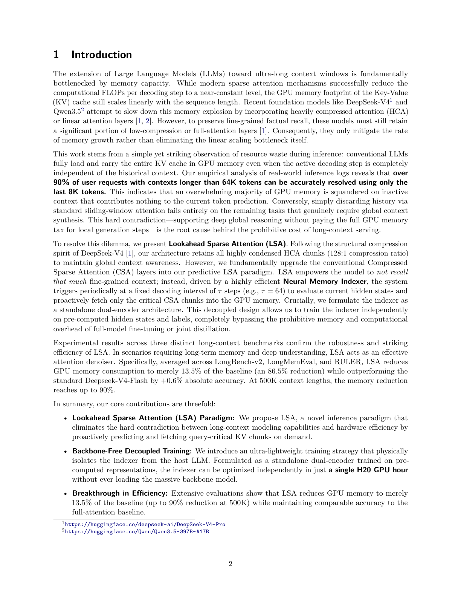

# FlashMemory-DeepSeek-V4 — 긴 컨텍스트 KV cache를 미리 골라 싣는 LSA

> 원본: [arxiv.org/abs/2606.09079](https://arxiv.org/abs/2606.09079)

FlashMemory-DeepSeek-V4는 ultra-long context LLM serving에서 "모든 history KV cache를 GPU에 계속 들고 있어야 하는가"라는 가정을 Lookahead Sparse Attention으로 정면으로 건드린다.

## 핵심 포인트

- **병목은 FLOPs만이 아니다.** sparse attention이 decoding FLOPs를 줄여도 KV cache는 sequence length에 따라 GPU memory를 계속 먹는다.
- **LSA는 미리 고르는 sparse attention이다.** Memory Indexer가 `$\\tau = 64$` step마다 다음 구간에 필요한 historical compressed KV chunk를 예측하고, CPU cold pool에서 GPU로 가져온다.
- **backbone-free 학습이 핵심이다.** indexer는 frozen DeepSeek-V4-Flash backbone을 다시 올리지 않고, pre-computed hidden state와 golden chunk label로 dual-encoder retrieval 모델처럼 학습된다.
- **보고된 평균 memory footprint는 13.5%다.** LongBench-v2, LongMemEval, RULER 평균에서 DS-V4-Flash 대비 GPU KV cache overhead를 86.5% 줄이고 평균 정확도는 76.9에서 77.5로 오른다.
- **한계도 선명하다.** context-independent task에서는 false positive retrieval이 누적되고, MRCR처럼 dense global memory가 필요한 benchmark에서는 정확도가 크게 떨어진다.

## 한 페이지 요약

긴 컨텍스트 모델의 서빙 비용을 볼 때 흔히 attention 계산량을 먼저 떠올린다. 하지만 FlashMemory-DeepSeek-V4 보고서가 겨냥하는 병목은 더 물리적이다. decoding 중 현재 token이 과거 전체를 실제로 필요로 하지 않더라도, 기존 LLM serving은 긴 prompt의 `$K$`, `$V$` cache를 GPU memory에 계속 유지한다. DeepSeek-V4나 Qwen3.5 같은 모델이 compressed attention, HCA, linear attention으로 증가 속도를 늦춰도, fine-grained recall을 위해 일부 low-compression 또는 full-attention 계층의 cache는 길이에 따라 계속 커진다.

저자들의 출발점은 운영 로그 관찰이다. 64K token을 넘는 real-world request 중 90% 이상은 마지막 8K token만으로도 정확히 해결된다고 한다. 그렇다면 대부분의 decoding step에서 전체 history KV cache는 GPU memory를 점유하지만 현재 token prediction에는 기여하지 않는다. 반대로 단순 sliding window는 나머지 10%의 global context synthesis task에서 무너진다. FlashMemory는 이 둘 사이에서 "항상 full cache"와 "항상 최근 window"가 아닌 세 번째 선택지를 만든다.

*논문 Figure 1이 포함된 페이지. FM-DS-V4는 benchmark 평균에서 DS-V4-Flash 대비 훨씬 작은 physical KV cache footprint를 보고한다.*

그 선택지가 Lookahead Sparse Attention, 줄여서 LSA다. LSA는 DeepSeek-V4-Flash의 compressed sparse attention 구조를 크게 바꾸지 않는다. 대신 native Lightning Indexer 옆에 Memory Indexer를 두고, 이 indexer가 일정 decoding interval마다 현재 hidden state를 보고 다음 `$\\tau$` step 동안 필요할 historical compressed KV entry를 미리 예측한다. 선택된 chunk만 CPU cold pool에서 GPU memory로 올라오고, 이후 native Lightning Indexer가 그 제한된 subset 안에서 다시 fine-grained Top-k를 고른다. 최종 attention은 local sliding-window KV cache와 fetched compressed KV chunk를 합친 작은 active footprint 위에서 돈다.

흥미로운 점은 학습 방식이다. Memory Indexer는 거대한 backbone과 end-to-end로 붙여 학습하지 않는다. DeepSeek-V4-Flash를 frozen backbone으로 두고, offline pass에서 hidden state와 native indexer score를 뽑는다. 이후 future window 안에서 여러 CSA layer가 반복적으로 선택한 chunk를 cross-layer majority voting으로 "golden entry" label로 만들고, indexer는 fixed historical key와 current query hidden state를 맞추는 dual-encoder retrieval 모델처럼 학습한다. 학습 대상은 query projection 쪽의 작은 행렬뿐이다. 논문은 이 구조 덕분에 전체 indexer가 단일 H20 GPU hour 안에 수렴했고, 8x H20 cluster로 한 주에 약 500개 run을 돌려 layer placement와 recipe를 탐색했다고 설명한다.

결과 수치는 강하다. LongBench-v2, LongMemEval, RULER의 46K부터 512K 수준 context에서 FM-DS-V4는 평균 정확도 77.5를 기록해 DS-V4-Flash의 76.9보다 0.6 point 높다. 동시에 평균 GPU KV cache overhead는 0.93GB에서 0.10GB로 줄어, baseline의 13.5% footprint만 쓴다. LongBench-v2-L 493K에서는 68.1에서 70.0으로 올라가면서 memory는 1.80GB에서 0.18GB가 된다. 저자들은 이를 "less is more"로 해석한다. 불필요한 history chunk를 제거하면 memory만 줄어드는 것이 아니라, attention noise가 줄어 factual recall에도 도움이 될 수 있다는 주장이다.

다만 이 보고서를 그대로 "긴 컨텍스트 KV cache 문제가 해결됐다"로 읽으면 안 된다. 저자들은 Section 3.3에서 실패 조건을 꽤 투명하게 공개한다. context-independent query에서는 retrieval이 0에 가까워져야 하지만, pointwise Sigmoid gating은 긴 candidate pool 위에서 작은 false positive를 누적한다. MRCR처럼 dense global memory dependency가 강한 benchmark에서는 baseline 76.0%가 48.0%로 떨어진다. 또한 128K 근처에서 학습한 indexer가 1M+ context로 자연스럽게 일반화될 것이라는 기대도 깨졌고, 경험적으로 training length의 2배 정도가 ceiling이라고 정리한다.

그래서 FlashMemory-DeepSeek-V4의 의미는 완성된 제품이라기보다, ultra-long context serving의 새로운 설계축을 보여주는 technical report에 가깝다. 핵심 질문은 "KV cache를 얼마나 압축할까"에서 "어떤 cache를 언제 GPU에 올릴까"로 이동한다. 실전 적용을 생각한다면 workload classifier, dense retrieval fallback, late-interaction indexer, end-to-end 또는 online calibration, context length별 validation이 함께 필요하다. 그래도 평균 13.5% footprint에서 정확도를 유지했다는 결과는 sparse KV retrieval이 long-context serving 비용 구조를 바꿀 수 있음을 보여주는 강한 신호다.

## 자세히 보기

<!-- VERSIONS_START -->
1. [왜 긴 컨텍스트 서빙은 KV cache에서 막히나](details/01-kv-cache-bottleneck/) — FlashMemory-DeepSeek-V4의 문제의식은 긴 컨텍스트 모델의 FLOPs보다 GPU에 상주하는 KV cache가 병목이라는 데서 출발한다.
2. [Lookahead Sparse Attention은 무엇을 바꾸나](details/02-lookahead-sparse-attention/) — LSA는 전체 history를 계속 GPU에 올려두지 않고, Memory Indexer가 다음 구간에 필요한 compressed KV chunk를 미리 골라 CPU cold pool에서 가져오는 방식이다.
3. [backbone 없이 Memory Indexer를 어떻게 학습하나](details/03-backbone-free-indexer-training/) — FlashMemory는 거대 backbone을 GPU에 올리지 않고, 미리 뽑아둔 hidden state와 golden chunk label로 query encoder만 retrieval 모델처럼 학습한다.
4. [평가 결과는 memory wall을 얼마나 깼나](details/04-evaluation-memory-wall/) — LongBench-v2, LongMemEval, RULER에서 FM-DS-V4는 평균 KV cache footprint를 13.5%로 낮추면서 평균 정확도를 소폭 올렸다.
5. [한계가 말해주는 실전 적용 조건](details/05-limitations-and-takeaways/) — FlashMemory는 매우 큰 메모리 절감을 보였지만, context-independent leakage, MRCR failure, 길이 일반화 ceiling은 sparse KV retrieval을 제품화할 때 별도 설계가 필요하다는 신호다.
<!-- VERSIONS_END -->

## 출처

- https://arxiv.org/abs/2606.09079
- https://arxiv.org/pdf/2606.09079
- https://github.com/libertywing/FlashMemory-Deepseek-V4
- https://huggingface.co/Branden-Wang/FlashMemory-DeepSeek-V4-Retriever
