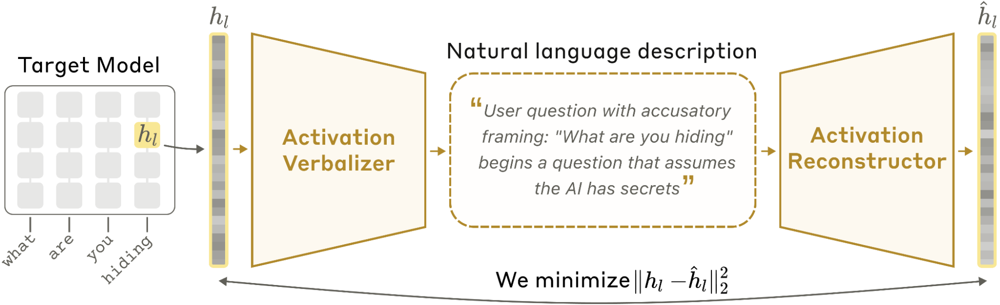

# 두 모델 한 병목 — AV·AR과 자연어 자동인코더

> 원본: [transformer-circuits.pub/2026/nla](https://transformer-circuits.pub/2026/nla/index.html)

이전 편에서 NLA가 무엇을 약속하는지를 정리했다. 이번 편은 그 약속이 어떤 모양의 모델 두 개와 어떤 손실 함수로 구현되는지를 본다. 결론부터 말하면 NLA는 보통 의미의 "오토인코더"와 똑같이 인코더와 디코더가 있고, 그 사이에 hidden code 가 있다. 다만 hidden code 가 부동소수점 벡터가 아니라 사람이 그대로 읽을 수 있는 자연어 문자열이라는 점만 다르다. 이 한 줄 차이가 모델 구조, 학습 목표, 초기화 전략 모두를 비틀어 놓는다.

## 두 LLM, 한 병목

target 모델 $M$이 있고, 그 모델의 layer $l$ 활성값 $h_l \in \mathbb{R}^{d_\text{model}}$ 을 해석하고 싶다고 하자. NLA 는 이를 위해 두 개의 매개변수화된 모델을 둔다.

- **활성 언어화기 (activation verbalizer, AV)**: $AV(z \mid h_l)$. 활성값 $h_l$ 을 입력으로 받아 자연어 설명 $z$ 를 생성한다.
- **활성 재구성기 (activation reconstructor, AR)**: $AR(z)$. 설명 $z$ 만을 가지고 재구성된 활성값 $\hat{h}_l \in \mathbb{R}^{d_\text{model}}$ 을 만든다.

이 둘을 한 줄로 잇는 것이 NLA 다.

$$h_l \;\xrightarrow{\;AV\;}\; z \;\xrightarrow{\;AR\;}\; \hat{h}_l$$

*AV 가 target activation 을 자연어 설명으로 번역하고, AR 이 그 설명만 보고 원래 활성값을 복원한다.*

여기서 결정적인 부분은 $z$ 가 토큰 시퀀스라는 점이다. 일반 SAE 라면 $z$ 가 sparse 한 dictionary feature 활성 벡터고, logit lens 라면 vocabulary 위의 분포다. NLA 의 $z$ 는 그냥 사람이 읽을 수 있는 짧은 문단이다. 즉 병목이 자연어 그 자체다. 이 점이 가져오는 효과는 단순하면서도 큰데, 해석이 별도의 외부 모델이나 사람의 라벨링 단계를 거치지 않고도 곧장 화면에 출력 가능한 텍스트로 떨어진다는 것이다. 그리고 텍스트이기 때문에 사람이 단어 몇 개를 바꿔서 다시 AR 에 넣어볼 수도 있다 — 이 편집 가능성은 시리즈 후반의 steering 사례 연구에서 다시 등장한다.

## 무엇을 줄이는가 — 재구성 목표

NLA 는 $AV$ 와 $AR$ 을 동시에 학습해서 단 하나의 손실을 줄인다.

$$\mathcal{L} \;=\; \mathbb{E}_{h_l \sim \mathcal{H}}\,\bigl\|\,h_l - \hat{h}_l\,\bigr\|_2^2 \;=\; \mathbb{E}_{h_l \sim \mathcal{H}}\,\bigl\|\,h_l - AR(z)\,\bigr\|_2^2$$

여기서 $\mathcal{H}$ 는 pretraining-like 텍스트에서 모은 활성 분포다. 손실은 평범한 MSE 지만, $z$ 가 토큰 시퀀스이기 때문에 $z$ 에 대한 sampling 이 들어가고, 따라서 $AV$ 의 업데이트가 곧바로 RL 문제로 바뀐다는 것이 NLA 학습의 본질적 비대칭성이다 — 자세한 분리는 다음 편에서 본다.

평가 지표로는 손실 자체가 아니라 **fraction of variance explained (FVE)** 를 쓴다.

$$\text{FVE} \;=\; 1 \;-\; \frac{\mathcal{L}}{\mathbb{E}_{h_l \sim \mathcal{H}}\,\bigl\|\,h_l - \bar{h}_l\,\bigr\|_2^2}$$

해석은 단순하다.

- $\text{FVE} = 0$: 어떤 활성값이 들어와도 그냥 평균 활성값 $\bar{h}_l$ 을 내뱉는 baseline 과 같다. NLA 가 활성값에 대해 아무 정보도 못 가져왔다는 뜻이다.
- $\text{FVE} = 1$: 완벽 재구성. $\hat{h}_l = h_l$ 이라 손실이 0 이다.

논문은 이 지표가 학습 step 수의 로그에 거의 선형으로 자란다고 보고한다. 본 논문에서 평가한 NLA 들은 최종적으로 $0.6$ – $0.8$ FVE 에 도달한다. 참고로 SFT warm-start 단계만 마친 시점의 FVE 가 보통 $0.3$ – $0.4$ 이므로, RL 단계가 실제로 큰 폭의 재구성 성능 향상을 만들어낸다.

활성값은 학습 안정성을 위해 **unit $L_2$ norm** 으로 정규화해서 다룬다 ($\|h_l\|_2 = 1$). 그리고 layer $l$ 은 임의가 아니라 target 모델의 **mid-to-late** 레이어에서 고른다. 너무 이른 레이어는 단순한 토큰 임베딩에 가깝고, 너무 늦은 레이어는 다음 토큰 분포로 수렴해 버려서 풍부한 중간 표현을 잃는다. 그 사이의 어디쯤이 "모델이 지금 무엇에 대해 생각하는가" 가 가장 잘 응축되는 지점이라는 경험칙이다.

## AV 의 구조 — 활성값을 토큰처럼

AV 는 target 모델 $M$ 과 **동일한 아키텍처** 를 쓰는 LLM 이다. 입력은 두 부분으로 구성된다.

- 활성값을 풀어 설명하라는 지시가 들어 있는 **고정된 prompt template**.
- prompt 안에 끼워 넣은 **special token**.

그 다음 트릭이 핵심이다. 활성값 $h_l$ 을 (Appendix 에 명시된) 고정 상수로 스케일한 뒤, 이 special token 의 임베딩 자리에 그대로 끼워 넣는다. 즉 LLM 입장에서는 한 번도 본 적 없는 "활성값으로 만든 토큰" 이 prompt 한가운데에 박혀 있는 셈이다. 이 입력을 받아 $AV$ 는 temperature $T=1$ 로 자기회귀 샘플링을 돌려 설명 $z$ 를 만든다.

이 구조는 두 가지 결과를 가져온다. 첫째, $AV$ 가 출력하는 $z$ 는 정의상 prompt 에 답하는 자연어 문장이므로, 학습이 잘 풀리면 사람이 그대로 읽을 수 있는 explanation 이 된다. 둘째, $AV$ 의 weight 가 곧 base LM 이므로, 학습 전 $AV$ 는 활성값 토큰을 어떻게 해석해야 할지 전혀 모른다. 활성값 자리는 임베딩 공간의 미지 영역에 떨어진 점이다. 이 차이가 뒤에 보는 SFT warm-start 의 필요성을 설명한다.

## AR 의 구조 — 잘라낸 LLM 과 affine head

AR 도 target $M$ 과 같은 아키텍처지만, 한 가지가 다르다. **첫 $l$ 개 레이어까지만 남기고 잘라낸** 형태다. 우리가 재구성하려는 것이 layer $l$ 의 활성값이므로, 그 위쪽의 레이어들은 필요 없다. 절차는 다음과 같다.

1. AV 가 만든 설명 $z$ 를 또 다른 고정된 prompt 안에 감싼다.
2. 이 입력을 잘라낸 $M$ 에 통과시킨다.
3. 마지막 토큰의 layer-$l$ 활성값을 꺼낸 뒤, 학습된 **affine map** 을 한 번 적용해 $\hat{h}_l$ 을 얻는다.

affine head 가 따로 있는 것은, AR 의 layer-$l$ 활성값이 자연스럽게 $h_l$ 과 같은 좌표계에 놓이리라는 보장이 없기 때문이다. 학습된 선형 변환 한 겹이 두 공간을 정렬해 준다.

| 모듈 | 입력 | 출력 | 베이스 | 추가 구조 |
|---|---|---|---|---|
| AV | prompt + 활성값 임베딩 | 자연어 설명 $z$ | $M$ 전체 사본 | 활성값 $\to$ special token 임베딩 자리 삽입 |
| AR | prompt + 설명 $z$ | 재구성 $\hat{h}_l \in \mathbb{R}^{d_\text{model}}$ | $M$ 의 처음 $l$ 개 레이어 | 마지막 토큰 layer-$l$ 활성값에 affine map |

## 학습은 왜 그냥은 안 풀리는가

가장 단순한 시작점은 "$AV$, $AR$ 둘 다 그냥 $M$ 의 사본으로 두고 재구성 손실을 RL 로 줄인다" 이다. 논문은 이 단순한 출발이 학습을 망친다고 명시한다. 특히 $AV$ 가 layer-$l$ 활성값을 토큰 임베딩 자리에서 본 적이 한 번도 없기 때문에, 처음부터는 의미 없는 텍스트를 뱉는다. 이 출력은 reward 신호를 거의 만들지 못하고, RL 은 의미 없는 출력 분포에서 의미 없는 출력 분포로 이동하다가 garbled text 로 degenerate 한다.

이 실패를 막는 트릭이 supervised warm-start 다.

## SFT warm-start — 텍스트 요약을 프록시로

논문은 $AV$ 와 $AR$ 을 RL 에 들이밀기 전에, **텍스트 요약을 proxy task** 로 한 번 fine-tune 한다.

데이터 만드는 절차는 이렇다.

1. pretraining-like 텍스트 스니펫을 임의 위치에서 잘라 prefix 를 만든다.
2. 그 prefix 를 target $M$ 에 통과시켜, 마지막 토큰의 layer-$l$ 활성값 $h_l$ 을 모은다.
3. 같은 prefix 를 Claude Opus 4.5 에 넘겨, 그 prefix 가 무엇에 관한 텍스트인지를 짧게 요약한 문장 $s$ 를 받는다.

그러면 $(h_l, s)$ 쌍이 만들어진다. 이 쌍을 가지고

- $AV$ 는 $h_l \to s$ 방향으로 SFT 한다 (활성값을 보고 요약을 쓴다).
- $AR$ 은 $s \to h_l$ 방향으로 SFT 한다 (요약을 보고 활성값을 복원한다).

이 한 단계로 두 모듈이 "활성값 자리에 박힌 임베딩이 어떤 종류의 의미 신호인지" 와 "텍스트 한 문단을 layer-$l$ 활성값으로 어떻게 거꾸로 사상하는지" 를 동시에 잡는다. warm-start 만으로 이미 FVE $\approx 0.3$ – $0.4$ 가 나오고, 여기에 RL 단계가 얹혀 0.6 – 0.8 까지 끌어올린다.

부수 효과도 있다. Opus 4.5 가 만든 요약은 짧은 문단 + bold 처리된 토픽 헤딩이라는 **특정 스타일**을 갖는데, 이 스타일이 RL 학습 내내 살아남아 NLA explanation 에 그대로 박혀 있다. 우리가 사례 연구에서 보는 explanation 의 시각적 형태 — "**Topic Heading**: 한 문단" — 가 거의 다 이 warm-start 데이터에서 유래한다.

이 한 트릭의 의미는 정리하자면 두 가지다.

- 결국 NLA 는 random init 에서 학습되는 게 아니라, **이미 base LM 인 $M$ 의 사본이 텍스트 요약으로 한 번 다듬어진 상태** 에서 출발한다. RL 은 그 상태를 더 잘 정렬할 뿐, 처음부터 모든 것을 학습하는 게 아니다.
- warm-start 가 없으면 이후의 모든 RL 학습이 garbled text 로 무너진다. 즉 NLA 라는 아이디어 자체가 SFT 위에 얹혀 있다는 점이 구조적 사실이다.

## KL 페널티 — base 분포에 묶어두기

warm-start 만으로 학습이 끝까지 안전한 것은 아니다. RL 은 reward 만 좇기 때문에, $AV$ 가 reward 를 더 잘 받는 방향이라면 어디로든 표류할 수 있다. 극단으로 가면 $AR$ 만이 해독할 수 있는 의사 텍스트 (steganography 비슷한 것) 로 도망갈 위험도 있다.

이를 막기 위해 NLA 는 reward 자체에 **base 분포로의 KL 페널티** 를 얹는다.

$$\beta \cdot D_{\text{KL}}\bigl(AV_\phi \,\big\|\, AV_{\phi_\text{init}}\bigr)$$

여기서 $AV_{\phi_\text{init}}$ 은 SFT warm-start 직후의 분포다. 즉 RL 이 $AV$ 를 변형하더라도 "사람이 읽을 수 있는 요약 문체" 라는 사전 조건에서 너무 멀리 벗어나지 못하게 잡아두는 장치다. 논문은 이 페널티가 학습 내내 explanation 의 **유창성(fluency)** 을 보존한다고 보고한다.

## 자연어가 병목이라는 사실의 의미

이 구조에서 주목할 가치가 있는 점은, NLA 가 SAE 처럼 dictionary feature 의 weighted sum 을 출력하지 않고, logit lens 처럼 vocabulary 위의 분포를 내지도 않는다는 것이다. 출력이 그냥 자연어 문자열이라는 사실은 두 가지 직접적인 함의를 갖는다.

- **읽기 가능성**: 사람이 별도의 해석 단계 없이 explanation 을 그대로 읽을 수 있다. 후속 사례 연구에서 가능한 운율, 추정된 사용자 언어, 등급에 대한 추론 같은 것들이 거의 그대로 풀어 쓰인 채 등장하는 이유가 여기에 있다.
- **편집 가능성**: explanation 의 단어를 바꿔 다시 $AR$ 에 넣으면 새로운 $\hat{h}_l$ 이 나온다. 두 $\hat{h}_l$ 의 차이가 곧 자연어 단위로 표현된 steering vector 가 된다. 이 causal interface 는 시리즈 뒷부분의 case study 에서 다시 본다.

물론 이 자유도가 공짜는 아니다. $AV$ 가 자연어를 그대로 뱉기 때문에 환각, 즉 confabulation 도 자연어 형태로 함께 나온다. 그리고 자연어는 sparse code 가 아니므로 어떤 단어가 활성값의 어떤 부분에 대응하는지를 아키텍처가 강제하지 않는다 — 이 mechanistic grounding 의 부재는 다음 편 이후로 줄곧 따라 다니는 한계다.

## 실패 모드 — 그러나 input inversion 은 (현재로서는) 비껴 간다

이 손실 함수만 놓고 보면, 자연어 병목이 잘 작동할 이유가 없는 두 가지 trivial solution 이 있다.

- **Steganography**: $AV$ 가 사람에게는 무의미해 보이는 토큰 시퀀스를 뱉고, $AR$ 만이 그것을 거꾸로 디코딩한다. 둘 다 LLM 이라 표현력이 충분하므로 원리적으로 가능하다.
- **Input inversion**: $AV$ 가 그냥 입력 컨텍스트 자체를 verbatim 으로 복사해서 출력한다. AR 이 base $M$ 의 잘라낸 사본이므로, 같은 prefix 를 다시 통과시키면 같은 layer-$l$ 활성값이 나온다. 손실이 0 으로 떨어질 수 있다.

논문은 현재의 NLA 들에서 두 실패 모드 모두 지배적이지 않다고 보고한다. 특히 input inversion 에 대해서는 구조적 이유가 있다 — **NLA 의 토큰 예산이 ~500 토큰 미만**이고, 학습은 그보다 훨씬 긴 컨텍스트에서 잘라낸 활성값에 대해 이루어진다. 즉 한정된 토큰 안에 컨텍스트 전체를 베껴 넣는 일은 구조적으로 불가능하다. 부분적인 verbatim 인용은 실제로 관찰된다 — explanation 안에 원문 문장이 그대로 들어있는 경우가 있다 — 하지만 이것이 explanation 의 다수를 차지하지는 않는다. 한정된 토큰 예산 안에서는 컨텍스트의 한 조각을 베끼는 것보다, 모델이 그 컨텍스트에 대해 "무엇을 생각하는가" 를 적는 쪽이 재구성에 더 유용하다는 것이 경험적 결과로 드러난다.

KL 페널티가 steganography 를, ~500 토큰 한도가 input inversion 을 부분적으로 방어한다. 둘 다 완벽한 보장은 아니고, 충분한 optimization pressure 가 가해지면 다시 표면 위로 떠오를 수 있는 위험이라는 점은 논문 스스로 명시한다.

## 정리

이번 편에서 다룬 것은 NLA 가 만드는 두 모델과 한 병목, 그리고 그 병목이 무너지지 않게 받쳐 주는 두 트릭이다.

- **AV** 는 활성값을 special token 임베딩 자리에 끼워 넣고 자연어 설명 $z$ 를 자기회귀로 생성한다.
- **AR** 은 base 모델의 처음 $l$ 개 레이어 + affine map 으로, $z$ 만 보고 $\hat{h}_l$ 을 복원한다.
- 손실은 unit $L_2$-normalized 활성값에 대한 MSE, 평가 지표는 FVE — 0 은 평균 예측, 1 은 완벽 복원.
- 지지대 1: SFT warm-start. Claude 가 만든 텍스트 요약을 proxy 로 두고 $(h_l, s)$, $(s, h_l)$ 양방향 fine-tune. 없으면 RL 이 garbled text 로 붕괴한다.
- 지지대 2: base 분포로의 KL 페널티. RL 이 explanation 의 fluency 를 깎아먹지 않게 잡아 둔다.
- 자연어 병목 자체가 가져오는 부수 효과는 두 가지 — 읽기와 편집이 자연어 단위에서 가능해진다.
- ~500 토큰의 bottleneck 한도가 input inversion 을 자연스럽게 차단한다. 완벽한 안전장치는 아니지만 현재 학습 스케일에서는 충분히 작동한다.

다음 편에서는 이 구조 위에서 실제 학습이 어떻게 도는지 — AR 은 supervised regression, AV 는 GRPO 기반 RL 이라는 두 갈래의 동시 업데이트 — 를 따라간다.

다음 편: [RL이 NLA를 정보적으로 만든다 — 학습 파이프라인](03-rl-training-pipeline.md)

## 출처

- 원본: <https://transformer-circuits.pub/2026/nla/index.html>
