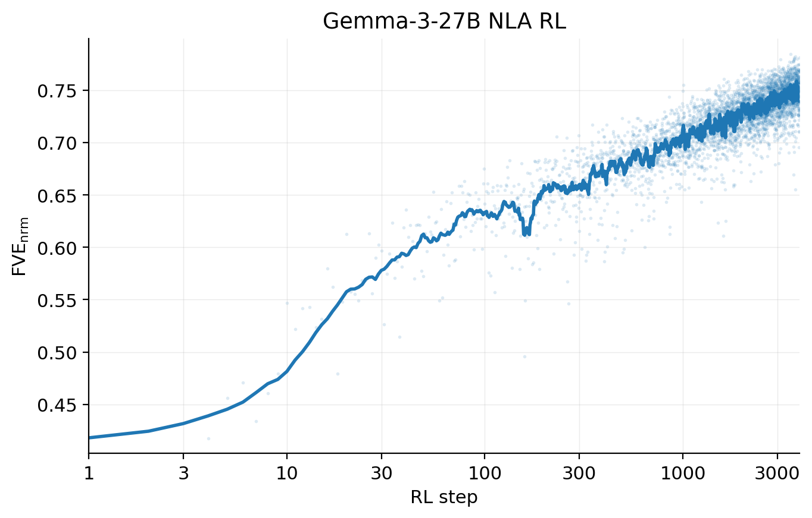
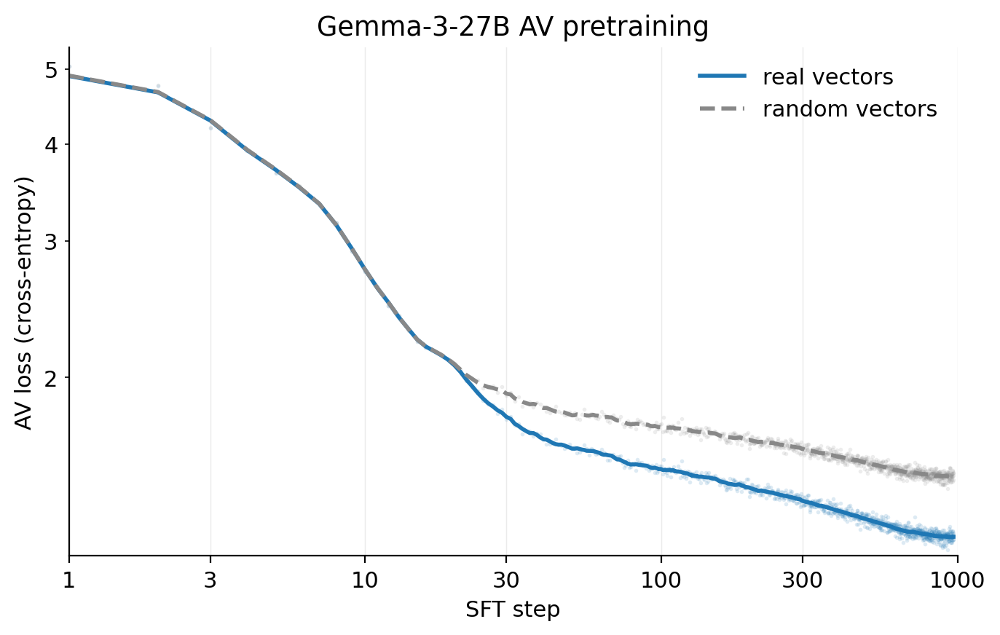
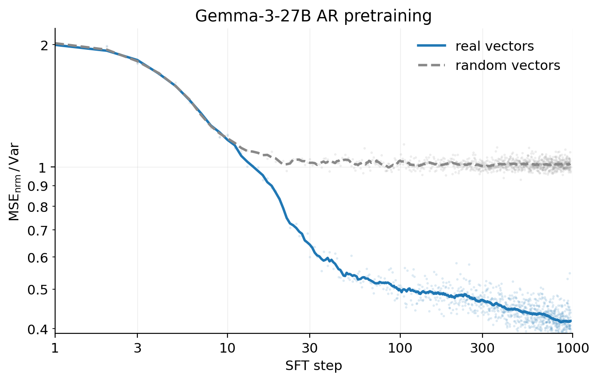

# RL이 NLA를 정보적으로 만든다 — 학습 파이프라인

> 원본: [transformer-circuits.pub/2026/nla](https://transformer-circuits.pub/2026/nla/index.html)

앞 편에서 NLA의 기본 구조 — 활성화 $h_l$ 을 자연어 설명 $z$ 로 바꾸는 verbalizer(AV)와 그 설명을 다시 활성화로 되돌리는 reconstructor(AR), 그리고 그 사이의 자연어 병목 — 를 살펴봤다. 이 편은 그 구조에 어떻게 신호를 흘려넣어서 "읽을 만한 설명"을 만들어내는지를 다룬다. 한 줄로 줄이면 다음과 같다. NLA는 처음부터 RL 로 학습하면 의미가 무너진다. 그래서 두 모듈을 먼저 지도학습으로 in-distribution 위치에 데려다 놓고, 그 다음에야 강화학습으로 재구성 손실을 최적화한다.

## 두 단계 파이프라인 한눈에

전체 학습은 명시적으로 두 단계로 분리되어 있다.

| 단계 | 목적 | 손실/신호 | 데이터 |
|------|------|-----------|--------|
| 1. Warm-start (SFT) | AV·AR 각각을 활성화↔요약 사상에 익숙해지게 함 | 지도학습 손실 | 사전학습 유사 코퍼스에서 활성화 $h_l$ 와 Claude Opus 4.5가 만든 요약 $s$ 의 페어 |
| 2. Joint RL | 자연어 병목을 통해 활성화를 재구성 | $\mathcal{L} = \|h_l - AR_\theta(z)\|_2^2$ + KL 페널티 | 사전학습 유사 코퍼스 + (선택적으로) chat 활성화 |

두 단계는 서로 다른 알고리즘이지만 동일한 목표 — AR 출력이 원래 활성화에 가까워지게 만들기 — 를 향한다. SFT는 그 목표를 직접 풀지 않고 "AV가 헛소리를 뱉지 않게" 해 두는 사전 작업이고, RL은 그 위에서 실제 재구성 손실을 줄이는 본 학습이다.

학습 진행도는 다음과 같이 정의되는 분산 설명률(FVE; Fraction of Variance Explained)로 측정한다.

$$
\text{FVE} = 1 - \frac{\mathcal{L}}{\mathbb{E}_{h_l \sim \mathcal{H}}\,\|h_l - \bar{h}_l\|_2^2}
$$

평균 활성화 $\bar{h}_l$ 만 출력하면 FVE = 0, 완벽한 재구성이면 FVE = 1 이다. SFT만 끝낸 시점의 FVE는 보통 0.3–0.4 수준이고, RL을 거친 본 논문의 NLA들은 0.6–0.8 까지 올라간다. 그리고 이 FVE는 단순한 학습 곡선의 y축이 아니라, 모델 간 비교를 정규화하는 축으로도 쓰인다 — 뒤에서 다시 등장한다.

## Warm-start: 왜 RL 만으로는 안 되는가

저자들이 실험 초기에 관찰한 핵심 사실은 이렇다. AV·AR을 그냥 타겟 모델 $M$ 의 복사본으로 초기화한 뒤 곧장 RL을 돌리면, 학습은 불안정해진다. 특히 AV가 layer-$l$ 활성화를 토큰 임베딩 자리에서 처음 마주치는 상황이라 의미 없는 설명을 뱉는다. 더 나쁜 경우는 FVE는 올라가는데 출력은 깨진(garbled) 텍스트로 가는 것 — 즉 자연어가 아닌 채로 두 모듈이 자기들끼리만 통하는 코드를 만들어내는 steganography 의 초기 신호다. 저자들이 명시적으로 적은 표현을 빌리면 "early experiments without this initialization, some runs degenerated into garbled text even though FVE increased". 이 경험이 워밍업을 도입한 직접적 동기다.

워밍업의 임무는 단순하다. RL이 시작될 때 AV가 이미 "활성화를 받으면 일관된 자연어 요약을 내놓는" 모드에 있도록 만들어 두는 것이다. AR도 마찬가지로 "자연어 요약을 받으면 그럴듯한 활성화를 복원"하는 모드에서 출발해야 한다. 그래야 RL의 보상이 자연어 표면 위에서 정의된 채로 작동한다.

### 워밍업 데이터: Opus 4.5 가 "내부 처리"를 상상한다

워밍업 데이터는 무작위로 자른 사전학습 유사 텍스트의 마지막 토큰에서 layer-$l$ 활성화 $h_l$ 를 뽑고, 같은 텍스트를 Claude Opus 4.5 에게 요약시키는 방식으로 만든다. 흥미로운 점은 요약 프롬프트의 설계다. "이 텍스트를 요약하라"가 아니라 "이 prefix 다음 토큰을 예측해야 하는 어떤 가상의 언어모델이 가장 중요하게 쓸 4–5개의 feature 를 적어라" 라고 묻는다. 통사·구조 제약, 의미적 기대, 문체·레지스터, 서사적 모멘텀, 인과 의존성 같은 카테고리가 예시로 함께 주어지고, 마지막 feature 는 반드시 시퀀스의 가장 끝 토큰에 대한 분석이어야 한다는 제약이 붙어 있다.

이렇게 만들어진 (활성화, 요약) 페어를 양방향으로 쪼개

- AV 학습: $(h_l, s)$
- AR 학습: $(s, h_l)$

지도학습으로 미세조정한다. 이 단계가 끝나면 AV의 출력은 짧은 단락 + 굵은 헤더 가 반복되는 Claude 특유의 스타일을 띠고, 이 스타일은 RL 이후에도 그대로 남는다.

데이터 선택에도 의도된 편향이 있다. 워밍업 코퍼스는 약 95%가 사전학습 유사 데이터다. 이유는 명확하다. chat 형식 데이터에는 assistant 페르소나가 끼어들어 Opus 4.5가 "어떻게 답해야 하는지"를 두 번 생각하게 되고, 그 결과 요약에 더 많은 편향이 들어온다. 반면 다음 토큰 예측만 떠올리는 raw text 위에서는 그 위험이 더 작다. RL 단계에서는 요약 자체가 필요 없으므로 chat 데이터 비중을 올려도 되고, 공개된 open-model NLA 들은 실제로 RL 활성화의 50%를 chat 코퍼스에서 뽑았다.

이 워밍업 자체가 우아하지 않다는 점은 저자들도 인정한다. NLA RL의 전제가 "활성화에 무엇이 들어 있는지에 대한 ground truth가 없다" 인데, 정작 초기화는 "Opus 4.5가 추정한 활성화 내용물"에 의존한다. 게다가 동일한 워밍업 데이터셋을 모든 타겟 모델·모든 레이어에 그대로 재사용하기 때문에, 모델별·레이어별 차이가 무시되는 잠재적 편향이 남는다. RL이 이 편향을 완전히 씻어내지 못할 수 있다는 한계는 limitations 절에 분명히 적혀 있다.

## RL 단계: 두 모듈이 한 step에 같이 업데이트된다

워밍업이 끝나면 본 학습이 시작된다. 학습 루프 한 step 은 다음과 같다.

1. 활성화 분포 $\mathcal{H}$ 에서 미니배치 $h_l$ 을 뽑는다.
2. 현재 AV 정책 $AV_\phi(\cdot \mid h_l)$ 에서 설명 $z$ 를 샘플링한다.
3. AR 업데이트: 입력 $z$, 타겟 $h_l$ 로 회귀 손실 $\|h_l - AR_\theta(z)\|_2^2$ 의 그래디언트 한 step.
4. AV 업데이트: 보상 $r(h_l, z) = -\|h_l - AR_\theta(z)\|_2^2$ 로 RL 한 step.

핵심은 두 업데이트가 **한 step 안에서 동시에** 일어나되 **서로 결합되지는 않는다** 는 점이다. AR 업데이트는 $\phi$ 로 역전파되지 않고, AV 의 보상은 그 순간의 $AR_\theta$ 를 고정된 채점기로 본다. 결과적으로 AR 은 표준 지도 회귀, AV 는 정책 경사 RL 로 학습되고, 둘 다 같은 활성화 분포 위에서 동기화된다.

AV 측 업데이트에는 두 가지 형태 변형이 들어간다.

- 보상의 단조 변환: 실제로는 $r(h_l, z) = -\log\|h_l - AR_\theta(z)\|_2^2$ 를 쓴다. 저자들은 이게 엄밀히 필수는 아니라고 적어 두었다. (활성화 정규화 이후에는 heavy-tail 보정이라는 원래 동기가 약해진 상태다.)
- KL 페널티: 워밍업으로 얻은 초기 정책 $AV_{\phi_\text{init}}$ 을 기준으로 $\beta\, D_{\text{KL}}(AV_\phi \,\|\, AV_{\phi_\text{init}})$ 을 더한다. 이 항이 학습 내내 설명의 유창성을 지키는 안전대 역할을 한다. KL 계수는 모델별로 별도 튜닝되며, "설명 품질이 무너지지 않게" 라는 단일 기준으로 정해진다.

오픈 모델 NLA 들은 AV 측에 GRPO 를 사용한다. 활성화 한 개당 $G = 8$ 개의 후보 설명을 그룹으로 샘플링하고, 각 후보를 AR 에 통과시켜 재구성 점수를 매긴 뒤, 그룹 정규화된 어드밴티지로 GRPO 목표를 최소화한다. 표준 GRPO 의 KL 페널티는 위에서 말한 $AV_{\phi_\text{init}}$ 을 기준으로 잡는다. AR 은 클로드 NLA 와 동일하게 표준 지도 회귀로 학습한다.

학습 곡선은 비교적 단순하다. RL이 시작된 직후 FVE가 빠르게 오른 뒤, $\log(\text{steps})$ 에 거의 선형인 영역으로 들어간다. 충분히 큰 배치 사이즈에서는 이 형태가 매우 부드럽게 재현된다.

*Gemma-3-27B 의 NLA RL FVE 는 SFT 종료 시점의 약 0.38 에서 시작해 30 step 안에 빠르게 오른 뒤 부드럽게 log-linear 로 자라 3,000 step 즈음 약 0.75 에 도달한다.*

*AV 워밍업: 진짜 활성화를 주입했을 때의 cross-entropy 와 무작위로 섞은 활성화를 주입했을 때의 control 사이 격차가 AV 가 활성화에서 끄집어내는 정보량을 가늠하게 한다.*

*AR 워밍업: 정규화된 MSE 가 (요약, 활성화) 페어가 진짜일 때 약 0.42 (FVE 0.58)까지 떨어지는 반면, 페어를 섞은 control 은 평균 예측 baseline 인 1.0 에 수렴한다.*

## 세 개의 NLA: Haiku 3.5 / Haiku 4.5 / Opus 4.6

본 논문은 세 개의 클로드에 NLA 를 학습시킨다.

| 타겟 모델 | 학습 레이어 | 비고 |
|-----------|-------------|------|
| Claude Haiku 3.5 | depth 의 약 2/3 지점 | Haiku 4.5 와 FVE 곡선이 유사 |
| Claude Haiku 4.5 | depth 의 약 2/3 지점 | Haiku 3.5 와 유사 |
| Claude Opus 4.6  | depth 의 약 2/3 지점 | FVE 가 전반적으로 더 낮음 |

세 모델 모두 총 학습 step 수와 step 당 compute 가 다르기 때문에, 학습 진행을 step 으로 비교하는 것은 의미가 없다. 그래서 이 논문은 평가 점수를 step 이 아니라 **FVE 에 대한 함수로** 그린다. FVE를 모델 비종속적인 학습 진행 척도로 간주하는 셈이다. 하이퍼파라미터와 학습 예산은 각 타겟 모델에 맞게 실용적으로 골랐기 때문에, 세 곡선은 통제된 스케일 비교가 아니라 독립된 사례로 읽어야 한다는 단서가 함께 붙는다.

곡선 자체는 흥미로운 비대칭을 보여준다. Haiku 3.5와 Haiku 4.5는 FVE 곡선이 비슷하게 자라지만, Opus 4.6은 동일 지점에서 FVE가 더 낮다. 그럼에도 다섯 개 다운스트림 평가 중 네 개에서 Opus 4.6 NLA 가 가장 잘 한다. 즉 같은 FVE 라도 더 큰 모델의 활성화에서 끄집어낼 수 있는 정보가 더 많을 수 있고, 반대로 같은 모델 안에서도 일부 평가는 작은 폭(예: Classification 83% → 86%)으로만 개선된다. 후자에 대해 저자들은 (a) 그 정보가 해당 활성화에 애초에 없거나, (b) 평가 셋업이 노이지하거나, (c) 완벽한 AV 라도 자연어로 표현하기 어렵다는 가능성을 모두 열어둔다.

### 레이어 선택은 평가의 일부다

세 NLA 는 모두 **타겟 모델 깊이의 2/3 지점** 에서 학습됐다. 그러나 이 위치 선택은 가치중립적이지 않다. 뒤에 나오는 auditing 사례 — reward-model 편향을 숨기도록 학습된 Haiku 3.5 변종(model organism) — 에서 저자들은 처음에 같은 2/3 위치에서 NLA 를 학습했지만 reward-model 관련 어휘를 거의 surfacing 하지 못했다. 학습 위치를 모델 중간점(roughly halfway through) 으로 옮기자 reward-model sycophancy 관련 설명이 비로소 등장했다. 이는 Lindsey 등의 선행 결과 — reward-model bias feature 가 후반부 레이어에는 잘 잡히지 않는다 — 와도 일치한다. 즉, NLA 는 **단일 레이어를 읽는 도구** 이므로 분석하려는 정보가 그 레이어에 없으면 보지 못한다. 이 한계는 limitations 절에 별도로 정리되어 있고, 향후 작업의 방향으로 "여러 레이어 활성화를 동시에 입력으로 받는 NLA" 가 제안된다.

## 잠재적 실패 모드 두 가지

NLA 학습은 표면적으로는 단지 "재구성 손실 줄이기" 일 뿐이다. 그래서 자연스럽게 두 종류의 degenerate 해법으로 빠질 수 있다.

1. **Steganography.** AV 가 의미가 잘 잡히지 않는 토큰 시퀀스를 출력해도, AR 이 충분히 표현력이 있어 그것을 활성화로 되돌릴 수 있다. 이 경우 FVE 는 오르지만, 인간이 읽기엔 무의미한 텍스트가 된다.
2. **Input inversion.** AV 가 입력 컨텍스트를 그대로 인용해 버리면, AR 은 컨텍스트를 보고 활성화를 잘 복원할 수 있다. 이 경우에도 FVE 는 그럴듯하지만, 설명이 모델 내부 처리에 대한 정보가 아니라 단순한 컨텍스트 사본이 된다.

NLA 파이프라인은 두 모드를 각각 다른 장치로 막는다.

- **Steganography 방어 = 워밍업 + KL 페널티.** 저자들은 모델이 활성화를 자연어로 verbalize 할 잠재 능력을 어느 정도 갖고 있다는 선행 연구(Lindsey 등)에 근거해, SFT 워밍업이 RL 시작 시점부터 AV 가 일관된 요약을 내도록 강제한다고 본다. 워밍업이 없을 때 FVE 가 오르며 출력이 깨졌던 초기 실험이 그 반대 사례다. 또한 학습 도중에는 KL 페널티가 AV 를 워밍업 분포 근처에 묶어둠으로써, 토큰 분포가 자연어에서 멀어지는 방향으로의 drift 를 억제한다.
- **Input inversion 방어 = 토큰 예산 + 컨텍스트 길이.** 자연어 병목은 약 500 토큰 이하로 제한되고, 학습은 그보다 긴 컨텍스트에서 잘라낸 활성화 위에서 이루어진다. 즉 전체 컨텍스트를 토씨 하나 안 빼고 quote 하는 것은 구성상 불가능하다. 실제로 NLA 설명에서 입력 문장을 부분적으로 인용하는 일은 관찰되지만, 그것이 설명 전체를 차지하지는 않는다. 토큰 예산이 제한된 상황에서는 컨텍스트를 일부만 베끼는 것보다 모델의 내부 처리를 압축적으로 적는 쪽이 재구성에 더 유리할 수도 있다는 가설이 따라붙는다.

저자들은 두 방어 모두 *현 시점에서* 작동한다고 보지만, 충분한 최적화 압력을 더 가하면 어느 방향으로도 무너질 수 있다는 단서를 남겼다. 이 한계는 후속 평가 — paraphrase·shuffle·번역 같은 의미 보존 변형 후 FVE가 얼마나 떨어지는지를 측정 — 로 다시 검증된다. 본 논문 시점의 결론은 "의미 보존 변형으로는 FVE가 거의 안 떨어지고, 그 격차도 학습 진행에 따라 벌어지지 않는다" 는 것이다.

## 비용: 왜 production RL 마다 NLA 를 끼워 넣지 못하는가

마지막으로 비용 이야기를 정리해 둘 필요가 있다. NLA 학습은 가벼운 작업이 아니다. 두 개의 풀 사이즈 LM 을 워밍업하고, 그 위에서 다시 RL 로 공동 학습해야 한다. 인퍼런스도 가볍지 않다 — 활성화 한 개당 약 500 토큰을 생성한다.

오픈 모델 가운데 Gemma-3-27B 의 reference 수치가 가장 구체적이다.

- 데이터: SFT 용 활성화 50만 개(샘플 100,000 문서 × 문서당 활성화 5개), 컨텍스트 최대 4,096. RL 용 추가 활성화 100만 개 (UltraFineWeb 50만 + WildChat 50만).
- 데이터 생성 비용: AV·AR 데이터셋 각각에 대해 Claude Sonnet 4.6 API 호출 25만 번, 호출당 평균 입력 토큰 2,000.
- RL 컴퓨트: 8×H100 노드 두 대.
- 시간: 약 1.5일에 FVE 0.38 → 0.71, 약 1주일에 FVE 0.75. 총 RL step 은 3,000.

이 수치가 함의하는 바는 두 가지다. 첫째, 한 번 학습해 두면 분석 도구로 재사용할 수 있는 NLA 를 만드는 비용 자체는 frontier 연구 환경에서는 감당 가능하지만, 절대 가벼운 단발 비용은 아니다. 둘째, 더 결정적으로, **production RL 도중 모든 토큰에 NLA 를 적용하는 것은 비용상 불가능하다**. SAE 나 linear probe 라면 이런 통합이 가능하지만, NLA 는 활성화 하나당 수백 토큰의 생성 비용을 요구하기 때문이다. 단일 트랜스크립트 안에서도 토큰 1만 개 정도를 넘으면 전수 분석은 비현실적이고, 그 결과 분석은 production audit 에서 나오는 long-context 트랜스크립트의 *일부 구간*에 한정된다.

이 비용 구조는 다음 편에서 다룰 사례 연구 — Opus 4.6 audit 시점에 실제로 NLA 를 어디에 어떻게 들이댔는지 — 의 배경이 된다. 모든 토큰을 다 보지 못하기 때문에, 어느 토큰의 활성화를 읽을지 자체가 분석의 일부가 된다.

## 한 페이지 요약

- NLA 학습은 (1) AV·AR 각각 SFT 워밍업, (2) 두 모델 joint RL 의 두 단계다. 진행도는 step 이 아니라 FVE 로 정규화한다.
- 워밍업은 Claude Opus 4.5 가 "다음 토큰 예측 LM 의 내부 처리"를 4–5개 feature 로 적은 요약을 사용한다. 데이터는 약 95%가 pretraining-like — chat 페르소나가 끼는 편향을 줄이기 위해서다.
- 워밍업 없이 곧장 RL 하면 FVE 는 올라도 출력이 깨진 텍스트로 가는 steganography 초기 신호가 나타난다. 이 경험이 워밍업 도입의 직접적 이유다.
- RL 한 step 에서 AR(회귀)과 AV(GRPO 등의 RL) 가 동시에 업데이트되되 그래디언트는 결합되지 않는다. KL 페널티가 AV 를 워밍업 분포 근처에 잡아둔다.
- 세 NLA(Haiku 3.5 / Haiku 4.5 / Opus 4.6) 는 모두 타겟 깊이의 2/3 위치에서 학습됐다. Haiku 두 개의 FVE 곡선은 비슷, Opus 4.6 은 전반적으로 낮지만 평가 점수는 더 높다.
- 두 개의 잠재적 실패 모드 — steganography(워밍업+KL 로 방어), input inversion(< 500 토큰의 병목 + 더 긴 컨텍스트 입력으로 방어) — 는 현 시점엔 통제되지만, 추가 최적화 압력 하에서는 재발할 수 있다.
- 비용 reference: Gemma-3-27B 에서 8×H100 두 노드, 1.5일에 FVE 0.38 → 0.71. production RL 의 모든 토큰에 NLA 를 끼워 넣는 것은 현재로선 비현실적이다.

다음 편: [운율을 미리 계획하다 — Planning in Poetry & Language Switching](04-case-planning-and-language.md)

## 출처

- 원문: <https://transformer-circuits.pub/2026/nla/index.html>
