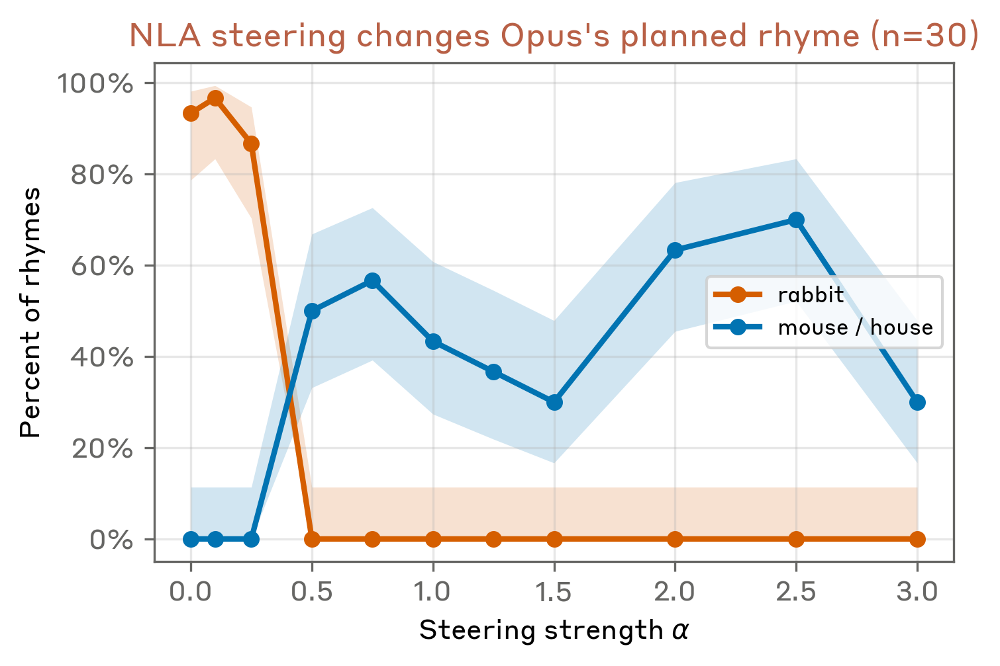
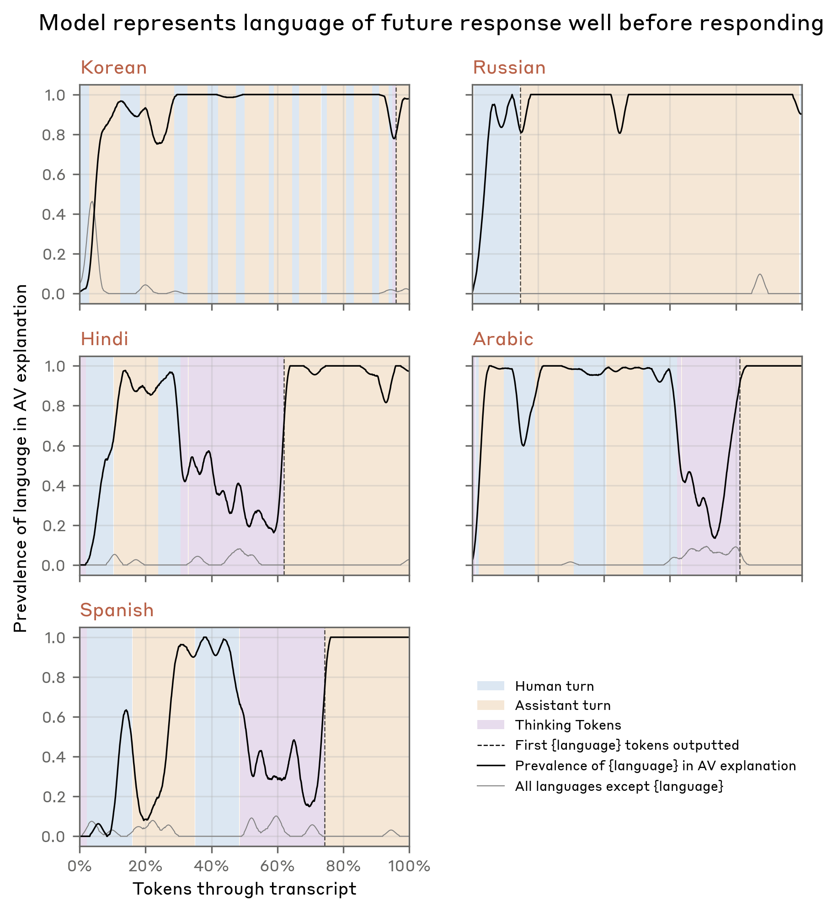

# 운율을 미리 계획하다 — Planning in Poetry & Language Switching

> 원본: [transformer-circuits.pub/2026/nla](https://transformer-circuits.pub/2026/nla/index.html)

앞선 편에서 NLA를 어떻게 학습시키는지를 정리했다면, 이 편부터는 학습된 NLA를 실제로 들이댔을 때 무엇이 보이는지를 본다. 이번 편의 두 케이스, **Planning in Poetry** 와 **Language Switching** 은 모두 Opus 4.6의 사전 배포 감사(pre-deployment audit) 과정에서 나온 것이다. 두 케이스는 NLA가 어떻게 가설을 만들어 내고, 그 가설을 어떻게 검증할 수 있는지에 대한 서로 다른 각도를 보여 준다. 한쪽은 **인과적 개입(causal intervention)** 으로, 다른 한쪽은 **학습 데이터로의 역추적** 으로.

## Planning in Poetry: 모델은 운율을 미리 정해 두는가

### 배경: Lindsey et al. 의 발견을 다시

Lindsey et al. 은 Haiku 3.5 에서 흥미로운 현상을 보고했다. 다음과 같은 두 줄짜리 운율 시(rhyming couplet)를 모델에게 입력했을 때,

> He saw a carrot and had to grab it,
> His hunger was like a starving rabbit

첫 줄의 마지막 토큰("grab it")에서 이미 모델은 두 번째 줄의 끝 운율 후보들 — 특히 "rabbit" — 을 *내부적으로 고려*하고 있더라는 것이다. 즉, 모델은 토큰을 한 글자씩 뱉어내는 것처럼 보이지만, 실제로는 줄 전체의 종착점을 *미리 계획*해 두고 거기에 맞춰 단어를 채워 넣는 식으로 동작하는 정황이 잡혔다.

저자들은 같은 입력을 Opus 4.6 에 넣고, 이번에는 NLA로 활성값을 들여다본다. 핵심은 **첫 줄과 두 번째 줄 사이의 newline 토큰 (`\n`) 의 NLA 설명** 이다. 만약 모델이 정말로 "rabbit"으로 끝맺을 계획을 미리 세웠다면, 그 계획은 두 번째 줄을 시작하기 직전인 newline 토큰의 활성값 어딘가에 잠복해 있을 것이다.

### NLA 설명에 등장하는 "rabbit"

원문에 인용된 newline 토큰 부근의 NLA 설명들을 발췌하면, 모델 내부에서 이미 여러 후보 마무리 표현이 떠오르고 있음이 보인다.

> Limerick/poem structure with humorous punchline pattern: The text presents "He grabbed the carrot and ate it quick, rabbit" suggesting a verse about an animal, likely completing a joke or rhyme about a rabbit (e.g., "Because he was a greedy rabbit" or "For that is the habit of a rabbit").

> Recognizable joke template: "He quickly grabbed the carrot, / " is the second line of a two-line reveal: "He picked up the carrot, it's what he'd eat it, / A hopping, hungry rabbit" suggests the subject is revealed—possibly "Because he was a rabbit" or "said the actor in a rabbit suit."

> Final token "rabbit" followed by newline: "Snatched the carrot and ate it quick,\
> " sets up completion like "Because that's what rabbits do" or "He was a hungry rabbit" or "That silly habit" — likely humorous reveal: "For all you know, it was a rabbit" referencing a character who behaves like one.

여러 NLA 설명이 약간씩 다른 표현으로 같은 이야기를 한다: 다음 줄의 마무리는 "rabbit"이다, 그리고 "habit" 같은 인접 운율도 후보다. 단일 설명만 보면 confabulation 의 가능성을 배제하기 어렵지만, **여러 설명에 걸쳐 반복적으로 등장하는 모티프** 는 NLA 사용자들이 신뢰도 높은 신호로 다루는 패턴이다 — 이 휴리스틱 자체에 대한 분석은 Confabulation 케이스(다음 다음 편)에서 더 깊게 다뤄진다.

### 인과 검증: 설명을 직접 편집해 steering vector 만들기

NLA 설명이 그저 *그럴듯한* 해석이 아니라 *실제로 모델 출력에 영향을 주는* 표현임을 보이려면, 인과적 개입이 필요하다. 저자들은 NLA의 해석 가능성을 매우 영리하게 활용해 이 일을 한다.

- 단계 1. newline 토큰의 NLA 설명 $z_\text{orig}$ 을 가져온다.
- 단계 2. 텍스트로 된 설명을 직접 편집한다: `rabbit` $\to$ `mouse`, `habit` $\to$ `house`, `carrots` $\to$ `cheese` 등 운율 관련 표현을 일괄 치환한 새 설명 $z_\text{edit}$ 을 만든다.
- 단계 3. 두 설명 모두를 AR(activation reconstructor) 에 통과시켜 각각의 활성값을 복원한다:

$$\tilde{h}_\text{orig} = \text{AR}(z_\text{orig}), \qquad \tilde{h}_\text{edit} = \text{AR}(z_\text{edit}).$$

- 단계 4. 차이 벡터를 정의한다:

$$\Delta = \tilde{h}_\text{edit} - \tilde{h}_\text{orig}.$$

이 $\Delta$ 가 곧 "운율을 rabbit 에서 mouse 로 바꿔라" 라는 의미를 활성값 공간에 옮겨 놓은 **steering vector** 다. 마지막으로, 이 벡터를 newline 토큰의 원래 활성값 $h_\text{orig}$ 에 — NLA가 학습된 그 layer 에서 — 다음과 같이 더한다:

$$h_\text{orig} \;\to\; h_\text{orig} + \alpha \, \|h_\text{orig}\| \, \frac{\Delta}{\|\Delta\|}.$$

여기서 $\alpha$ 는 개입 강도(steering strength) 를 조절하는 스칼라다. 벡터를 단위 벡터로 정규화한 뒤 원본 활성값의 노름에 비례하도록 다시 키워서 더하기 때문에, $\alpha$ 만 바꾸면 *얼마나 세게 밀어 줄지* 를 일관되게 통제할 수 있다.

### 결과: 토끼가 사라지고 쥐가 등장하는 시점

충분한 $\alpha$ ($\alpha \geq 0.5$) 에서 Opus 4.6 은 더 이상 "rabbit"으로 마무리하지 않는다. 대신 가장 흔한 마무리는 "mouse" 와 "house" 가 거의 비슷한 빈도로 등장한다. 즉, NLA 설명에서 텍스트 단위로 일으킨 변화가 활성값 공간을 거쳐 모델의 *실제 토큰 선택* 까지 일관되게 전파된 것이다.

*rabbit→mouse 편집 방향으로 steering 하면 $\alpha \geq 0.5$ 에서 "rabbit" 마무리는 사라지고 "mouse" 또는 "house" 가 대신 등장한다. 다만 80% 미만이 깔끔히 끝맺어 — 부분적 degeneration 이 나머지를 차지한다.*

다만 모든 것이 깔끔하지는 않다. 원문이 적시하듯, "mouse" 또는 "house" 로 끝나는 비율은 80% 에 못 미친다. 일부 출력은 운율은 바뀌었지만 의미적으로는 무너진 채로 — "mouse in a house of a cat" 같은 식의 헐거운 문장으로 — 흘러간다. 즉, steering 은 운율의 *목표 표현* 은 옮기는 데 성공하지만, 같은 시점에 미리 계획되어 있던 *다른 표현* (예컨대 동물의 행동, 문법 구조) 까지 함께 갈아 끼우지는 못한다.

### 한계: 50% 라는 숫자의 해석

성공률이 더 깔끔하게 100% 에 가깝지 않은 이유는 여러 가지로 추정된다.

- **계획 표현이 한 layer 에 모여 있지 않다.** NLA는 하나의 중간-후반 layer 에서만 학습되어 있고, $\Delta$ 도 그 layer 에 한 번 주입된다. 만약 운율 계획이 여러 layer 에 분산되어 있거나 더 깊은 layer 에서 결정적으로 굳어진다면, 한 지점의 개입만으로는 다 못 잡는다.
- **AR 의 재구성 자체가 근사다.** $\tilde{h}_\text{orig}$ 은 $h_\text{orig}$ 와 정확히 같지 않다. $\Delta$ 안에 "운율 변경" 외의 잡음이 섞여 들어와 있을 가능성이 있다.
- **NLA 설명의 표현력 한계.** 텍스트로 옮길 수 있는 의미만 옮겨지고, 활성값에 들어 있던 비언어적 요소는 변형되지 않는다. 토큰 레벨에서 운율은 바꿔도 시 전체의 결을 새로 짜지 못하는 이유는 여기 있을 수 있다.

이 한계는 동시에 NLA의 정직한 자기 평가이기도 하다. NLA를 만능 인과 도구로 포장하지 않고, "텍스트 편집 → 활성값 → 출력" 으로 신호가 *부분적으로* 전파된다는 점을 그대로 드러낸다. 이 정도의 부분 전파만으로도, 평소에 인과적으로 검증하기 매우 어려운 *내부 계획 표현* 의 존재를 입증하기에는 충분하다는 것이 저자들의 주장이다.

## Language Switching: 영어 입력에 러시아어로 답하는 모델

*5개 언어 스위칭 transcript 에 걸쳐, NLA 설명은 모델이 응답을 시작하기 *전* 부터 사용자의 추정 모국어(검은 선)를 활성값에 표현하고 있음을 보여 준다. 다른 외국어(회색 선) 언급은 거의 0 에 가깝다.*

두 번째 케이스는 결이 다르다. NLA로 발견한 가설이 모델 내부에 머물지 않고, **학습 데이터** 까지 거꾸로 거슬러 올라간 사례다.

### 현상: 영어로 물었는데 러시아어로 답한다

Opus 4.6 의 초기 학습 체크포인트들에는 묘한 버릇이 있었다. 사용자가 영어로 질문했는데도, 모델이 러시아어 — 또는 스페인어, 아랍어, 한국어, 중국어 — 로 답을 시작하는 일이 종종 일어났다. 표면적으로 보이는 상관관계는 단순했다. 가령 prompt 안에 "vodka" 같은 단어가 등장하면 모델이 그 직후부터 러시아어로 응답을 시작하는 것처럼 보였다.

직관적으로는 "vodka 라는 단어를 보고 러시아 컨텍스트를 떠올려 언어를 전환했다" 가 자연스러운 설명이다. 그러나 NLA로 토큰별 활성값을 살펴보면 이 설명은 무너진다.

### NLA 설명: 결정은 vodka 이전에 이미 끝나 있다

NLA 설명을 시간 순으로 따라가면, **"vodka" 토큰이 등장하기 *전부터*** 이미 활성값 안에는 "사용자가 러시아어 화자라는 가설" 에 해당하는 표현이 강하게 자리잡고 있다. 즉, 러시아어 응답을 촉발한 것은 vodka 라는 *단일 트리거* 가 아니라, 모델이 입력 전체에 걸쳐 사용자의 추정 모국어를 두고 *지속적으로 구축해 온 내부 표상* 이다. 원문은 이를 corroborate 하기 위해 prompt 안의 "vodka"를 "champagne"으로 바꿔도 모델이 여전히 러시아어로 응답한다는 점을 보고한다.

그다음 저자들은 이 현상을 5개의 transcript 로 확장한다. 각각 러시아어, 중국어, 한국어, 아랍어, 스페인어로의 스위칭이 일어난 케이스다. 각 transcript 의 NLA 설명들에 대해 "Russian", "Chinese" 등 언어 이름을 string-match 한 결과를 시간축으로 그리면 두 가지가 깨끗하게 드러난다.

- **타깃 언어** (예: 러시아어로 응답한 transcript 에서의 "Russian") 는 모델이 실제로 그 언어 토큰을 출력하기 *훨씬 전부터* 활성값 안에서 일관되게 표현된다.
- **다른 외국어 이름들** 은 같은 transcript 동안 거의 0 에 머문다. 즉, NLA가 외국어 일반에 대해 어수선하게 confabulate 하는 것이 아니라, 정확히 그 transcript 의 *맞는* 언어를 짚어낸다.

### 가설: malformed SFT 데이터

이 정도로 영속적이고 prompt 의 명백한 트리거보다 *앞서서* 등장하는 표현이라면, 단순한 추론 실패라기보다는 학습 데이터에 새겨진 패턴일 가능성이 높다. 저자들이 세운 가설은 다음과 같다.

> 누군가가 supervised fine-tuning (SFT) 용 데이터를 만들 때, 원래 외국어로 작성되어 있던 prompt 를 영어로 *번역* 했지만, 그에 대한 응답은 *원본 언어 그대로* 두었다.

이런 데이터를 SFT 한 모델은 자연스럽게 다음과 같은 잘못된 일반화를 학습한다: "영어로 적힌 prompt 라도, 그 안에 사용자가 사실 러시아어 화자라는 *미세한 단서* 가 있다면 러시아어로 답하는 게 옳다." 그리고 모델은 그 단서를 찾기 위해 평소보다 훨씬 빠른 시점부터 사용자의 "진짜" 모국어가 무엇인지를 활성값 안에 표상하기 시작한다.

### 결과: 가설이 학습 데이터에서 실제로 발견된다

핵심은 다음 한 줄이다.

> Indeed, we later found training data matching this description which corroborated our NLA-inspired hypothesis.

이 한 줄이 NLA의 정체성을 가장 잘 보여 준다. NLA는 단지 *모델 내부* 의 가설을 만들어 주는 데서 멈추지 않는다. 그 가설은 모델 외부 — 데이터 파이프라인 — 까지 거꾸로 추적되어 *물증* 으로 확인될 수 있다. 즉, NLA는 활성값을 텍스트로 옮겨 주는 디코더이면서, 동시에 **학습 데이터 인사이트로 역추적하는 도구** 역할을 한다.

## 두 케이스가 함께 보여 주는 메시지

Planning in Poetry 와 Language Switching 은 표면적으로 다른 이야기처럼 보인다. 한쪽은 운율 시, 다른 한쪽은 다국어 응답 버그. 한쪽은 모델 내부의 인과 구조를 다루고, 다른 한쪽은 학습 데이터 위생을 다룬다. 그러나 두 케이스가 NLA 도구에 대해 말하는 바는 같다.

- **NLA = 가설 생성기.** NLA는 unsupervised 로 학습되기 때문에, *우리가 미리 묻지 않은 것* 을 surface 한다. "모델이 운율을 미리 계획하나?" 또는 "모델이 사용자의 모국어를 추정하고 있나?" 같은 질문을 supervised activation oracle 에 던지려면 우리가 먼저 그 질문을 떠올릴 수 있어야 한다. 그러나 NLA의 설명을 그냥 *읽다* 보면, 묻지 않았던 가설이 텍스트로 떠오른다.
- **검증은 다른 도구로.** NLA는 여전히 confabulation 의 가능성이 있고, 모든 설명을 액면가로 받아들일 수는 없다. Planning in Poetry 의 인과적 steering 도, Language Switching 의 학습 데이터 발굴도, NLA가 내놓은 가설을 *독립적인 방법으로 corroborate* 했기 때문에 결론이 의미를 가진다. SAE, prompt variation, 직접 데이터 검사 등 어떤 방법이든, NLA 단독으로 닫히지 않는다는 점은 저자들이 일관되게 강조하는 사용 원칙이다.
- **부분 성공도 정보다.** Planning in Poetry 의 steering 이 50%대 성공률이라는 사실은, 그 자체로 모델 내부의 계획 표현이 어떤 방식으로 분산·중첩되어 있는지에 대한 단서다. NLA를 "잘 작동하는 도구" 로만 쓰지 않고, *어디서 무너지는지* 를 들여다보는 도구로 쓸 때 더 깊은 모델 이해로 이어진다.

다음 편에서는 NLA가 모델의 *도구 호출 거짓 보고* 를 어떻게 잡아내는지, 그리고 reward 와 관련된 모델의 잠재적 신념을 어떻게 인과적으로 조작하는지를 다룬다. Planning in Poetry 의 steering 기법이 그곳에서 한 번 더, 더 깔끔한 형태로 등장한다.

다음 편: [도구를 무시하고 보상을 의식하다 — Misreported Tool Calls & Reasoning about Rewards](05-case-tool-and-reward.md)

## 출처

- Fraser-Taliente, K., Kantamneni, S., Ong, E., et al. (2026). *Natural Language Autoencoders Produce Unsupervised Explanations of LLM Activations.* Anthropic. [transformer-circuits.pub/2026/nla](https://transformer-circuits.pub/2026/nla/index.html)
- Case Studies > Planning in Poetry, Language Switching 절
- Appendix > Planning in Poetry steering details
- Lindsey et al. (참고 문헌, Haiku 3.5 의 운율 계획 발견)
