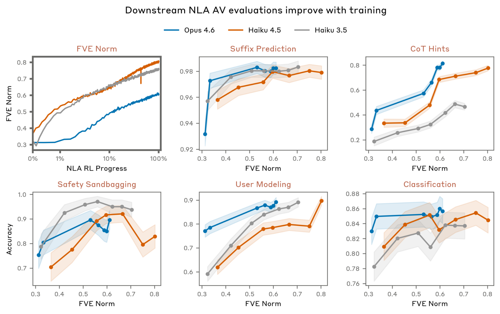
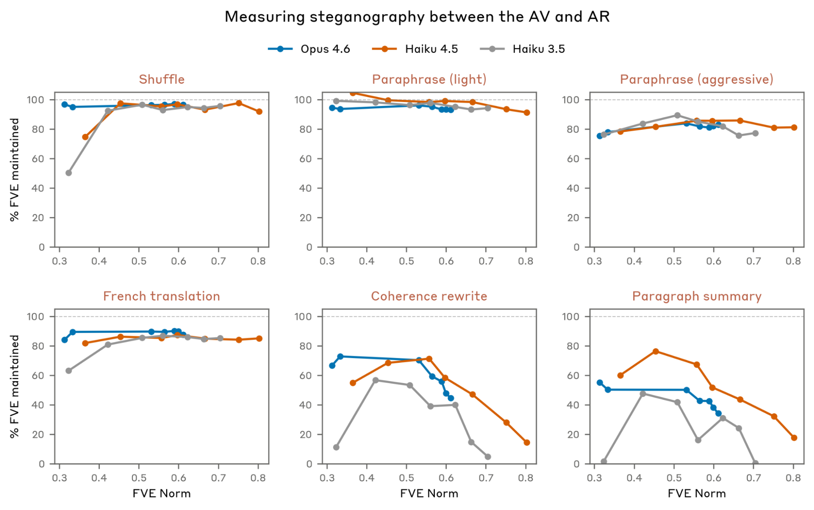
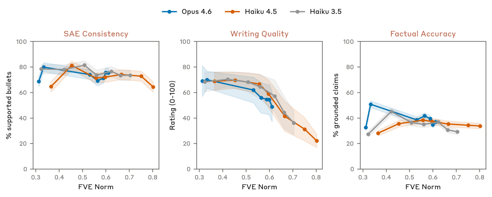
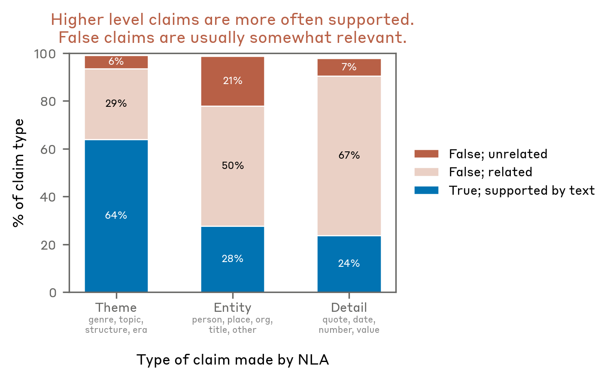
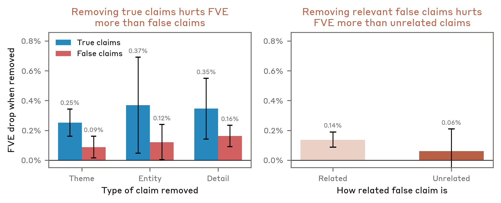
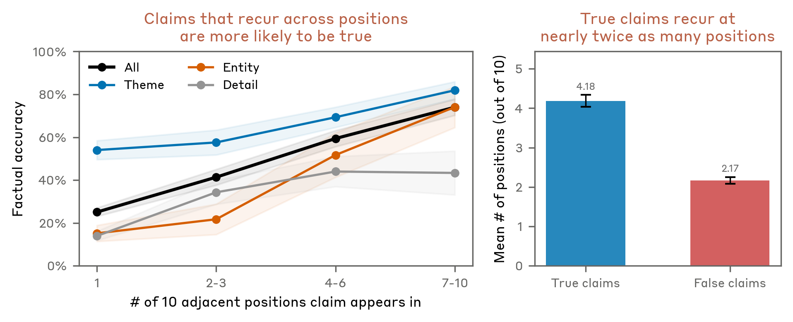

# 정보성은 늘지만 진실성은 평이하다 — 평가와 환각 분석

> 원본: [transformer-circuits.pub/2026/nla](https://transformer-circuits.pub/2026/nla/index.html)

NLA는 그 출발점부터 곤란한 평가 문제를 안고 있다. 활성화에 무엇이 들어 있는지에 대한 ground truth가 일반적으로 *없기* 때문에 NLA를 도입하는 것인데, 도입한 NLA가 잘 작동하는지는 어떻게 검증할 것인가? 5편에서 본 사례 연구는 이 질문에 대한 *질적인* 답이었다. 사례마다 NLA 해석을 attribution graph·activation steering·학습 데이터 검사 같은 독립적인 방법으로 교차 검증해 보였지만, "사례가 잘 풀렸다"는 것이 일반적으로도 잘 작동한다는 보장은 아니다.

이번 편은 그 빈자리를 정량적으로 메우려는 시도다. 두 갈래의 평가가 있다. 첫째, ground truth가 *알려진* 좁은 셋업 다섯 개에서 NLA가 그 정보를 회수하는지를 측정한다. 둘째, 회수와 무관하게 설명 자체의 *행동적 속성* — 스테가노그래피, 문체 품질, SAE 일치도, 검증 가능한 거짓 — 을 측정한다. 마지막으로, 가장 골치 아픈 환각 문제를 떼어 내 그 *구조*를 들여다본다. 환각이 아무 데서나 무작위로 튀어나오는 것이 아니라 일정한 패턴을 따른다는 사실이 확인되며, 이로부터 NLA를 실무에서 어떻게 읽어야 하는지에 대한 휴리스틱이 나온다.

## Ground truth가 알려진 다섯 셋업으로 정보성 측정

NLA RL은 오로지 reconstruction error만 최적화한다. 그러나 우리는 그 결과로 *정보성 있는* 자연어 설명이 따라 나온다고 주장한다. 이 주장을 직접 검증할 길이 없으므로, ground truth를 *구성에 의해* 알 수 있는 좁은 셋업을 다섯 개 만들어 우회 검증한다. NLA 설명을 이 셋업에 적용했을 때, 그 안에 들어 있어야 *마땅한* 정보를 NLA가 실제로 회수하는지 보는 것이다.

세 모델 — Claude Haiku 3.5, Haiku 4.5, Opus 4.6 — 각각에 대해 학습된 NLA를 평가했다. 셋의 학습 step·step당 compute가 모두 다르므로, 학습 진행도를 step이 아니라 모델 비의존적인 척도인 $\text{FVE}$(fraction of variance explained)에 대해 정규화해서 곡선을 그렸다. 다음과 같은 결과가 나왔다.

- 다섯 평가 모두에서 세 NLA의 성능은 학습 동안 *증가*한다. RL 목표가 reconstruction뿐이라는 점을 감안하면, 정보성이 부수효과로 따라 올라간다는 비자명한 관찰이다.
- 향상의 폭은 평가에 따라 다르다. 예를 들어 Classification 평가에서 Opus 4.6 NLA의 점수는 학습 중 $83\% \to 86\%$ 정도로 *modest*하게만 오른다. 해당 활성화 자체에 그 정보가 충분히 들어 있지 않거나, 평가 셋업이 noisy하거나, 정보를 언어화하는 일이 완벽한 AV에게도 어렵다는 등의 가능성이 함께 시사된다.
- Opus 4.6 NLA는 다섯 평가 중 네 평가에서 가장 높은 점수를 보였다. 다만 세 NLA의 학습 budget·target model 차이 때문에 이 비교를 모델 스케일의 효과로 곧장 해석하지는 않는다. 세 곡선은 *통제된 비교*가 아니라 *독립된 시연 세 장*으로 읽어야 한다.

또한 분명히 해 둘 한 가지가 있다. 이 다섯 평가는 모두 LLM에게 입력 전체를 context로 주면 곧잘 풀 수 있는 종류의 task이다. 즉 이 평가들은 NLA가 다른 방법론 대비 *uniquely* 유용함을 입증하지 *않는다*. 측정하는 것은 어디까지나 "학습이 진행될수록 NLA 설명이 더 많은 정보를 담는다"는 일반적 추세이며, 같은 NLA 학습 안에서의 체크포인트 비교에 가장 적합하다.

| 평가 셋업 | Ground truth | 측정 의도 |
| --- | --- | --- |
| Classification | 입력의 사전 정의된 라벨 | NLA 설명이 라벨 결정에 유용한 단서를 담는가 |
| CoT Hints | 프롬프트에 심어 둔 힌트 | 모델이 사용한 reasoning 단서가 설명에 드러나는가 |
| 그 외 세 셋업 | 구성된 조건에 의해 알려진 정보 | 활성화에 인코딩된 알려진 정보를 회수하는가 |

다섯 평가 전부 동일한 메시지를 향한다 — *학습은 정보를 더 끌어올린다*. 하지만 정보가 더 들어 있다는 것이 곧 그 정보가 모두 *참*이라는 뜻은 아니다. 다음 평가들은 그 갭을 본다.

*세 NLA 모두 학습 동안 다섯 평가 모두에서 점수가 올라간다. 학습 진행은 step 이 아니라 모델 비의존적 척도인 FVE 로 정규화한다.*

## 행동적 속성 — 스테가노그래피·SAE·문체·진실성

ground truth 회수 평가가 NLA 설명의 *유익한* 면을 본다면, 행동적 평가는 *해로울 수 있는* 면들을 본다. 네 가지를 차례로 살펴본다.

### 스테가노그래피 — AV는 자기들끼리만 통하는 코드를 쓰는가

가장 큰 우려는 이것이다. AV와 AR 둘 다 충분히 표현력 있는 신경망이므로, 자연어처럼 보이는 토큰열에 인간이 못 읽는 사이드 채널을 숨기고 그 채널로 reconstruction을 잘하는 식으로 RL이 *치팅*할 수 있다. 사실 워밍 SFT를 빼고 돌린 초기 실험에서는 FVE가 오르면서도 출력이 *garbled* 텍스트로 무너지는 런을 본 적이 있다. 그래서 SFT warm-start가 도입됐다. 그러나 warm-start를 했더라도 점진적으로 다시 코드화될 가능성은 남는다.

이를 검증하기 위해, AV 출력에 의미 보존 변환과 의미 파괴 변환을 각각 적용하고 변환 후 $\text{FVE}$가 얼마나 떨어지는지 본다. 의미 보존 변환에서 큰 폭의 하락이 나오면 *겉으로 안 보이는* 정보가 출력에 실려 있다는 신호다.

| 변환 | 의미 보존 여부 | 관찰된 FVE 영향 |
| --- | --- | --- |
| Paraphrase | 보존 | 작음 — 학습 중 갭이 벌어지지 않음 |
| Bullet shuffle | 보존 | 작음 |
| French 번역 | 보존 | 작음 |
| Coherence rewrite | 모순 claim 등 *제거* | 큼 (정보 자체가 빠지므로 expected) |
| Paragraph summary | 2~3문장으로 *압축* | 큼 (정보가 빠지므로 expected) |

요지는 두 부류 모두 학습 동안 추세가 안정적이라는 것이다. 의미 보존 변환의 작은 갭은 학습이 진행돼도 거의 일정하고, 의미 파괴 변환의 큰 갭은 변환 정의상 자연스럽다. 따라서 *현재 NLA 런들에서는* 스테가노그래피의 강한 증거가 보이지 않는다. 다만 충분한 최적화 압력이 가해지면 결국 코드화가 일어날 수 있다는 점은 저자들도 단서를 달아 두었다.

*의미 보존 변환은 FVE 를 거의 떨어뜨리지 않지만, coherence rewrite 와 paragraph summary 같은 의미 파괴 변환은 — 정의상 — FVE 를 크게 떨어뜨린다.*

### SAE 일치도 — 다른 해석법과 한 방향을 가리키는가

같은 활성화 토큰에서 active한 SAE feature와 NLA 설명을 비교했다. 일반적으로 둘은 강하게 일치한다. 단 비교는 까다로운데, AV claim은 종종 SAE feature가 잡는 *넓은 컨셉*보다 더 *specific*하기 때문이다. 즉 이 일치도 측정은 noisy하지만, 적어도 두 해석법이 서로를 강하게 *모순*하지는 않는다는 점이 확인된다.

### Writing quality — 학습은 문체를 갉아먹는다

학습이 진행될수록 AV 출력의 *가독성·문체* 점수는 꾸준히 *떨어진다*. 놀라운 결과는 아니다. RL 보상에 문체 보상이 들어 있지 않으니, FVE 게인을 짜내는 과정에서 자연어로서의 매끄러움이 비용이 된다. 후기 체크포인트 출력이 초기 체크포인트 출력보다 읽기 거칠다는 질적 인상과도 일치한다. 이 결과는 production NLA를 고르는 기준에 함의가 있다 — 단순히 FVE가 가장 높은 체크포인트가 사람에게 가장 *읽힐만한* 체크포인트는 아니다.

### Verifiable falsity — 검증 가능한 거짓 비율은 학습 내내 거의 일정

마지막이자 가장 중요한 행동 평가다. AV 설명에서 검증 가능한 사실 claim을 추출하고, 입력 context에 비추어 그 claim의 참·거짓을 판정했다. 결과는 다음과 같다.

- AV는 context에 대한 거짓 claim을 *상당한 비율로* 만든다.
- 그 비율은 학습 동안 거의 *flat*하다 — 즉 NLA RL은 환각을 직접적으로 부추기는 것도, 직접적으로 줄이는 것도 아니다.

세 행동 결과를 종합하면 다음 한 줄이 된다 — *NLA 설명에 들어 있는 개별 사실 주장은 곧이곧대로 받아들이지 말 것*. 그러나 거짓이 일정 비율로 섞인다는 사실 자체는 NLA가 무가치하다는 뜻이 아니다. 어떤 종류의 claim이 더 자주 거짓이고, 어떤 종류의 claim이 더 자주 참인지를 분리할 수 있다면, *읽는 방식*에서 신뢰도를 짜낼 수 있다. 이것이 다음 절의 주제다.

*Writing quality 는 학습과 함께 떨어지고, 검증 가능한 거짓 비율은 학습 내내 거의 일정하지만, SAE feature 와의 일치도는 안정적으로 강하다.*

## 환각의 구조 — 어떤 거짓은 다른 거짓보다 정직하다

환각 분석은 Opus 4.6 NLA를 pretraining-like 텍스트 (예: 한국 역사 기록 텍스트) 위에서 돌린 explanation들에 대해 수행됐다. Haiku 4.5가 *judge*로 동원되어 각 설명에서 검증 가능한 claim을 추출하고, 각 claim에 대해 (1) 진실성, (2) 구체성, (3) prior token에서의 재출현 여부, (4) 해당 claim을 지웠을 때 reconstruction MSE의 변화를 라벨링한다. Haiku 4.5 judge는 일반적으로 신뢰할 만하지만 일정 비율로 miscategorization을 한다는 것이 명시돼 있다.

이 라벨링 위에서 네 가지 사실이 떨어진다.

### 1. 구체성이 낮을수록 더 자주 참이다

같은 NLA 설명 안의 claim이라도 그 *해상도*는 다르다.

- *Theme* claim — "이 텍스트는 조선 왕조 역사 기록을 다룬다."
- *Entity* claim — "이 텍스트는 중종이라는 한국 역사 인물을 언급한다."
- *Specific detail* — "이 텍스트는 조선왕조실록을 인용한다."

진실성 비율은 *theme > entity > specific detail* 순으로 떨어진다. 가장 추상적인 claim이 가장 자주 supported되고, 가장 구체적인 claim이 가장 자주 false이다.

*Theme claim 이 entity 보다, entity 가 specific detail 보다 더 자주 참이다. 다만 거짓 claim 도 대개 input context 와 어느 정도 thematic 하게 연관된다.*

### 2. 거짓 claim도 보통은 무관한 거짓이 아니라 *thematic*한 거짓이다

흥미로운 사실은, 거짓 claim 역시 대개 input context와 *어느 정도 관련된* 거짓이라는 것이다. 위의 한국 역사 기록 예시에서 NLA가 본문에 직접 인용되지 않은 "조선왕조실록"을 언급한 사례가 그렇다 — 텍스트 자체에는 그 출처가 등장하지 않지만, 한국 역사 기록이라는 주제 안에서 *plausible*한 출처다. 환각이 무작위 fabrication이 아니라 주제 위로 보간된 *plausible 디테일*이라는 사실은, 환각의 정체를 이해하는 데에도 환각을 사용해도 되는 영역을 가르는 데에도 중요하다.

> 예시: "이 텍스트는 한국 역사 인물 중종을 언급하고, 조선왕조실록을 인용한다."
> 본문에는 한국 역사 기록과 중종은 등장하지만, 조선왕조실록은 인용되지 *않았다*. theme·entity 수준은 참, specific source 수준은 거짓.

### 3. AR을 *weak verifier*로 쓸 수 있다

AR이 explanation을 다시 활성화로 매핑해야 한다는 점을 고려하면, 활성화에 *없는* 정보를 말하는 claim은 AR의 reconstruction에 별 기여를 하지 않아야 한다. 이를 검증하기 위해 explanation에서 개별 claim을 *지우고* MSE 변화를 측정했다.

- 참 claim을 지우면 거짓 claim을 지운 것보다 MSE가 *더 많이* 오른다 — AR이 참 claim에 더 의존한다.
- 거짓 claim 중에서도 context와 *관련된* 거짓 claim이 unrelated 거짓 claim보다 reconstruction에 더 중요하다.
- 다만 두 추세는 aggregate에서는 보이지만 *개별 transcript에서는 noisy*하다. 따라서 AR은 per-claim 진위 판별기로 쓰기에는 약한 신호다.

이 결과의 의의는 두 가지다. 첫째, RL이 환각을 직접적으로 부추기지 않는다는 정황적 증거가 된다 — 참 claim이 reconstruction에 더 도움이 된다면, 추가 학습이 환각을 줄일 *것 같지만*, 실제로는 verifiable falsity 비율이 학습 내내 flat하므로 그 압력이 충분히 강하지는 않다. 둘째, 강한 per-claim verifier가 필요한 자리에 AR을 두기는 어렵지만, 약한 신호로는 활용 가능하다.

*참 claim 을 explanation 에서 지우면 거짓 claim 을 지웠을 때보다 MSE 가 더 많이 오른다. context 와 관련된 거짓 claim 이 무관한 거짓 claim 보다 reconstruction 에 더 중요하다.*

### 4. 참인 claim은 인접 토큰에서도 자주 *반복*된다

마지막이자 실무에서 가장 유용한 결과다. 같은 transcript의 마지막 10 토큰 각각에 NLA를 적용하고, 마지막 토큰 explanation의 각 claim이 이전 토큰들의 explanation에 등장하는 빈도를 셌다. 결과는 명확하다 — *recurring claim이 더 자주 true*이다.

직관과도 맞는다. 모델이 일관되게 어떤 정보를 표상하고 있다면, 인접 토큰의 활성화에서도 그 정보가 비치고 NLA가 일관되게 그 정보를 verbalize할 가능성이 높다. 반면 한 토큰에만 튀어나오는 claim은 그 토큰의 noise일 확률이 더 크다. 이 휴리스틱은 5편 사례 연구에서 우리가 이미 사용하고 있던 것이다 — Misreported Tool Calls에서 "이 모델은 도구 호출 형식을 헷갈리고 있다"는 해석에 가중치를 둔 이유는 그 주제가 여러 토큰에 걸쳐 반복됐기 때문이다.

*참 claim 이 거짓 claim 보다 여러 token 위치에 걸쳐 반복적으로 등장하는 비율이 높다.*

## 실무 휴리스틱 — NLA 설명을 어떻게 읽을 것인가

위 네 사실은 NLA 출력을 다루는 *읽기 규약*으로 정리된다.

- **개별 specific claim보다 theme을 신뢰하라.** 구체성이 높은 claim일수록 거짓일 확률이 높다. "이 텍스트가 한국 역사 기록을 다룬다"는 거의 받아들여도 좋지만, "조선왕조실록을 인용한다"는 별도 검증이 필요하다.
- **여러 토큰에 걸쳐 반복되는 claim만 강하게 신뢰하라.** 한 토큰에서만 보이는 claim은 noise로 간주한다. 이는 explanation을 단일 토큰에서 읽지 말고 인접 토큰을 *함께* 살펴야 한다는 뜻이기도 하다.
- **Cross-check 가능한 사실은 transcript와 직접 비교하라.** input context는 항상 우리에게 있으므로, NLA가 제시한 인용·이름·날짜 같은 verifiable 디테일은 곧장 원문과 대조해서 검증할 수 있다. 이것은 일반 LLM hallucination이 가지지 못한 NLA 고유의 검증 경로다.
- **모델 인지에 대한 unverifiable claim은 더 신중하게 다뤄라.** 위 환각 분석은 *입력 텍스트에 대한* claim에만 적용된다. "모델이 X를 생각하고 있다"는 식의 모델 cognition claim은 ground truth 자체가 관측 불가능해서 이 휴리스틱이 그대로 옮겨가지 않는다. theme·반복·교차 검증 같은 잣대는 여전히 적용해 볼 수 있지만, 결론을 내리기 전에 *별도의* 인과적 검증 — 즉 NLA explanation을 편집해서 모델 행동이 예측대로 바뀌는지 보는 종류의 실험 — 이 필요하다.

마지막 항목은 다음 편의 출발점이기도 하다. 모델이 *말하지 않는* 것을 NLA가 듣고 있다는 가장 흥미로운 주장 — evaluation awareness — 은 ground truth가 정의상 부재하는 영역에 놓여 있다. 환각 분석에서 다듬은 휴리스틱만으로는 충분하지 않고, NLA-측정 awareness가 인과적으로 모델의 내부 상태를 따라가는지를 별도의 manipulation으로 검증해야 한다.

다음 편: [모델이 말하지 않는 것을 듣기 — Unverbalized Evaluation Awareness](07-detecting-evaluation-awareness.md)

## 출처

- Anthropic Transformer Circuits, *Natural Language Autoencoders*, 2026. <https://transformer-circuits.pub/2026/nla/index.html>
- 본문 인용된 섹션: "Evaluating NLAs during training", "NLA evaluations improve with training", "Measuring behavioral properties of NLAs", "Characterizing NLA confabulations".
