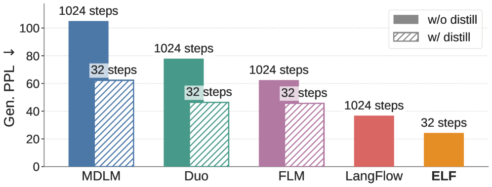

# 왜 다시 연속 확산 언어 모델인가 — 이산 우세 속에서 ELF가 노리는 빈 자리

> 원본: [arxiv.org/abs/2605.10938](https://arxiv.org/abs/2605.10938)

디퓨전과 플로우 매칭은 이미지·비디오 같은 연속 데이터 도메인에서는 사실상 표준 생성 방식이 됐다. 그런데 그 흐름이 언어로 옮겨가는 순간 갈래가 갈렸고, 최근 몇 년간은 토큰 공간에서 직접 동작하는 이산(discrete) 방식이 우세를 점해 왔다. ELF는 이 흐름을 거슬러 "연속(continuous) 방식이 진짜로 불리한 건지, 아니면 그동안의 디자인 선택이 잘못된 건지" 다시 묻는 논문이다. 이 편에서는 ELF가 제안되는 배경 — 두 갈래의 분기, 연속 쪽이 밀려난 이유, 그리고 ELF가 비집고 들어가려는 디자인 공백 — 을 정리한다.

## 한 장으로 보는 결론

*Fig 1. MDLM, Duo, FLM, LangFlow, ELF의 생성 퍼플렉시티($\text{Gen. PPL}$, 낮을수록 좋음) 비교. 빗금 막대는 distillation을 추가한 버전. ELF는 distillation 없이 32 step만으로 가장 낮은 Gen. PPL을 달성한다. 다른 모델 다수는 1024 step을 쓰거나 별도 distillation 단계를 추가해서 step 수를 줄인다.*

본문 전반의 결론을 한 그림으로 압축하면 위와 같다. ELF는 distillation도 없이, 더 적은 step($32$ step)으로, 기존 이산·연속 DLM 모두보다 낮은 Gen. PPL을 낸다. 다음 편들이 다룰 디자인 결정의 정당화이자, 1편에서 짚을 "연속 DLM이 정말 본질적으로 약한가?"라는 질문에 대한 저자들의 답이다.

## DLM의 두 갈래

언어로 확산 모델을 옮기려는 시도는 크게 두 갈래로 갈라져 있다.

- **연속 DLM (Continuous DLM)**: 이산 토큰을 임베딩이나 simplex 같은 연속 표현으로 매핑한 뒤, 그 연속 공간에서 denoising을 수행한다. Diffusion-LM, CDCD, DiffuSeq, SSD-LM, TESS, 그리고 latent diffusion 계열인 LD4LG 등이 여기 속한다.
- **이산 DLM (Discrete DLM)**: 토큰 공간에서 직접 동작하며, 이산 확률변수에 대한 확산 과정을 정의한다. D3PM이 일반화된 이산 corruption을 제시했고, MDLM 같은 masked diffusion, Duo 같은 uniform-state diffusion, 그리고 E2D2 같은 semi-autoregressive 변형이 나와 있다.

최근 진척은 거의 이산 쪽에 몰려 있다. 코드 생성, 멀티모달까지 확장된 사례도 이산 계열이 주도한다. 저자들은 이 우세가 *경험적*이라는 점을 분명히 한다. 즉 "언어가 이산이니 이산 모델이 맞다"는 본질론으로는 설명이 안 되고, 연속 쪽이 정말 본질적으로 불리한 건지 아니면 디자인 선택의 누적된 약점 때문인지가 미해결로 남아 있다는 것이다.

이 차이는 그냥 경합 문제가 아니라 후속 기법 이식성 문제이기도 하다. 이미지 도메인에서 정착한 핵심 도구들 — classifier-free guidance, rectified flow, $x_0$-prediction의 manifold 가설, training-time CFG, SDE 기반 sampler — 은 대부분 연속 score field 또는 velocity field를 전제로 설계됐다. 이산 DLM에서는 같은 도구를 옮기기가 까다롭다. 실제로 CFG는 이산 DLM에서 효과가 약하다고 여러 후속 연구가 보고했다. 연속 DLM이 효과적으로 작동한다면, 그 자체의 성능을 넘어 image-domain 연구 진척을 거의 무료로 흡수할 수 있다는 점이 ELF가 연속 쪽을 다시 미는 두 번째 동기다.

## 연속 DLM이 밀려난 진짜 이유

기존 연속 DLM들을 자세히 보면 공통적인 약점이 있다. 형식적으로는 연속 공간에서 동작하지만, 실제 denoising 궤적은 매 step마다 토큰 공간 쪽으로 끌어당겨진다.

- **임베딩 공간 계열 (Diffusion-LM, CDCD, DiffuSeq 등)**: 가우시안 노이즈를 토큰 임베딩에 직접 더한다. 학습 시 rounding loss 또는 토큰 단위 cross-entropy를 매 step에서 함께 주는 경우가 많아, 궤적이 vocab에 묶인다.
- **Simplex 기반 계열 (SSD-LM, TESS, RDLM 등)**: 표현 공간 자체가 simplex 또는 categorical sphere 형태라 vocab 차원으로 강하게 제약된다. 추론 시 매 step argmax projection이 들어가기도 한다.
- **Latent diffusion 계열 (LD4LG 및 후속)**: 압축된 latent 공간을 쓰는 대신, 토큰을 복원하려면 별도로 학습한 디코더가 필요하다. 추론 파이프라인이 두 모듈로 쪼개진다.

ELF의 진단은 명확하다. 이들 모두 *어디선가* 매 step 토큰 공간과의 직접 연결을 유지하고 있고, 그 연결이 flow dynamics의 자유도를 깎아 먹는다. 토큰 단위 supervision은 어휘 수준의 지도(指導)를 주는 대신, 중간 denoising state를 categorical prediction과 묶어버린다.

여기에 더해, *동시기* 연속 플로우 모델들 — DFM, CFM, FLM/FMLM, LangFlow — 도 비슷한 함정에 다시 빠진다. 이들 역시 Flow Matching을 가져오면서 simplex, one-hot, embedding 같은 다양한 연속 상태 공간을 시도하지만, 모두 flow trajectory를 따라 토큰 단위 cross-entropy 감독을 어떤 식으로든 넣는다. 일부는 few-step generation을 위해 별도 distillation 단계를 추가한다. 새 process(FM)는 들였지만 *per-step 토큰 supervision*이라는 옛 디자인은 그대로 유지된 셈이다.

## 부록 A의 분류 축

부록 A는 기존 연속 DLM들을 표로 정리하면서 다섯 가지 디자인 축을 제시한다. 이 축들이 ELF의 좌표가 어디 비어 있는지를 명료하게 보여준다.

| 축 | 의미 |
|---|---|
| Process | 사용하는 확산/플로우 정식화. Flow Matching, DDPM, VP-DDPM/-SDE, Score-ODE, SDE/DDIM, VLB, RDM, Bregman FM 등. |
| State | denoising이 수행되는 연속 상태 공간. jointly-trained embedding, frozen embedding, frozen encoder(+bottleneck), simplex, one-hot stack 등. |
| Train per-step discr. | 학습 시 중간 denoising state를 토큰 예측으로 매핑해서 cross-entropy 같은 토큰 단위 손실로 감독하는지 여부. |
| Infer. per-step discr. | 추론 시 매 sampling step에서 token-aligned 표현으로 다시 투영(nearest-neighbor rounding, argmax 등)하는지 여부. |
| Sep. dec. | 잠재 표현을 텍스트로 되돌리기 위해 별도 학습된 디코더가 필요한지 여부. |

이 다섯 축으로 기존 방법들을 줄세우면 패턴이 보인다.

- 임베딩 공간·simplex 계열은 대부분 *학습 시* per-step 토큰 supervision을 켠다. 어휘 수준 신호를 직접 받지만, 그만큼 중간 state가 vocab에 매여 있다.
- Latent Diffusion 계열은 per-step 토큰 supervision은 끄지만, *별도 디코더* 가 거의 필수다. 노이즈 스케줄도 DDPM 계열에 묶여 있다.

즉, 두 묶음은 각자 다른 비용을 치르고 있다. 한쪽은 매 step 어휘 신호를, 다른 쪽은 별도 디코더를. 둘 다 안 치르는 자리는 표에서 *비어 있다*. ELF가 노리는 곳이 바로 거기다.

## ELF가 비집고 들어가는 자리

ELF (Embedded Language Flows)는 이 다섯 축을 다음 조합으로 채운다.

- **Process**: continuous-time Flow Matching, linear interpolant (rectified flow).
- **State**: frozen pretrained encoder(T5)의 contextual embedding + low-dim bottleneck.
- **Train per-step discr.**: 없음. 중간 step은 임베딩 공간 안에서만 denoise한다.
- **Infer. per-step discr.**: 없음. 샘플링 궤적은 마지막 step 전까지 vocab에 닿지 않는다.
- **Sep. dec.**: 없음. 마지막 step에서 같은 네트워크가 weight를 공유한 채로 임베딩→토큰 매핑까지 같이 한다.

핵심 아이디어 두 가지를 미리 짚으면 다음과 같다.

- **마지막 step만 이산화**: Flow Matching의 시간축 $t \in [0, 1]$에서 $t=1$ 한 점만 continuous-to-discrete decoding으로 재해석한다. 그 한 점 직전까지는 전부 연속 임베딩에서 MSE로 학습한다.
- **공유 weight 디코더**: 별도 디코더 모듈을 두지 않고, 같은 네트워크가 "denoise" 모드와 "decode" 모드를 binary mode token으로 구분해서 두 역할을 다 한다. 학습은 한 배치 안에서 마스킹으로 두 모드를 같이 돈다.

이 조합은 부록 A 표에서 비어 있던 좌표다. 토큰 supervision도 매 step 안 주고, 별도 디코더도 안 두면서, 동시에 Flow Matching 기반 image-domain 기법(linear interpolant, $x_0$-prediction, CFG, training-time CFG, SDE-inspired sampler 등)을 거의 그대로 가져다 쓸 수 있는 자리.

## 다섯 축의 ELF 좌표 요약

기존 연속 DLM들을 부록 A 다섯 축으로 정리하면, ELF의 자리는 다음과 같이 비교된다.

| 그룹 | Process | State | Train per-step discr. | Infer. per-step discr. | Sep. dec. |
|---|---|---|---|---|---|
| 임베딩 공간 계열 | DDPM 류 다수 | learn/fix emb | 있음 (CE) | 일부 있음 | 없음 |
| Simplex 계열 | DDPM, RDM | simplex/one-hot | 있음 | 있음 (argmax 등) | 없음 |
| Latent Diffusion 계열 | DDPM/Score-ODE | fix enc | 대부분 없음 | 없음 | 있음 |
| Concurrent flow 계열 (DFM, CFM, FLM, LangFlow) | FM 변형 | simplex/one-hot/emb | 있음 (CE 동반) | 변형마다 다름 | 일부 distillation 의존 |
| **ELF** | **Flow Matching (linear)** | **fix enc + bottleneck** | **없음** | **없음** | **없음 (weight 공유)** |

ELF가 비교 대상으로 강조하는 *동시기* 연속 플로우 모델들 — DFM, CFM, FLM/FMLM, LangFlow — 역시 비슷한 문제의식에서 출발하지만, 모두 flow trajectory를 따라 토큰 단위 cross-entropy 감독을 어떤 식으로든 넣는다. 일부는 few-step generation을 위해 distillation을 추가한다. ELF는 이 두 가지를 모두 비워두고, 토큰 단위 supervision은 *마지막 decoding step 하나*에만 적용한다.

## 형식적 그림: 어디서 연속이고 어디서 이산인가

이를 식으로 정리하면 다음과 같다. 입력 토큰 시퀀스를 frozen encoder $E$로 임베딩하면 깨끗한 latent $x_1$이 얻어진다. Flow Matching은 노이즈 $x_0 \sim \mathcal{N}(0, I)$에서 $x_1$까지 직선 보간(rectified flow)으로 잇는다.

$$
x_t = (1 - t) \cdot x_0 + t \cdot x_1, \quad t \in [0, 1]
$$

속도장 $v_t = \dot{x}_t = x_1 - x_0$를 직접 회귀하는 대신 ELF는 $x_1$-prediction을 쓴다. 네트워크 출력을 $\hat{x}_1$이라 하면 학습 손실의 한 축은

$$
\mathcal{L}_{\text{MSE}} = \mathbb{E}_{t, x_0, x_1} \left\| \hat{x}_1(x_t, t) - x_1 \right\|^2
$$

이고, 이 손실은 $t \in [0, 1)$ 범위의 거의 모든 step에서만 작동한다. 이산화는 $t = 1$ 한 점에서만 일어난다. 같은 네트워크가 mode token으로 "decode"로 바뀌면, $\hat{x}_1$에 학습 가능한 unembedding 행렬 $W$를 곱해 로짓을 얻고

$$
\mathcal{L}_{\text{CE}} = - \sum_{i} \log \text{softmax}(W \hat{x}_1)_{w_i}
$$

로 토큰 단위 cross-entropy를 받는다. 학습 배치는 $\mathcal{L}_{\text{MSE}}$와 $\mathcal{L}_{\text{CE}}$를 약 80:20 비율로 섞는다. 추론 시에는 ODE/SDE solver로 $t=0$에서 $t=1$까지 적분한 뒤, 마지막 한 번만 decode 모드로 평가해서 토큰을 뽑는다.

이렇게 보면 ELF의 "연속성"이 가진 두 층이 분명해진다. *공간*에서 연속(임베딩 공간 안에서만 움직이고, 중간엔 vocab에 닿지 않음)이고, *시간*에서 연속(continuous-time Flow Matching이라 step을 자유롭게 조절 가능)이다. 이 두 층의 연속성이 image-domain 디퓨전에서 쌓아온 기법들 — classifier-free guidance(CFG), training-time CFG, rectified flow, SDE-inspired sampling, self-conditioning, $x_0$-prediction의 manifold 가설 — 을 거의 그대로 이식 가능하게 만든다는 게 ELF의 주장이다. 이산 DLM에서 CFG가 잘 안 듣는다고 보고된 것과 대비된다.

부수적으로 짚어둘 점이 두 가지 있다. 첫째, encoder $E$는 학습이 끝나면 *추론 시 사용되지 않는다*. 학습 시 깨끗한 latent $x_1$을 만들기 위한 도구일 뿐, 생성 단계에선 노이즈 $x_0$에서 시작해 같은 공유 네트워크만으로 모든 step을 돈다. 결과적으로 추론 모듈 수는 한 개로 유지된다. 둘째, $x_1$-prediction 선택은 weight 공유와 직접 맞물려 있다. Flow Matching에서 흔히 쓰는 속도장 $v$-prediction을 쓰면 $\hat{v}$에서 $\hat{x}_1$을 재구성하는 변환이 들어가서, denoise 손실(MSE)과 decode 손실(CE)이 공유하는 표현이 어긋난다. 저자들은 이 경우 weight 공유 디코더의 성능이 망가진다고 실험적으로 보고한다.

## 이 편에서 들고 갈 것

다음 편 이후의 디자인·실험을 따라가기 전에, 1편에서 정리한 그림을 한 번 더 정렬해두면 좋다.

- 디퓨전·플로우 매칭은 이미지·비디오에서 dominant. 언어로 옮긴 시도는 연속·이산 두 갈래로 갈라졌고, 최근은 이산 우세.
- 단, 이 우세는 경험적이고, "언어가 이산이라서"라는 본질론은 아직 입증되지 않았다. 미해결 질문이다.
- 기존 연속 DLM들은 형식적으론 연속이지만, 매 step 토큰 단위 supervision 또는 별도 디코더 중 어느 한쪽에 묶여 flow의 자유도를 잃었다.
- 부록 A의 다섯 축(Process / State / Train per-step discr. / Infer per-step discr. / Sep. dec.) 위에서 ELF는 "토큰 supervision 없음 × 추론 이산화 없음 × 별도 디코더 없음"이라는 빈 좌표를 차지한다.
- 이 좌표는 image-domain Flow Matching의 기법을 거의 그대로 가져올 수 있게 해주는 자리이기도 하다.

다음 편: [임베딩 공간에 머무는 흐름 — ELF가 만든 세 가지 디자인 결정](02-design-principles.md)

## 출처

- [ELF: Embedded Language Flows (arXiv:2605.10938)](https://arxiv.org/abs/2605.10938)
