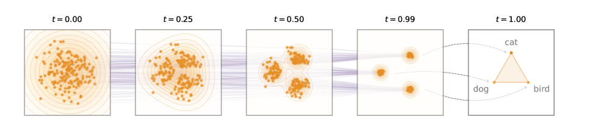

# 임베딩 공간에 머무는 흐름 — ELF가 만든 세 가지 디자인 결정

> 원본: [arxiv.org/abs/2605.10938](https://arxiv.org/abs/2605.10938)

이전 편에서 우리는 DLM(diffusion language model)이 둘로 갈라져 왔다는 점을 확인했다. 한쪽은 token 공간을 직접 다루는 discrete DLM, 다른 한쪽은 token을 일단 연속 공간으로 옮긴 다음 그 안에서 denoising하는 continuous DLM이다. ELF는 후자에 속하지만, 그 안에서도 가장 "연속적인" 쪽으로 끝까지 밀어붙인 설계다. denoising 경로의 거의 모든 step을 임베딩 공간에서 처리하고, 마지막 한 step에서만 token으로 떨어뜨린다.

이 편에서는 논문 3장의 첫 번째 절 "The ELF Framework"를 따라가며, 그 단순함을 지탱하는 세 가지 디자인 결정을 풀어본다. 결정 하나하나는 자체로는 소박하지만, 세 가지가 합쳐졌을 때 별도 디코더가 필요 없는 "한 네트워크 짜리" DLM이 떨어진다.

*Fig 2. ELF 개요. 왼쪽 끝의 점 구름이 noise, 오른쪽으로 갈수록 의미를 가진 임베딩 군집이 형성되고, 가장 오른쪽에서 dog / cat / bird 같은 discrete token으로 떨어진다.*

## 결정 1 — discrete token 대신 continuous embedding 위에서 움직인다

ELF가 가장 먼저 내리는 결정은 "denoising을 어디서 할 것인가" 다. 답은 단순하다. token 자체에서는 아무것도 하지 않고, token을 먼저 연속 벡터로 옮긴 다음 그 위에서만 flow를 정의한다.

길이 $n$ 의 문장 $s_1, s_2, \dots, s_n$ 이 주어지면, ELF는 우선 인코더 $E$ 를 통해 각 token을 $d$ 차원 벡터로 매핑한다.

$$
x = E(s_1, s_2, \dots, s_n) \in \mathbb{R}^{n \times d}.
$$

기본 설정에서 $E$ 는 사전학습된 T5 encoder다. T5는 bidirectional contextual embedding을 내준다. 같은 token이라도 문맥에 따라 다른 벡터로 표현된다는 뜻이다. 중요한 점은 이 인코더의 역할이 학습 단계에 그친다는 것이다. 인퍼런스에서는 noise $\epsilon \sim \mathcal{N}(0, I)$ 에서 출발해 임베딩 공간 안에서 flow를 풀기 때문에, T5 encoder는 추가 모듈로 따라붙지 않는다.

논문이 강조하는 것은 임베딩 선택의 유연성이다. 인코더는 사전학습된 것을 그대로 써도 되고, 임베딩 차원만 맞으면 OWT로 from-scratch 학습한 인코더도 된다. 학습 가능한 임베딩 레이어 하나만 둬도 동작은 한다. 4장 ablation에서 보겠지만 사전학습된 contextual embedding이 가장 좋은 quality–diversity trade-off를 보였고, 학습 가능한 비-contextual 임베딩은 가장 약했다. 어쨌든 이 단계의 핵심은 "ELF가 token이 아니라 벡터 위에서 산다"는 사실 자체이며, 어떤 벡터냐는 ELF가 강하게 가정하지 않는다.

좀 더 풀자면, 이 결정에는 "임베딩이 token보다 더 풍부한 정보를 담은 표현이고, denoising은 그 풍부한 공간 위에서 푸는 편이 더 잘 풀린다"는 가설이 깔려 있다. token은 vocabulary 위의 one-hot으로, 의미적으로 가까운 단어조차 직교한다. 반면 사전학습된 contextual embedding은 의미가 비슷한 단어 또는 같은 단어의 다른 문맥적 의미가 서로 가깝게 모이는 기하를 갖는다. flow의 입장에서 보면 이런 공간은 trajectory가 부드럽게 움직일 수 있는 manifold에 가깝고, Gaussian noise에서 데이터 분포로의 변환이 본질적으로 더 짧고 단순한 path로도 가능해진다.

대안 대비 위치는 이렇다. Diffusion-LM, CDCD, DiffuSeq 같은 초기 embedding-space DLM은 token 임베딩에 직접 Gaussian noise를 얹는 점에서 표면적으로는 비슷하지만, 각 step마다 token 단위의 rounding loss나 cross-entropy를 끌어와 trajectory를 token에 묶어 둔다. simplex 기반의 SSD-LM, TESS는 임베딩 대신 vocabulary simplex 위로 점을 보내고 그 위에서 noise를 얹는다. 둘 다 본질적으로 "연속화된 discrete 공간"에서 움직이는 형태다. ELF는 그 묶임을 풀고 임베딩 공간을 진짜로 unrestricted한 continuous latent로 본다. 결과적으로 모든 중간 step에서 flow가 따라야 할 제약이 없어지고, denoising 동역학이 임베딩 공간 자체의 기하에 맞춰 자유롭게 형성된다.

같은 맥락에서 latent diffusion 계열(LD4LG와 후속작들)과의 차이도 짚어둘 만하다. 이들은 임베딩을 더 압축해 저차원 latent로 내린 뒤 그 위에서 diffusion을 푼다. ELF는 압축을 하지 않고, T5의 512-d 출력을 그대로 또는 가볍게 정규화한 형태로 유지한 채 768-d 안팎의 고차원에서 직접 flow를 푼다. 압축이 만들 수 있는 표현 손실을 감수하지 않는 대신, 결정 2에서 보겠지만 그 고차원성을 견딜 수 있는 학습 target을 따로 선택해야 한다.

## 결정 2 — Flow Matching을 쓰되 $v$ 가 아니라 $x_1$ 을 예측한다

두 번째 결정은 flow의 형태와 학습 target에 관한 것이다. ELF는 가장 단순한 Flow Matching 구성을 따른다. 깨끗한 임베딩 $x_1 \sim p_\text{data}$ 과 Gaussian noise $\epsilon \sim p_0 = \mathcal{N}(0, I)$ 사이를 선형으로 잇는 rectified-flow interpolant다.

$$
x_t = (1 - t)\,\epsilon + t\,x_1, \qquad t \in [0, 1].
$$

$t = 0$ 이면 순수 noise, $t = 1$ 이면 깨끗한 임베딩이다. 이 경로 위의 velocity field는 시간 미분으로 떨어진다.

$$
v(x_t, t) = \frac{d x_t}{d t} = x_1 - \epsilon.
$$

표준 Flow Matching이라면 네트워크가 직접 $v$ 를 예측한다. ELF는 같은 경로를 쓰되 parameterization을 바꾼다. 네트워크의 즉시 출력은 $\hat{x}_1(x_t, t)$ 다. 즉 "현재 noisy 임베딩 $x_t$ 를 보고 깨끗한 임베딩 $x_1$ 이 무엇이었는지" 를 직접 맞춘다. 두 parameterization은 다음 관계로 서로 변환된다.

$$
v(x_t, t) = x_1 - \epsilon, \qquad \hat{v}(x_t, t) = \hat{x}_1(x_t, t) - \epsilon.
$$

학습 손실은 예측 velocity와 정답 velocity의 MSE 형태로 쓰지만, 위 관계를 대입하면 $\epsilon$ 이 깨끗하게 소거되어 결국 "$x_1$ 의 회귀"가 된다.

$$
\mathcal{L}_\text{denoise} = \mathbb{E}\bigl\| v(x_t, t) - \hat{v}(x_t, t) \bigr\|^2 = \mathbb{E}\bigl\| \hat{x}_1(x_t, t) - x_1 \bigr\|^2. \tag{1}
$$

식 (1)이 ELF의 denoising loss다. $\epsilon$ 도, $v$ 도 아니라 깨끗한 임베딩 $x_1$ 자체가 네트워크의 학습 target이라는 점이 핵심이다.

왜 굳이 $x_1$-prediction을 선택했나. 논문은 두 가지 이유를 든다. 첫째, 고차원 임베딩에서의 안정성이다. ELF는 별도 압축 없이 per-token 768-d 같은 큰 임베딩 위에서 flow를 푼다. 이 정도 차원에서 $v$-prediction은 $\epsilon$ 의 분산을 그대로 떠안기 때문에 학습 시 분산이 커지고, 최근 image generation 쪽에서 보고된 것처럼 $x_1$-prediction이 더 잘 작동한다. 둘째, 마지막 step에서의 자연 정합이다. 어차피 ELF의 마지막 step은 "깨끗한 임베딩으로부터 token을 뽑는" 디코딩이다. 그렇다면 그 한 step 전까지의 모든 forward pass도 동일한 출력 의미("깨끗한 임베딩")를 갖도록 맞추는 편이 자연스럽다. 같은 입출력 의미를 공유해야 다음 결정에 등장할 weight sharing이 비로소 말이 된다. 실험적으로도 weight를 공유한 상태에서 $v$-prediction을 쓰면 성능이 크게 떨어진다고 밝힌다.

대안 대비 위치는 image-domain의 흐름과 거의 같다. 초기 Flow Matching 논문들은 $v$-prediction을 디폴트로 두지만, FLUX 계열의 rectified-flow 후속 작업들은 고차원 latent에서 $x_1$-prediction이 더 강하다는 점을 일관되게 보고해왔다. ELF는 그 결론을 language로 옮긴다. 동시에 simplex나 one-hot 위에서 flow를 정의하는 동시기 연구들(DFM, CFM, FLM/FMLM, LangFlow)과 비교했을 때 ELF의 path는 어떤 도메인 제약도 갖지 않는 fully unrestricted한 임베딩 path라는 점이 차별점이다. velocity 추정의 분산을 어떻게 다룰지에 대한 답으로 ELF는 path를 단순한 직선에 두고 target을 $x_1$ 로 옮긴 것이다.

## 결정 3 — 마지막 한 step만 같은 네트워크로 decode 한다

세 번째 결정이 ELF의 시그니처다. continuous한 흐름에서 어떻게 discrete token으로 돌아오는가. 답은 "별도 디코더를 두지 않는다"다. 정확히는, denoising에 쓰는 네트워크가 마지막 한 step에서 디코더 역할을 같이 한다.

원리는 간단하다. $t = 1$ 에서의 $x_1$ 은 정의상 깨끗한 임베딩이고, 우리는 그 임베딩이 어떤 token에서 왔는지를 알면 된다. 그렇다면 마지막 한 step에서 "임베딩 $\to$ token" 매핑만 추가로 학습하면 충분하다. 단 한 가지 기술적인 문제는, $t \to 1$ 의 극한에서 $x_t$ 가 $x_1$ 으로 수렴해버려 입력이 그대로 정답이 되는 trivial한 학습 신호가 된다는 점이다. ELF는 이를 막기 위해 마지막 step 전용의 token-level corruption 절차를 따로 둔다 (논문 Appendix B.1). 이 corruption을 거친 입력을 $z_t$ 라 하자.

같은 네트워크가 $z_t$ 를 받아 깨끗한 임베딩 $\hat{x}_1$ 을 내놓는다. 그 다음, 학습 가능한 unembedding 행렬 $W \in \mathbb{R}^{|V| \times d}$ 를 곱해 vocabulary $V$ 위의 logits을 얻고, ground-truth token $s_i$ 에 대한 cross-entropy로 학습한다.

$$
\mathcal{L}_\text{decode} = \mathbb{E}\,\Bigl[ -\sum_{i=1}^{n} \log \mathrm{softmax}\bigl(W\,\hat{x}_1(z_t, t = 1)\bigr)_{s_i} \Bigr]. \tag{2}
$$

식 (2)의 cross-entropy는 ELF가 token-level supervision을 받는 유일한 지점이다. 중간 step들은 모두 식 (1)의 MSE로만 학습된다. 80%의 미니배치 샘플은 임의의 $t \in [0, 1)$ 에서 식 (1)을, 20%는 $t = 1$ 에서 식 (2)를 따른다는 비율을 논문이 명시한다.

네트워크 분기는 weight-shared, branch-conditioned 구조로 정리된다. 같은 transformer 가중치를 공유하되, 두 가지 추가 신호를 함께 입력한다. 하나는 time 조건 $t$, 다른 하나는 binary mode token $m \in \{\text{denoise}, \text{decode}\}$ 다. 학습 시 두 분기의 sample은 한 배치 안에 섞여 들어가고, masking으로 분기별 corruption과 loss를 선택적으로 적용한다. "if 문"으로 보이지만 실제 구현에서는 두 branch가 같은 forward에 batched되어 들어가므로 추가 비용은 거의 없다. 인퍼런스에서는 이 구조가 더 단순해진다. $t = 0$ 에서 시작해 $t = 1$ 직전까지는 mode token을 denoise로 두고 ODE/SDE 솔버로 임베딩을 한 단계씩 옮긴다. 마지막 한 step에서만 mode를 decode로 바꿔서 같은 네트워크에 $z_{t \to 1}$ 을 통과시키고 $W$ 를 곱해 token을 얻는다.

*Fig 3. 위쪽이 학습 흐름, 아래쪽이 샘플링 흐름. denoise 분기와 decode 분기가 같은 네트워크 가중치를 공유한다는 점이 모식도의 핵심이다.*

대안 대비 위치는 두 방향으로 갈린다. 한 갈래는 LD4LG, LD3SM 같은 latent diffusion 계열이다. 이들은 별도의 (보통 frozen) decoder를 학습해 latent에서 token을 복원한다. ELF는 별도 디코더를 두지 않고, denoising과 decoding의 가중치를 공유하므로 인퍼런스 모듈이 줄어들고 파이프라인의 학습 단계도 줄어든다. 4장의 ablation에 따르면 디코더를 따로 학습한 two-stage 변형도 비슷한 trade-off를 보이지만, weight-shared 변형이 low-perplexity 쪽 frontier를 더 멀리 밀어낸다. 또 다른 갈래는 Diffusion-LM부터 LangFlow까지의 per-step token supervision 계열이다. 이들은 모든 step에서 rounding loss나 cross-entropy로 trajectory를 token에 묶는다. ELF는 그 묶임을 마지막 한 step으로 미루기 때문에, 중간 step의 동역학이 token simplex의 모양에 강제되지 않고 임베딩 공간 자체의 기하만 따른다.

## 세 결정이 함께 만들어내는 것

세 결정은 서로 독립적이 아니라 연속적으로 맞물려 있다.

- 결정 1이 임베딩 공간을 unrestricted한 continuous latent로 정의한다. 그 덕에 path를 정의할 자유가 열린다.
- 결정 2가 그 자유 안에서 가장 단순한 path(rectified flow)와 가장 자연스러운 target($x_1$)을 고른다. 그 결과 네트워크의 입출력 의미가 "noisy 임베딩 $\to$ 깨끗한 임베딩"으로 통일된다.
- 결정 3이 그 통일된 의미를 활용해 마지막 step의 디코딩을 별도 모듈 없이 같은 네트워크에 흡수시킨다. mode token이라는 작은 컨디셔닝 하나로 두 분기를 묶어낸다.

결국 ELF는 한 개의 transformer와 한 개의 unembedding 행렬, 그리고 두 개의 손실 (식 (1)과 식 (2)) 만으로 구성된 모델이다. 새로운 컴포넌트를 끼워 넣어 성능을 끌어올렸다기보다는, continuous DLM이 안고 있던 "어디서 어떻게 token으로 떨어질 것인가"라는 한 가지 인터페이스 문제에 가장 단순한 답을 찾은 쪽에 가깝다. 다음 편에서는 이 단순함이 실제 코드로 어떻게 굳어지는지, T5 인코더 위의 bottleneck projection, mode token, self-conditioning, 그리고 in-context conditioning까지의 구성 요소를 차례로 살펴본다.

다음 편: [T5 인코더부터 in-context 컨디셔닝까지 — ELF의 실제 구성](03-architecture-and-conditioning.md)

## 출처

- 원문: Hu, Qiu, Lu, Zhao, Li, Kim, Andreas, He. "ELF: Embedded Language Flows." arXiv:2605.10938 (2026). <https://arxiv.org/abs/2605.10938>
