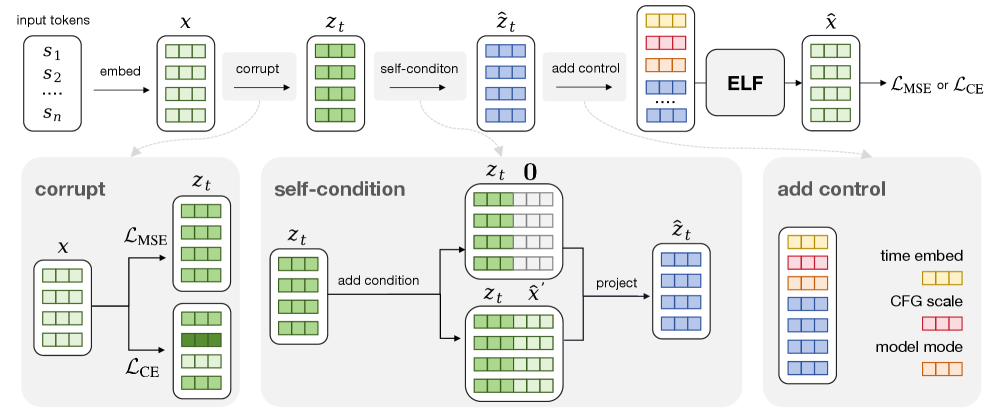

# T5 인코더부터 in-context 컨디셔닝까지 — ELF의 실제 구성

> 원본: [arxiv.org/abs/2605.10938](https://arxiv.org/abs/2605.10938)

앞 편에서는 ELF가 왜 연속 임베딩 위의 Flow Matching으로 결심했는지, denoise와 decode를 한 네트워크에 묶은 설계 원칙이 무엇인지 봤다. 이번 편은 그 결심을 실제 코드와 배치 안에 어떻게 박아 넣었는지를 본다. 원문 3.2 Pseudocode, 3.3 Conditioning and Guidance, 부록 B.1/B.2, 그리고 부록 D.1 모델 아키텍처 표를 빌딩블록 단위로 풀어쓴 글이다. 그림 한 장과 표 한 장으로 전체 흐름을 잡은 뒤, corruption, self-conditioning, 컨트롤 토큰, training-time CFG, 컨디셔널 확장, inference까지 따라간다.

## 모델 백본: DiT를 살짝 손본 표준 트랜스포머

ELF의 본체는 별스럽지 않다. 표준 Diffusion Transformer (DiT) 위에 요즘 LLM 쪽에서 검증된 옵션들을 얹은 구성이다. 활성함수는 SwiGLU, normalization은 RMSNorm, 위치 정보는 RoPE, 그리고 어텐션 안정화를 위한 qk-norm이 들어간다. 한 가지 의도된 차이는, 통상의 DiT가 시간·클래스 같은 컨디션을 adaLN-Zero로 흘려보내는 데 비해 ELF는 그것을 통째로 빼고 **in-context conditioning**으로 바꿨다는 점이다. 이 결정 하나로 ELF-B 기준 파라미터 수가 148M에서 105M으로 줄었다. adaLN을 떼면서 잃은 표현력은 컨트롤 토큰을 시퀀스 앞에 붙여 self-attention으로 흡수시켜 보충한다. 자세한 효과는 다음 편 ablation에서 다시 본다.

세 가지 사이즈를 만든다. 모든 변형은 위 백본을 그대로 공유하며 depth, hidden, head 수만 바꾼다.

| Model | Depth | Hidden | Heads | Params | OWT Epochs |
|---|---|---|---|---|---|
| ELF-B | 12 | 768 | 12 | 105M | 5 |
| ELF-M | 24 | 1056 | 16 | 342M | 4 |
| ELF-L | 32 | 1280 | 16 | 652M | 3 |

표에서 눈에 띄는 점은 모델이 커질수록 epoch 수가 줄어든다는 것이다. ELF-L은 OWT를 3회만 본다. 큰 모델이 적은 epoch에서 더 빨리 학습 곡선을 따라잡는다는 관찰을 그대로 반영한 스케줄이다. 145M에서 출발해 105M으로 줄인 ELF-B를 디폴트 ablation 모델로 쓰는 것도 같은 맥락이다. 비교 베이스라인이 대부분 170M 안팎인데, ELF는 더 작은 모델로 같은 자리에서 싸우겠다는 선택을 했다.

## 임베딩 파이프라인: 동결 T5 인코더 + 보틀넥

토큰을 어떻게 연속값으로 끌어올리느냐는 ELF에서 단순한 임베딩 룩업의 문제가 아니다. denoising이 일어나는 공간 그 자체이기 때문이다. ELF는 **frozen T5-small encoder**를 그대로 가져다 쓴다. T5-small은 35M 파라미터에 512차원 출력이다. 학습 가능한 임베딩과 달리, 동결된 사전학습 인코더는 denoiser와 임베딩 공간이 서로 끌어당기는 동시 최적화 문제를 피한다. ELF가 시도한 ablation에서 learnable embedding이 가장 나쁘게 나오는 이유도 여기에 있다.

T5 인코더의 512차원이 그대로 트랜스포머에 들어가지는 않는다. 그 사이에 **128차원 보틀넥**이 끼어 있다. 즉, 512차원 출력 → 128차원으로 linear projection → 다시 모델 hidden인 768차원으로 projection이라는 두 번의 변환이 있다. 이 디자인의 근거는 "고차원 임베딩이 사실 저차원 매니폴드 위에 분포한다"는 가설이다. 128차원이 그 매니폴드를 충분히 담을 수 있는 한, 굳이 512차원 노이즈 공간에서 denoising 할 필요는 없다는 것. 다음 편 ablation에서 32, 128, 512를 비교한 결과가 나오는데, 128이 quality-diversity trade-off에서 가장 좋은 자리에 떨어진다.

추가로, corruption을 가하기 전에 **OWT에서 추정한 채널별 평균과 표준편차로 임베딩을 정규화**한다. 노이즈 스케일과 logit-normal 분포가 가정하는 단위가 깨지지 않도록 첫 단계에서 통일해두는 셈이다.

## 두 모드와 손실: 같은 forward에 binary mode token

ELF에서 가장 자주 오해받는 부분이 "denoise와 decode가 정말 같은 네트워크냐"이다. 답은 "weight는 같지만 입력의 mode token이 다르다"이다. 학습 중에 각 시퀀스는 두 분기 중 하나에 배정된다.

- **denoising branch (80%)**: 일반적인 Flow Matching처럼 $t \in (0, 1)$ 의 노이즈 임베딩 $x_t$가 들어가고, 모델은 깨끗한 임베딩 $x_1$을 예측한다. 손실은 MSE.
- **decoding branch (20%)**: $t = 1$ 에 가까운 시점을 가정한다. 모델 출력은 unembedding 레이어를 거쳐 토큰 logit이 되고, 손실은 cross-entropy.

두 분기는 별도 배치가 아니라 **하나의 batch에 섞여서 함께 forward**된다. 마스킹이 어떤 토큰에 어떤 corruption과 어떤 loss를 적용할지 결정한다. 모드를 구분해 알려주는 신호가 바로 **binary mode token**이다. 시퀀스 맨 앞에 prepend되는 컨트롤 토큰 중 일부가 "지금 너는 denoise 중이야" 혹은 "decode 중이야"를 알려준다. 이렇게 묶었기 때문에 두 분기를 위해 두 번 forward를 할 필요도, 두 개의 옵티마이저를 굴릴 필요도 없다. 한 번에 한 모델만 학습한다.

corruption 스케줄도 두 모드가 다르다.

- **Denoise branch**: 시퀀스 단위로 시간 $t$를 logit-normal 분포에서 뽑는다. 구체적으로 $\tau \sim \mathcal{N}(m_t, s_t^2)$를 뽑은 뒤 $t = \sigma(\tau)$로 매핑한다. 디폴트는 $m_t = 0$, $s_t = 1$. 표준 가우시안 노이즈에 scale 2를 곱한 뒤 $x_t = (1-t) x_1 + t \epsilon$ 형태로 더한다.
- **Decode branch**: $t = 1$ 이므로 그대로 두면 입력이 그냥 노이즈가 되어 토큰 정보가 사라진다. 그래서 별도 분포로 per-token corruption을 가한다. 토큰별 corruption level $u$를 logit-normal $\mathcal{N}(-1, 1)$ 에서 뽑고, 노이즈 스케일을 OWT는 5, 컨디셔널 태스크는 1로 곱한다. 같은 시퀀스 안에서도 토큰마다 corruption 정도가 다르다. 디코더가 깔끔한 임베딩만 입력으로 받아 본 적이 없어야, 추론 단계에서 denoiser가 만들어내는 약간 부정확한 임베딩을 견디고 토큰으로 떨어뜨릴 수 있다.

이 80/20 mode 비율이 우연이 아니라는 것도 ablation에 나와 있다. denoising mode 확률이 너무 낮으면 trade-off 곡선 자체가 망가지고, 0.8 부근이 ODE/SDE 양쪽 모두에서 가장 좋다.

## Self-conditioning: 두 번째 forward 한 번으로 끝

self-conditioning은 ELF가 새로 만든 트릭이 아니라 [9]에서 가져온 표준 기법이지만, ELF에서는 단순한 성능 부스터가 아니라 **CFG의 컨디션 신호 그 자체**로 다시 쓰인다. 그래서 위치가 중요하다.

학습 시, 한 번의 forward로 얻은 중간 예측을 $\tilde x_1$이라 하자. self-conditioning이 활성화되면 모델은 두 번째 forward를 돈다. 이때 입력은 노이즈 임베딩 $x_t$를 단독으로 넣는 대신, $x_t$와 stop-gradient 처리된 $\tilde x_1$을 **채널 방향으로 concat**한 형태다. 채널이 두 배가 되므로 입력 직후 linear layer 하나로 다시 원래 dimension으로 줄인다.

50%의 확률로는 $\tilde x_1$ 대신 **all-zero 임베딩**을 concat한다. 이게 "null condition"이고, 나중에 CFG에서 unconditional branch 역할을 한다. 학습 중에 모델은 self-condition이 있을 때와 없을 때 모두를 한 네트워크에서 다루게 된다. 한편 decode branch는 항상 $\tilde x_1$을 사용한다. 디코딩은 본질적으로 self-conditioning 입력에 더 강하게 기대는 분기이기 때문이다.

추론 시점의 처리는 한 줄로 요약된다. **이전 step의 prediction을 이번 step의 self-condition으로 그대로 쓴다**. 매 step마다 추가 forward를 돌리지 않는다. 이 단순한 재사용이 다음 절에서 다룰 training-time CFG와 직접 연결된다.

*Fig 9. 입력 토큰을 T5 인코더로 임베딩한 뒤 corrupt, self-condition, control token 추가 세 단계를 거쳐 ELF에 들어간다. corrupt 단계에서는 같은 깨끗한 임베딩 $x_1$이 denoise branch에서는 MSE 손실로, decode branch에서는 CE 손실로 분기된다. self-condition 단계에서는 $x_t$ 옆에 $\tilde x_1$ 혹은 all-zero를 채널 concat한 뒤 projection으로 다시 줄인다. 마지막에 time / CFG scale / model mode 컨트롤 토큰이 prepend된다.*

## Training-time CFG: 한 번의 forward로 끝나는 가이던스

표준 CFG는 step마다 forward를 두 번 돈다. conditional과 unconditional을 각각 계산한 뒤 $u^w = (1+w) u_c - w u_u$로 외삽한다. 이걸 매 sampling step에서 한다면 inference cost가 그대로 두 배다. 학습 비용을 한 번에 흡수해서 추론에서 한 번만 돌게 하자는 접근이 **training-time CFG**다. 이미지 쪽에서 [16, 17] 등이 다져둔 방법론을 ELF가 거의 그대로 가져온다.

핵심 발상은 네트워크가 conditional/unconditional을 따로 학습하지 않고, **post-combination quantity** $u^w(\tilde u, x_t)$를 직접 학습하게 만드는 것이다. 학습 시점에 각 example마다 self-conditioning CFG scale $w$를 random sampling하고, 그에 해당하는 회귀 타깃을 만들어 모델이 한 번의 forward로 그 값을 예측하도록 푸시한다. 추론 단계에서는 $w$를 컨트롤 토큰으로 넣어주기만 하면 그 가이던스가 반영된 출력이 한 번에 나온다.

$w$를 어떻게 뽑느냐도 중요하다. ELF는 작은 값에 편향된 **power distribution**에서 $w$를 sampling한다. 큰 $w$가 가끔 등장은 하지만, 대부분의 학습 신호는 적당한 $w$ 주변에 모인다. 그리고 ELF는 $x_1$-prediction이라서, $u$-기반 수식을 적용하기 위해서는 매번 prediction을 $u$로 변환하는 작은 변환 한 단계가 더 붙는다.

여기서 in-context conditioning이 왜 필요한지가 분명해진다. 시간 $t$, CFG scale $w$, model mode 같은 신호가 모두 모델 입력에 영향을 미치는데, adaLN처럼 합산식으로 한꺼번에 처리하면 신호가 다양해질수록 서로를 깎아낸다. ELF는 이 신호들을 각각 4개씩 token으로 만들어 시퀀스 앞에 붙인다.

- **time token 4개**: 연속값 $t \in [0, 1]$을 positional embedding으로 변환.
- **CFG scale token 4개**: $w$ 역시 positional embedding으로 변환.
- **model mode token 4개**: denoise / decode 중 어느 모드인지.

각 컨트롤 토큰의 차원은 일반 언어 토큰과 같다. 12개 토큰이 시퀀스 앞에 prepend되고, self-attention이 본 시퀀스와 컨트롤 토큰을 같이 본다. adaLN-Zero 대신 이걸 쓰는 것만으로 ELF-B 파라미터가 148M에서 105M으로 줄었다는 점이 부록 D.1에 명시되어 있다. 작아진 것 같지만 ablation에서 trade-off 곡선이 살짝 더 좋아진다.

## Conditional 확장: prefix clean embedding + 10% drop

지금까지 본 구성은 unconditional 생성을 가정한 것이다. 번역이나 요약처럼 입력 시퀀스가 주어지는 conditional 태스크는 어떻게 처리할까. 답은 또 한 번 단순하다. **conditioning 시퀀스의 깨끗한 임베딩을 시퀀스 앞쪽에 prepend하고, 학습·추론 양쪽에서 그 부분에는 corruption을 가하지 않는다**. 컨트롤 토큰 12개 뒤, 본 타깃 시퀀스 앞이 그 자리다. 모델은 그냥 self-attention으로 거기에 컨디션 시킨다.

conditional CFG도 거의 자동으로 따라온다. 학습 중 10% 확률로 condition 임베딩을 0으로 마스킹해버린다. 그러면 모델은 "condition이 있을 때"와 "condition이 없을 때" 양쪽에서의 출력을 한 네트워크 안에서 학습하게 된다. 추론 시 input-condition CFG scale을 두 갈래의 선형 결합 가중치로 쓰면 끝이다. text-to-image에서 prompt drop으로 unconditional 분기를 만드는 그 패턴과 동일하다. 정리하면 ELF에는 두 종류의 CFG가 동시에 살아 있다: self-conditioning CFG (모든 태스크에서, 학습 시 흡수됨)와 input-condition CFG (conditional 태스크에서, 추론 시 두 번 forward).

## Inference: ODE Euler 또는 SDE 재주입

추론은 의외로 간결하다. 노이즈 $x_0$에서 시작해 ODE $dx/dt = u^w(x_t, t)$를 numerical solver로 푼다. ELF의 디폴트는 Euler 1차 적분이다. 매 step마다 컨트롤 토큰을 만들어 prepend하고, self-conditioning 입력으로는 직전 step의 $\tilde x_1$을 그대로 재활용한다. 최종 step ($t = 1$)에서는 mode token을 "decode"로 바꿔 한 번 더 forward해서 unembedding으로 토큰을 떨어뜨린다. 별도의 디코더 모델은 없다.

시간 격자 자체도 학습 분포와 맞춘다. interval 경계점을 학습 때 쓴 logit-normal 분포 ($m_t = 0$, $s_t = 1$)에서 sampling한 뒤 sort해서 만든다. 첫 점은 0, 마지막 점은 1에 고정. 결과적으로 노이즈가 강한 $t \approx 0$ 부근에 step이 빽빽하게 모이고, $t \approx 1$ 쪽은 듬성해진다. 노이즈 영역이 더 잘게 풀어야 한다는 직관과, 학습/추론 분포를 맞추겠다는 두 가지 의도가 동시에 들어간 설계다.

SDE 변형도 같은 네트워크를 그대로 쓴다. Flow Matching에 대응되는 SDE는 매 step infinitesimal noise를 다시 주입하는 동역학으로 해석할 수 있는데, ELF는 그걸 단순화해서 **noise re-injection scale** $\eta$로 통제되는 가우시안을 매 step 다시 더해 넣는다. 그 직후 시간 변수도 노이즈 영역 쪽으로 살짝 밀어준 다음 denoiser를 평가하고, 그 출력으로 원래 state를 업데이트한다. $\eta = 0$ 이면 정확히 ODE Euler로 환원된다. 다음 편 ablation에서 보겠지만, 적당한 $\eta$ (논문 디폴트 $\eta = 1.5$)는 ODE보다 한참 적은 step으로도 더 낮은 generative perplexity에 닿는다.

여기까지가 ELF의 실제 파이프라인이다. T5-small (35M, 512-d)을 frozen 인코더로 두고, 128차원 보틀넥을 거쳐 105M짜리 DiT-like 트랜스포머에 들어가며, 시퀀스 앞 12개 컨트롤 토큰이 시간·CFG·모드를 한꺼번에 알려준다. 학습 중 한 batch에 denoise 80%와 decode 20%가 섞이고, self-conditioning은 추론 시 직전 step의 출력 재사용으로 단순화된다. CFG는 self-conditioning CFG (training-time)와 input-condition CFG (conditional task)의 두 갈래로 갈리고, 둘 다 같은 컨트롤 토큰 인터페이스 위에 얹힌다. 다음 편에서는 이 빌딩블록 중 무엇이 실제로 점수를 만들고 있는지, 어떤 선택이 빼도 무방했는지를 ablation 표 위에서 본다.

다음 편: [무엇이 ELF를 작동시키는가 — CFG·임베딩·샘플러 ablation](04-ablations-what-matters.md)

## 출처

- ELF: Embedded Language Flows. arXiv 2605.10938. <https://arxiv.org/abs/2605.10938>
