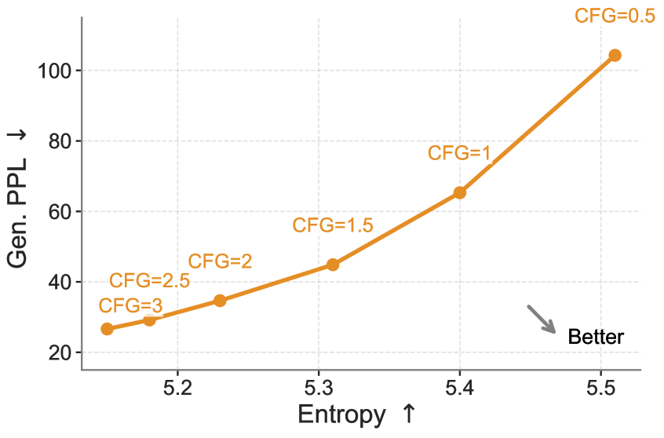
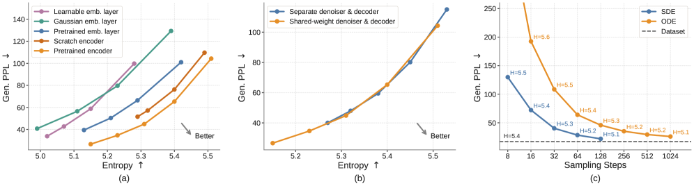
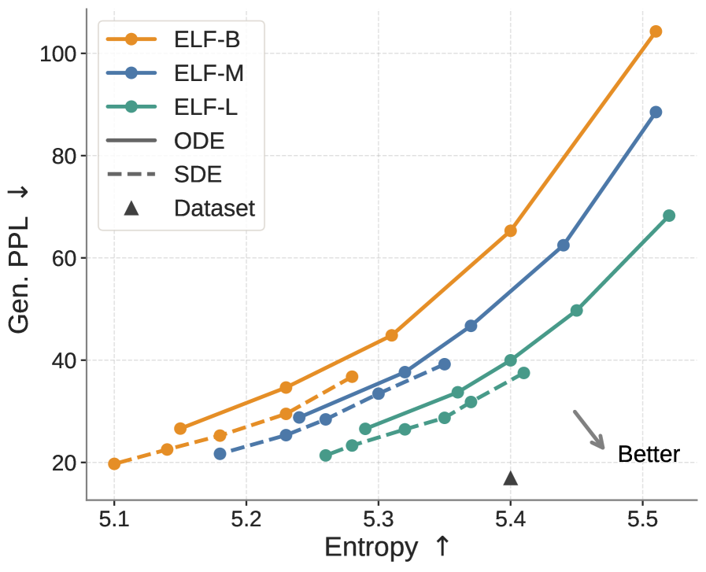
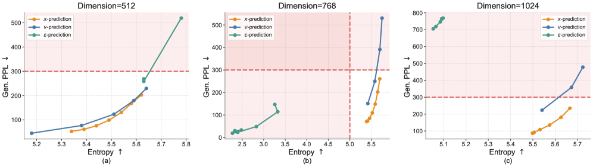
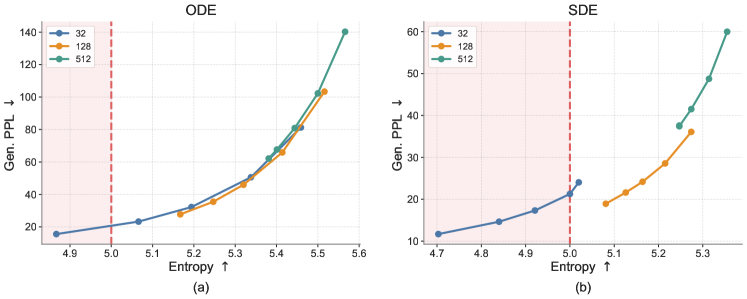

# 무엇이 ELF를 작동시키는가 — CFG·임베딩·샘플러 ablation

> 원본: [arxiv.org/abs/2605.10938](https://arxiv.org/abs/2605.10938)

이 편의 목표는 분명하다. 앞의 3편까지에서 ELF가 어떤 모델인지를 봤다면, 여기서는 "이 모델의 어떤 부품이 실제로 성능을 만들고 있는가" 를 ablation으로 확인한다. ELF 논문 4.1 절은 다섯 가지 결정 — CFG scale, 임베딩 종류, 디코딩 전략, 샘플러, 모델 크기 — 을 흔든다. 부록 C는 여기에 prediction target과 bottleneck dimension까지 더한다. 결론을 먼저 말하면, $x_1$-prediction, contextual embedding, shared-weight decoding, SDE 샘플러 이 넷은 결정적이고, 나머지(예: optimizer, time schedule)는 부차적이다.

## 평가 프로토콜: 한 점이 아니라 한 곡선으로 비교한다

ablation 결과를 읽기 전에 평가 방식부터 정리해야 한다. ELF는 모든 비교를 단일 숫자가 아니라 **trade-off 곡선**으로 한다. 두 축은 다음과 같다.

- $x$-축: average unigram entropy. 샘플들의 토큰 분포가 얼마나 다양한지. 높을수록 다양성이 좋다.
- $y$-축: generative perplexity (Gen PPL). GPT-2 Large가 ELF 생성문을 평가한 perplexity. 낮을수록 자연어 같다.

좋은 모델은 두 축에서 동시에 유리한 쪽 — **우하단 (high entropy, low PPL)** — 으로 곡선이 밀려 있어야 한다.

곡선을 그리는 방법은 단순하다. **CFG scale을 sweep한다**. 각 점은 특정 CFG scale에서 1000개 샘플을 뽑아 (Gen PPL, entropy)를 잰 결과다. CFG가 곧 quality-diversity 다이얼이므로, CFG를 돌리는 행위 자체가 한 모델의 trade-off frontier를 그리게 된다. 이렇게 하면 모델 A가 모델 B보다 단순히 "PPL이 낮다"는 식의 비교가 아니라, **같은 entropy에서 더 낮은 PPL인지** 또는 **같은 PPL에서 더 높은 entropy인지** 를 보게 된다.

ablation 기본 설정은 다음으로 고정한다.

- 모델: ELF-B (105M)
- 학습: OWT 5 epoch (~95K step), Muon, batch 512
- 샘플러: 별도 명시 없으면 64-step ODE Euler
- 평가: 1000샘플, GPT-2 Large 기반 Gen PPL + unigram entropy

부록 C는 entropy < 5.0 (반복문) 또는 Gen PPL > 300 (문법 깨진 문장) 영역을 붉게 칠해 "여기는 사실상 망가진 생성" 으로 표시한다. 이 영역에 들어가지 않으면서 우하단으로 곡선이 밀리는 모델이 좋은 모델이다.

## CFG scale: quality와 diversity의 다이얼

가장 먼저 흔드는 것이 CFG scale $w$ 자체다. ELF는 self-conditioning에서 얻은 중간 예측 $\tilde{x}_1$을 condition으로 쓰고, 학습 시 50% 확률로 null condition을 섞어 conditional/unconditional 두 velocity를 한 forward pass로 모델링한다. inference에서 CFG는

$$
v_{\text{CFG}} = v_\theta(\cdot \mid \tilde{x}_1) + w \cdot (v_\theta(\cdot \mid \tilde{x}_1) - v_\theta(\cdot \mid \emptyset))
$$

로 합성된다 (정확한 형식은 training-time CFG라 살짝 다르지만, 동일하게 scale $w$ 하나가 강도를 조절한다).

*Fig 4. CFG scale을 0.5에서 3까지 sweep한 trade-off 곡선. CFG=1이 거의 "전환점" 으로, 이 이상에서는 PPL이 빠르게 떨어지지만 entropy도 같이 내려간다. 우하단으로 갈수록 좋다.*

읽는 법은 두 가지다.

- **PPL 절대값**: CFG=0.5에서 Gen PPL ≈ 105이고, CFG=3에서 ≈ 27까지 내려간다. 거의 4배 차이.
- **diversity 비용**: 같은 구간에서 entropy는 5.51 → 5.15로 약 0.36 만큼 내려간다. unigram entropy가 0.3 정도 빠지면 다양성이 눈에 띄게 줄어든다는 의미다.

이 trade-off는 image diffusion의 CFG와 같은 패턴이다. 차이라면 ELF는 class label 없이 self-conditioning만으로 이 다이얼을 갖는다는 점, 그리고 discrete DLM에서는 CFG 자체가 잘 작동하지 않는다는 점이다. 즉 CFG는 ELF가 "continuous로 갔기 때문에 공짜로 따라오는" 성능 레버다.

남은 ablation은 모두 CFG sweep으로 곡선을 그리고 그 곡선의 위치를 비교한다.

## 임베딩 선택: pretrained contextual이 best, learnable이 worst

ELF는 continuous embedding 위에서 denoising하므로, "어떤 embedding이냐"가 가장 직접적인 디자인 결정이다. 논문은 두 축으로 ablation한다.

| 축 | 선택지 |
|---|---|
| contextual vs non-contextual | encoder 통과 vs 단일 embedding layer |
| fixed vs learnable | freeze vs 같이 학습 |

구체적으로 다섯 변형을 본다.

- **T5 pretrained (contextual, fixed)** — 기본 설정. 미리 학습된 T5-small encoder를 freeze.
- **T5 from-scratch on OWT (contextual, fixed)** — 같은 T5 objective를 OWT로 처음부터 학습한 encoder를 freeze.
- **T5 token embedding (non-contextual, fixed)** — pretrained T5의 token embedding matrix만 떼서 사용.
- **frozen Gaussian (non-contextual, fixed)** — Gaussian random vector를 freeze해서 token embedding으로 사용.
- **learnable (non-contextual, learnable)** — embedding과 denoiser를 같이 학습.

*Fig 5. (a) 임베딩 종류: pretrained contextual이 곡선을 가장 좌하단으로 민다. learnable은 가장 위. (b) 디코딩 전략: shared-weight가 곡선의 low-PPL 쪽으로 더 멀리 뻗는다. (c) 샘플러: SDE가 같은 step에서 ODE보다 압도적으로 낮은 PPL.*

Fig 5a의 곡선 순위가 이 ablation의 핵심이다.

1. **T5 pretrained contextual** — best frontier.
2. **T5 from-scratch on OWT** — pretrained보다 조금 뒤지지만 비슷한 형태.
3. **T5 token embedding** — non-contextual 중 가장 좋음.
4. **frozen Gaussian** — 정보 없는 random vector라도 학습 가능, 하지만 위 그룹들보다 뒤.
5. **learnable** — worst. 곡선이 명백히 위쪽으로 들려 있음.

해석은 두 가지.

- **contextual > non-contextual.** denoiser가 보는 representation에 이미 문맥이 들어 있어야 학습이 쉽다. 토큰 단위 random vector를 noise에서 복원하라는 건 결국 denoiser가 언어 모델 + 임베딩을 동시에 배우라는 요구가 된다.
- **learnable < frozen.** denoiser와 embedding을 같이 학습하면 두 목적이 서로를 흔든다. embedding이 변하면 denoising target도 같이 움직이므로 최적화가 어렵다는 가설. ELF는 embedding을 단순히 freeze해버려서 이 문제를 우회한다.

실무적으로 중요한 함의는, ELF는 LDM처럼 "잘 학습된 encoder"가 별도로 필요하다는 점이다. 다만 디코더는 필요 없으니 (다음 절), encoder/decoder를 같이 학습하는 LDM보다 부담은 적다.

## 디코딩 전략: shared-weight 1-stage가 더 멀리 뻗는다

ELF의 결정적 디자인 중 하나는 **denoiser와 decoder가 같은 네트워크** 라는 점이다. mode token $m \in \{\text{denoise}, \text{decode}\}$으로 두 모드를 토글한다. 이걸 두 단계로 풀어버리는 대안과 비교한다.

- **shared-weight (default)** — 하나의 네트워크가 MSE loss(80%) + CE loss(20%)를 같이 학습. inference에서 마지막 step만 decode 모드.
- **two-stage** — 1단계: frozen T5 encoder 위에서 decoder만 학습 (masked/noisy embedding → token, CE). 2단계: encoder/decoder freeze하고 denoiser만 학습 (MSE).

Fig 5b를 보면 두 trade-off 곡선이 거의 겹친다. mid-entropy 영역에서는 두 곡선이 사실상 동일. 차이는 곡선의 끝점에서 난다.

- shared-weight 곡선이 **low PPL 영역으로 더 멀리 뻗는다**. CFG를 강하게 걸어 우하단을 끝까지 밀어붙일 때 shared-weight 쪽이 더 낮은 PPL에 도달.
- two-stage는 같은 영역에 도달하기 어렵다.

표면적 차이는 작아 보이지만 함의는 크다.

- 파이프라인이 1-stage로 단순해진다. encoder만 외부 의존이고, 그 뒤로는 denoiser=decoder=한 모델.
- inference 시 별도 decoder module이 필요 없다. 마지막 step만 다른 mode로 forward.
- LDM이 reconstruction loss를 decoder에 따로 거는 것과 달리, ELF는 denoising/decoding을 한 객체로 묶어 더 좋은 representation을 공유한다는 가설.

저자들은 trade-off가 비슷하다고 솔직하게 말하지만, "어차피 비슷하면 단순한 쪽" 이라는 실무 기준에서 shared-weight가 이긴다.

## 샘플러: SDE가 few-step에서 ODE를 크게 앞선다

Flow Matching은 deterministic ODE로 푸는 게 표준이다. ELF는 여기에 SDE-inspired 변형을 같이 지원한다 — 한 step마다 작은 noise를 다시 주입하고, time variable을 그만큼 noise 쪽으로 약간 밀어준다 ($r=0.5$가 default scale).

Fig 5c의 그림이 ablation 전체에서 가장 인상적이다. $x$-축은 sampling step 수 (16, 32, 64, 128, ...), $y$-축은 Gen PPL.

- ODE: step이 적을수록 Gen PPL이 크게 치솟는다. 16 step 근처에서는 거의 사용 불가 수준.
- SDE: same step 수에서 ODE보다 **확연히 낮은** Gen PPL. 특히 few-step regime (~16~32 step)에서 차이가 크다.
- step이 충분히 많아지면 (~128 step) 두 곡선이 가까워진다.

논문이 제시하는 해석은 **에러 누적 완화** 이다. ODE는 deterministic이라 한 step에서 발생한 작은 prediction error가 그대로 다음 trajectory를 비틀어 누적된다. SDE는 매 step 작은 noise를 다시 넣으므로, 잘못 그려진 trajectory가 그 자리에 묶이지 않고 분포로 흩어진다. 다시 말해 noise가 일종의 **자기교정 메커니즘** 으로 작동한다.

이게 왜 중요한가. 32-step에서 Gen PPL 24를 찍은 ELF의 최종 결과(다음 편에서 다룸)는 곧 SDE 샘플러의 효과다. ODE만 썼다면 16~32 step regime에서 ELF는 discrete DLM 대비 큰 우위를 못 보였을 가능성이 높다.

## 모델 스케일: ELF-B / M / L 모두 같은 패턴

ELF는 세 사이즈로 학습된다.

| 모델 | depth | hidden | heads | params | OWT epoch |
|---|---|---|---|---|---|
| ELF-B | 12 | 768 | 12 | 105M | 5 |
| ELF-M | 24 | 1056 | 16 | 342M | 4 |
| ELF-L | 32 | 1280 | 16 | 652M | 3 |

세 모델 각각에 ODE/SDE 두 샘플러를 돌려 trade-off 곡선을 그린다.

*Fig 6. 모델 크기와 샘플러를 같이 sweep한 결과. 점선이 ODE, 실선이 SDE. ELF-L SDE가 우하단을 가장 멀리 점령. 삼각형은 dataset (ground-truth) 위치 — 큰 모델일수록 dataset에 가까워진다.*

읽어야 할 패턴은 셋이다.

- **동일 entropy에서 큰 모델 → 낮은 PPL.** ELF-B → ELF-L로 가면 entropy 5.3 부근에서 Gen PPL이 거의 절반 가까이 떨어진다. 다양성을 희생하지 않고 품질이 올라간다는 의미.
- **동일 PPL에서 큰 모델 → 높은 entropy.** 반대 방향 읽기로도 같은 결론.
- **SDE 효과는 사이즈에 무관하게 일정.** 모든 모델에서 SDE 곡선이 ODE 곡선보다 좌하단. 두 레버 — 스케일과 샘플러 — 가 독립적으로 더해진다.

요점은 scaling이 깨지지 않는다는 것이다. 어떤 새 아키텍처들은 작은 사이즈에서만 잘 작동하다 큰 사이즈에서 무너지곤 하는데, ELF는 105M→652M까지 frontier가 일관되게 우하단으로 밀린다. 다음 편에서 보겠지만, ELF-B 단독으로도 system-level 비교에서 이기기 때문에, ELF-L의 frontier는 그보다 한참 더 아래에 있다.

## 부록의 보너스: prediction target과 bottleneck

부록 C에서 두 가지만 짚는다.

### Prediction target — $x_1$만 1024-d에서 살아남는다

Flow Matching에서 네트워크는 $x_1$ (clean embedding), $\epsilon$ (noise), $v$ (velocity) 중 하나를 예측하도록 학습할 수 있다 (셋은 linear interpolation $x_t = (1-t) \epsilon + t \cdot x_1$과 $v = x_1 - \epsilon$으로 묶여 있어서 상호 변환 가능).

*Fig 10. 세 패널은 각각 embedding dim 512, 768, 1024. 붉은 영역은 entropy<5 또는 PPL>300의 "망가진 생성" 구간. $x_1$-prediction(파란색)만 1024-d에서도 붉은 영역을 피해 살아남는다.*

- **$x_1$-prediction (default)** — 512/768/1024 어디서나 안정. trade-off 곡선이 일관된 형태.
- **$\epsilon$-prediction** — 512에서는 경쟁력 있지만 768, 1024로 가면 곡선이 위로 들리며 PPL이 크게 악화.
- **$v$-prediction** — 모든 차원에서 무너진다. 곡선이 붉은 영역에 잠겨, 반복적이거나 비문인 출력 위주.

해석은 **manifold 가설** 이다. 자연어 임베딩은 고차원 공간 안의 저차원 manifold 위에 놓여 있고, clean한 점 $x_1$ 자체를 예측하는 게 이 구조와 가장 잘 맞는다. noise나 velocity는 어디서나 분포돼 있는 양이라 high-dim에서 학습 신호가 분산된다는 설명.

또 한 가지 실용적 이유는 weight sharing이다. ELF는 마지막 step에서 같은 네트워크가 clean token까지 뽑아야 하는데, "clean embedding" 을 직접 출력하는 $x_1$-prediction은 그 다음 단계(unembedding → token)에 자연스럽게 이어진다. $\epsilon$ 또는 $v$로 학습한 모델은 weight sharing 자체가 잘 안 된다고 저자들은 보고한다.

### Bottleneck dimension — 128이 best balance

ELF는 T5-small encoder의 512-d embedding을 곧장 모델 hidden(768)으로 쓰지 않고, 그 사이에 **저차원 bottleneck** (default 128)을 끼운다. embedding → 128-d → 768-d.

*Fig 11. 왼쪽 ODE, 오른쪽 SDE. 32(파랑), 128(주황), 512(초록). 32는 PPL 최저지만 entropy 5 미만 영역에 자주 빠진다. 512는 entropy는 유지하지만 PPL이 크게 올라간다. 128이 두 축의 trade-off frontier에서 가장 균형.*

- **32-d**: PPL은 가장 낮지만 entropy<5 (반복문 영역)에 자주 빠진다. SDE에서 12까지 낮은 PPL을 찍지만 다양성이 죽어 있다.
- **128-d**: 두 축 모두 reasonable. SDE에서 entropy 5.0~5.3 구간을 PPL 20~40대로 커버. ELF가 default로 쓰는 값.
- **512-d**: entropy는 유지되지만 SDE에서 PPL이 40~60대로 올라간다. denoising 공간이 너무 넓어 학습이 어렵다는 신호.

manifold 가설과 일관된다. 텍스트의 진짜 차원은 임베딩 차원보다 한참 낮을 것이므로, denoising을 너무 고차원에서 하면 학습이 비효율적이다.

## 정리: 결정적 4가지

ablation 결과를 한 줄로 요약하면 다음 네 가지가 ELF를 만든다.

| 결정 | 선택 | 효과 |
|---|---|---|
| prediction target | $x_1$-prediction | 1024-d까지 안정, weight sharing 가능 |
| embedding | pretrained contextual (T5) | trade-off 곡선이 가장 우하단 |
| decoding | shared-weight 1-stage | low-PPL 영역으로 더 멀리 뻗고 파이프라인 단순 |
| sampler | SDE-inspired | few-step regime에서 PPL 크게 낮춤 |

부차적인 결정들 — bottleneck=128, denoising mode prob=0.8, in-context conditioning, Muon optimizer, logit-normal time schedule — 도 곡선을 조금씩 더 좌하단으로 밀어주지만, 위 네 결정만큼 결정적이지는 않다. 저자들도 부록 C.5에서 "Muon이 AdamW보다 좋지만 두 optimizer 모두 baseline을 이긴다" 고 명시한다. ELF의 성능은 specific optimizer가 아니라 위 네 가지 모델링 결정의 합으로 만들어진다.

이 네 결정이 합쳐지면 어떤 시스템이 되는지, 그리고 ELF-B가 32 step만으로 어떻게 Gen PPL 24를 찍어 기존 discrete/continuous DLM을 모두 이기는지는 다음 편에서 본다.

다음 편: [32 스텝으로 GenPPL 24 — 시스템 비교와 의미](05-evaluation-and-implications.md)

## 출처

- [Embedded Language Flows (arxiv.org/abs/2605.10938)](https://arxiv.org/abs/2605.10938)
