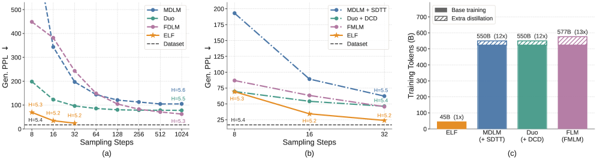
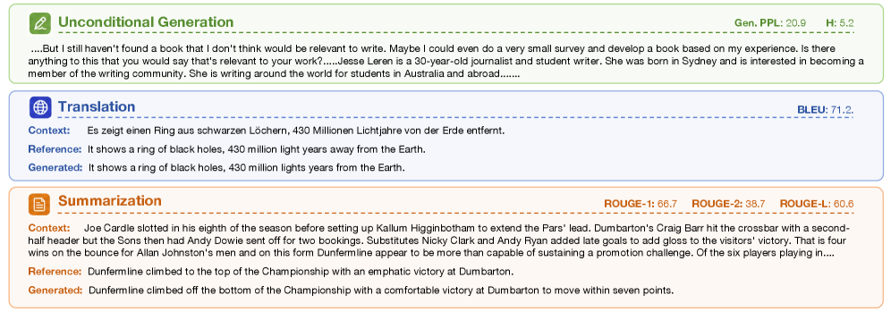
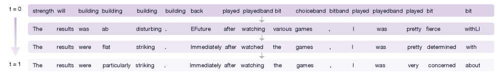

# 32 스텝으로 GenPPL 24 — 시스템 비교와 의미

> 원본: [arxiv.org/abs/2605.10938](https://arxiv.org/abs/2605.10938)

직전 편까지는 ELF 내부의 설계 선택지를 골라내는 ablation 위주였다. 마지막 편에서는 그렇게 추려낸 한 가지 구성이 외부 베이스라인과 붙었을 때 어떤 결과를 만드는지 본다. 그리고 이 결과가 continuous diffusion language model (DLM) 진영에 무엇을 의미하는지, 어디서 멈춰 있는지를 정리한다.

## Unconditional 시스템 비교

ELF-B는 105M parameter다. 비교 대상은 두 그룹으로 나뉜다.

- **연속 DLM**: LangFlow (~170M), FLM (~170M) 등. ELF처럼 continuous space에서 denoising하는 계열.
- **디스크리트 DLM**: MDLM, Duo. 토큰을 직접 mask/unmask하며 생성하는 계열이고, 보통 sampling step을 키워야 품질이 나온다.

세 패널로 구성된 Fig. 7이 핵심이다.

*Fig 7. (a) sampling step 수에 따른 Gen PPL — ELF의 곡선이 모든 step 영역에서 가장 아래에 있다. (b) MDLM+SDTT, Duo+DCD, FMLM 같은 distillation 후처리 모델들과 ELF를 비교 — distillation 없이도 few-step regime에서 우위. (c) effective training token 수 막대그래프 — ELF는 45B, 비교 모델들은 500B 이상.*

### few-step regime에서의 우위

best config는 다음과 같다. SDE sampler + self-conditioning CFG scale $s = 3$ + logit-normal time schedule. 그리고 8/16 step의 매우 짧은 step 영역에서는 noise re-injection scale $\eta = 0.5$로 stochasticity를 더 부어 주고, 32 step에서는 $\eta = 0.3$으로 낮춘다. trajectory가 길어지면 SDE의 보정 효과가 덜 필요하다는 뜻이다.

부록 D.4의 Tab. 6 기준, ELF-B의 평균 수치는 다음 정도다.

| Sampling steps | self-cond CFG | Gen PPL | Entropy |
|---|---|---|---|
| 8 | 3 | 약 40 대 | 약 5.3 |
| 16 | 3 | 약 30 대 | 약 5.2 |
| 32 | 3 | 약 24 | 약 5.1 |

32 step에서 Gen PPL 24라는 숫자가 의미가 있는 이유는, 같은 step 수에서 디스크리트 DLM들은 보통 50~80 사이에 머무르고, distillation을 거친 MDLM+SDTT나 Duo+DCD조차 ELF의 곡선보다 위에 위치한다는 점 때문이다. 즉, 다음 두 가지가 한꺼번에 깨졌다.

- "few-step diffusion text 생성은 distillation으로만 가능하다"는 가정
- "continuous DLM은 디스크리트 DLM에 비해 본질적으로 품질이 떨어진다"는 가정

ELF는 distillation 없이, base training만으로 이 영역에 들어왔다.

### training token 효율

Fig. 7c가 사실 가장 충격적인 패널이다. OWT (OpenWebText) 약 $9.04\text{B}$ 토큰을 5 epoch 학습했으므로 ELF-B의 effective training token은 $9.04 \times 5 \approx 45.2\text{B}$다. 같은 그림에 표시된 비교 모델들은 대체로 $500\text{B}$ 이상을 본다. 약 한 자릿수 차이다.

| Method | Effective tokens | ELF 대비 비율 |
|---|---|---|
| ELF-B | 45.2B | $1\times$ |
| MDLM | 500B+ | 약 $11\times$ |
| Duo + DCD | 500B+ distill 추가 | 약 $11\times$ 이상 |
| FMLM | 500B+ flow-map 추가 | 약 $11\times$ 이상 |

학습 효율에서의 이 격차는 인프라 관점에서도 의미가 있다. 동일 결과를 더 적은 compute로 얻을 수 있다는 것은 단순히 비용 문제가 아니라, 후속 연구가 같은 규모로 재현하기 쉬워진다는 뜻이다. ELF-B 학습이 TPU v5p 64에서 epoch당 1.5h, 총 약 7.5h 정도로 끝났다는 부록 D.2의 수치도 같은 맥락이다.

## Conditional: 번역과 요약

unconditional generation이 base 능력의 척도라면, conditional generation은 그 base가 실제 task에 어떻게 옮겨지는지를 보여준다. 저자들은 두 가지 표준 벤치마크를 골랐다.

- **WMT14 De-En** 기계 번역. BLEU로 평가.
- **XSum** 추출형/추상형 요약. ROUGE-1 / ROUGE-2 / ROUGE-L로 평가.

inference setting은 unconditional과 약간 다르다. 64-step ODE sampler + logit-normal time schedule, self-conditioning CFG scale $s_\text{self} = 1$, 그리고 입력 조건에 대한 CFG scale $s_\text{cond} = 2$. 부록 C.7에서 confirmed된 sweet spot이다.

### WMT14 De-En

| Method | Sampling | BLEU |
|---|---|---|
| AR baseline (Qwen3-0.6B 기반) | greedy | 25.2 |
| SeqDiffuSeq | – | 18.x 수준 |
| CDCD | – | 19.x 수준 |
| MDLM (재현) | predict_and_noise | 24 대 |
| E2D2 | predict_and_noise | 24 대 후반 |
| Duo (cross-attn + CFG 추가) | Duo sampler 1000 | 25 대 |
| **ELF-B** | 64-step ODE | **26.4** |

ELF-B가 AR baseline을 약 $+1.2$ BLEU로 앞선다. 그리고 비교된 모든 디스크리트 DLM, 그리고 SeqDiffuSeq / CDCD 같은 기존 연속 DLM도 outperform한다. 디스크리트 DLM 중 가장 강한 재현이었던 E2D2와 Duo도 ELF보다 낮다.

### XSum

요약은 일반적으로 입력이 길고 출력이 짧아서, CFG의 영향이 번역보다 더 두드러진다.

| Method | ROUGE-1 | ROUGE-2 | ROUGE-L |
|---|---|---|---|
| AR baseline | 약 30 | 약 10 | 약 24 |
| MDLM (semi-AR, block 32) | 30 대 후반 | 12 대 | 25 대 |
| E2D2 | 30 대 후반 | 12 대 | 25 대 후반 |
| Duo | 31~32 | 11~12 | 25 대 |
| **ELF-B** | **best** | **best** | **best** |

ROUGE-1 / ROUGE-2 / ROUGE-L 세 지표에서 모두 ELF가 최고를 차지한다. 본문에서 강조되는 부분은 ELF가 *autoregressive decoder 없이* 이 결과를 냈다는 점이다. 다른 latent diffusion LM들이 보통 별도의 AR 디코더를 잠재 공간 뒤에 두는 것과 대조된다.

### 한 줄로 정리

ELF의 디자인 — frozen contextual embedding space + 공유 weight denoiser/decoder + training-time CFG + SDE sampler — 가 unconditional 뿐만 아니라 input-conditional 영역에서도 그대로 작동한다. 즉, "task에 맞춰 별도 파이프라인을 다시 짤 필요가 없다"는 점이 실용적으로는 가장 큰 셀링 포인트일 수 있다.

## Qualitative: 어떻게 생성되는가

수치 외에 trajectory 자체를 본 그림이 두 개 있다.

*Fig 8. unconditional / 번역 / 요약 세 도메인에서의 ELF 샘플. 본문에 강조된 문구는 source와 정확히 매칭되는 부분이다.*

*Fig 17. denoising trajectory 시각화 — "strength will building building building..." 같은 반복 상태가 단계별로 "The results were particularly striking. Immediately after watching the games, I was very concerned about..."에 가까운 문장으로 수렴한다.*

여기서 흥미로운 관찰 두 가지.

- 초기 ($t \approx 0$) 의 상태가 "랜덤"이 아니다. 같은 토큰이 반복되는 degenerate한 분포다. continuous embedding space에서의 Gaussian noise가 unembedding을 거치면 가장 가까운 *고빈도 단일 토큰* 으로 매핑되기 때문으로 보인다.
- 중간 단계 ($t$ 중간값) 에서 phrase 단위로 의미가 먼저 잡히고, 그 다음에 word choice가 정제된다. AR 모델이 토큰 단위로 좌→우 commitment하는 것과 대비된다.

이 trajectory는 ELF가 단순히 "최종 결과만 좋은" 모델이 아니라, denoising step 자체가 의미 있는 점진적 refinement임을 보여준다. 그래서 step 수를 늘리면 품질이 더 올라가는 것이 이상하지 않다.

## 결론과 한계

저자들의 결론을 그대로 요약하면 다음과 같다.

- continuous DLM이 디스크리트 DLM보다 본질적으로 약하다는 통념은 사실이 아니다.
- frozen contextual embedding을 state로 쓰는 것 + 공유 weight denoiser-decoder + training-time CFG + SDE sampler의 조합이 핵심이다.
- distillation 없이 base training만으로 few-step regime에서 최고 성능, conditional task에서도 sota급.

그러나 짚어야 할 한계도 명확하다.

### 측정 측면

- **Likelihood 평가가 없다.** 부록 footnote 2가 명시한다 — continuous DLM에서 정확한 likelihood를 평가하려면 별도 distillation이 필요한 경우가 많고, ELF도 이 점을 회피한다. 즉, "perplexity" 계열의 직접 비교는 같은 토큰화 위에서 측정되지 않은 부분이 있다. unconditional 평가에 사용되는 것은 *Gen PPL* (GPT-2 large로 ELF 출력을 다시 채점한 값) 으로, internal LM의 likelihood가 아니다.

### 스케일 측면

- **검증된 최대 크기가 652M (ELF-L) 이다.** Llama-3 8B나 더 큰 모델 규모에서 같은 디자인이 그대로 작동하는지는 미검증이다. 특히 frozen T5-small encoder가 hidden dim 512인데, 모델이 커지면 이 encoder가 병목이 될 가능성은 본문이 직접 다루지 않는다.

### Encoder 의존

- **T5-small encoder에 강하게 의존한다.** ablation에서 scratch encoder, learnable embedding, Gaussian embedding 모두 시도했지만 frozen T5-small가 가장 안정적이었다 (편 04 참고). 즉, ELF의 강점이 어디까지 ELF 자체의 contribution이고 어디까지가 T5의 contextual representation에서 오는지는 분리되어 있지 않다.

### Non-English 평가 없음

- 평가 데이터셋은 OpenWebText (영어), WMT14 De-En (독영 번역), XSum (영어 요약) 으로 모두 영어 중심이다. 한국어처럼 형태소가 풍부하거나 tokenizer가 sub-word 단위로 더 잘게 쪼개지는 언어에서 같은 trajectory가 형성될지는 검증이 없다.

### Latency

- 32 step Gen PPL 24가 인상적이지만, *wall-clock latency* 와 *autoregressive 대비 throughput* 의 직접 비교가 본문에 없다. AR은 KV cache가 있고, 32-token 입력 + 1024-token 생성이면 1024 forward pass를 거치되 각 step이 매우 가볍다. ELF는 step 수가 32이지만 매 step이 1024-token 전체에 대한 bidirectional self-attention forward다. step 수가 줄어도 step당 cost가 다른 차원이라는 것은 별도로 측정되어야 한다.

저자들이 자신 있게 주장하는 것은 *step 수* 와 *training token* 의 효율이지, *latency* 그 자체는 아니라는 점을 분리해 읽어야 한다.

## 편집자 메모

마지막으로 짧게 정리.

- **"continuous DLM은 안 된다"가 아니라 디자인의 문제였다.** 이 메시지가 가장 크다. embedding space를 어디서 가져오는지, 어디서 discretize하는지, 어떤 prediction target을 쓰는지에 따라 결과가 한 자릿수 단위로 달라진다. 즉, 이 영역의 디자인 공간은 닫혀 있지 않다.
- **이미지 도메인의 Flow Matching 발전과 합류 가능성.** SD3, Wan 등 이미지·비디오 쪽에서 Flow Matching이 standard로 자리 잡는 동안 텍스트는 디스크리트 DLM이 주류였다. ELF는 이 두 흐름이 같은 수학으로 묶일 수 있다는 점을 보여 준다. 같은 ODE/SDE sampler 인프라, 같은 CFG 패턴, 같은 logit-normal time schedule을 텍스트에도 가져다 쓸 수 있다.
- **다음에 볼 만한 후속 질문 세 가지.**
  - *더 강한 pretrained encoder.* T5-small 대신 LLM 백본 (Llama-3 8B, Qwen3 7B) 의 contextual embedding을 frozen state로 두면? hidden dim이 4096 이상으로 늘어날 때 bottleneck $d_\text{bn} = 128$이 여전히 최적일까?
  - *Few-step distillation 추가.* 본문은 distillation 없이 32 step에서 Gen PPL 24를 찍었다. SDTT나 DCD 같은 step-distillation을 ELF 위에 한 번 더 얹으면 8 step에서 어디까지 내려갈까?
  - *Sequence-level CFG 일반화.* 현재 CFG는 self-conditioning과 input-conditioning 두 채널만 다룬다. 하지만 in-context conditioning은 임의 control token을 받을 수 있으므로, length / style / persona / format 등 더 많은 채널의 CFG를 학습시키는 일반화가 자연스럽다.

종합하면, ELF는 "continuous DLM의 부활 가능성" 보다는, *Flow Matching이라는 통일된 도구로 텍스트를 다시 보자* 는 제안에 가깝다. 그 제안의 첫 데이터 포인트가 32 step에서 Gen PPL 24, WMT14 De-En BLEU 26.4, XSum ROUGE 전 지표 best라는 형태로 찍혔다. 다음 데이터 포인트는 더 큰 encoder, 더 큰 모델, 더 많은 언어에서 나올 것이다.

## 출처

- 원문: [arxiv.org/abs/2605.10938](https://arxiv.org/abs/2605.10938)
- HTML 버전: [arxiv.org/html/2605.10938v1](https://arxiv.org/html/2605.10938v1)

시리즈를 처음부터 다시 보기: [01편](01-overview-and-context.md)
