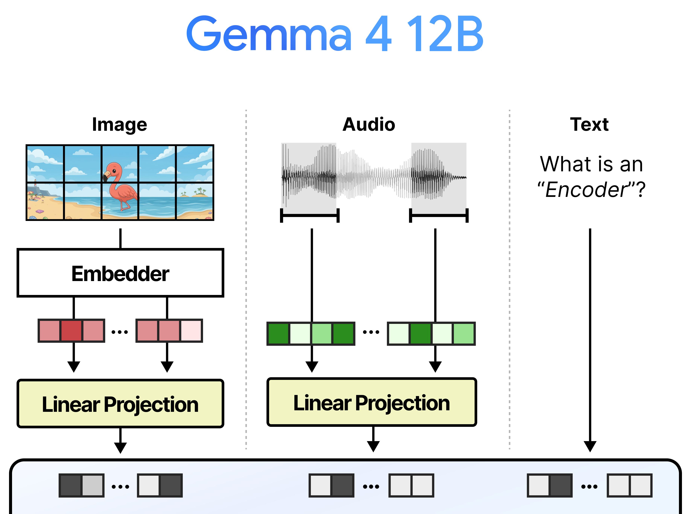
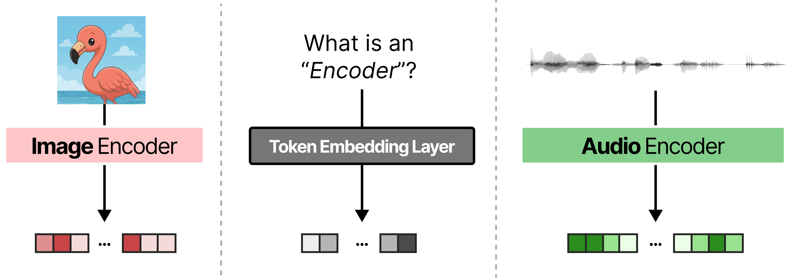
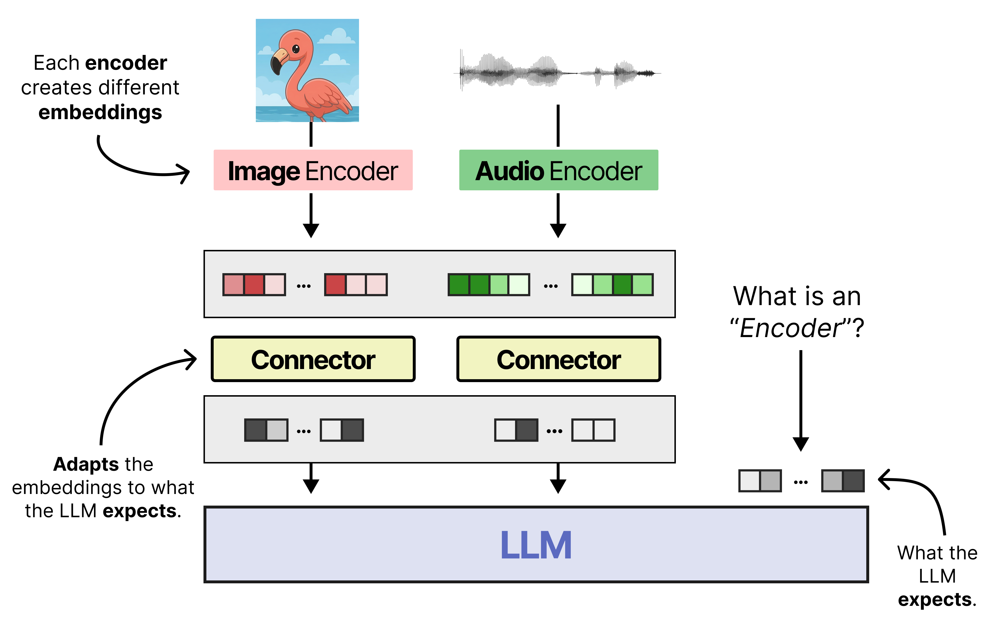

# 멀티모달 LLM은 왜 encoder와 connector를 따로 두었나

> 원본: [Exploring Language Models](https://newsletter.maartengrootendorst.com/p/a-visual-guide-to-gemma-4-12b)

Gemma 4 12B의 핵심 메시지는 "encoder-free"다. 처음 들으면 조금 이상하다. 최근 생성형 LLM은 대체로 decoder-only 구조인데, 여기서 말하는 encoder는 텍스트를 생성하는 LLM 본체의 encoder가 아니라 이미지와 오디오를 먼저 해석하던 별도 모듈을 가리킨다.

이 편은 Gemma 4 12B의 새 구조로 바로 들어가지 않는다. 먼저 기존 멀티모달 LLM이 왜 텍스트와 비텍스트 입력을 다르게 다루었는지, 왜 이미지와 오디오에는 encoder가 붙었고, 왜 encoder 뒤에 connector가 한 번 더 필요했는지 정리한다. 이 배경을 잡아야 다음 편에서 Gemma 4의 vision/audio encoder가 무슨 일을 했는지, 그 다음 편에서 Gemma 4 12B가 무엇을 없앴는지 선명하게 보인다.

## 한 장으로 보는 문제 설정

*Fig 1. Gemma 4 12B의 encoder-free 개요. 이미지는 embedder, 오디오는 projection을 거쳐 Gemma 4 12B로 들어가고, 텍스트는 그대로 LLM 입력 시퀀스에 합류한다. 질문은 "encoder가 무엇이었고, 왜 없앨 수 있었나"로 모인다.*

원문의 도입부는 새 모델의 크기보다 구조 변화에 초점을 둔다. Gemma 4 계열에는 E4B와 26B A4B 사이의 빈 공간이 있었고, 12B 모델은 그 중간을 채운다. 하지만 이 글에서 더 중요한 점은 크기 배치가 아니라, 이미지와 오디오 이해를 위해 쓰이던 encoder를 제거했다는 점이다.

"제거"라는 표현은 단순한 경량화로만 읽으면 부족하다. 기존 구조에서는 이미지와 오디오가 LLM에 들어가기 전에 먼저 별도 transformer 계열 encoder를 통과했다. 이 encoder가 입력을 해석해 어느 정도 의미 있는 embedding을 만들고, connector가 그 embedding을 LLM이 받을 수 있는 차원으로 맞춘 뒤에야 LLM 본체가 일을 시작했다.

Gemma 4 12B의 도전은 이 순서를 바꾸는 데 있다. 비텍스트 입력을 깊은 encoder가 먼저 처리하지 않고, 더 얕은 embedding/projection 단계만 거쳐 LLM 안으로 일찍 보낸다. 따라서 "encoder-free"는 아무 전처리도 없다는 뜻이 아니다. 비텍스트 modality를 LLM이 직접 더 많이 처리하도록 역할을 재분배했다는 뜻에 가깝다.

## 텍스트는 왜 상대적으로 단순한가

텍스트 입력은 LLM의 원래 전공이다. 문장 `"What is an Encoder?"`가 들어오면 tokenizer가 문자열을 token으로 나누고, LLM의 token embedding layer가 각 token id를 vector로 바꾼다. 그 뒤 decoder layer의 attention과 MLP가 token embedding들을 문맥적으로 갱신한다.

이 과정에서 중요한 점은 token embedding layer가 LLM 내부에 있다는 것이다. 텍스트는 애초에 LLM이 학습한 공간으로 들어간다. 입력 단위도 token이고, embedding 차원도 LLM이 기대하는 크기이며, sequence로 나열되는 방식도 LLM의 positional encoding과 맞다.

텍스트 경로를 단순화하면 다음과 같다.

| 단계 | 역할 | 별도 encoder 필요 여부 |
|---|---|---|
| Tokenization | 문자열을 token id로 변환 | 없음 |
| Token embedding | token id를 LLM 입력 vector로 변환 | 없음 |
| Decoder layers | attention으로 문맥 표현 생성 | LLM 본체가 처리 |

여기서 LLM은 입력을 "해석하기 좋은 표현"으로 바꾸는 일과, 그 표현을 바탕으로 다음 token을 예측하는 일을 같은 본체 안에서 처리한다. 텍스트는 이 구조에 자연스럽게 맞는다. 그래서 텍스트만 다루는 LLM에서는 보통 별도 connector라는 말이 등장하지 않는다.

## 이미지와 오디오는 왜 바로 넣기 어려운가

이미지와 오디오는 상황이 다르다. 이미지는 2차원 공간에 놓인 pixel들의 배열이고, 오디오는 시간에 따라 변하는 waveform 또는 feature sequence다. 둘 다 처음부터 LLM의 token embedding과 같은 공간에 있지 않다.

LLM 입장에서 비텍스트 입력은 세 가지 면에서 맞지 않는다.

- **단위가 다르다.** 텍스트는 token이지만 이미지는 patch, 오디오는 시간 chunk나 acoustic feature가 기본 단위다.
- **차원이 다르다.** 이미지 patch나 audio feature의 raw 차원은 LLM embedding dimension과 맞지 않는다.
- **구조가 다르다.** 이미지는 2차원 위치 관계가 중요하고, 오디오는 시간축의 연속성과 주파수/진폭 패턴이 중요하다.

이 차이를 무시하고 raw pixel이나 waveform을 그대로 token embedding처럼 취급하면 LLM은 입력의 물리적 구조를 알기 어렵다. 예를 들어 이미지에서는 왼쪽 위 patch와 오른쪽 아래 patch가 서로 다른 공간 위치를 가진다. 오디오에서는 앞쪽 40ms와 뒤쪽 40ms의 순서가 의미를 만든다. 텍스트 token sequence처럼 일렬로 놓을 수는 있지만, 그 전에 각 modality에 맞는 표현을 만들어야 한다.

이 때문에 기존 멀티모달 LLM은 비텍스트 입력을 LLM 바깥에서 먼저 처리했다. 이미지에는 vision encoder를, 오디오에는 audio encoder를 붙여 modality별로 의미 있는 embedding을 만든다. 그 다음 connector가 그 embedding을 LLM 입력 공간으로 변환한다.

## 기존 멀티모달 입력 파이프라인

*Fig 2. 이미지, 오디오, 텍스트가 LLM으로 들어가는 세 경로. Gemma 4 12B에서는 이미지는 embedder와 linear projection, 오디오는 chunk 단위 projection, 텍스트는 token embedding 경로를 통해 같은 LLM 입력 영역에 놓인다.*

Fig 2는 Gemma 4 12B의 간소화된 경로를 보여주지만, 동시에 멀티모달 LLM이 풀어야 하는 공통 문제도 잘 드러낸다. 최종적으로는 이미지 token, 오디오 token, 텍스트 token이 모두 LLM의 입력 sequence 안에 놓여야 한다. LLM은 이들을 같은 attention 계산 안에서 함께 본다.

여기서 "같은 sequence에 놓인다"는 말은 단순히 이어 붙인다는 뜻이 아니다. 각 입력 vector가 LLM의 hidden size와 맞아야 하고, LLM이 학습 중 보아 온 token embedding과 어느 정도 호환되는 분포를 가져야 한다. 그렇지 않으면 attention score, LayerNorm, residual stream의 동작이 불안정해질 수 있다.

기존 구조에서는 이 호환성을 두 단계로 만들었다.

- **Encoder:** modality 내부 구조를 먼저 처리한다. 이미지 patch 사이의 관계, 오디오 frame 사이의 시간적 관계를 attention 기반 transformer로 섞어 더 풍부한 embedding을 만든다.
- **Connector:** encoder output을 LLM이 기대하는 embedding dimension과 분포로 맞춘다. 보통 linear projection이나 작은 projection module이 이 역할을 한다.

이 분업은 설계상 자연스럽다. 이미지와 오디오를 잘 이해하는 encoder를 따로 학습하거나 가져오고, LLM은 이미 만들어진 visual/audio token을 텍스트 token과 함께 처리하면 된다. 많은 vision-language model과 audio-language model이 이 방식을 택한 이유다.

## Encoder의 역할: modality 안에서 먼저 이해하기

*Fig 3. 이미지 encoder, audio encoder, token embedding layer의 역할 비교. 비텍스트 입력은 별도 encoder가 먼저 embedding을 만들고, 텍스트는 LLM 내부 token embedding layer가 바로 입력 vector를 만든다.*

Encoder는 단순한 차원 변환기가 아니다. 원문은 encoder를 attention 기반의 작은 transformer model로 설명한다. 즉 encoder도 LLM처럼 attention을 사용해 입력 요소들 사이의 관계를 계산한다. 차이는 처리 대상이 language token이 아니라 image patch나 audio feature라는 점이다.

이미지 encoder는 patch들을 받아 각 patch가 주변 patch와 어떤 관계를 갖는지 반영한다. patch 하나만 보면 색과 질감 정도만 알 수 있지만, 여러 patch를 함께 보면 물체의 형태, 경계, 위치 관계가 드러난다. vision encoder는 이런 정보를 embedding 안에 접어 넣는다.

Audio encoder도 비슷하다. waveform이나 spectrogram 계열 feature는 시간에 따라 변한다. 특정 순간의 amplitude만으로는 음소, 단어, 말소리의 경계를 알기 어렵다. audio encoder는 앞뒤 구간을 함께 보면서 더 안정적인 audio token을 만든다.

정리하면 encoder의 핵심 역할은 다음 세 가지다.

| 역할 | 이미지 예시 | 오디오 예시 |
|---|---|---|
| Local feature 추출 | edge, color, texture, small pattern | 짧은 음향 패턴, amplitude 변화 |
| Contextualization | patch 간 위치와 물체 단서 결합 | 앞뒤 frame을 통한 음소/단어 단서 결합 |
| Modality-specific abstraction | raw pixel보다 의미 있는 visual token 생성 | raw waveform보다 의미 있는 audio token 생성 |

이 역할을 LLM 바깥에서 먼저 수행하면 LLM은 더 정돈된 입력을 받는다. 특히 기존 LLM을 멀티모달로 확장할 때는 부담을 줄일 수 있다. LLM이 처음부터 pixel이나 waveform의 통계까지 배울 필요가 없고, encoder가 어느 정도 정리한 표현을 언어적 추론과 결합하면 되기 때문이다.

## Connector의 역할: LLM이 기대하는 공간으로 맞추기

*Fig 4. 기존 멀티모달 LLM의 일반 구조. 이미지와 오디오 encoder는 modality별 embedding을 만들고, connector는 그 embedding을 LLM이 기대하는 차원과 형태로 변환한다. 텍스트 token embedding은 이미 LLM 입력 공간에 있다.*

Encoder output은 곧바로 LLM에 넣을 수 없다. 이유는 간단하다. encoder가 만든 embedding의 차원, scale, 분포가 LLM의 token embedding과 다를 수 있기 때문이다. Fig 4에서 connector가 따로 그려진 이유가 여기에 있다.

LLM이 기대하는 입력 vector를 $h$라고 두자. 각 token 위치에는 hidden size $d$를 가진 vector가 들어간다. 그런데 vision encoder의 output은 $d_v$, audio encoder의 output은 $d_a$일 수 있다. 이때 connector는 대략 다음과 같은 일을 한다.

$$
z_{\text{image}} \in \mathbb{R}^{d_v} \rightarrow h_{\text{image}} \in \mathbb{R}^{d}
$$

$$
z_{\text{audio}} \in \mathbb{R}^{d_a} \rightarrow h_{\text{audio}} \in \mathbb{R}^{d}
$$

실제 구현은 단순 linear layer일 수도 있고, 여러 층의 projector일 수도 있다. 핵심은 encoder가 만든 modality-specific representation을 LLM의 residual stream에 들어갈 수 있는 representation으로 바꾸는 것이다.

Connector가 필요한 이유는 세 가지로 나눌 수 있다.

- **차원 정렬:** LLM hidden size와 encoder output size가 다를 때 입력 shape을 맞춘다.
- **분포 정렬:** LLM이 안정적으로 처리할 수 있도록 embedding scale과 방향성을 조정한다.
- **역할 분리:** encoder는 modality 이해에 집중하고, connector는 LLM과의 interface에 집중한다.

이 분리는 engineering 관점에서도 편하다. vision encoder를 바꾸더라도 connector를 다시 맞추면 LLM 쪽 변경을 줄일 수 있다. 반대로 LLM의 hidden size가 바뀌면 connector가 adapter처럼 완충 역할을 할 수 있다.

## 왜 이 구조가 널리 쓰였나

Encoder와 connector를 나누는 방식은 비용이 있지만, 장점도 명확하다. 기존 LLM은 텍스트에 강하고, 기존 vision/audio encoder는 각 modality의 저수준 구조를 처리하는 데 강하다. 두 능력을 연결하면 처음부터 모든 것을 하나의 거대한 모델에 다시 학습시키지 않고도 멀티모달 능력을 만들 수 있다.

이 구조가 널리 쓰인 이유를 요약하면 다음과 같다.

| 장점 | 의미 |
|---|---|
| 모듈성 | vision/audio encoder와 LLM을 비교적 독립적으로 설계할 수 있다. |
| 학습 효율 | 이미 잘 학습된 encoder나 LLM을 활용하기 쉽다. |
| 입력 안정성 | LLM은 connector를 거친 token-like embedding을 받는다. |
| modality 전문성 | 이미지와 오디오의 구조를 별도 encoder가 먼저 처리한다. |

특히 open-access 멀티모달 LLM에서는 이 방식이 실용적이다. LLM 본체를 크게 바꾸지 않고, 이미지나 오디오 경로를 추가할 수 있다. 원문도 이런 일반 구조가 Gemma 4와 Qwen 계열 같은 여러 멀티모달 LLM에서 쓰인다고 설명한다.

다만 이 장점은 "공짜"가 아니다. encoder가 별도 transformer라면, inference 때마다 이미지나 오디오 입력을 먼저 통과시켜야 한다. LLM은 encoder가 output을 내고 connector가 변환을 끝낼 때까지 기다린다. 입력이 길거나 encoder가 크면 이 대기 시간이 전체 latency에 영향을 준다.

## 비용: latency, parameter, fine-tuning 복잡도

원문이 Gemma 4 12B의 encoder-free 구조를 강조하는 이유는 기존 방식의 비용이 작지 않기 때문이다. 비텍스트 encoder는 LLM에 비하면 작아 보일 수 있지만, 절대적인 parameter 수와 계산량은 여전히 크다. 또한 LLM 본체와 별도로 돌아야 하므로 pipeline 전체가 길어진다.

비용은 세 층으로 볼 수 있다.

- **Latency:** 이미지/audio encoder가 먼저 입력을 처리해야 LLM이 시작할 수 있다. encoder 처리 시간이 prompt ingestion 단계에 추가된다.
- **Parameter:** vision/audio encoder는 수천만에서 수억 parameter 규모가 될 수 있다. 모델 파일, memory footprint, 로딩 비용이 늘어난다.
- **Fine-tuning 복잡도:** LLM만 fine-tuning하고 encoder는 고정하는 경우가 많다. 이때 LLM은 바뀌지만 encoder는 같이 성장하지 않아 modality interface가 병목이 될 수 있다.

Fine-tuning 문제는 특히 중요하다. 멀티모달 모델을 특정 업무에 맞출 때 LLM 본체만 조정하면 작업은 쉬워진다. 하지만 이미지나 오디오를 해석하는 초기 표현은 그대로 남는다. encoder까지 함께 fine-tuning하면 성능 여지는 생기지만, 학습 비용과 안정성 문제가 커진다.

Gemma 4 12B의 질문은 여기서 나온다. 비텍스트 encoder가 하는 일을 모두 LLM 바깥에서 미리 끝내야 할까? 혹은 최소한의 embedding/projection만 한 뒤, LLM이 attention 안에서 더 많은 해석을 맡게 할 수 있을까? 원문은 이 질문을 "What if the connector is all you need?"라는 형태로 던진다.

## Encoder-free가 실제로 없애는 것

Fig 1과 Fig 2를 다시 보면, Gemma 4 12B에도 embedder와 projection은 남아 있다. 따라서 encoder-free는 "모든 입력 변환을 제거했다"는 뜻이 아니다. 제거된 것은 attention 기반으로 image/audio 입력을 먼저 깊게 처리하던 별도 encoder다.

이 차이를 분명히 해야 한다.

| 표현 | 남는 것 | 사라지는 것 |
|---|---|---|
| 기존 encoder+connector | modality별 transformer encoder, connector | 없음 |
| Gemma 4 12B encoder-free | 가벼운 embedder/projection, LLM 내부 attention | 깊은 vision/audio encoder |

이 변화는 역할의 이동이다. 기존에는 "비텍스트 입력 이해"의 상당 부분을 encoder가 맡고, LLM은 connector를 지난 token-like embedding을 받아 언어적 추론과 생성에 집중했다. encoder-free 구조에서는 비텍스트 입력이 더 일찍 LLM으로 들어간다. 그만큼 LLM이 image/audio token 사이의 관계를 직접 처리해야 한다.

장점도 여기서 나온다. encoder가 먼저 끝나기를 기다릴 필요가 줄어든다. 별도 encoder parameter도 줄어든다. 구조가 단순해져 serving과 fine-tuning 경로도 정리될 수 있다. 반면 부담은 LLM으로 이동한다. LLM이 충분한 학습을 통해 image/audio token을 해석할 수 있어야 한다.

이 편의 결론은 단순하다. 기존 멀티모달 LLM에서 encoder와 connector는 각각 필요한 이유가 있었다. encoder는 modality 내부 구조를 먼저 이해했고, connector는 그 결과를 LLM 입력 공간으로 맞췄다. Gemma 4 12B의 흥미로운 지점은 이 검증된 분업에서 encoder 쪽을 과감히 줄이고, connector에 가까운 얕은 변환과 LLM 본체 학습으로 그 공백을 메우려 했다는 데 있다.

다음 편: [기존 Gemma 4의 vision/audio encoder는 무엇을 했나](02-gemma4-encoders.md)

## 출처

- https://newsletter.maartengrootendorst.com/p/a-visual-guide-to-gemma-4-12b
