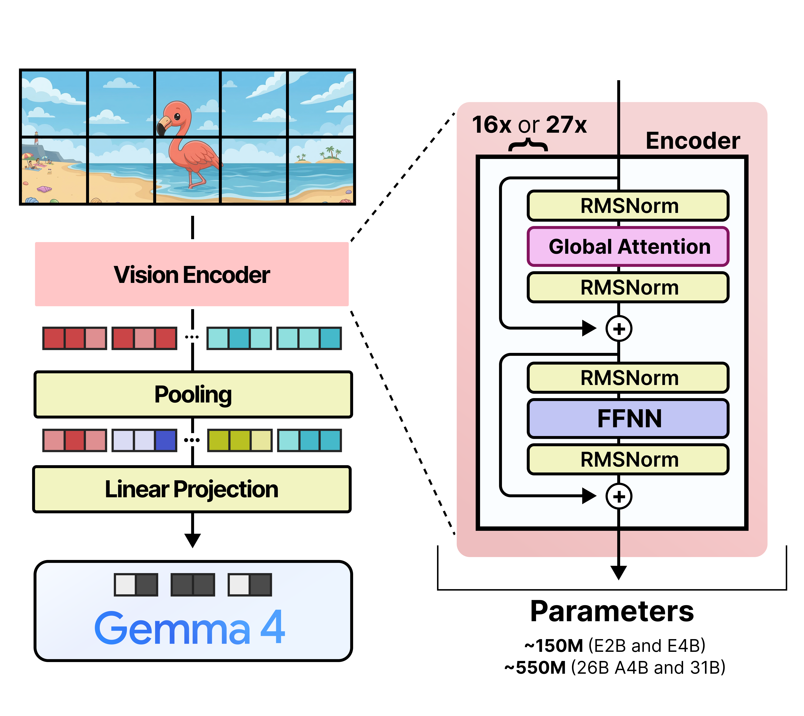
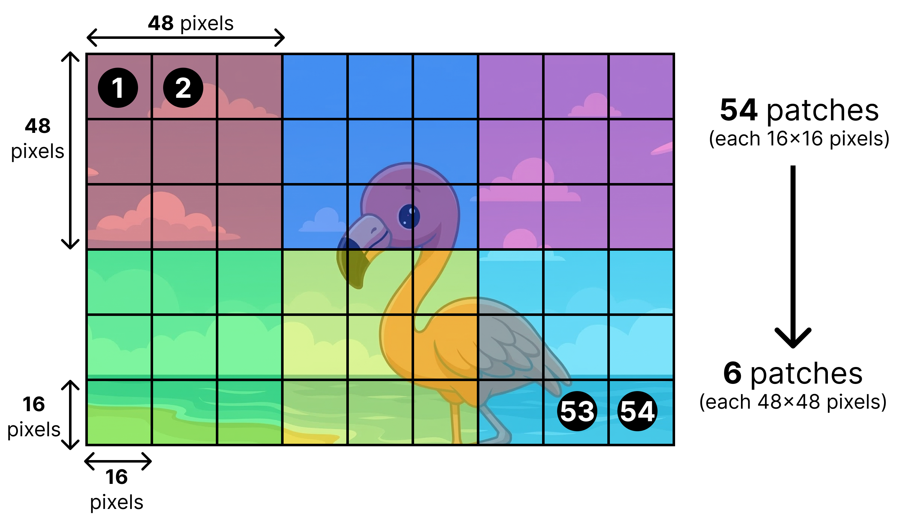
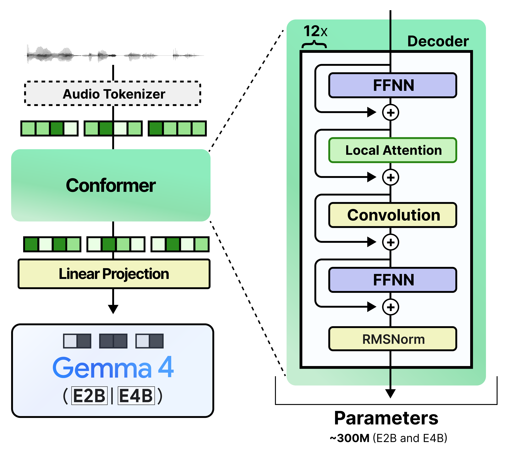

# 기존 Gemma 4의 vision/audio encoder는 무엇을 했나

> 원본: [Exploring Language Models](https://newsletter.maartengrootendorst.com/p/a-visual-guide-to-gemma-4-12b)

직전 편에서는 multimodal LLM이 텍스트가 아닌 입력을 받아들이기 위해 보통 encoder와 connector를 붙인다는 점을 봤다. 텍스트 token은 LLM의 embedding layer가 바로 처리하지만, 이미지는 pixel grid이고 오디오는 시간에 따라 변하는 wave다. 그래서 많은 모델은 각 modality에 맞는 encoder를 먼저 돌리고, 그 결과를 LLM이 읽을 수 있는 token embedding 모양으로 바꾼다.

이번 편의 질문은 더 구체적이다. Gemma 4 12B가 encoder-free를 내세우기 전, 기존 Gemma 4 계열은 vision과 audio encoder로 정확히 무엇을 했을까. 답을 먼저 말하면, vision encoder는 이미지를 작은 patch들의 sequence로 바꾼 뒤 attention으로 시각 특징을 만들고, audio encoder는 오디오를 짧은 시간 단위의 특징 sequence로 바꾼 뒤 Conformer 계열 블록으로 처리했다. 둘 다 마지막에는 projection 또는 connector를 거쳐 텍스트 token embedding과 같은 공간으로 들어간다.

## Gemma 4가 지원한 modality

Gemma 4 계열은 text, image, audio라는 세 종류의 입력을 다룬다. 다만 모든 모델이 세 modality를 똑같이 지원한 것은 아니다. 텍스트와 이미지는 전체 계열의 기본 입력이지만, 오디오는 작은 모델인 E2B와 E4B에만 붙어 있었다.

| 입력 modality | 지원 범위 | 처리 방식 |
|---|---|---|
| Text | 모든 Gemma 4 모델 | LLM의 tokenizer와 token embedding layer가 직접 처리 |
| Image | E2B, E4B, 26B A4B, 31B | 별도 vision encoder가 patch sequence를 처리한 뒤 connector로 투입 |
| Audio | E2B, E4B | 별도 audio encoder가 audio feature sequence를 처리한 뒤 projection으로 투입 |

이 구분이 중요한 이유는 modality마다 LLM 앞단에 붙는 계산량이 다르기 때문이다. 텍스트는 모델 본체의 natural input이다. 반면 이미지는 2차원 공간 구조를 갖고, 오디오는 시간축을 따라 길게 늘어진 신호다. 기존 Gemma 4는 이 차이를 LLM 안에서 바로 풀지 않고, 각각에 특화된 encoder에게 먼저 맡겼다.

Gemma 4 12B의 encoder-free 설계는 이 전제를 뒤집는다. 하지만 그 의미를 이해하려면 먼저 기존 구조가 충분히 합리적인 선택이었다는 점을 봐야 한다. encoder는 단순히 format converter가 아니라, LLM이 보기 전에 raw input에서 의미 있는 특징을 뽑아내는 전처리 모델에 가깝다.

## Vision encoder가 한 일

기존 Gemma 4의 vision path는 전형적인 vision-language model의 흐름을 따른다. 이미지를 작은 patch로 나누고, patch embedding을 만들고, vision encoder 내부의 attention layer들이 patch 사이의 관계를 처리한다. 그 다음 pooled patch embedding을 connector가 LLM embedding dimension에 맞춰 바꾼다.

*Figure 5. Gemma 4의 vision encoder는 16x16 patch를 attention layer stack으로 처리하고, pooling과 linear projection을 거쳐 LLM 입력 embedding으로 만든다.*

그림에서 중요한 흐름은 세 단계다.

- **Patch화**: 이미지를 16x16 pixel patch들로 쪼갠다.
- **Vision encoder 처리**: patch embedding sequence를 transformer-style attention layer stack에 통과시킨다.
- **Connector 투입**: pooling된 visual embedding을 LLM token embedding과 같은 shape로 projection한다.

여기서 vision encoder는 작은 보조 레이어가 아니다. E2B와 E4B에 붙은 vision encoder는 약 1억 5천만 parameter이고, 26B A4B와 31B의 vision encoder는 약 5억 5천만 parameter다. LLM 본체에 비하면 작아 보일 수 있지만, inference pipeline 관점에서는 별도의 모델 하나가 먼저 실행되는 셈이다.

이 encoder가 하는 핵심 작업은 patch 간 attention이다. 예를 들어 어떤 patch 하나가 물체의 모서리인지, 배경인지, 글자 일부인지는 주변 patch와 함께 봐야 더 잘 판단된다. vision encoder는 이런 지역적, 전역적 관계를 LLM에 넘기기 전에 어느 정도 정리한다. 그래서 LLM이 받는 것은 raw pixel에 가까운 값이 아니라 이미 시각적으로 가공된 visual token이다.

## 16x16 patch와 3x3 pooling

Gemma 4의 vision encoder는 입력 이미지를 16x16 pixel patch 단위로 본다. 하지만 LLM으로 넘기는 최종 visual token이 그대로 16x16 영역 하나만 대표하는 것은 아니다. vision encoder가 patch를 처리한 뒤, 3x3 patch grid를 pooling해서 더 큰 단위의 patch embedding을 만든다.

*Figure 6. 16x16 patch 아홉 개를 3x3으로 묶으면 최종 patch embedding 하나가 48x48 pixel 영역을 대표한다.*

수치로 보면 단순하다. 원래 patch 하나는 16x16 pixel이다. 이 patch를 $3 \times 3$ grid로 묶으면 가로와 세로가 각각 3배가 되므로, pooled embedding 하나는 48x48 pixel에 해당하는 영역을 대표한다. 즉 LLM이 보는 visual token 수를 줄이면서도, vision encoder 안에서는 더 촘촘한 patch 단위로 먼저 시각 정보를 처리하는 구조다.

이 pooling은 token budget과 직접 연결된다. 이미지를 매우 작은 patch 단위로 모두 LLM에 넣으면 visual token 수가 빠르게 늘어난다. token 수가 늘면 attention 비용도 늘고, 텍스트와 이미지가 섞인 긴 context를 다루기가 어려워진다. pooling은 vision encoder가 먼저 세밀하게 처리한 정보를 LLM 앞에서 압축하는 역할을 한다.

중요한 점은 pooling이 단순한 resize와 다르다는 것이다. pooling 전 patch embedding은 이미 vision encoder의 attention layer를 지난 상태다. 따라서 최종 48x48 영역 하나는 단순한 pixel 묶음이 아니라, 주변 patch들과 상호작용한 뒤 요약된 표현이다. 이것이 다음 편에서 볼 encoder-free embedder와 기존 vision encoder의 큰 차이다. encoder-free 구조에서는 LLM이 훨씬 이른 단계부터 이런 관계 처리를 직접 떠안아야 한다.

## Connector의 역할

vision encoder의 출력은 그대로 LLM에 넣을 수 없다. encoder가 만든 vector의 dimension, scale, 분포는 LLM의 text token embedding과 다를 수 있다. LLM은 원래 tokenizer가 만든 token embedding sequence를 입력으로 받도록 훈련되어 있으므로, visual embedding도 그와 같은 형식으로 정렬해야 한다.

이때 쓰이는 작은 linear projection layer가 connector다. connector는 vision encoder의 pooled patch embedding을 LLM이 기대하는 embedding dimension으로 바꾼다. 바뀐 visual token embedding은 text token embedding과 같은 sequence 안에 interleave된다. 예를 들어 이미지 설명 prompt가 있다면, special image 위치에 visual token들이 들어가고 그 앞뒤로 텍스트 token들이 이어지는 식이다.

connector는 구조적으로 단순하지만, multimodal LLM에서 인터페이스를 담당하는 중요한 경계다.

| 구성 요소 | 하는 일 | LLM 입장에서의 의미 |
|---|---|---|
| Vision encoder | patch 사이의 시각 관계를 attention으로 처리 | raw image를 의미 있는 visual feature로 바꿈 |
| Pooling | 16x16 patch들을 48x48 단위로 요약 | visual token 수를 줄임 |
| Connector | visual feature를 LLM embedding dimension으로 projection | text token처럼 sequence에 섞을 수 있게 함 |

따라서 기존 Gemma 4의 vision path는 "이미지 입력을 LLM이 이해할 수 있게 바꾼다"는 한 문장으로 끝나지 않는다. 먼저 시각 구조를 별도 encoder에서 해석하고, 그 해석 결과를 connector가 언어 모델의 좌표계로 옮기는 2단 구조다.

## Audio encoder가 한 일

오디오는 이미지와 성격이 다르다. 이미지는 공간 grid지만, 오디오는 시간에 따라 이어지는 waveform이다. Gemma 4 E2B와 E4B는 이 오디오 입력을 처리하기 위해 별도 audio encoder를 사용했다. 이 audio encoder 역시 가벼운 부속품은 아니며, E2B와 E4B에서 같은 구조를 쓰고 약 3억 5백만 parameter를 가진다.

*Figure 7. Gemma 4의 audio encoder는 오디오를 feature sequence로 token화한 뒤 Conformer 계열 stack으로 처리하고, projection을 거쳐 audio token embedding을 만든다.*

그림의 핵심은 audio path도 결국 sequence를 만든다는 점이다. 원시 waveform은 먼저 일정한 시간 단위의 feature로 바뀐다. 그 다음 Conformer 계열 블록이 이 feature sequence를 처리한다. Conformer는 convolution과 self-attention을 함께 쓰는 계열로, speech나 audio처럼 local pattern과 long-range dependency가 모두 중요한 입력에 자주 쓰인다. 짧은 시간 구간의 음향 패턴과 더 긴 발화 흐름을 함께 잡기 위한 선택으로 볼 수 있다.

audio encoder가 처리한 결과도 LLM에 바로 들어가지는 않는다. vision path와 마찬가지로 projection을 통해 text token embedding과 같은 dimensional space로 맞춘다. 이렇게 만들어진 audio token embedding은 text token embedding과 interleave된다. 즉 LLM 본체는 최종적으로 텍스트, 이미지, 오디오를 모두 같은 종류의 embedding sequence처럼 받는다.

## Image와 audio path의 공통점

vision encoder와 audio encoder는 입력 형태가 다르지만, LLM 앞단에서 맡은 역할은 거의 같다. 둘 다 raw modality를 먼저 자체적인 sequence representation으로 만들고, attention 기반의 encoder로 의미 있는 embedding을 만든 뒤, projection을 통해 LLM의 입력 공간에 맞춘다.

공통 구조는 다음처럼 정리할 수 있다.

| 단계 | Image path | Audio path |
|---|---|---|
| Raw input | pixel grid | waveform 또는 audio feature |
| 단위화 | 16x16 patch | 짧은 시간 단위 feature sequence |
| encoder 처리 | vision transformer 계열 attention stack | Conformer 계열 processing stack |
| 압축/정렬 | 3x3 pooling 후 connector | projection |
| LLM 투입 | visual token embedding | audio token embedding |

이 구조는 modular하다. vision을 잘하는 encoder, audio를 잘하는 encoder, language를 잘하는 LLM을 각각 두고, connector로 붙이면 된다. 모델을 설계하는 입장에서는 이해하기 쉽고, 기존 연구 자산도 활용하기 좋다. 실제로 Gemma 4뿐 아니라 Qwen 계열 같은 open-access multimodal LLM에서도 비슷한 철학을 볼 수 있다.

하지만 modular하다는 장점은 동시에 비용이 된다. 각 modality마다 별도 encoder가 붙으면 inference path가 길어진다. image나 audio가 들어온 요청은 LLM이 바로 decoding을 시작할 수 없고, 먼저 encoder가 입력을 처리해 visual 또는 audio token embedding을 만들어야 한다. 사용자가 체감하는 latency는 이 앞단 계산을 그대로 포함한다.

## Latency와 parameter 비용

기존 구조의 첫 번째 문제는 latency다. 텍스트만 있는 요청이라면 LLM은 token embedding을 만들고 곧장 decoder layer를 돌릴 수 있다. 반면 이미지나 오디오가 있는 요청에서는 별도 encoder가 먼저 실행된다. 특히 vision encoder는 여러 transformer layer에서 patch sequence attention을 수행하고, audio encoder도 Conformer 계열 stack을 거친다. 이 계산이 끝나야 LLM 입력 sequence가 완성된다.

두 번째 문제는 parameter다. 작은 Gemma 4의 vision encoder만 해도 1억 5천만 parameter이고, 큰 모델 쪽 vision encoder는 5억 5천만 parameter다. audio encoder는 E2B와 E4B에서 3억 5백만 parameter다. 물론 LLM 본체의 수십억 parameter와 비교하면 상대적으로 작다. 그러나 배포와 serving에서는 "본체보다 작다"가 곧 "공짜다"를 의미하지 않는다. memory footprint, load time, device placement, batch scheduling에서 모두 별도 고려 대상이 된다.

세 번째 문제는 pipeline 복잡도다. encoder가 붙은 multimodal 모델은 사실상 여러 모델의 조합이다. image request는 vision encoder와 LLM을 지나고, audio request는 audio encoder와 LLM을 지난다. modality별 preprocessing, tensor shape, positional handling, projection layer, special token 배치까지 맞아야 한다. 단일 text LLM을 serving하는 것보다 움직이는 부품이 많다.

## Fine-tuning이 까다로워지는 이유

fine-tuning에서도 문제가 생긴다. 실제 운영이나 downstream adaptation에서는 보통 LLM 본체만 fine-tuning하고, vision/audio encoder는 frozen 상태로 두는 경우가 많다. 비용과 안정성 때문이다. encoder까지 함께 업데이트하면 학습해야 할 parameter가 늘고, modality별 data와 loss balancing도 신경 써야 한다.

하지만 encoder를 frozen으로 두면 다른 문제가 남는다. LLM은 새 task에 맞게 바뀌는데, encoder가 만들어내는 visual 또는 audio representation은 그대로다. 특히 모델 크기를 키우거나 도메인을 바꾸려 할 때, encoder와 LLM이 함께 성장하지 못한다. LLM이 원하는 embedding space와 encoder가 내보내는 representation 사이의 간극을 connector가 어느 정도 완충하더라도, 근본적으로는 별도 모듈을 따로 관리하는 구조다.

반대로 encoder까지 함께 fine-tuning하면 복잡도가 커진다. vision과 audio input을 충분히 포함한 학습 batch가 필요하고, text-only 성능과 multimodal 성능 사이의 trade-off도 봐야 한다. modality별 encoder가 서로 다른 속도와 memory profile을 갖기 때문에 training system도 단순하지 않다. Gemma 4 12B가 encoder-free를 시도한 배경에는 이런 학습과 배포의 복잡도가 함께 놓여 있다.

## 기존 구조가 남긴 질문

정리하면 기존 Gemma 4의 vision/audio encoder는 LLM이 직접 다루기 어려운 raw modality를 먼저 해석하는 역할을 했다. vision encoder는 16x16 patch를 attention으로 처리하고 3x3 pooling으로 48x48 단위 visual token을 만들었다. audio encoder는 오디오 feature sequence를 Conformer 계열 stack으로 처리해 audio token embedding을 만들었다. 두 경로 모두 마지막에는 projection 또는 connector를 거쳐 text token과 같은 embedding sequence에 섞였다.

이 방식은 자연스럽고 성능 면에서도 설득력이 있다. 문제는 비용이다. encoder는 parameter를 추가하고, latency를 늘리고, fine-tuning과 serving pipeline을 복잡하게 만든다. 그래서 다음 질문이 나온다. 시각과 오디오의 의미 처리를 별도 encoder가 먼저 하지 않고, LLM이 더 직접적으로 맡게 만들 수 있을까. Gemma 4 12B의 encoder-free 설계는 바로 이 질문에 대한 답으로 등장한다.

다음 편: [Gemma 4 12B는 어떻게 encoder-free가 되었나](03-encoder-free-12b.md)

## 출처

- 원문: <https://newsletter.maartengrootendorst.com/p/a-visual-guide-to-gemma-4-12b>
