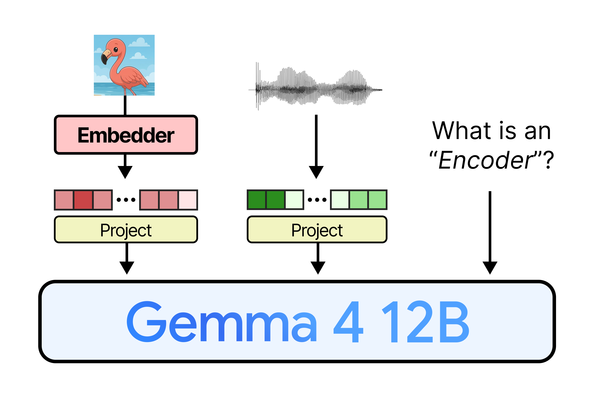
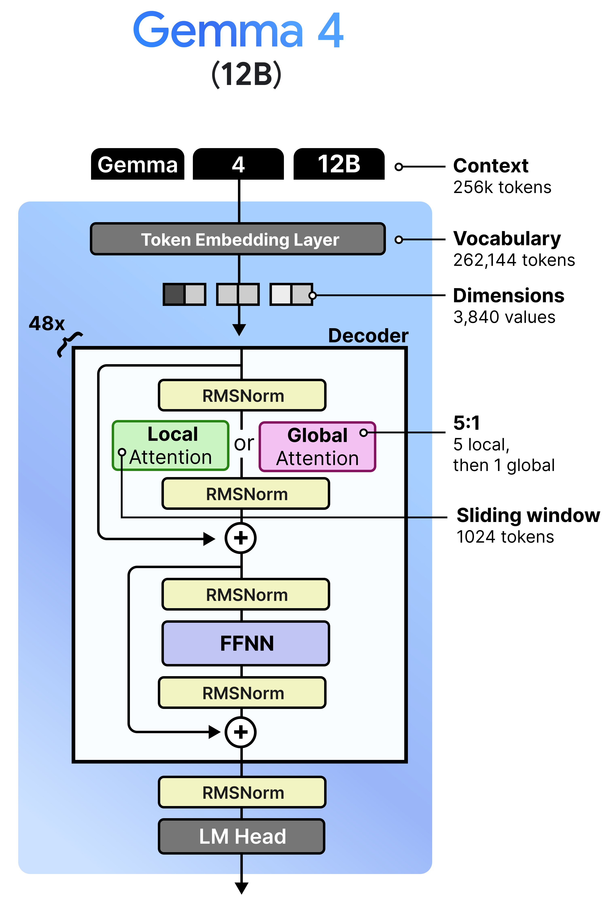
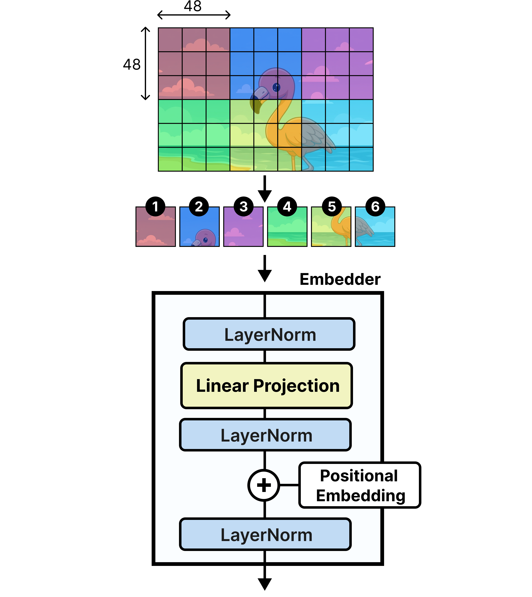
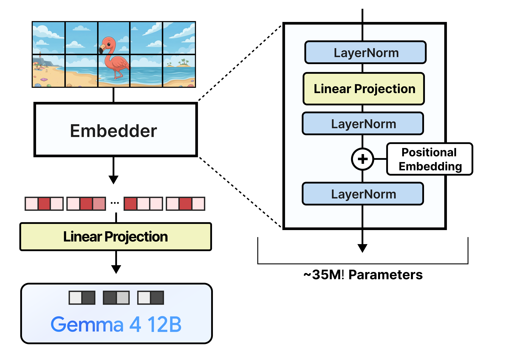

# Gemma 4 12B는 어떻게 encoder-free가 되었나

> 원본: [Exploring Language Models](https://newsletter.maartengrootendorst.com/p/a-visual-guide-to-gemma-4-12b)

앞 편에서는 Gemma 4 계열의 기존 멀티모달 경로를 봤다. 이미지와 오디오는 각각 별도의 encoder를 거쳐 의미 있는 토큰 표현으로 바뀌고, connector가 그 표현을 LLM의 입력 차원으로 맞춘다. 이번 편의 질문은 그 반대다. Gemma 4 12B는 어떤 조건을 만족시켜야 encoder를 빼도 모델 전체가 여전히 이미지와 오디오를 다룰 수 있었을까.

원문의 핵심은 "encoder-free"가 "전처리 없음"을 뜻하지 않는다는 점이다. 이미지와 오디오는 여전히 LLM에 바로 들어갈 수 없고, 패치나 오디오 조각을 모델 차원의 embedding으로 바꾸는 얇은 module이 필요하다. 달라진 것은 그 module이 attention으로 입력을 깊게 해석하지 않는다는 점이다. 시각적·청각적 관계를 미리 encoder에서 정리하지 않고, 훨씬 이른 시점에 LLM decoder로 넘긴다.

*Figure 1. Gemma 4 12B의 encoder-free 개요. 이미지는 embedder를 거치고, 오디오는 projection 경로를 거쳐 Gemma 4 12B에 들어간다. 오른쪽의 "What is an Encoder?"라는 질문은 이 모델에서 제거된 대상이 LLM 본체가 아니라 비텍스트 modality encoder임을 강조한다.*

## 12B라는 빈자리

Gemma 4 12B는 제품 라인업상으로도 의도가 분명한 위치에 놓인다. 기존에는 작은 E4B와 더 큰 26B A4B 사이가 비어 있었고, 12B는 그 중간을 채우는 크기다. 원문은 이 모델이 12GB에서 16GB 사이 VRAM을 가진 환경에 맞는 선택지라고 설명한다.

하지만 12B의 의미가 단순히 "중간 크기 모델"에만 있지는 않다. Google DeepMind가 이 크기의 모델을 새로 내면서 동시에 던진 설계 실험은, 이미지와 오디오 encoder를 떼어내도 멀티모달 LLM을 만들 수 있는가였다. 그래서 Gemma 4 12B를 볼 때는 두 축을 같이 봐야 한다.

| 축 | Gemma 4 12B에서의 의미 |
|---|---|
| 모델 크기 | E4B보다 크고 26B A4B보다 작은 실용 구간 |
| LLM 구조 | 31B dense 모델과 유사한 decoder 구조 |
| 멀티모달 처리 | 별도 vision/audio encoder 대신 얇은 embedding 또는 projection module |
| 시스템 효과 | encoder 선처리 대기 시간이 줄고, LLM이 더 빨리 일을 시작함 |

이 포지션은 꽤 절묘하다. 너무 작은 모델에서는 encoder가 하던 이해 부담을 LLM이 대신 떠안기 어렵고, 너무 큰 모델에서는 encoder 제거의 실용적 이득이 상대적으로 덜 눈에 띌 수 있다. 12B는 충분히 큰 decoder를 가지면서도, 단일 장비에서의 latency와 메모리 비용이 중요한 구간에 있다. encoder-free 설계가 모델 구조와 배포 현실을 동시에 건드리는 이유다.

## decoder는 31B dense와 닮았다

Gemma 4 12B의 LLM 본체만 놓고 보면 원문은 31B dense 모델과 상당히 비슷하다고 설명한다. decoder-only LLM의 기본 틀 위에 token embedding layer, 반복 decoder block, 마지막 RMSNorm과 LM head가 놓이는 구조다. 중요한 숫자는 context 256k tokens, vocabulary 262,144 tokens, hidden dimension 3,840이다.

그림에서 decoder block은 48번 반복된다. 각 block은 RMSNorm, attention, residual add, RMSNorm, FFNN, RMSNorm, residual add로 이어지는 익숙한 형태를 갖는다. 여기서 attention이 매 block 동일하지 않고 local attention과 global attention 사이를 오간다는 점이 Gemma 4 12B 구조를 이해하는 핵심이다.

*Figure 8. Gemma 4 12B의 decoder 구조. local attention은 1,024-token sliding window를 쓰고, global attention은 더 넓은 문맥을 본다. 5개의 local attention 뒤에 1개의 global attention을 두는 5:1 패턴이 반복되며, global attention이 항상 묶음의 마지막에 온다.*

## local과 global attention의 배치

원문이 짚는 decoder 구조의 핵심은 local attention과 global attention의 interleaving이다. Gemma 4 12B는 5개의 local attention layer를 둔 뒤 1개의 global attention layer를 두는 5:1 패턴을 사용한다. 또한 global attention이 항상 마지막에 오도록 배치한다.

local attention은 sliding window 1,024 tokens 안에서만 관계를 본다. 긴 context를 모두 전역적으로 보는 것보다 계산량이 훨씬 작고, 근처 token 사이의 조밀한 상호작용을 빠르게 처리할 수 있다. 반대로 global attention은 더 넓은 문맥을 한 번에 묶어 준다. 256k token context를 지원하려면 모든 layer가 global attention인 구조는 부담이 크므로, 대부분의 layer는 local하게 굴리고 주기적으로 global layer를 넣어 멀리 떨어진 정보를 연결하는 방식이 타협점이 된다.

이 배치가 encoder-free와 연결되는 지점은 다음과 같다. 이미지 패치와 오디오 조각이 더 이상 전용 encoder에서 깊게 가공되지 않는다면, LLM 내부 attention이 modality 간 관계를 직접 만들어야 한다. local layer는 가까운 token 묶음의 패턴을 빠르게 처리하고, global layer는 여러 modality token과 텍스트 token 사이의 더 긴 연결을 정리한다. encoder-free 설계는 단순히 앞단을 지운 것이 아니라, decoder가 관계 해석의 중심이 되도록 전체 pipeline의 책임을 옮긴 것이다.

## encoder를 빼면 무엇이 사라지나

기존 vision-language 모델에서 vision encoder는 입력 이미지를 patch로 쪼갠 뒤, transformer layer를 여러 층 통과시키며 시각적 특징을 만든다. Gemma 4의 다른 모델에서는 E2B와 E4B 쪽 vision encoder가 약 150M parameters, 26B A4B와 31B 쪽 vision encoder가 약 550M parameters 규모라고 설명된다. 작은 보조 module처럼 보이지만, 실제로는 별도 transformer 하나가 붙어 있는 셈이다.

Gemma 4 12B가 제거한 것은 이 transformer encoder다. 즉 사라지는 것은 단순한 projection layer가 아니라, patch 간 attention, feature extraction, pooling 같은 처리를 담당하던 시각 전용 네트워크다. audio 쪽도 마찬가지다. E2B와 E4B의 audio encoder는 입력 오디오를 token화하고 stacked decoder 또는 encoder-style processing을 거쳐 LLM 입력으로 맞춘다. Gemma 4 12B는 이 경로를 훨씬 얇게 만든다.

정리하면 encoder 제거로 없어지는 비용은 세 갈래다.

- **파라미터 비용**: vision encoder 수억 개, audio encoder 수억 개 규모의 별도 weight를 줄인다.
- **실행 비용**: LLM이 시작하기 전에 modality encoder가 먼저 끝나야 하는 대기 구간을 줄인다.
- **학습·튜닝 복잡도**: LLM과 encoder를 함께 키우거나 맞춰야 하는 부담을 낮춘다.

물론 사라지는 비용만큼 사라지는 능력도 있다. encoder가 미리 만들어주던 semantic feature가 없어지므로, raw patch나 raw audio chunk에 가까운 입력을 LLM이 직접 해석해야 한다. 이 trade-off를 감당하기 위해서는 12B decoder가 충분한 표현력을 가져야 하고, training 단계에서 LLM이 modality token을 이해하도록 학습되어야 한다.

## vision encoder는 embedder로 바뀐다

Gemma 4 12B의 이미지 경로는 vision encoder 대신 lightweight embedder를 쓴다. 원문은 이를 "single layer to create the embeddings"라고 설명한다. 기존 encoder가 15층 또는 27층 transformer를 돌며 visual feature를 만들었다면, 12B의 embedder는 패치를 LLM 입력 차원으로 바꾸고 위치 정보를 더하는 훨씬 얇은 module이다.

가장 먼저 달라지는 것은 patch 단위다. 기존 vision encoder는 $16 \times 16$ pixel patch를 처리한 뒤 $3 \times 3$ pooling을 통해 최종적으로 $48 \times 48$ pixel에 대응하는 patch embedding을 만든다. Gemma 4 12B는 이 중간 과정을 건너뛰고 처음부터 $48 \times 48$ pixel patch를 사용한다. attention-free embedder가 $16 \times 16$ patch를 여러 단계로 통합해 semantic feature를 만드는 구조가 아니기 때문에, pooling을 거쳐 얻는 장점도 줄어든다. 그래서 모델은 더 큰 patch를 직접 입력 단위로 삼는다.

*Figure 9. $48 \times 48$ image patch가 embedder로 들어가는 과정. 각 patch는 독립적으로 처리되며, attention을 통한 patch 간 상호작용은 이 단계가 아니라 Gemma 4 12B decoder 내부에서 일어난다.*

## 위치 정보는 LLM에 들어가기 전에 넣는다

attention-free embedder에서는 이미지 전용 2D-RoPE를 그대로 쓸 수 없다. 2D-RoPE는 vision encoder의 attention 구조 안에서 patch 사이의 상대적 위치를 반영하는 방식이기 때문이다. 그렇다고 LLM의 일반 positional encoding에만 맡기기도 어렵다. LLM은 입력을 1차원 token sequence로 다루므로, 이미지 위의 $x$ 좌표와 $y$ 좌표를 자연스럽게 알지 못한다.

Gemma 4 12B의 해법은 LLM에 넣기 전에 patch embedding 자체에 2차원 위치 정보를 더하는 것이다. 원문은 이를 두 개의 matrix로 설명한다. 하나는 $x$ 좌표용, 다른 하나는 $y$ 좌표용이며, 각각 최대 patch position 1,120개와 모델 차원 3,840을 갖는다. 특정 patch가 위치 $x = 2$, $y = 1$에 있다면, $x$ table에서 2번 embedding을, $y$ table에서 1번 embedding을 뽑아 더한다. 이 합이 해당 patch의 positional embedding이 된다.

이 설계는 명시적으로 공간 정보를 주입한다. patch embedding은 raw pixel block에서 나온 값이고, positional embedding은 그 patch가 이미지 어디에 있었는지를 알려준다. 두 정보를 더한 뒤 LayerNorm으로 안정화하고, 최종적으로 Gemma 4 12B가 기대하는 3,840차원 token embedding 형태로 맞춘다.

여기서 중요한 점은 위치 정보가 "관계 해석"을 대체하지 않는다는 것이다. $x$와 $y$ embedding은 각 patch의 주소를 알려줄 뿐이다. 어떤 patch가 같은 물체에 속하는지, 멀리 떨어진 두 영역이 어떤 관계를 갖는지는 여전히 decoder attention이 학습해야 한다. encoder-free라는 이름은 결국 이 책임 이동을 가리킨다.

## 35M parameter의 정체

"encoder-free"라고 하면 추가 파라미터가 거의 없을 것처럼 들릴 수 있지만, Gemma 4 12B의 image embedder도 약 35M parameters를 갖는다. 원문은 이 숫자의 대부분이 pixel-to-model projection에서 온다고 설명한다. patch 하나는 $48 \times 48 \times 3$ pixels이므로 raw 값은 6,912개다. 이를 Gemma 4 12B의 hidden dimension인 3,840으로 사영해야 한다.

단순한 linear projection만 계산해도 parameter 수는 다음과 같다.

$$
6{,}912 \times 3{,}840 + 3{,}840 = 26{,}545{,}920
$$

즉 약 26.5M parameters가 projection 하나에서 나온다. 나머지는 positional embedding table, normalization 관련 parameter 등에서 더해진다. 그래서 35M이라는 숫자는 "작은 transformer encoder"의 축소판이 아니라, 큰 pixel vector를 LLM 차원으로 올리는 데 드는 선형 사영 비용에 가깝다.

이 차이는 실무적으로 중요하다. 35M parameters는 550M vision encoder에 비하면 훨씬 작지만, 완전히 공짜는 아니다. 대신 이 module은 attention stack을 돌리지 않는다. patch 하나하나를 독립적으로 LLM 입력 차원으로 바꾸고, 나머지 시각 이해는 decoder로 넘긴다.

*Figure 12. vision encoder를 대체한 lightweight image embedder. 확대된 오른쪽 구조를 보면 attention block이 없고, normalization, linear projection, positional embedding 추가가 중심임을 볼 수 있다.*

## patch 간 attention은 어디서 일어나는가

Figure 9와 Figure 12에서 가장 눈에 띄는 부분은 patch가 독립적으로 처리된다는 점이다. embedder 내부에는 self-attention이 없으므로, 첫 번째 patch와 여섯 번째 patch가 같은 물체의 일부인지, 배경과 전경이 어떻게 나뉘는지, 이미지 안의 글자와 물체가 어떤 관계인지 이 단계에서는 직접 판단하지 않는다. 각 patch는 자기 pixel 값과 자기 위치 정보만 들고 LLM으로 들어간다.

그 다음부터는 모든 것이 sequence modeling 문제로 바뀐다. 이미지 patch embedding은 text token embedding과 같은 차원에 놓이고, decoder block은 이 token들을 함께 본다. local attention layer는 가까운 token 사이의 세부 패턴을 처리하고, global attention layer는 멀리 떨어진 patch와 텍스트 지시문 사이의 연결을 만든다. 따라서 "이미지를 이해하는 모델"이 vision encoder에서 LLM으로 이동한다.

이 구조는 장단점이 분명하다.

| 관점 | encoder가 있는 경로 | Gemma 4 12B encoder-free 경로 |
|---|---|---|
| 이미지 feature | vision encoder가 patch 관계를 미리 처리 | decoder가 patch token을 직접 해석 |
| 앞단 latency | encoder 완료 후 LLM 시작 | patch projection 뒤 LLM이 더 빨리 시작 |
| module 규모 | 수억 parameter transformer | 약 35M image embedder |
| 학습 부담 | encoder와 LLM의 역할이 분리됨 | LLM이 modality 이해를 더 많이 떠안음 |

이 table의 마지막 줄이 가장 중요하다. encoder-free는 latency와 구조 단순화의 이득을 주지만, LLM 본체가 더 많은 학습 신호를 받아야 한다. "connector is all you need"처럼 보이지만, 실제로는 "decoder가 충분히 강하고 충분히 학습되면 connector에 가까운 module만으로도 가능하다"에 가깝다.

## 오디오 경로는 더 단순하다

원문의 "Making Gemma 4 12B Encoder-free" 섹션은 이미지뿐 아니라 audio encoder 제거도 함께 다룬다. 오디오는 이미지보다 더 단순한 경로를 갖는다. raw audio를 40ms 단위 sequence로 나누고, 16kHz 기준 각 sequence는 640개의 amplitude sample을 가진다. 이 640개 raw feature를 linear projection으로 Gemma 4 12B가 기대하는 3,840차원 audio token embedding에 맞춘다.

이미지와 달리 오디오는 별도의 2D positional embedding이 필요 없다고 설명된다. 오디오는 시간 순서가 있는 sequence이고, text token처럼 1차원 sequence로 다룰 수 있기 때문이다. 물론 오디오가 실제로는 waveform의 시간적 패턴과 주파수적 구조를 모두 갖는 복잡한 신호라는 점은 남아 있다. 다만 architecture 관점에서 Gemma 4 12B는 이 복잡성을 전용 audio encoder에서 미리 풀지 않고, chunk와 projection을 거쳐 decoder로 넘긴다.

이 차이는 pipeline을 크게 바꾼다. E4B의 audio encoder 경로는 audio input을 token화하고 stacked processing을 거친 뒤 projection한다. Gemma 4 12B는 split and project에 가깝다. 오디오에서도 encoder-free의 의미는 동일하다. 앞단에서 깊게 이해하지 않고, LLM이 더 이른 시점에 modality token을 받아 처리한다.

## latency 관점의 변화

encoder-free의 가장 직접적인 이득은 latency다. 기존 멀티모달 LLM에서는 image encoder나 audio encoder가 먼저 입력을 처리해야 한다. LLM은 그 결과 embedding이 나와야 다음 단계로 넘어갈 수 있다. 특히 encoder가 transformer stack이면, modality별 선처리 시간이 inference pipeline의 앞부분을 차지한다.

Gemma 4 12B에서는 이 선처리 단계가 얇아진다. 이미지는 $48 \times 48$ patch를 만들고, projection과 positional embedding을 거쳐 LLM으로 들어간다. 오디오는 40ms chunk를 만들고 projection한다. attention-heavy encoder를 기다리는 시간이 줄어들기 때문에, LLM은 더 빨리 multimodal token sequence를 받아 context 처리와 generation을 시작할 수 있다.

이 변화는 단순히 wall-clock time만의 문제가 아니다. pipeline 관점에서도 역할 경계가 바뀐다.

- **기존 경로**: modality input -> modality encoder -> connector/projection -> LLM
- **Gemma 4 12B 경로**: modality input -> lightweight embedder/projection -> LLM
- **책임 이동**: modality-specific feature extraction 일부가 LLM decoder 내부 attention으로 이동

따라서 encoder-free는 "앞단을 빨리 만든다"와 "뒷단에 더 많이 맡긴다"가 동시에 일어나는 설계다. 모델이 작동하려면 LLM decoder가 이미지 patch token, audio token, text token을 같은 sequence 안에서 안정적으로 다루도록 학습되어야 한다.

## encoder-free는 단순화이지만, 쉬운 길은 아니다

Gemma 4 12B의 encoder-free 설계는 표면적으로는 매우 간단해 보인다. vision encoder를 image embedder로, audio encoder를 split-and-project 경로로 바꾼다. 그러나 실제 의미는 단순한 module 교체보다 크다. 전용 encoder가 하던 feature extraction을 줄이고, LLM decoder가 modality token의 관계를 직접 학습하도록 만든다.

이 선택이 성립하려면 세 조건이 맞아야 한다.

- **충분한 decoder capacity**: 12B 규모와 48-layer decoder가 modality 이해 부담을 떠안을 수 있어야 한다.
- **명시적인 alignment interface**: 모든 modality token이 3,840차원 LLM 입력 공간으로 맞춰져야 한다.
- **위치와 순서 신호**: 이미지는 $x$, $y$ positional embedding으로, 오디오는 sequence 순서로 decoder가 원래 입력 구조를 복원할 단서를 받아야 한다.

이 관점에서 Gemma 4 12B는 encoder를 "없앤" 모델이라기보다, encoder의 일부 역할을 LLM으로 "흡수한" 모델에 가깝다. 앞단 module은 줄었지만, 모델 전체가 해야 하는 일은 사라지지 않는다. 다만 그 일이 더 통합된 decoder 안에서 일어난다.

## 이번 편의 정리

Gemma 4 12B는 E4B와 26B A4B 사이의 빈 크기를 채우면서, 동시에 Gemma 4 계열에서 독특한 encoder-free 경로를 보여준다. LLM 본체는 31B dense와 닮은 decoder 구조를 갖고, 48개 block 안에서 local attention과 global attention을 5:1로 섞는다. 이 decoder가 멀티모달 token의 관계 해석을 더 많이 맡기 때문에, vision/audio encoder를 떼어낼 수 있다.

이미지 쪽에서는 48x48 patch를 약 35M parameter embedder로 LLM 입력 차원에 맞춘다. 2D-RoPE는 빠지고, 대신 $x$와 $y$ positional embedding을 patch embedding에 직접 더한다. 오디오 쪽에서는 40ms chunk를 raw feature로 보고 projection한다. 두 경우 모두 attention-heavy encoder가 사라지고, LLM이 더 빨리 token sequence를 받아 처리한다.

다음 편에서는 이 중 vision embedder만 더 좁혀서 본다. $48 \times 48$ patch, 1,120 patch budget, $x$/$y$ positional table, LayerNorm과 projection이 어떻게 맞물려 이미지 위치와 차원을 LLM 입력 형식으로 맞추는지 살펴본다.

다음 편: [vision embedder는 위치와 차원을 어떻게 맞추나](04-vision-embedder.md)

## 출처

- <https://newsletter.maartengrootendorst.com/p/a-visual-guide-to-gemma-4-12b>
