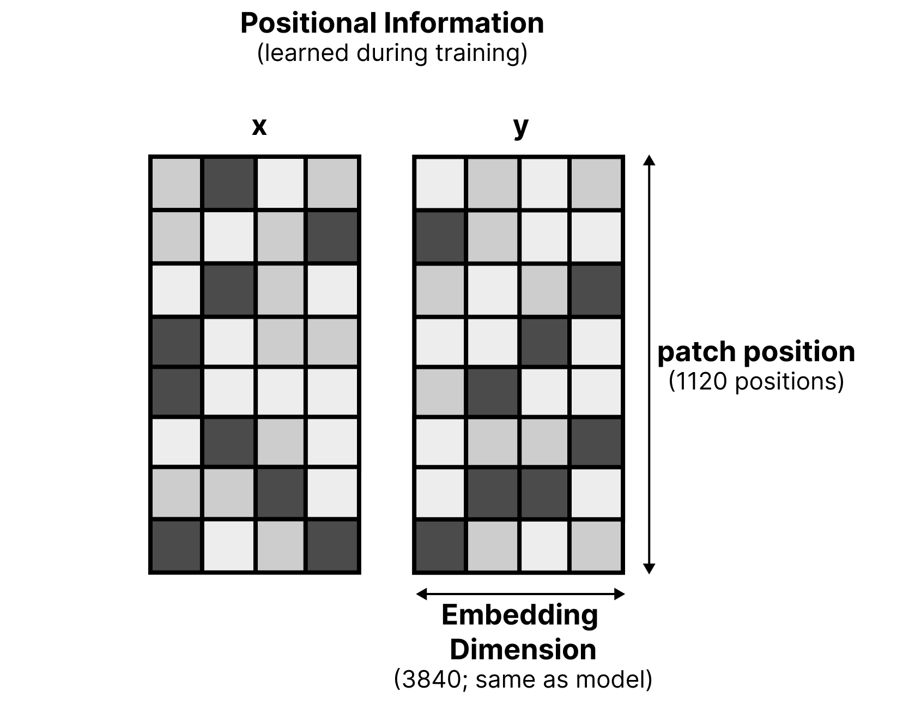
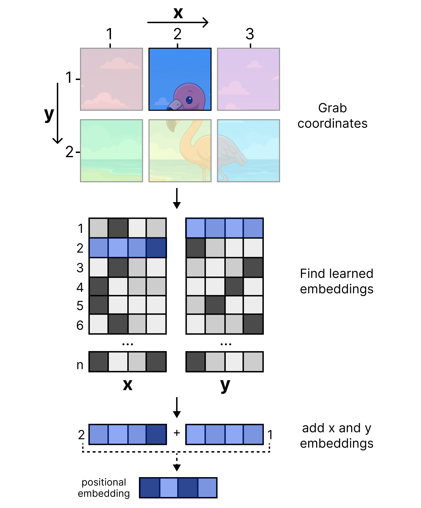
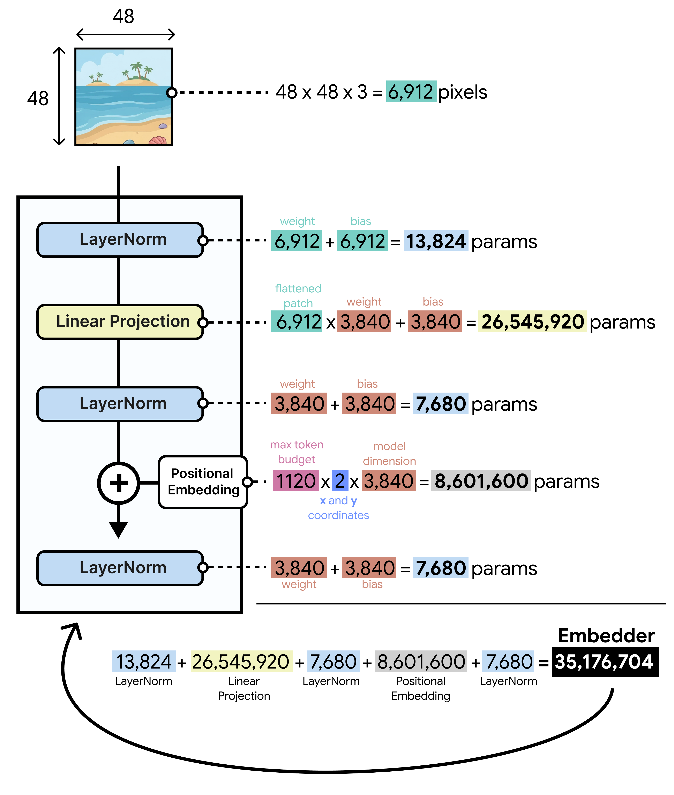
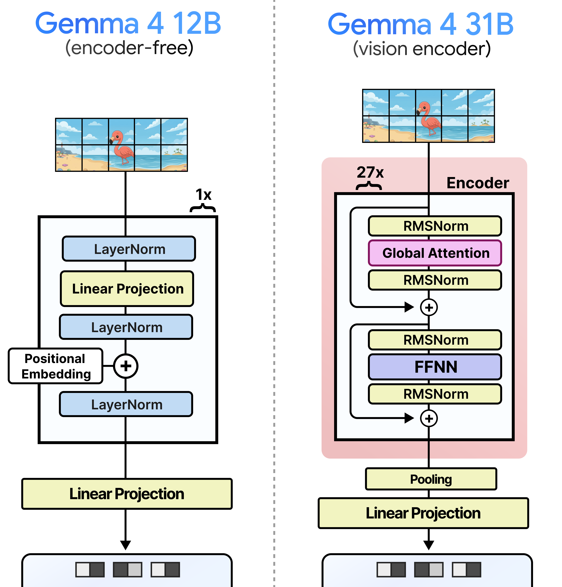

# vision embedder는 위치와 차원을 어떻게 맞추나

> 원본: [Exploring Language Models](https://newsletter.maartengrootendorst.com/p/a-visual-guide-to-gemma-4-12b)

이 편에서는 Gemma 4 12B의 encoder-free 설계 중 이미지 경로만 좁혀서 본다. 직전 편이 "왜 vision encoder를 없앨 수 있었나"를 큰 구조로 설명했다면, 여기서는 제거된 encoder 자리에 실제로 무엇이 들어갔는지를 추적한다.

핵심은 단순하다. Gemma 4 12B는 이미지를 의미적으로 처리하는 작은 Transformer를 따로 두지 않고, 원본 이미지 패치를 곧바로 LLM이 읽을 수 있는 벡터로 바꾼다. 이때 필요한 것은 세 가지다.

- 패치 자체의 픽셀 값을 모델 차원으로 보내는 projection
- 이미지 안에서 그 패치가 어디에 있었는지 알려주는 x/y positional embedding
- projection 전후의 분포를 안정화하는 LayerNorm

이렇게 말하면 마치 "이미지를 그냥 펼쳐 넣는다"처럼 들리지만, 실제로는 위치와 차원을 맞추는 세부가 중요하다. encoder-free라는 이름은 vision 입력 처리가 사라졌다는 뜻이 아니라, attention 기반 vision encoder가 하던 일을 훨씬 얇은 embedding module과 LLM 본체로 나누었다는 뜻에 가깝다.

## 31B 모델의 vision encoder가 하던 일

기존 Gemma 4 계열의 image path는 vision encoder와 connector로 나뉜다. vision encoder는 이미지 패치를 attention layer로 처리하면서 패치 사이 관계를 먼저 만들고, connector는 그 결과를 LLM token embedding과 같은 차원으로 바꾼다.

Gemma 4 31B 같은 큰 모델에서는 이 vision encoder가 약 550M parameter 규모다. LLM 전체와 비교하면 작아 보일 수 있지만, inference 경로에서는 별도의 Transformer를 한 번 더 실행한다는 점이 더 중요하다. 이미지를 넣으면 LLM이 바로 시작하는 것이 아니라, vision encoder가 visual token을 준비할 때까지 기다려야 한다.

전통적인 경로를 정리하면 다음과 같다.

| 단계 | 역할 | 비용 |
| --- | --- | --- |
| $16 \times 16$ patching | 이미지를 작은 패치로 분할 | 비교적 작음 |
| vision encoder | attention으로 패치 관계와 시각 특징 생성 | 큼 |
| pooling | 여러 패치를 더 큰 단위로 압축 | 중간 |
| projection connector | LLM 입력 차원에 맞춤 | 작지만 필수 |
| LLM | text token과 visual token을 함께 처리 | 최종 reasoning |

Gemma 4 12B의 목표는 이 중 가장 무거운 attention 기반 vision encoder를 제거하는 것이다. 대신 LLM이 더 일찍 visual token을 받아서, 시각적 관계 해석까지 본체 안에서 학습하도록 만든다.

## $48 \times 48$ patch를 직접 쓴다는 의미

기존 vision encoder 경로에서는 먼저 $16 \times 16$ patch를 만들고, encoder가 처리한 뒤 pooling을 통해 $48 \times 48$에 해당하는 visual token 단위로 묶는다. Gemma 4 12B는 이 중간 절차를 줄인다. 처음부터 $48 \times 48$ patch를 직접 사용한다.

*Figure 9. Gemma 4 12B의 vision embedder는 $48 \times 48$ 원본 패치에 위치 정보를 더한 뒤 LayerNorm과 projection을 거쳐 LLM 입력 토큰을 만든다.*

이 선택은 두 가지 관점에서 봐야 한다.

- 구조 단순화: $16 \times 16$ patch를 encoder로 처리하고 pooling하는 단계를 없앤다.
- 의미 처리의 이동: visual feature를 풍부하게 만드는 책임을 vision encoder에서 LLM으로 옮긴다.

여기서 중요한 차이는 pooling의 대상이다. 기존 모델에서 pooling되는 것은 이미 encoder를 통과한 representation이다. 각 $16 \times 16$ 패치가 주변 패치와 attention으로 상호작용한 뒤 묶이므로, $48 \times 48$ 단위는 단순한 원본 픽셀 묶음이 아니다. 반면 Gemma 4 12B의 $48 \times 48$ patch는 encoder가 보강한 특징이 아니라 raw pixel block에 가깝다.

따라서 이 설계는 "더 큰 패치를 쓰니 정보가 줄었다"만으로 해석하기 어렵다. 어차피 attention-free embedder는 패치 사이를 보지 않는다. 대신 더 적은 수의 큰 패치를 LLM 입력으로 빠르게 넘기고, 패치 사이 관계는 LLM attention이 맡도록 설계한 것이다.

## attention-free embedder의 가장 큰 문제

vision encoder를 없애면 곧바로 생기는 문제가 있다. 패치 하나가 이미지의 어디에 있었는지 알려줘야 한다.

Transformer 기반 vision encoder는 보통 2D positional encoding이나 2D RoPE 같은 방식으로 패치의 공간 위치를 attention 안에 반영할 수 있다. 하지만 Gemma 4 12B의 vision embedder는 attention-free다. embedder 안에는 패치 사이를 비교하는 attention 연산이 없으므로, 2D RoPE를 적용할 공간도 없다.

그렇다고 LLM의 일반적인 positional encoding에만 맡기기도 어렵다. LLM은 입력을 일렬의 sequence로 본다. 이미지 패치가 sequence 안에서 몇 번째인지는 알 수 있어도, 그 패치가 원본 이미지의 왼쪽 위인지, 가운데인지, 오른쪽 아래인지는 별도 정보 없이는 모호해진다.

예를 들어 같은 row-major 순서로 패치를 나열하더라도 이미지 비율이 달라지면 sequence index와 실제 x/y 위치의 관계가 달라질 수 있다. multimodal 모델은 text token과 image token이 섞인 긴 sequence를 처리하므로, 단순한 1D 순서만으로 2D 공간 구조를 안정적으로 표현하기 어렵다.

Gemma 4 12B의 해결책은 위치 정보를 LLM에 들어가기 전에 visual token embedding에 직접 더하는 것이다. 즉, 패치 값으로 만든 embedding 위에 "이 패치는 x축에서 몇 번째, y축에서 몇 번째 위치다"라는 학습된 벡터를 더한다.

## x/y positional embedding table

Gemma 4 12B는 이미지 위치를 위해 두 개의 learned table을 둔다. 하나는 x좌표용, 다른 하나는 y좌표용이다.

*Figure 10. x 위치와 y 위치를 위한 별도 embedding table이 있고, 각 row는 특정 patch coordinate를 나타낸다.*

각 table의 shape은 $1120 \times 3840$이다. 여기서 $1120$은 지원할 수 있는 최대 patch position budget을 나타내고, $3840$은 Gemma 4 12B가 기대하는 embedding dimension이다.

이 숫자에는 몇 가지 의미가 들어 있다.

| 항목 | 의미 |
| --- | --- |
| $1120$ | 이미지 입력에서 사용할 수 있는 최대 patch budget |
| $3840$ | Gemma 4 12B의 token embedding 차원 |
| x table | 패치의 가로 위치를 나타내는 learned embedding |
| y table | 패치의 세로 위치를 나타내는 learned embedding |

Gemma 4 계열의 vision 입력은 이미지마다 같은 토큰 수만 강제하지 않는다. 예산은 70, 140, 280, 560, 1120 같은 선택지로 조절될 수 있고, 이미지의 aspect ratio에 따라 실제 패치 격자도 달라질 수 있다. 그러므로 positional table은 다양한 해상도와 비율에서 쓸 수 있는 coordinate embedding의 저장소 역할을 한다.

여기서 x table과 y table을 분리하는 것이 중요하다. 모든 가능한 2D 좌표마다 별도 embedding을 만들 수도 있지만, 그러면 위치 조합 수가 커진다. x축과 y축 embedding을 나누면, 모델은 x 위치와 y 위치의 효과를 각각 학습하고 두 벡터를 합쳐 특정 2D 위치를 표현할 수 있다.

## 좌표 embedding을 어떻게 더하나

패치 하나를 예로 들면 과정은 직관적이다. 어떤 패치의 좌표가 $x=2$, $y=1$이라고 하자. 모델은 x positional table에서 2번 row를 꺼내고, y positional table에서 1번 row를 꺼낸다.

*Figure 11. 특정 패치 좌표에 해당하는 x embedding과 y embedding을 선택한 뒤 더해서 하나의 positional embedding을 만든다.*

그다음 두 embedding을 더한다. 결과 벡터의 dimension은 여전히 $3840$이다. 이 positional embedding을 해당 이미지 패치의 embedding에 더하면, 패치 값과 공간 위치가 같은 벡터 안에 합쳐진다.

수식처럼 쓰면 다음과 같이 볼 수 있다.

$$
\mathrm{pos}(x, y) = \mathrm{pos}_x[x] + \mathrm{pos}_y[y]
$$

$$
\mathrm{vision\_input} = \mathrm{patch\_embedding} + \mathrm{pos}(x, y)
$$

이 방식은 attention-free embedder에 잘 맞는다. 패치별로 독립적으로 처리해도, 각 패치 embedding에는 이미 자신의 2D 위치가 들어 있다. 이후 LLM은 여러 visual token을 attention으로 보면서, token 내용과 위치 정보를 함께 사용할 수 있다.

다만 이 위치 정보는 어디까지나 학습된 absolute coordinate signal이다. vision encoder 안에서 2D RoPE를 쓰는 방식처럼 attention score 계산 자체에 상대 위치 관계를 직접 주입하는 것과는 다르다. 그래서 encoder-free 모델은 학습 과정에서 LLM이 이 absolute x/y signal을 이용해 상대적 공간 관계를 재구성하도록 배워야 한다.

## LayerNorm은 작지만 필요한 안정 장치

위치 embedding을 더한 뒤에는 LayerNorm이 들어간다. 이 단계는 parameter 수로 보면 거의 눈에 띄지 않지만, raw pixel 기반 embedding을 LLM 차원으로 보내기 전 분포를 안정화하는 역할을 한다.

*Figure 12. attention layer 없이 위치 주입, 정규화, projection만으로 visual token을 만드는 가벼운 image embedder 구조.*

왜 필요한가를 생각해보면 간단하다. 패치 값에서 온 신호와 positional embedding에서 온 신호는 성격이 다르다. raw pixel block은 지역적인 색상과 패턴을 담고, learned positional embedding은 좌표 정보를 담는다. 두 신호를 더한 뒤 바로 큰 projection을 태우면 scale이나 분산 차이가 downstream LLM 입력 품질에 영향을 줄 수 있다.

LayerNorm은 이 혼합 벡터를 일정한 분포로 맞춘다. 기존 vision encoder가 여러 layer를 거치며 representation을 정제했다면, Gemma 4 12B의 embedder에는 그런 완충 장치가 거의 없다. 그래서 단일 LayerNorm이라도 projection 앞에서 입력 스케일을 정돈하는 의미가 있다.

## projection이 parameter 대부분을 차지한다

encoder-free라고 하면 parameter가 거의 없어질 것 같지만, image embedder에는 약 35M parameter가 남아 있다. 이 숫자의 대부분은 attention이나 feed-forward layer가 아니라 projection에서 나온다.

*Figure 13. image embedder의 parameter 대부분은 원본 픽셀 벡터를 모델 차원으로 보내는 projection에서 발생한다.*

$48 \times 48$ RGB patch 하나는 픽셀 값으로 보면 $48 \times 48 \times 3$이다. 이를 펼치면 $6912$차원 벡터가 된다. Gemma 4 12B의 입력 embedding dimension은 $3840$이므로, patch projection의 weight matrix는 $6912 \times 3840$ 규모다.

계산하면 projection weight만 약 26.5M parameter다.

| 구성 요소 | 대략적 parameter |
| --- | ---: |
| patch projection weight $6912 \times 3840$ | 26.5M |
| projection bias $3840$ | 0.004M |
| x positional table $1120 \times 3840$ | 4.3M |
| y positional table $1120 \times 3840$ | 4.3M |
| LayerNorm scale/bias | 0.008M |
| 합계 | 약 35M |

즉, 35M이라는 숫자는 "작은 vision network가 남아 있다"는 뜻이 아니다. raw pixel block을 LLM의 $3840$차원 token space로 옮기는 선형 변환이 그 자체로 크기 때문에 생기는 비용이다.

이 대목은 encoder-free 모델을 이해할 때 중요하다. encoder를 없앤다고 해서 이미지 입력의 차원 맞춤 비용까지 사라지지는 않는다. 특히 원본 픽셀을 직접 쓰는 경우, 패치 하나의 입력 차원이 이미 크다. $48 \times 48$ RGB patch는 간단해 보이지만, LLM embedding으로 보내려면 꽤 큰 행렬 곱이 필요하다.

## embedder는 패치 사이를 보지 않는다

Figure 13에서 한 패치만 강조되는 이유도 여기와 연결된다. Gemma 4 12B의 image embedder는 패치를 독립적으로 처리한다. x/y positional embedding을 더하고 projection을 수행하지만, 이 단계에서는 한 패치가 다른 패치의 내용을 참고하지 않는다.

이 점은 기존 vision encoder와 가장 큰 차이다. vision encoder는 attention을 통해 "이 패치가 주변 패치와 어떤 관계인지"를 미리 계산한다. 예를 들어 물체의 경계, 부품 간 관계, 전경과 배경의 상호작용 같은 정보가 encoder 내부에서 어느 정도 섞인다.

반면 encoder-free image embedder는 다음 정보만 visual token에 넣는다.

- 해당 $48 \times 48$ patch의 raw pixel 기반 신호
- 해당 patch의 x/y 위치 신호
- LLM 차원에 맞춰진 projection 결과

나머지는 LLM이 한다. LLM은 visual token과 text token을 함께 받아 attention을 수행한다. 이미지 이해가 text-conditioned reasoning과 더 가까운 위치에서 일어나는 셈이다.

이 설계는 latency 관점에서 유리하다. vision encoder가 모든 image patch를 먼저 처리할 때까지 기다리지 않아도 된다. 하지만 학습 관점에서는 더 어려운 문제가 된다. LLM이 언어뿐 아니라 raw visual token의 공간 구조까지 직접 해석해야 하기 때문이다.

## 31B vision encoder와의 대비

Gemma 4 12B의 image embedder를 Gemma 4 31B의 vision encoder와 나란히 놓으면 차이가 분명하다. 하나는 attention-free projection module이고, 다른 하나는 수억 parameter의 Transformer encoder다.

*Figure 14. Gemma 4 12B의 35M image embedder와 Gemma 4 31B의 약 550M vision encoder는 역할 분담과 latency 특성이 크게 다르다.*

비교를 표로 정리하면 다음과 같다.

| 구분 | Gemma 4 12B image embedder | Gemma 4 31B vision encoder |
| --- | --- | --- |
| 입력 단위 | 직접 $48 \times 48$ patch | 주로 $16 \times 16$ patch 후 처리 |
| attention | embedder 안에는 없음 | vision encoder 내부에 있음 |
| 위치 정보 | x/y learned table을 embedding에 더함 | 2D positional mechanism 사용 가능 |
| parameter | 약 35M | 약 550M |
| 주 역할 | 위치와 차원 맞춤 | 시각 특징 추출과 패치 관계 처리 |
| LLM 시작 시점 | visual token 생성이 빠름 | encoder 처리 완료 후 시작 |

이 비교에서 Gemma 4 12B가 무조건 더 좋다는 결론을 내리면 안 된다. 31B의 vision encoder는 그만큼 더 많은 시각 처리 능력을 앞단에 갖고 있다. 복잡한 시각 패턴을 LLM에 넘기기 전에 정제할 수 있고, attention 기반으로 패치 간 관계를 직접 모델링한다.

Gemma 4 12B의 장점은 다른 곳에 있다. 입력 경로가 짧고, parameter가 작고, multimodal 처리를 LLM 내부로 더 강하게 통합한다. 특히 encoder가 별도로 커지거나 fine-tuning 대상에서 빠지는 복잡도를 줄일 수 있다.

## encoder-free는 connector-only에 가깝다

Gemma 4 12B의 vision path를 한 문장으로 요약하면 "connector만 남긴 모델"에 가깝다. 다만 일반적인 connector보다 하는 일이 조금 더 많다. raw patch를 받고, 2D 위치를 주입하고, 정규화한 뒤, LLM embedding space로 보낸다.

그렇기 때문에 이 모듈을 단순 projection layer로만 부르면 핵심을 놓친다. 실제로 중요한 설계 포인트는 세 가지의 조합이다.

- $48 \times 48$ patch를 직접 사용해 encoder 입력과 pooling 과정을 줄인다.
- x/y positional table로 1D sequence가 잃기 쉬운 2D 위치 정보를 미리 넣는다.
- 큰 $6912 \times 3840$ projection으로 raw pixel block을 LLM token과 같은 차원에 맞춘다.

이 조합 덕분에 Gemma 4 12B는 vision encoder 없이도 이미지를 LLM 입력 sequence에 끼워 넣을 수 있다. visual token은 text token과 같은 차원을 갖고, 위치 정보도 포함하므로 LLM attention에서 함께 처리될 수 있다.

## 무엇을 얻고 무엇을 넘겼나

Gemma 4 12B의 image embedder는 latency와 구조 단순성 측면에서 큰 이득을 준다. vision encoder를 제거하면 수억 parameter의 별도 Transformer를 실행하지 않아도 되고, visual token이 더 빨리 LLM에 도달한다. 시스템 관점에서는 multimodal pipeline이 짧아지고, model serving에서도 별도 encoder 경로의 부담이 줄어든다.

대신 비용은 LLM 쪽으로 넘어간다. raw patch에서 의미 있는 시각 개념을 만들고, x/y absolute embedding으로부터 공간 관계를 해석하고, text instruction과 visual evidence를 결합하는 일을 LLM이 더 많이 맡는다.

이 trade-off는 Gemma 4 12B의 위치를 잘 보여준다. 31B처럼 무거운 vision encoder를 가진 모델은 시각 처리에 더 많은 전용 capacity를 둔다. 12B encoder-free 모델은 전용 encoder capacity를 크게 줄이고, 통합 LLM이 multimodal reasoning을 흡수하도록 훈련한다.

결국 "vision embedder는 위치와 차원을 어떻게 맞추나"라는 질문의 답은 다음과 같다. 위치는 $1120 \times 3840$ x/y learned table 두 개로 넣고, 차원은 $6912 \times 3840$ projection으로 맞춘다. 그 사이에 LayerNorm을 두어 신호를 안정화한다. 이 얇은 모듈이 약 35M parameter로 vision encoder의 입구 역할을 대신하고, 나머지 시각 이해는 LLM 본체가 이어받는다.

다음 편: [오디오는 왜 더 단순하게 encoder-free가 되나](05-audio-path-and-implications.md)

## 출처

- https://newsletter.maartengrootendorst.com/p/a-visual-guide-to-gemma-4-12b
