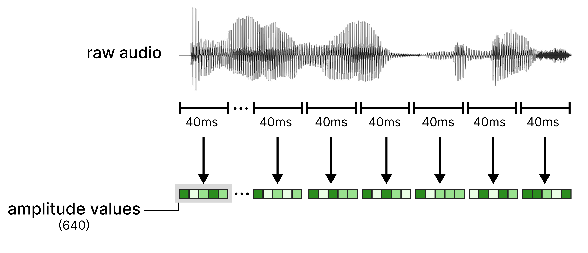
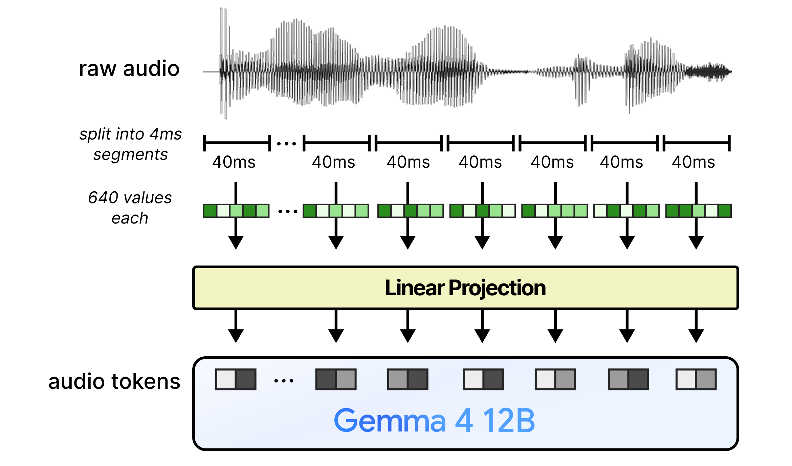
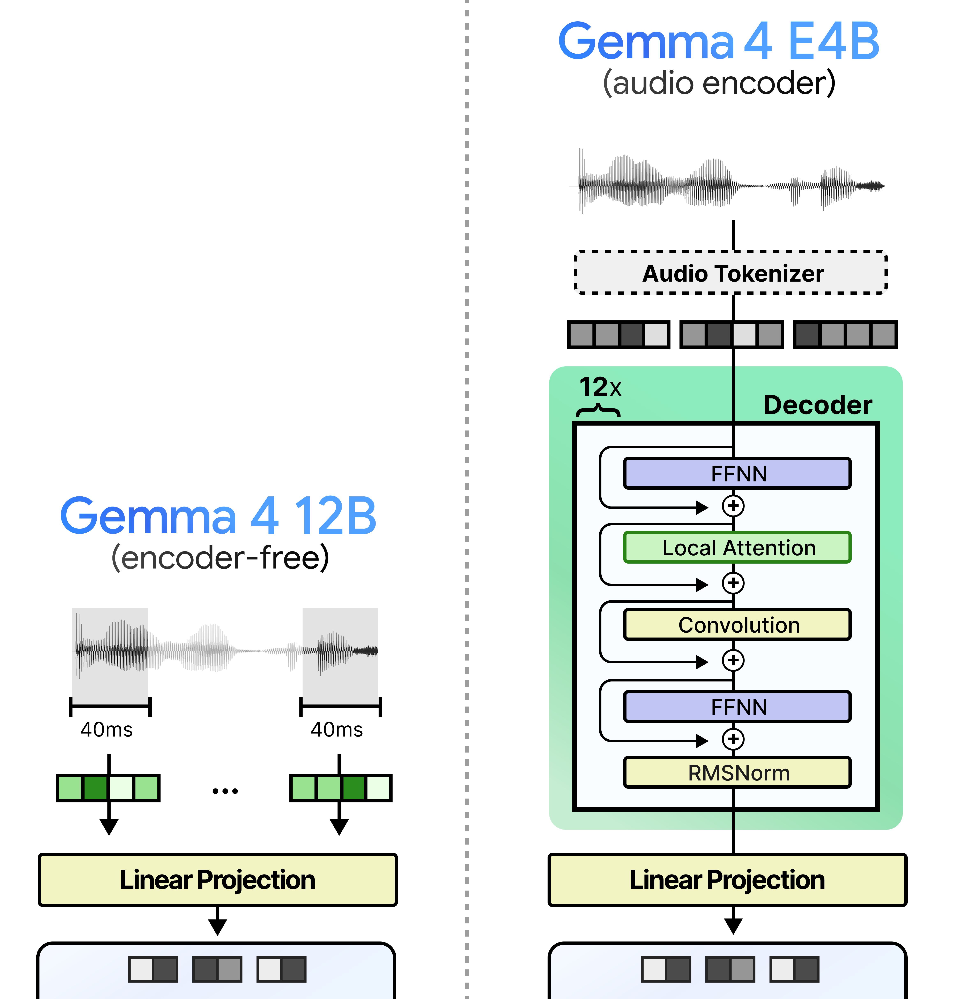

# 오디오는 왜 더 단순하게 encoder-free가 되나

> 원본: [Exploring Language Models](https://newsletter.maartengrootendorst.com/p/a-visual-guide-to-gemma-4-12b)

직전 편에서는 Gemma 4 12B가 vision encoder를 없애기 위해 image patch embedder를 어떻게 구성했는지 봤다. 이미지는 $48 \times 48$ raw patch를 projection하고, 별도의 x/y positional embedding을 더하고, LayerNorm을 거쳐 LLM 입력 차원에 맞추는 흐름이었다. encoder-free라고 해도 이미지에서는 최소한 "이 patch가 원본 이미지의 어디에 있었는가"를 따로 주입해야 했다.

오디오는 더 단순하다. Gemma 4 12B의 audio path는 raw waveform을 일정 길이로 자른 뒤, 그 벡터를 linear projection으로 LLM token embedding 차원에 맞춘다. 기존 encoder가 하던 attention 기반 feature extraction은 사라지고, 시간 순서에 따른 의미 해석은 LLM 본체가 가져간다.

*Figure 1. Gemma 4 12B의 전체 encoder-free 개요. 이미지와 오디오는 별도 encoder를 통과하지 않고, 가벼운 embedding/projection 단계만 거쳐 LLM 입력 시퀀스에 합류한다.*

## 왜 오디오는 이미지보다 단순한가

이미지와 오디오는 둘 다 text token이 아니다. 그래서 LLM이 처리하려면 결국 "LLM의 token embedding과 같은 차원의 벡터"로 변환되어야 한다. 하지만 두 modality가 가지고 있는 구조는 다르다.

이미지는 공간적이다. 같은 patch 값이라도 왼쪽 위에 있는지, 오른쪽 아래에 있는지에 따라 의미가 달라진다. vision encoder가 있을 때는 attention과 $2$D positional encoding이 이 공간 관계를 처리했지만, encoder-free embedder에서는 x/y 위치 테이블을 직접 더해 주어야 한다.

오디오는 기본적으로 시간 순서의 신호다. waveform은 앞에서 뒤로 흐르고, LLM 입력 시퀀스도 앞에서 뒤로 흐른다. 따라서 이미지처럼 별도의 $x/y$ 좌표계를 만들 필요가 작고, 각 audio chunk를 순서대로 token처럼 나열하는 방식이 자연스럽다.

| Modality | 입력 구조 | encoder-free에서 필요한 추가 정보 | LLM이 맡는 부담 |
|---|---|---|---|
| Image | $2$D spatial grid | patch 위치를 위한 x/y positional embedding | patch 간 관계, 객체, 장면 이해 |
| Audio | 시간 순서 waveform | chunk 순서 자체가 시간 정보를 제공 | 음소, 리듬, 발화, 소리 패턴 이해 |

여기서 "오디오는 쉽다"는 뜻은 아니다. 단지 encoder를 제거한 뒤 남는 연결 장치가 이미지보다 간단하다는 뜻이다. 음성 인식, 소리 분류, 화자 단서, 배경음 해석 같은 일은 여전히 어렵고, 그 어려움은 이제 audio encoder가 아니라 LLM 내부 attention layer로 이동한다.

## raw audio를 token으로 자르는 방식

Gemma 4 12B는 오디오를 먼저 $16\,000$Hz로 다룬다. 이는 $1$초에 $16\,000$개의 snapshot, 즉 amplitude sample을 기록한다는 뜻이다. 모델은 이 긴 waveform을 $40\text{ms}$ 단위로 나눈다.

$40\text{ms}$는 $0.04$초다. 따라서 한 구간에 들어가는 sample 수는 $16\,000 \times 0.04 = 640$개다. 하나의 audio chunk는 길이 $640$인 raw amplitude vector가 되고, 이 vector 하나가 나중에 하나의 audio token embedding으로 바뀐다.

*Figure 15. $16\,000$Hz audio를 $40\text{ms}$ 구간으로 나누면 chunk마다 $640$개의 raw amplitude sample이 생긴다.*

이 단계에서 주목할 점은 feature engineering이 거의 없다는 것이다. spectrogram을 만들거나, mel filter bank를 적용하거나, 음향 encoder가 좋아하는 중간 representation으로 바꾸지 않는다. 원문이 강조하는 흐름은 "raw features를 그대로 projection한다"에 가깝다.

정리하면 audio tokenization은 다음 순서다.

- 입력 waveform을 $16\,000$Hz 기준 sample sequence로 본다.
- sequence를 $40\text{ms}$ 구간으로 자른다.
- 각 구간은 $640$개의 amplitude sample을 가진 vector가 된다.
- 이 vector를 linear projection에 넣어 Gemma 4 12B의 hidden dimension에 맞춘다.
- projection된 vector들을 text token embedding 사이에 interleave하거나 함께 넣어 LLM이 처리하게 한다.

텍스트 tokenizer와 비슷하게 생각하면 이해가 쉽다. text에서는 문자열을 subword token으로 쪼개고 embedding table을 통해 벡터로 바꾼다. audio path에서는 waveform을 fixed-size chunk로 쪼개고, embedding table 대신 linear projection을 통해 벡터로 바꾼다.

## linear projection만 남긴다

encoder-free audio path의 핵심은 linear projection이다. 입력은 길이 $640$의 raw amplitude vector이고, 출력은 LLM이 기대하는 embedding dimension의 vector다. 이 출력이 audio token embedding으로 취급된다.

*Figure 16. Gemma 4 12B audio path의 핵심은 split and project다. attention 기반 audio encoder 없이 raw chunk를 LLM 입력 차원으로 바로 보낸다.*

이 구조는 vision embedder보다도 단순하다. vision 쪽에서는 raw patch projection 외에도 spatial positional embedding과 LayerNorm이 중요했다. audio 쪽에서는 chunk의 순서가 곧 시간 순서이므로, 별도의 $2$D 위치 주입 장치가 필요하지 않다.

물론 LLM 내부에는 자체 positional mechanism이 있다. audio token들이 text token들과 같은 sequence에 들어오면, LLM은 그 순서 정보를 바탕으로 앞뒤 맥락을 계산한다. 기존 audio encoder에서 먼저 처리하던 short-range acoustic pattern과 longer-range temporal dependency가 이제 LLM layer 안으로 들어오는 셈이다.

이 설계가 과감한 이유는 projection 자체가 audio를 "이해"하지는 않기 때문이다. linear layer는 $640$차원 sample vector를 다른 차원의 vector로 옮길 뿐, attention으로 주변 chunk를 보거나 음향 구조를 단계적으로 압축하지 않는다. 따라서 모델이 제대로 작동하려면 학습 과정에서 LLM이 raw audio token sequence의 규칙을 직접 배워야 한다.

## E4B audio encoder와의 차이

기존 Gemma 4 E2B와 E4B는 audio encoder를 쓴다. 원문 기준으로 두 모델의 audio encoder는 같은 구조이며, 약 $305$M parameter를 가진다. 이 encoder는 raw audio를 먼저 tokenizer/encoder path로 처리하고, 그 결과를 LLM token embedding과 맞는 공간으로 projection한다.

Gemma 4 12B는 이 중간 encoder stack을 제거한다. audio input을 잘라서 바로 projection하기 때문에, LLM 앞에 놓인 별도 Transformer 계열 처리가 사라진다. Figure 17은 이 차이를 가장 직접적으로 보여준다.

*Figure 17. Gemma 4 12B audio projection과 Gemma 4 E4B audio encoder의 대비. 12B 경로는 encoder stack이 없고, E4B 경로는 audio tokenizer와 encoder 처리를 거친 뒤 LLM에 연결된다.*

비교를 표로 놓으면 설계 의도가 더 분명하다.

| 항목 | Gemma 4 E4B audio path | Gemma 4 12B audio path |
|---|---|---|
| 핵심 처리 | audio tokenizer + encoder stack + projection | $40\text{ms}$ split + linear projection |
| encoder parameter | 약 $305$M | 제거 |
| attention 위치 | LLM 앞 audio encoder와 LLM 내부 | LLM 내부로 집중 |
| 입력 feature | encoder가 처리한 audio feature | raw amplitude chunk |
| 장점 | modality 전용 inductive bias | 낮은 latency, 단순한 pipeline |
| 비용 | 추가 parameter와 사전 처리 latency | LLM의 학습 부담 증가 |

E4B 방식은 전통적인 multimodal LLM 설계에 가깝다. modality별 encoder가 먼저 신호를 해석하고, connector가 LLM이 읽을 수 있는 차원으로 맞춘다. 이 접근은 안정적이지만, LLM이 답변을 시작하기 전 encoder 계산이 끝나야 한다.

12B 방식은 connector에 가까운 부분만 남긴다. audio-specific encoder가 사라졌으므로 입력 token이 LLM에 더 빨리 도착한다. 대신 LLM은 덜 정제된 token을 받는다.

## latency: 기다림을 줄인다

encoder-free의 가장 직관적인 이점은 latency다. 기존 구조에서는 audio encoder가 먼저 전체 또는 일정 구간의 입력을 처리하고, 그 결과가 projection된 뒤 LLM으로 넘어간다. LLM 입장에서는 modality encoder가 준비해 준 embedding을 기다려야 한다.

Gemma 4 12B에서는 이 대기 구간이 크게 줄어든다. raw waveform을 chunk로 자르고 linear projection을 적용하는 비용은 attention stack을 통과하는 것보다 훨씬 단순하다. 그래서 audio token이 LLM에 들어가는 시점이 빨라지고, 전체 inference pipeline도 짧아질 수 있다.

다만 latency 이득을 "항상 최종 응답이 훨씬 빠르다"로 읽으면 안 된다. encoder가 사라진 만큼 LLM이 더 많은 audio understanding을 수행해야 하므로, LLM 내부 계산량과 context length 압력은 중요해진다. 특히 긴 오디오에서는 $40\text{ms}$마다 token이 하나씩 생기므로, $1$초에 약 $25$개의 audio token이 추가된다.

| 오디오 길이 | chunk 크기 | 생성되는 audio token 수 |
|---|---:|---:|
| $1$초 | $40\text{ms}$ | 약 $25$개 |
| $10$초 | $40\text{ms}$ | 약 $250$개 |
| $60$초 | $40\text{ms}$ | 약 $1\,500$개 |

짧은 음성 명령이나 간단한 소리 입력에서는 encoder-free path가 매우 매력적이다. 반대로 긴 회의 녹취나 장시간 오디오 이해에서는 context budget, attention cost, long-range alignment가 다시 문제가 된다. encoder를 없애면 앞단은 단순해지지만, 전체 시스템의 병목이 LLM 쪽으로 이동한다.

## parameter: 작아진 앞단, 커진 책임

parameter 관점에서도 audio encoder 제거는 명확한 효과가 있다. E2B/E4B의 audio encoder가 약 $305$M parameter였다면, 12B의 audio path는 linear projection 중심의 훨씬 작은 모듈이다. multimodal capability를 유지하면서 별도 encoder parameter를 줄일 수 있다.

이 이점은 배포 관점에서 중요하다. 모델을 serving할 때 parameter가 줄면 memory footprint가 낮아지고, encoder와 LLM을 따로 최적화해야 하는 부담도 줄어든다. 특히 여러 modality를 지원하는 모델에서는 vision encoder, audio encoder, connector가 각각 운영 복잡도를 만든다.

하지만 parameter가 사라졌다는 것은 capacity가 사라졌다는 뜻이기도 하다. audio encoder가 가지고 있던 음향 domain 전용 inductive bias와 representation capacity를 LLM이 대신 떠안는다. 즉, "parameter를 아꼈다"는 말은 "그 일을 더 큰 LLM 본체와 학습 데이터에 맡겼다"는 말과 함께 읽어야 한다.

이 지점에서 Gemma 4 12B의 크기가 의미를 가진다. 작은 LLM이라면 raw audio token을 직접 이해하는 부담이 너무 클 수 있다. 12B는 E4B보다 큰 LLM이기 때문에, 별도 audio encoder가 하던 일부 일을 내부 layer로 흡수할 여지가 있다.

## fine-tuning: 단순하지만 더 조심스럽다

원문에서 중요한 관찰 중 하나는 fine-tuning 복잡도다. 기존 multimodal 모델에서는 LLM만 fine-tune하고 encoder는 고정하는 경우가 많다. 그러면 modality encoder가 새 task나 새 domain에 맞춰 함께 적응하지 못할 수 있다.

반대로 encoder까지 함께 fine-tune하면 pipeline이 복잡해진다. learning rate, batch 구성, modality별 loss, memory 사용량을 모두 신경 써야 한다. encoder와 LLM이 서로 다른 속도로 망가질 수 있기 때문에 튜닝 난도가 올라간다.

encoder-free 구조는 이 문제를 단순화한다. 별도 audio encoder가 없으니, fine-tuning의 중심은 LLM과 작은 projection module이 된다. modality-specific encoder를 어떻게 얼릴지, 어디까지 풀지, 어느 layer를 adapter로 감쌀지 같은 선택지가 줄어든다.

하지만 trade-off도 있다. audio 이해 능력 자체가 LLM에 더 깊게 섞이기 때문에, fine-tuning이 audio capability를 보존하면서 text capability를 유지해야 한다. raw audio token을 읽는 방식이 LLM 내부에 분산되어 있다면, 특정 task fine-tuning이 그 표현을 쉽게 흔들 수 있다.

| 관점 | encoder 기반 | encoder-free |
|---|---|---|
| fine-tuning 대상 | LLM, encoder, connector 중 선택 | LLM과 projection 중심 |
| 장점 | encoder를 고정해 안정성 확보 가능 | 구조가 단순하고 end-to-end 적응이 쉬움 |
| 위험 | encoder와 LLM의 domain mismatch | LLM 내부 multimodal 능력의 간섭 |

따라서 encoder-free는 fine-tuning을 자동으로 쉽게 만드는 만능 해결책이 아니다. 구성 요소는 줄어들지만, LLM 하나가 더 많은 역할을 맡기 때문에 catastrophic forgetting이나 modality 간 간섭을 더 주의 깊게 봐야 한다.

## 한계: projection은 이해가 아니다

Gemma 4 12B의 audio path는 인상적으로 단순하지만, 그 단순함이 곧 한계다. linear projection은 raw amplitude sample을 LLM hidden space로 옮긴다. 그러나 음소 경계, pitch contour, speaker identity, background noise, prosody 같은 구조를 명시적으로 추출하지는 않는다.

audio encoder는 이런 구조를 처리하기 위해 만들어진 도구다. Conformer나 Transformer 기반 audio encoder는 local pattern과 temporal context를 함께 보며, raw waveform 또는 acoustic feature를 점진적으로 더 의미 있는 representation으로 바꾼다. Gemma 4 12B는 그 과정을 줄이고 LLM에게 직접 맡긴다.

그래서 encoder-free의 성패는 학습에 달려 있다. LLM이 충분한 multimodal pretraining을 통해 raw audio chunk sequence와 language output 사이의 대응을 배워야 한다. 데이터가 부족하거나 task가 특수하면, 전용 audio encoder가 주는 inductive bias가 오히려 더 유리할 수 있다.

또 하나의 한계는 token efficiency다. $40\text{ms}$ chunk는 단순하고 균일하지만, 모든 구간이 같은 정보량을 갖지는 않는다. 침묵, 잡음, 길게 늘어진 모음, 빠른 자음 전환은 서로 다른 처리 밀도를 요구할 수 있다. fixed chunk 방식은 pipeline을 단순하게 만들지만, adaptive compression은 거의 하지 않는다.

## 시사점: LLM이 multimodal front-end가 된다

Gemma 4 12B의 encoder-free audio path가 던지는 가장 큰 메시지는 "LLM이 더 많은 front-end 역할을 할 수 있다"는 것이다. 과거에는 image와 audio를 LLM 밖에서 충분히 해석한 뒤, LLM에는 잘 정리된 token embedding만 넘기는 방식이 자연스러웠다. 12B는 그 경계를 LLM 쪽으로 밀어 넣는다.

이는 모델 구조의 통합을 의미한다. modality별 expert encoder를 붙이는 대신, raw에 가까운 token을 공통 LLM으로 보내고, LLM이 attention을 통해 modality 간 관계를 배운다. text, image, audio가 모두 같은 decoder stack 안에서 만나는 설계다.

장점은 명확하다.

- 별도 encoder 계산이 줄어 latency가 낮아질 수 있다.
- parameter와 serving component가 줄어 pipeline이 단순해진다.
- fine-tuning 시 modality encoder를 따로 관리하는 부담이 줄어든다.
- LLM 내부에서 text/audio/image interaction을 더 직접적으로 학습할 수 있다.

하지만 비용도 명확하다.

- LLM이 raw modality 구조를 더 많이 학습해야 한다.
- 긴 입력에서는 token 수가 빠르게 늘어난다.
- 전용 encoder가 제공하던 inductive bias와 compression을 잃는다.
- 특정 audio domain에서는 별도 encoder가 여전히 더 효율적일 수 있다.

따라서 encoder-free는 "encoder는 불필요하다"는 결론이 아니라, "충분히 큰 LLM과 충분한 학습이 있다면 encoder의 일부 역할을 LLM 안으로 흡수할 수 있다"는 제안에 가깝다. 특히 audio는 시간 순서와 LLM sequence 구조가 잘 맞기 때문에, vision보다 더 단순한 형태로 이 실험이 가능했다.

## 결론

Gemma 4 12B의 audio path는 시리즈 전체에서 가장 간단한 구조다. audio를 $16\,000$Hz로 보고, $40\text{ms}$마다 $640$개의 amplitude sample로 자르고, linear projection으로 LLM hidden dimension에 맞춘다. 그리고 나머지는 LLM이 한다.

이 단순함은 우연이 아니다. 오디오는 이미지처럼 $2$D spatial coordinate를 별도로 복원해야 하는 입력이 아니라, 시간 순서가 곧 sequence order인 입력이다. 그래서 encoder-free로 만들 때 필요한 연결 장치가 더 작고 직접적이다.

기존 E4B audio encoder와 비교하면 차이는 분명하다. E4B는 약 $305$M parameter의 audio encoder로 feature를 먼저 만들고, 12B는 encoder stack을 제거한 뒤 raw chunk를 바로 token화한다. 그 결과 latency와 parameter, fine-tuning 복잡도에서 이점이 생긴다.

다만 공짜 점심은 아니다. encoder가 사라진 만큼 LLM은 더 덜 가공된 audio token을 이해해야 한다. 이 모델이 흥미로운 이유는 encoder를 없앴기 때문만이 아니라, multimodal understanding의 중심을 점점 더 LLM 본체로 옮기는 방향을 보여주기 때문이다.

Gemma 4 12B는 E4B와 26B A4B 사이의 빈 크기를 채우는 모델이면서, 동시에 "connector만으로 어디까지 갈 수 있는가"를 묻는 모델이다. audio path는 그 질문에 가장 간결한 답을 준다. split, project, 그리고 LLM에게 맡긴다.

## 출처

- 원문: [Exploring Language Models - A Visual Guide to Gemma 4 12B](https://newsletter.maartengrootendorst.com/p/a-visual-guide-to-gemma-4-12b)
