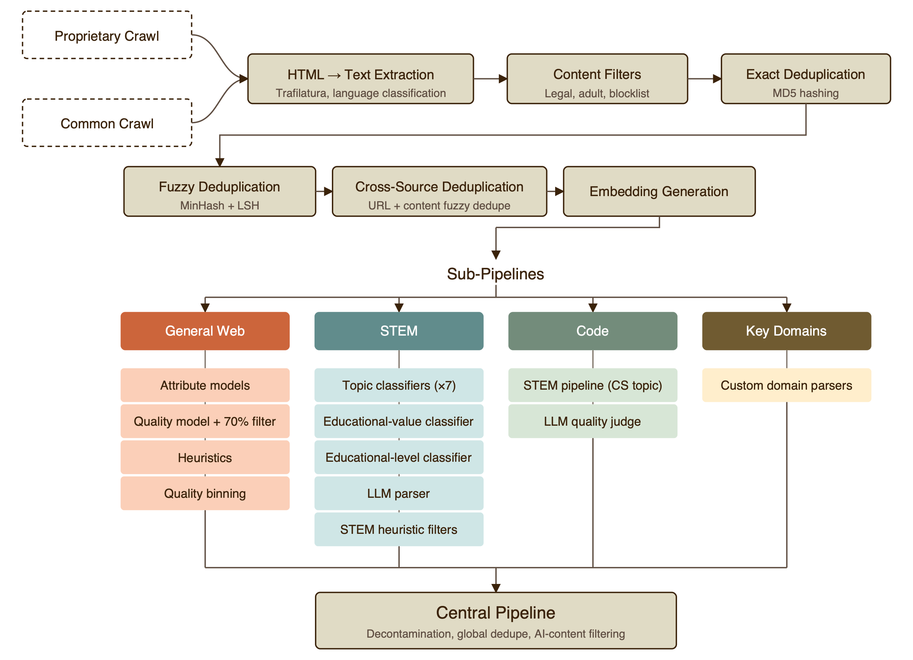

# pre-training은 어떻게 실험 가능한 과학이 되었나

> 원본: [Microsoft AI technical report](https://microsoft.ai/pdf/mai-thinking-1.pdf)

MAI-Thinking-1의 첫 번째 기반은 MAI-Base-1이다. 보고서는 이 base model을 단순히 "큰 MoE를 많이 학습했다"로 설명하지 않는다. 핵심은 pre-training 결정을 반복 가능한 실험으로 바꾸는 장치들이다. 깨끗한 human-generated corpus, scale을 따라가는 ablation, 빠르게 돌릴 수 있는 $NLL$ 평가, 그리고 data mixture search가 하나의 루프로 묶인다.

이 편은 원문 2장의 pre-training 파트를 따라간다. 특히 Microsoft가 강조하는 지점은 shortcut을 쓰지 않는다는 선언과, 그 선언을 실험 체계로 지탱하는 방법이다. pre-training에는 language-model-generated synthetic data를 쓰지 않고, third-party model distillation도 쓰지 않으며, open-source training dataset을 그대로 가져오지 않는다. 대신 원천 데이터를 직접 수집, 정제, 분류하고, 작은 scale의 신호가 큰 scale에서도 유지되는지 계속 확인한다.

## Architecture는 실험 가능한 family로 설계된다

MAI-Base-1은 $35$B active / 약 $1$T total parameter의 sparse MoE decoder-only Transformer다. 최종 구성은 $78$ layer, top-$8$ / $512$ experts, periodic local/global attention, dense FFN과 MoE FFN의 교대 구조를 사용한다. architecture 자체의 세부도 중요하지만, 이 장에서 더 중요한 점은 모든 variant가 하나의 ladder family 안에서 비교되도록 설계됐다는 것이다.

모델 family는 layer 수 $L$을 중심으로 정의된다. $L$이 정해지면 hidden size, head 수, FFN 크기, MoE 크기가 함께 정해지고, $L12$부터 $L78$까지 같은 비율을 유지한 model scale이 만들어진다. 그래서 한 architecture change나 data change를 볼 때 "작은 모델 하나에서 좋아졌다"가 아니라 "scale을 키워도 scaling curve가 좋아지는가"를 물을 수 있다.

architecture 요약은 다음처럼 읽을 수 있다.

| 구성 | MAI-Base-1의 선택 | 실험상 의미 |
|---|---|---|
| attention | local $5$개 + global $1$개 주기 | 긴 context와 inference KV cost를 줄이는 구조 |
| feed-forward | dense FFN과 high-sparsity MoE 교대 | every-layer MoE보다 wall-clock tradeoff를 개선 |
| MoE routing | LatentMoE, top-$8$ / $512$ experts | compressed latent space에서 expert dispatch |
| tokenizer | `o200k_base`, vocab $200{,}019$ | 내부 tooling과 평가 일관성 우선 |
| MoE 구현 | dropless routing | token dropping이 ablation 결론을 왜곡하지 않도록 함 |

여기서 dropless MoE는 pre-training 실험의 신뢰성과도 연결된다. finite capacity에서 token dropping이 발생하면 routing 방법, imbalance, dropped token 처리 방식이 결과에 섞일 수 있다. Microsoft는 variable-size all-to-all을 지원하는 dropless MoE로 수렴해, architecture ablation이 실제 architecture 효과를 더 직접적으로 반영하도록 만들었다.

## Scaling ladder: 작은 실험을 큰 결정으로 연결하는 장치

보고서가 "scientific rigor"라고 부르는 핵심 도구는 scaling ladder다. 모든 ablation은 여러 model size를 같은 tokens-per-active-parameter 조건에서 학습해 baseline scaling curve와 비교한다. architecture ablation은 보통 Chinchilla-optimal에 가까운 $100$-$200$ TPP 근처에서 수행하고, 최종 main run은 inference 비용을 고려해 더 compact한 over-trained model을 만들기 위해 $500$-$1{,}000$ TPP 수준으로 간다.

이 방식의 장점은 candidate의 효과가 scale에 따라 사라지는지 조기에 볼 수 있다는 점이다. 작은 scale에서 좋아 보이는 dataset이나 architecture가 frontier scale에서는 효용이 줄어들 수 있다. ladder는 이 문제를 "감"이 아니라 curve 비교로 다룬다.

효율 비교에는 efficiency gain, 즉 $EG$를 쓴다. baseline ladder에 scaling law를 맞춘 뒤,

$$
L = f(C) = AC^{-\alpha} + E
$$

candidate run이 loss $L'$를 cost $C'$로 달성했을 때 baseline이 같은 loss에 도달하려면 얼마의 cost가 필요한지 계산한다.

$$
EG = \frac{f^{-1}(L')}{C'}
$$

$EG = 1.3$이면 baseline은 candidate와 같은 loss를 얻기 위해 $30$% 더 큰 cost가 필요하다는 뜻이다. 여기서 $C$는 FLOPs일 수도 있고, 실제 training time일 수도 있다. 원문은 보통 FLOPs 기준 $EG_{\mathrm{FLOPs}}$를 보되, infrastructure efficiency가 중요한 경우 $EG_{\mathrm{Time}}$도 함께 본다.

이 구분은 architecture 선택에서 중요했다. 예를 들어 every-layer MoE variant는 FLOPs 기준으로는 baseline과 비슷하거나 약간 좋아 보일 수 있지만, training time까지 넣으면 interleaved dense/MoE layout이 더 나은 선택이었다. 즉 "더 좋은 모델 구조"와 "현재 시스템에서 더 빨리 학습되는 구조"를 분리해서 본 뒤, 최종 모델에서는 둘을 함께 최적화했다.

## NLL evaluation: 빠르고 일관된 pre-training 계기판

pre-training 단계에서는 모든 후보를 downstream benchmark와 post-training까지 밀어보는 것이 어렵다. 그래서 MAI team은 내부 $NLL$ evaluation suite를 만든다. coding, STEM, math, general knowledge, multilingual의 다섯 범주에 걸쳐 약 $40$개의 held-out benchmark를 구성하고, 모든 실험을 같은 tokenizer와 같은 scoring 방식으로 비교한다.

집계 목표는 명시적인 weight를 가진다.

$$
\mathrm{Target} = 0.5 \times \mathrm{Coding} + 0.175 \times \mathrm{STEM} + 0.175 \times \mathrm{Math} + 0.1 \times \mathrm{General} + 0.05 \times \mathrm{Multilingual}
$$

이 식은 평가 철학을 숨기지 않는다. MAI-Base-1은 reasoning과 coding 기반을 만들기 위한 모델이므로 coding에 가장 큰 비중을 두고, math를 broader STEM과 분리해 별도 범주로 취급한다. 각 category score는 raw $NLL$을 고정된 내부 reference model 기준으로 normalize한 뒤 평균한다.

$NLL$을 쓰는 이유도 실용적이다. multiple-choice, generative, judge-based evaluation은 inference stack, generation setting, judge model, answer formatting에 민감하다. 반면 $NLL$은 pre-training과 같은 next-token prediction objective이고, generation 없이 logits만으로 계산할 수 있어 빠르고 싸다. 이 때문에 수천 개의 작은 model run과 ladder ablation에서 같은 기준을 반복 적용할 수 있다.

public benchmark contamination도 별도 문제로 다룬다. Hugging Face와 mirror domain 데이터를 제거하고, 모든 training source에 $20$-gram fuzzy deduplication을 적용하며, similarity threshold $80$%를 사용한다. 그래도 완전하지 않다는 것을 인정하고, 웹에 존재하지 않는 internal 또는 vendor-created benchmark를 개발해 day-to-day decision에 사용한다.

## Data는 양보다 통제 가능성이 먼저다

MAI-Base-1은 publicly available data와 licensed data로 구성된 human-generated corpus에서 학습된다. 범위는 web, public GitHub code, books, academic papers, news, multilingual text, domain-specific material을 포함한다. 보고서는 pre-training에 language-model-generated synthetic data를 쓰지 않았고, 수집된 corpus 안에서도 AI-generated content를 피하고 제거하려 노력했다고 밝힌다.

데이터 governance는 꽤 강하게 서술된다. web data는 robots.txt와 관련 web control을 존중하는 proprietary crawler로 수집하고, commercial provider data는 usage rights와 ownership diligence를 거친다. private customer data나 Microsoft product/service data는 pre-training에 쓰지 않았다고 설명하되, 사용자가 명시적으로 opt-in했거나 적용 가능한 agreement가 있는 경우는 예외로 둔다. 전체 corpus에는 PII-risk와 safety filtering이 적용된다.

knowledge cutoff도 source family별로 다르다.

| Source family | Knowledge cutoff |
|---|---|
| Web HTML pages | September 2025 |
| Web PDFs | December 2025 |
| Public GitHub Code | June 2025 |
| Books and journals | March 2026 |

이 표는 단순한 메타데이터가 아니다. source family별 freshness, licensing, processing pipeline이 다르기 때문에, final mixture를 해석할 때 어떤 지식이 어디에서 왔는지 구분하는 기준이 된다.

## Web pipeline은 corpus를 bucket으로 바꾸는 과정이다

*Web HTML data는 proprietary crawl과 Common Crawl에서 시작해 extraction, filtering, deduplication, embedding generation을 거친 뒤 general web, STEM, code, key domains 같은 하위 pipeline으로 분기된다.*

그림의 pipeline은 원문에서 Fig. 4로 설명되는 web data processing flow다. 시작점은 proprietary crawl과 Common Crawl이고, 먼저 HTML에서 text를 추출한다. 이후 legal, adult, blocklist 기반 content filter를 통과하고, exact deduplication, fuzzy deduplication, cross-source deduplication을 거친다. embedding generation 이후에는 source 목적에 따라 sub-pipeline으로 분기된다.

중요한 점은 이 pipeline이 "깨끗한 text를 많이 만들기"에서 끝나지 않는다는 것이다. general web은 attribute model, quality model, heuristic filter, quality binning을 거친다. STEM 쪽은 topic classifier, educational-value classifier, educational-level classifier, LLM parser, STEM heuristic filter를 사용한다. code나 key domain도 별도의 parser와 quality judge를 통과한다.

이렇게 만들어진 결과는 단일 corpus가 아니라 mixture optimization에 쓸 수 있는 bucket collection이다. bucket은 quality tier, language group, topic, educational value, educational level, source type, domain-specific subcorpus 같은 해석 가능한 축을 가진다. 이후 data mixture search는 이 bucket의 weight를 조절하는 문제가 된다.

## Deduplication은 memorization 방지이자 scaling 보정이다

원문은 deduplication을 privacy나 contamination 문제로만 보지 않는다. 큰 sparse model은 detail을 외울 수 있는 capacity가 크기 때문에, 반복된 content는 memorization과 overfitting으로 이어질 수 있다. 더 중요한 것은 scaling behavior 자체가 unique token 수에 민감하다는 점이다. diversity가 낮은 corpus는 작은 모델에서는 좋아 보여도, 큰 모델에서는 새 정보를 빨리 소진해 scaling이 나빠질 수 있다.

Microsoft가 사용하는 deduplication은 여러 층으로 나뉜다.

- boilerplate removal: header, footer, navigation, sidebar 같은 반복 text 제거
- exact duplicates: byte-level 또는 hash-level 동일 문서 제거
- fuzzy duplicates: MinHash LSH 기반 near-duplicate 제거, similarity threshold $0.8$
- templated web pages: template skeleton을 만들어 계산기류처럼 구조만 반복되는 page 제거
- semantic duplication: embedding similarity로 독립 작성됐지만 의미가 매우 비슷한 문서 cluster 축소
- cross-dataset dedupe: global drop-order를 두고 가장 높은 priority dataset에만 instance 유지

cross-dataset dedupe는 특히 mixture interpretation에 영향을 준다. 어떤 dataset을 수정하면 다른 dataset과의 overlap이 바뀌고, 실제 training에 들어가는 token이 source family 사이에서 이동할 수 있다. 따라서 data ablation은 dataset 하나의 독립 효과를 보는 문제가 아니라, 전체 corpus graph 안에서 overlap까지 고려하는 문제가 된다.

## Data mixture search: rank non-invariance가 경고한 것

data mixture selection은 고정 compute budget에서 수백 개 source의 상대 weight를 정하는 문제다. Microsoft는 목표 함수를 $NLL$ suite의 weighted aggregate로 정의하고, 여러 mixture를 작은 scale에서 학습해 validation loss frontier를 탐색한다. 그러나 원문이 강조하는 가장 중요한 교훈은 작은 scale의 rank가 항상 큰 scale의 rank로 보존되지 않는다는 점이다.

보고서는 code-heavy mix와 stem-heavy mix의 사례를 든다. 작은 scale과 초기 training에서는 stem-heavy mix가 STEM held-out $NLL$에서 더 좋아 보였다. 하지만 $23$B active parameter 모델을 약 $20$T token까지 학습하자 curve가 중간에 교차했고, 최종적으로 code-heavy mix가 STEM 평가에서도 더 나았다. 두 mixture의 차이는 training source weight뿐이었다.

사후 분석에서는 stem-heavy mix에 높은 weight로 들어간 두 STEM source가 문제로 지목된다. quality는 높았지만 fuzzy duplication이 많고 content diversity가 낮았다. 작은 모델에는 매우 유용했지만, scale이 커지고 training horizon이 길어지자 다양성 부족이 병목이 된 것으로 해석된다. 원문은 이 결과 이후 candidate mixture의 fixed-scale score뿐 아니라 ladder 기반 scaling performance를 더 중시했다고 말한다.

최종 mix selection은 hierarchical search로 진행된다. data를 coding, STEM, PDFs, general web 등 약 $10$개 high-level category로 나누고, 두 종류의 search를 번갈아 수행한다.

| Search | 고정하는 것 | 바꾸는 것 |
|---|---|---|
| Local search | high-level category weight | category 내부 source weight |
| Global search | category 내부 구성 | high-level category 사이의 relative weight |

모든 과정에서 dataset별 최대 repetition은 $8$ epoch로 제한한다. 작은 고품질 dataset을 과도하게 반복하면 fixed-scale $NLL$은 좋아질 수 있지만, long horizon에서는 overfitting과 diminishing return으로 이어질 수 있기 때문이다.

## Final mix는 code 중심이지만 web과 PDF를 소진하지 않는다

최종 pre-training mix는 총 $30$T training tokens이고, deduplicated unique tokens는 약 $29.2$T다. 전체 평균 epoch는 $1.03\times$로 보이지만 source family별 사용 방식은 크게 다르다.

| Source family | Unique tokens | Training tokens | Mix percentage | Avg. epochs |
|---|---:|---:|---:|---:|
| Code | $7.4$T | $16.4$T | $54.6$% | $2.22\times$ |
| STEM | $2.2$T | $4.7$T | $15.8$% | $2.17\times$ |
| Math | $0.3$T | $1.6$T | $5.4$% | $5.28\times$ |
| Books and journals | $0.6$T | $0.9$T | $3.1$% | $1.65\times$ |
| PDFs | $2.7$T | $1.4$T | $4.7$% | $0.53\times$ |
| Web text | $8.1$T | $4.5$T | $14.9$% | $0.55\times$ |
| Multilingual (other) | $8.1$T | $0.5$T | $1.6$% | $0.06\times$ |

표에서 가장 눈에 띄는 것은 code의 비중이다. MAI-Base-1 pre-training token의 절반 이상이 code source family에서 온다. Math는 unique token은 작지만 평균 $5.28\times$로 가장 많이 반복된다. 반대로 web text와 PDFs는 전체 available corpus를 다 쓰지 않는다. 이는 "web을 최대한 많이 먹인다"보다, downstream objective와 scaling behavior에 맞춰 source family별 sampling pressure를 조절했다는 뜻이다.

mid-training에서도 새 source나 synthetic source를 추가하지 않는다. pre-training corpus에서 더 높은 quality subset을 골라 STEM, math, code 쪽으로 더 강하게 bias를 준다. 원문은 mid-training mixture를 STEM/math $35$%, code $55$%, background $10$%로 설명한다. 이후 context extension을 위해 같은 mixture를 더 긴 sequence length로 repack한다.

## Training recipe와 YOLO가 실험 루프를 닫는다

MAI-Base-1 학습은 세 phase로 구성된다. pre-training은 $30$T token, context length $16{,}384$, $8{,}192$ GB200 GPUs에서 수행된다. mid-training 1은 $3.4$T token, context length $65{,}536$, $8{,}192$ GPUs이고, mid-training 2는 $150$B token, context length $262{,}144$, $4{,}096$ GPUs다.

optimization recipe도 원문은 자세히 공개한다. AdamW를 사용하고, global batch size는 $134$M tokens다. learning rate는 약 $12$B token warmup 후 peak $2 \times 10^{-4}$에서 minimum $2 \times 10^{-5}$까지 cosine decay한다. weight decay, dropout, attention output zero initialization, BF16/FP8 mixed precision, FP32 residual stream 같은 결정도 ladder evaluation과 system constraint를 함께 고려해 선택된다.

이 recipe를 실제로 운영하는 framework가 YOLO다. YOLO는 PyTorch 위에 만든 MAI의 in-house large-scale training framework로, model definition, sharding, optimizer, dataloading, checkpointing, logging을 담당한다. custom kernel, tensor sharding annotation, ZeRO stages, tensor/context/expert/pipeline parallelism, activation checkpointing/offloading, dropless MoE를 포함한다.

이 부분이 pre-training 과학화의 마지막 조건이다. 같은 data mixture와 같은 architecture를 정의해도, distributed training stack이 deterministic하지 않거나 routing과 dataloader order가 흔들리면 ablation 결과는 다시 불안정해진다. YOLO는 속도만이 아니라 determinism, correctness, developer agility를 목표로 둔다. 그래서 scaling ladder, $NLL$ suite, data mixture search가 실제 production-scale run까지 이어질 수 있다.

## 정리: pre-training을 선택 가능한 실험으로 만든 네 가지 축

MAI-Base-1의 pre-training 파트는 거대한 단일 run의 무용담보다, decision system에 가깝다. Microsoft는 clean human-generated corpus를 만들고, 이를 bucket화한 뒤, $NLL$ objective로 data mixture를 탐색한다. 작은 실험은 scaling ladder와 $EG$로 검증하고, rank non-invariance 같은 실패 사례를 통해 fixed-scale optimization의 위험을 보정한다. 마지막으로 YOLO가 동일한 실험을 실제 cluster에서 반복 가능하게 만든다.

이 구조는 다음 편의 RL discussion으로 자연스럽게 이어진다. pre-training은 long RL climb을 시작할 수 있는 prior와 data substrate를 만든다. 하지만 그 climb이 실제로 오래 지속되려면 reward, rollout, learner, data curriculum이 다시 별도의 recipe로 정렬되어야 한다.

다음 편: [RL climb을 오래 지속시키는 recipe](03-rl-recipe-for-long-climbs.md)

## 출처

- https://microsoft.ai/pdf/mai-thinking-1.pdf
