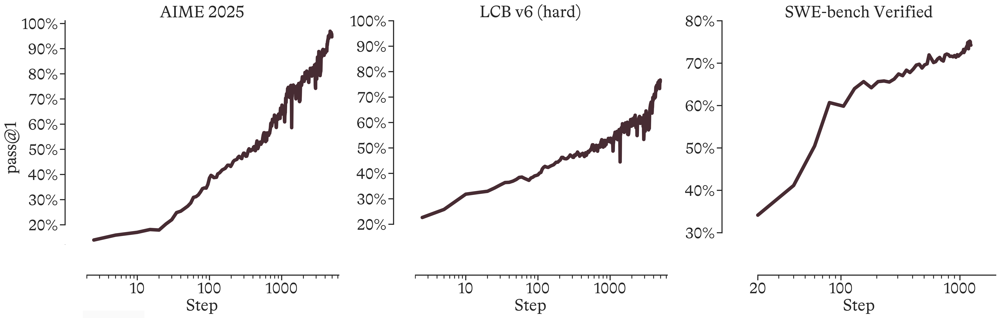

# 평가, 안전성, 인프라가 말해주는 실제 위치

> 원본: [Microsoft AI technical report](https://microsoft.ai/pdf/mai-thinking-1.pdf)

앞선 편들에서는 MAI-Thinking-1이 어떻게 세 개의 specialist climb을 거쳐 하나의 모델로 합쳐졌는지 봤다. 마지막 편에서는 결과를 본다. 공개 benchmark, human side-by-side, safety eval, red teaming, 그리고 cluster 운영 지표가 함께 보여주는 위치는 단순한 "1등 모델" 서사가 아니다.

Microsoft가 보여주려는 핵심은 조금 다르다. MAI-Thinking-1은 일부 STEM과 coding 지표에서 매우 강하지만, 전체 표를 보면 frontier 최상단을 독주하지는 않는다. 대신 from-scratch pre-training, 자체 RL recipe, safety training, 그리고 대규모 cluster 운영을 하나의 반복 시스템으로 묶어 frontier-adjacent 수준까지 끌어올렸다는 점이 더 중요하다.

*Figure 1. MAI-Thinking-1의 RL progress. 마지막 평가 수치는 한 번의 post-training 결과지만, 그 뒤에는 STEM climb과 agentic climb에서 장기간 유지된 상승 곡선이 있다.*

## 공개 benchmark: 강한 곳과 비어 있는 곳

MAI-Thinking-1의 가장 눈에 띄는 숫자는 STEM과 coding 쪽에 모여 있다. 본문 Table 11은 Microsoft가 공식 model card나 release announcement에서 가져온 타 모델 수치와 MAI-Thinking-1을 비교한다. MAI 쪽 평가는 기본적으로 temperature $T=1$, top-p $p=0.97$에서 4회 평균으로 보고된다.

| Benchmark | MAI-Thinking-1 | 비교상 의미 |
|---|---:|---|
| AIME 2025 | 97.0 | Sonnet 4.6의 95.6보다 높고, Opus 4.6의 99.8보다 낮다. |
| AIME 2026 | 94.5 | Kimi K2.6 96.4, GLM-5.1 95.3에 근접한다. |
| LiveCodeBench v6 | 87.7 | DeepSeek V3.2 83.3보다 높지만, Kimi K2.6 89.6과 DeepSeek V4 93.5보다 낮다. |
| SWE-Bench Pro | 52.8 | Opus 4.6 53.4에 가깝지만, GPT 5.4 57.7, Kimi K2.6 58.6, GLM-5.1 58.4에는 못 미친다. |
| SWE-bench Verified | 73.5 | 여러 frontier 모델의 79~81대보다 낮다. |
| Terminal-Bench 2.0 | 46.0 | Sonnet 4.6 59.1, Opus 4.6 65.4, GPT 5.4 75.1과 차이가 크다. |

해석은 명확하다. MAI-Thinking-1은 수학과 competitive coding, 그리고 SWE-Bench Pro 같은 어려운 agentic coding에서 "비슷한 체급의 강한 모델"로 올라왔다. 특히 AIME 2025 97.0%, AIME 2026 94.5%, LiveCodeBench v6 87.7%, SWE-Bench Pro 52.8%는 Microsoft가 abstract와 introduction에서 반복해서 내세우는 대표 수치다.

하지만 이 표는 동시에 한계도 보여준다. Terminal-Bench 2.0에서는 46.0으로, 다른 상위 모델 대비 격차가 분명하다. 논문은 MAI의 SWE agentic training data가 bash와 string-replace tool 중심이며, Terminal-Bench에 맞춘 terminal-interaction environment를 직접 포함하지 않았다고 설명한다. 즉 이 낮은 점수는 "일반 agentic training이 터미널 작업으로 어느 정도 일반화되는가"를 보여주는 수치에 가깝다.

또 다른 주의점은 비교 방식이다. 타 모델 점수는 각자의 공식 자료에서 가져온 것이므로, 모든 모델이 완전히 같은 inference stack과 같은 harness에서 평가된 것은 아니다. MAI가 직접 Sonnet 4.6을 평가한 Table 12와 달리, Table 11은 public leaderboard 성격이 강하다. 그래서 이 표는 순위표라기보다 위치 추정으로 읽는 편이 안전하다.

## Sonnet 4.6과의 넓은 비교

Table 12는 지표 범위를 넓힌다. knowledge, instruction following, long context, tool calling, safety, honesty, health까지 포함하고, 비교 대상으로 Sonnet 4.6을 Microsoft 내부 evaluation suite에서 직접 돌린다. 여기서 MAI-Thinking-1은 대체로 Sonnet 4.6과 비슷한 수준으로 제시된다.

대표적으로 MMLU-Pro는 MAI 85, Sonnet 87이고, SimpleQA Verified는 MAI 31, Sonnet 29다. instruction following에서는 IFBench 69 대 50으로 MAI가 높지만, AdvancedIF는 85 대 86, MultiChallenge는 53 대 57로 비슷하거나 약간 낮다. long context GraphWalks는 90 대 96, BFCL v3 tool calling은 72 대 76이다.

안전과 honesty 쪽도 비슷한 그림이다. AIR-Bench는 둘 다 88, LongFact는 둘 다 98, TruthfulQA도 둘 다 88이다. HealthBench는 MAI 35, Sonnet 38이고, MedXpert QA는 43 대 49로 Sonnet 쪽이 높다. 이 넓은 표는 MAI-Thinking-1을 "특정 benchmark만 잘하는 모델"로 보지 않게 해 주지만, 동시에 범용 능력에서 Sonnet을 일관되게 앞선다고 주장하지도 않는다.

여기서 중요한 점은 consolidation의 목적과 맞닿아 있다. 세 specialist teacher를 하나로 합칠 때 STEM/coding trace가 token weight의 대부분을 차지했지만, 최종 모델은 helpfulness와 safety를 완전히 잃지 않았다. 균형을 맞춘 것이다. 다만 그 균형은 "모든 영역에서 최고"가 아니라 "여러 영역에서 실사용 가능한 frontier-adjacent"에 가깝다.

## Human eval: Sonnet에는 근소 우위, Opus에는 근소 열위

공개 benchmark만으로는 실제 user-facing 품질을 알기 어렵다. Microsoft는 1,276개 영어 task로 side-by-side human evaluation을 구성했다. 이 중 30%는 multi-turn이고, task는 open QA, brainstorming, advising, content authoring, structured problem solving, summarization, academic help 등으로 나뉜다.

평가자는 각 응답을 instruction following, factuality, conciseness and relevance, completeness, style and tone 관점에서 본 뒤, 마지막에 7점 Likert scale로 전체 선호를 고른다. 결과는 아주 큰 차이가 아니라 작은 차이로 나타난다.

| 비교 | Overall preference | 승/무/패 |
|---|---:|---|
| MAI-Thinking-1 vs Sonnet 4.6 | $0.07 \pm 0.06$ | 49% / 6% / 45% |
| MAI-Thinking-1 vs Opus 4.6 | $-0.07 \pm 0.06$ | 43% / 5% / 52% |

MAI-Thinking-1은 Sonnet 4.6보다 약간 선호되지만, Opus 4.6보다는 약간 덜 선호된다. dimension별로 보면 Sonnet 대비 conciseness and relevance에서 $+0.11$, style and tone에서 $+0.08$이 나온다. 반면 instruction following, factuality, completeness는 거의 noise 범위다.

이 결과는 모델의 실제 포지션을 잘 말해 준다. 사람 평가에서는 "사용자가 읽기에 더 간결하고 톤이 좋다"는 장점이 보이지만, factuality나 completeness에서 압도적인 우위가 잡히지는 않는다. Opus 4.6과의 비교에서도 conciseness와 style은 MAI 쪽이 높지만, 전체 선호는 Opus 쪽으로 기운다.

## Safety-helpfulness: 거절과 응답 사이의 trade-off

MAI-Thinking-1에서 안전성은 별도 후처리 장식이 아니라 RL climb의 일부다. 3.4절의 helpfulness and safety climb은 human preference reward model, rubric-guided AI judge, verifiable reward를 섞는다. 특히 safety에서는 response가 policy-non-compliant로 판정되면 다른 품질 점수와 무관하게 minimum reward를 주는 gated aggregation을 쓴다.

이 구조가 필요한 이유는 safety와 helpfulness가 자주 충돌하기 때문이다. 모델이 위험 요청을 거절해야 하는 것은 맞지만, policy-adjacent인 정상 요청까지 과하게 거절하면 사용자 경험은 망가진다. Microsoft는 내부 safety evaluation에서 두 축을 함께 본다.

- **Safety pass rate**: high-sensitivity content에서 안전 정책을 지키는 비율.
- **Helpfulness**: non-sensitive content에서 over-refusal 없이 응답하는 정도. 본문에서는 $1 - \text{over-refusal rate}$로 보고한다.

Figure 20은 harm category별로 이 trade-off를 그린다. MAI-Thinking-1은 8개 category 중 5개에서 Sonnet 4.6보다 위쪽 또는 오른쪽에 위치한다. 특히 CBRN, Self Harm, Elections & Politics에서 개선 폭이 크다고 설명된다.

이 수치를 과장해서 읽을 필요는 없다. 내부 benchmark이고, category별 세부 숫자가 모두 표로 공개되지는 않는다. 그래도 중요한 메시지는 있다. MAI의 safety training은 단순히 refusal을 늘리는 방식이 아니라, 민감하지 않은 요청에서는 답하고 위험 요청에서는 안전하게 제한하는 방향으로 설계되어 있다.

## Jailbreak와 red teaming: 자동 평가 밖의 취약점

Jailbreak 평가에서는 약 2.5K unique seed scenario를 vendor, internal red teaming, open-source benchmark에서 모은 뒤, 최종 약 9.5K jailbreak prompt로 확장한다. 공격은 세 bucket으로 나뉜다.

| Bucket | 설명 | MAI-Thinking-1 ASR |
|---|---|---:|
| Foundational Techniques | jailbreak wrapper나 prompt template 같은 단일 변형 | 4.4% |
| Compositional Techniques | PyRIT, PAP류 template, 비영어·혼합 언어 등 복합 변형 | 17.6% |
| Adaptive Techniques | TAP, multi-turn attack처럼 interaction과 search를 포함 | 26.8% |

ASR은 attack success rate이므로 낮을수록 좋다. 본문은 MAI-Thinking-1이 Sonnet 4.6, Opus 4.6과 비슷한 낮은 ASR을 달성한다고 요약한다. 단, Figure 21의 third-party model 결과에는 provider-side safety filtering이 포함될 수 있다는 단서가 있다.

red teaming은 더 실제적인 층이다. 내부 red team은 개발 초기, 중기, 후기에 걸쳐 15개 engagement를 수행했고, 25개 policy category에서 2,170개 이상의 goal-based adversarial scenario를 실행했다. 각 scenario는 5~10 conversational turn으로 진행되어, 첫 턴 refusal 이후의 multi-turn escalation까지 본다.

반복적으로 나온 공격 패턴은 여섯 가지로 정리된다.

- benign pretext 아래에서 점진적으로 escalation하는 multi-turn attack
- fiction 또는 novelistic framing
- credentialed persona를 내세우는 pretext
- 반복적인 expand, reformat, operationalize 요청으로 경계가 흐려지는 formatting drift
- in-context age-indicator bypass
- authoritative-document fabrication

이 패턴들은 개별 prompt보다 더 중요하다. prompt 하나를 막는 것이 아니라, 같은 취약면을 계속 건드리는 attack family를 찾아 training data와 judge rubric으로 되돌려 넣는 것이 red teaming의 목적이기 때문이다. Microsoft는 top priority remediation category에서 aggregate attack success가 final candidate까지 약 22% 줄었고, jailbreak는 약 44%, hate & fairness는 약 43%, child safety는 약 30%, mental health attack은 약 20% 줄었다고 보고한다.

독립 red team에서도 중요한 gap이 드러났다. TAP 공격은 robustness gap으로 확인되어 targeted adversarial data pipeline으로 이어졌고, Yoruba, Telugu, Amharic, Burmese, Khmer, Malay 같은 low-resource language framing도 취약점으로 제기됐다. Microsoft는 다국어 adversarial seed를 확장해 일부 gap을 줄였지만, low-resource language long tail은 계속 투자할 영역이라고 남긴다.

여기에도 한계는 명시되어 있다. 내부 red teaming은 주로 영어 중심이고, non-English는 제한적으로 jailbreak vector로 사용됐다. agentic tool-use와 multimodal input은 범위 밖이었다. structured dangerous-capability 또는 uplift evaluation도 이번 release scope에는 포함되지 않는다.

## Rocket, YOLO, SGLang: RL을 돌리는 기계

평가 수치 뒤에는 RL infrastructure가 있다. 3.6절에서 소개되는 Rocket은 대규모 asynchronous distributed RL을 위한 Microsoft 내부 framework다. learner는 YOLO를 쓰고, inference는 SGLang 기반 serving stack을 쓴다. 공개 RL framework로는 MAI-Thinking-1 규모의 수천 GPU 비동기 RL 요구를 만족하기 어려웠다는 것이 자체 framework를 만든 이유다.

Rocket의 기본 흐름은 controller, problem worker, rollout worker, router와 inference server로 나뉜다. controller는 task를 보내고 completed rollout과 reward metadata를 받아 learner batch로 넘긴다. problem worker는 early-exit rollout 16개로 task 난이도와 pass-rate 구간을 먼저 보고, 조건이 맞을 때 full rollout 128개를 추가로 보낸다. rollout worker는 model response, tool call, grading을 실제로 수행한다.

inference가 특히 크다. 가장 큰 RL job은 4,864개 GB300 chip을 썼고, 이 중 4,096개가 inference, 768개가 learner에 배정됐다. job 특성에 따라 inference:learner GPU 비율이 5:1까지 간다. reasoning RL에서는 "학습"보다 "긴 rollout을 많이 생성하는 serving"이 병목이 될 수 있다는 뜻이다.

SGLang은 router, load balancing, traffic control, prefix caching을 담당한다. single-turn workload에서는 thinking을 포함한 generation이 128K token까지 길어질 수 있어 KV cache memory가 핵심 병목이다. multi-turn workload에서는 prompt가 길고 generation이 짧아 prefill-heavy가 되며, 이때 production RL run의 prefix cache hit rate는 97~98%까지 올라간다.

또 하나의 중요한 문제는 learner와 inference engine 사이의 numerics gap이다. YOLO와 SGLang은 서로 다른 kernel, scheduling, parallelism을 쓰기 때문에 token logprob 차이가 긴 rollout에서 누적될 수 있다. Microsoft는 learner와 inference 모두 bf16을 쓰고, MoE routing replay와 top-p mask replay를 적용해 off-policy RL의 importance-sampling correction이 흔들리지 않게 한다.

## Cluster: 8K GB200, 4.6K GB300, 90% goodput

cluster 환경은 별도 장으로 다뤄질 만큼 중요하다. MAI-Base-1 pre-training은 Microsoft-operated Azure cluster의 8K GB200 GPU에서 수행됐고, MAI-Thinking-1 RL climb은 4.6K GB300에서 수행됐다. 본문은 이를 단순한 compute allocation이 아니라 "usable training capacity" 문제로 설명한다.

여기서 핵심 KPI는 goodput이다. 논문은 goodput을 ideal training duration 대비 실제 wall-clock duration의 비율로 정의한다. 즉 GPU가 켜져 있는 시간이 아니라, 실제로 유효한 학습 진전으로 바뀐 시간이 중요하다. failure, checkpoint stall, recomputation, degraded MFU는 모두 goodput을 깎는다.

MAI-Base-1 최종 pre-training run은 8K GPU에서 90.0% goodput에 도달했다. 총 overhead는 51시간이었고, checkpoint로 되돌아간 뒤 이미 계산한 step을 다시 수행하는 recomputation은 6.5시간, non-stepping time은 14시간이었다. 가장 큰 남은 overhead는 MFU drop으로, 18시간이자 전체 overhead의 35%를 차지했다.

YOLO는 이 지표를 높이기 위한 핵심 training framework다. PyTorch 위에 구축되며, pre-training, mid-training, SFT, RL learner를 모두 지원한다. custom kernel, ZeRO 계열 data parallelism, tensor/context/expert/pipeline parallelism, activation checkpointing과 offloading, MoE routing, distributed checkpointing, deterministic restart까지 포함한다.

determinism도 흥미로운 선택이다. Microsoft는 고정된 hardware topology, model configuration, software version에서 bitwise reproducibility를 목표로 한다. 이를 위해 dataloader ordering, checkpoint state, GPU kernel reduction order, NCCL topology까지 통제한다. frontier scale에서는 재현성이 연구 편의가 아니라 장애 진단과 numerical correctness의 일부가 된다.

배포 쪽에서는 MAIA-200이 언급된다. MAI-Thinking-1을 Microsoft MAIA-200 hardware에 구현했을 때, GB200 기반 deployment 대비 같은 rack power budget에서 token generation throughput이 40% 이상 높았다고 보고한다. reasoning model에서 inference cost와 datacenter power가 병목이 되므로, 이 숫자는 모델 품질만큼이나 deployment 전략의 일부다.

## 실제 위치: 모델보다 시스템의 증거

MAI-Thinking-1의 평가는 한 문장으로 정리하기 어렵다. AIME와 LiveCodeBench, SWE-Bench Pro에서는 강하다. Terminal-Bench와 일부 health, long-context, tool-calling 지표에서는 더 강한 경쟁 모델이 많다. human eval에서는 Sonnet 4.6보다 약간 선호되고 Opus 4.6보다 약간 덜 선호된다. safety는 low ASR과 red-team remediation을 보여주지만, non-English long tail, agentic tool-use, multimodal red teaming은 아직 열린 영역이다.

그래서 이 report의 메시지는 "Microsoft가 최고 성능 모델 하나를 공개했다"보다 "Microsoft가 hill-climbing machine을 실제로 한 바퀴 돌렸다"에 가깝다. 데이터 pipeline, pre-training stack, YOLO, Rocket, SGLang inference, safety evaluation, red-team feedback, 8K GB200 pre-training, 4.6K GB300 RL, MAIA-200 deployment까지 이어지는 전체 시스템이 하나의 실험 루프를 만든다.

이 관점에서 MAI-Thinking-1은 결과물이자 측정 장치다. 모델의 benchmark 숫자는 현재 위치를 보여주고, infrastructure 숫자는 다음 climb을 얼마나 빠르고 안정적으로 반복할 수 있는지를 보여준다. frontier race에서 장기적으로 중요한 것은 단일 checkpoint의 순위뿐 아니라, 더 나은 checkpoint를 반복적으로 만들어 내는 속도다.

따라서 MAI-Thinking-1을 읽을 때 가장 균형 잡힌 결론은 이렇다. 공개 성능은 일부 영역에서 매우 강한 frontier-adjacent 모델이다. 안전성은 자동 평가와 red teaming을 함께 붙였지만, 범위 제한이 있다. 인프라는 이미 대규모 반복 학습을 위한 형태를 갖췄다. 이 세 가지를 함께 보면, MAI-Thinking-1의 실제 의미는 benchmark table의 굵은 숫자보다 "Microsoft AI가 자체 hill-climbing loop를 운영 가능한 상태로 만들었다"는 증거에 있다.

## 출처

- https://microsoft.ai/pdf/mai-thinking-1.pdf
