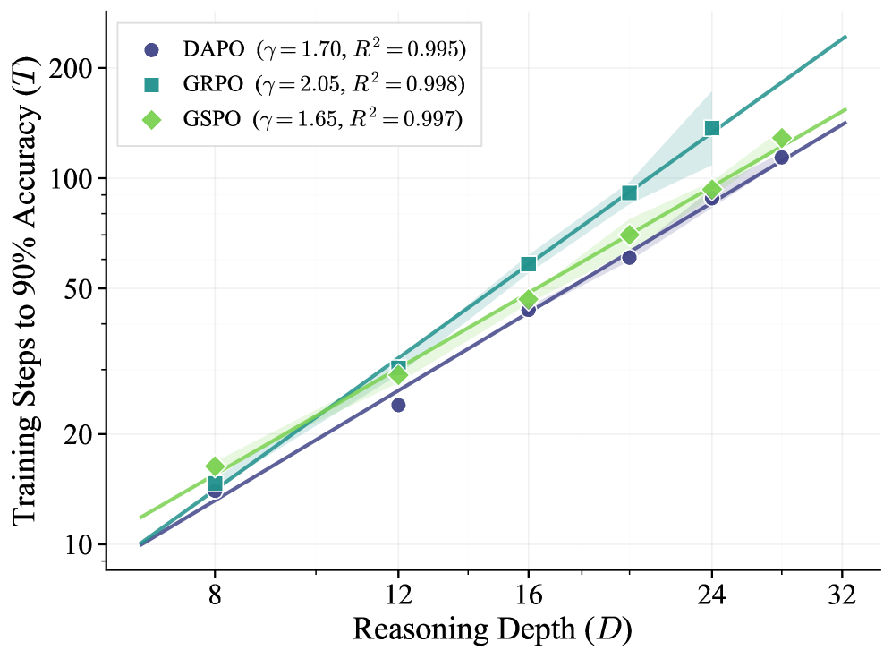

# DAPO 학습 셋업과 깊이에 대한 파워 로 스케일링

> 원본: [arxiv.org/abs/2605.06638](https://arxiv.org/abs/2605.06638)

앞 편에서 ScaleLogic 이 깊이 $D$ 와 표현력 두 축으로 난이도를 매끄럽게 끌어올린다는 점을 봤다. 이 편은 그 환경 위에 어떤 RL 레시피를 얹었는지, 그리고 그 결과 학습 비용이 깊이에 대해 어떻게 늘어나는지 본다. 결론부터 말하면, 학습 비용은 깊이에 대해 지수 함수가 아니라 **파워 로** 로 늘어나며, 그 지수는 표현력이 높아질수록 단조 증가한다. 이 패턴은 DAPO 한 알고리즘에 국한된 현상이 아니라 GRPO·GSPO 에서도 똑같이 나타난다.

## RL 레시피: GRPO 위에 DAPO

베이스 알고리즘은 **GRPO** (Group Relative Policy Optimization). 한 prompt $q$ 마다 정책으로부터 $G$ 개 completion 을 그룹으로 샘플링하고, 그 그룹 안에서 reward 통계를 잡아 advantage 를 만든다. 즉 별도 value network 을 쓰지 않고 그룹 평균이 baseline 역할을 한다. completion $i$ 의 스칼라 reward 를 $r_i$ 라 두면 group-normalized advantage 는

$$
A_i = \frac{r_i - \mathrm{mean}(r_1, \dots, r_G)}{\mathrm{std}(r_1, \dots, r_G)}
$$

로 정의된다. 같은 그룹 안 다른 completion 들이 평균보다 잘 했는지 못 했는지를 표준편차 단위로 잰다고 보면 된다. 정책 업데이트는 PPO 식의 token-level 비율 $\rho_t = \pi_\theta(o_t \mid q, o_{<t}) / \pi_{\theta_{\mathrm{old}}}(o_t \mid q, o_{<t})$ 에 advantage 를 곱한 뒤 clip 으로 제한한다. 토큰 별로 advantage 가 같은 값 $A_i$ (그 completion 의 그룹 정규화 점수) 가 곱해지는 구조다.

그 위에 **DAPO** 의 두 가지 보강을 얹는다.

- **Dynamic sampling**. 그룹 전원이 정답이거나 전원이 오답인 prompt 는 advantage 가 모두 0 이 되어 학습 신호가 사라진다. DAPO 는 이런 prompt 를 한 배치 안에서 걸러내고, 학습 신호가 살아 있는 prompt 비율을 일정 수준으로 유지하도록 추가 샘플링한다.
- **Clip-higher**. PPO·GRPO 의 clipping 비대칭을 깬다. 기본 clip 구간 $[1 - \varepsilon_{\mathrm{low}}, 1 + \varepsilon_{\mathrm{high}}]$ 에서 $\varepsilon_{\mathrm{high}}$ 를 더 크게 풀어, 양의 advantage 토큰이 정책 비율을 더 크게 끌어올릴 수 있게 한다. 탐색의 폭이 좁아지는 entropy collapse 를 늦추는 장치다.

reward 는 이진. 모델이 chain-of-thought 끝에 `<answer>...</answer>` 태그 안에 답을 넣게 하고, verifier 가 그 안의 문자열을 ground truth 와 **exact match** 로 비교한다. 형식이 깨지거나 답이 다르면 $r = 0$, 정확히 일치하면 $r = 1$. 부분 점수도, 추론 과정에 대한 보상도 없다. 이 단순한 보상이 GRPO 의 그룹 정규화와 합쳐지면서, 같은 prompt 안에서 운 좋게 맞춘 completion 을 기준으로 다른 completion 의 토큰을 끌어올리거나 끌어내리는 학습 신호를 만든다.

## 무엇을 변수로 두고 무엇을 고정했나

§4.1 의 셋업은 한마디로 "두 축만 흔들고 나머지는 모두 잠금" 이다.

- **모델**. Qwen3-4B 의 non-thinking 버전. 별도 reasoning 모드를 켜지 않은 상태에서 RL 만으로 추론을 키운다. 일부 실험은 cross-scale 검증용으로 Qwen3-8B 도 돌렸다.
- **라이브러리**. verl. B200 180GB GPU 위에서 학습.
- **후보 수**. 한 문제의 후보 객체 수 $B$ 는 $4$ 로 고정. $B$ 의 효과는 부록에서 따로 본다.
- **학습 데이터**. 목표 깊이 $D$ 가 정해지면, 깊이 $\{1, 2, \dots, D\}$ 에서 균등 샘플링해 학습셋을 만든다. 크기는 보통 $100{,}000$ 인스턴스, **1 epoch** 안에 수렴할 만큼만. 같은 인스턴스를 두 번 보지 않는다.
- **평가**. 같은 설정의 held-out 검증셋 $1{,}000$ 인스턴스. 매 RL step 마다 Pass@1 을 잰다.
- **표현력**. 5단계 — Implication-only, + Conjunction, + Negation, + Disjunction, + Quantification — 를 별도 학습 run 으로 돌린다.

여기서 핵심은 **compute metric** 이다. 저자들은 학습 비용을 단일 숫자로 요약하기 위해

$$
T = (\text{Pass@1 이 } 90\% \text{ 에 처음 도달하기까지의 RL step 수})
$$

로 정의한다. 토큰이나 FLOPs 도 부록에서 같이 보지만, 본문 그래프는 모두 $T$ 기준이다. 모델·후보 수·배치 사이즈 같은 step 당 cost 가 동일하게 잠겨 있기 때문에 step 수가 곧 wall-clock 비용에 비례한다. depth 가 깊어질수록 한 completion 의 토큰 길이도 늘어 step 당 cost 가 미세하게 늘어나지만, 본문 결론은 step 수만 봐도 깨지지 않는다 (부록 H.3 참고).

이 셋업의 미덕은 분명하다. **표현력과 깊이만 변수다**. 데이터 구성도, 모델도, 알고리즘 (DAPO) 도 같다. 이 위에서 $D$ 를 키우며 $T$ 를 재면, 곡선의 모양 자체가 task 의 난이도 구조를 그대로 드러낸다.

## 깊이에 대한 파워 로

5개 표현력 각각에서 깊이 $D \in \{2, 4, 6, \dots\}$ 까지 학습 run 을 돌리고, $T$ 를 $D$ 의 함수로 fit 했다. 결과는 단순하다.

$$
T(D) = a \cdot D^{\gamma}
$$

5개 표현력 모두에서 $R^2 > 0.99$ 로 깔끔하게 들어맞는다. 부록 H.1 은 같은 데이터를 $T = a' \cdot \exp(b \cdot D)$ 형태의 지수 fit 과 AIC 로 비교했고, 모든 설정에서 power-law 가 이긴다. 즉 본 환경의 학습 비용은 깊이에 대해 **다항식적으로** 늘어난다, 지수적으로가 아니라.

*log-log 평면에서 직선 = 파워 로. 같은 직선 위에 점들이 박힌다는 사실 자체가 이 환경의 깊이 축이 task-내적으로 잘 정의된 난이도 변수임을 시사한다.*

지수 $\gamma$ 가 표현력에 따라 어떻게 움직이는지가 본 편의 핵심 결과다. 표는 다음과 같다.

| 표현력 | $\gamma$ | $R^2$ |
| --- | --- | --- |
| Implication-only | 1.04 | 0.997 |
| + Conjunction | 1.72 | 0.991 |
| + Negation | 1.81 | 0.997 |
| + Disjunction | 2.11 | 0.993 |
| + Quantification | 2.60 | 0.998 |

*막대가 단조 상승. 깊이 한 단위 늘릴 때 비용이 얼마나 더 드는지 — 그 "단가" 자체가 표현력에 따라 달라진다.*

이 표가 말하는 것을 한 줄로 요약하면 이렇다. **표현력이 단순할수록 깊이는 선형 비용, 표현력이 풍부해질수록 깊이는 가속 비용** 이다.

조금 더 구체적으로 풀어쓴다.

- **Implication-only 의 $\gamma \approx 1$** 이 가장 해석하기 쉽다. 만약-그러면 한 종류의 룰만 있는 세계라면, 깊이를 한 단계 늘리는 것은 "한 단계 더 chain 하는 법" 을 배우는 일이다. 이 한계 학습 비용이 깊이에 대해 거의 일정하기 때문에 $T$ 가 $D$ 에 거의 선형으로 늘어난다. doubling depth -> doubling cost.
- **+ Quantification 의 $\gamma \approx 2.6$** 은 정반대 극단이다. 깊이를 두 배로 늘리면 비용은 약 $2^{2.6} \approx 6$ 배가 된다. 한 단계가 추가될 때마다 모델이 새로 통제해야 하는 결합 구조의 양이 늘기 때문에, 단순한 "한 단계 더 chain" 보다 훨씬 비싼 학습이 된다. ∀·∃ quantifier 가 도입되면 단일 객체에 대한 단일 chain 만으로는 답이 안 나오고, 모든 객체나 어떤 객체에 대한 통합 검증이 끼어든다.
- **중간 단계의 단조성**. + Disjunction 이 + Negation 보다 비싸고, + Negation 이 + Conjunction 보다 비싸다. 표현력이 늘면 깊이의 한계 비용도 같이 는다.

여기서 본 논문이 짧게 짚고 가는 흥미로운 디테일이 + Conjunction ($\gamma = 1.72$) 과 + Negation ($\gamma = 1.81$) 의 **간격이 작다** 는 점이다. 표준오차 범위가 일부 겹친다. 저자들은 이를 negation 의 본질로 설명한다. negation 은 새로운 결합 구조를 도입하지 않는다 — "Alice 는 포유류가 아니다" 같은 명제는 conjunction 처럼 여러 전제를 동시에 검증하라고 요구하지 않는다. 모델은 기본적으로 **literal 의 극성 (polarity)** 을 따라가기만 하면 된다. 결합 폭발이 없으니 깊이 비용도 conjunction 대비 거의 안 늘어난다. 또 한 가지 부가 이유로, 본 환경의 RL inference 는 proof-by-contradiction 같은 "negation 을 적극 활용하는" 추론 규칙을 따로 학습 신호로 주지 않는다는 점도 거론된다.

## 파워 로는 알고리즘이 만드는 게 아니다

남는 의심은 자연스럽다. 이 깨끗한 power-law 가 혹시 DAPO 라는 특정 알고리즘이 만들어내는 인공물 아닐까? §4.5 는 이를 분리하기 위해 + Conjunction 환경 ($\gamma_{\mathrm{DAPO}} \approx 1.70$) 에서 알고리즘을 바꿔가며 똑같은 스케일링 실험을 반복한다. 비교 대상은 두 가지다.

- **GRPO**. DAPO 의 dynamic sampling·clip-higher 를 떼고 원형 GRPO 만 사용.
- **GSPO** (Group Sequence Policy Optimization). sequence-level policy optimization 변형. 각 sample 시드 3개로 평균.

세 알고리즘 모두 power-law 가 깨끗하게 살아남는다 ($R^2 > 0.99$). 단, 지수는 다음처럼 갈린다.

| 알고리즘 | $\gamma$ |
| --- | --- |
| GRPO (vanilla) | 2.05 |
| DAPO | 1.70 |
| GSPO | 1.65 |

*세 곡선 모두 log-log 위 직선. 알고리즘은 절편 (= 상수 $a$) 과 기울기 ($\gamma$) 만 흔들 뿐, 함수 형태 자체는 같다.*

여기서 두 가지가 동시에 읽힌다.

1. **함수 형태는 task 가 결정한다**. depth-cost 가 power-law 라는 사실은 알고리즘 의존이 아니다. ScaleLogic 의 깊이 축이 task-내적으로 잘 정의된 난이도 변수이기 때문에, 그 위에서 step 수를 재면 알고리즘과 무관하게 같은 모양이 나온다. 이는 결과를 task 의 본질적 성질로 일반화할 정당성을 준다.
2. **알고리즘은 기울기를 흔든다**. vanilla GRPO 의 $\gamma \approx 2.05$ 가 DAPO 의 $1.70$, GSPO 의 $1.65$ 보다 가파르다. 깊이를 두 배로 늘릴 때 GRPO 가 DAPO 보다 약 $2^{0.35} \approx 1.27$ 배 더 많은 step 을 요구한다는 뜻이다. 또한 큰 깊이에서 GRPO 의 시드 간 분산도 더 크다. 즉 **긴 호흡으로 갈수록 vanilla GRPO 의 sample efficiency 가 떨어진다**. DAPO 의 dynamic sampling·clip-higher 가 이 long-horizon regime 에서 의미 있는 보강이라는 신호이며, GSPO 도 비슷한 효과를 다른 메커니즘 (sequence-level optimization) 으로 얻는다.

이 두 가지를 묶으면, 다음 편에서 등장할 "어떤 분포로 학습할 것인가 (curriculum vs. uniform vs. difficult-only)" 라는 질문이 자연스럽게 따라온다. 함수 형태는 task 가 정하고 기울기는 알고리즘과 학습 분포가 흔든다면, 이 두 레버를 어디까지 당겨 $\gamma$ 를 더 낮출 수 있느냐가 다음 문제다.

## 핵심 정리

- 학습 알고리즘은 **GRPO + DAPO**. group-normalized advantage $A_i = (r_i - \mathrm{mean}) / \mathrm{std}$ 위에 token-level clipping. dynamic sampling 과 clip-higher 로 학습 신호의 신선도와 탐색 폭을 보강. reward 는 `<answer>...</answer>` 안 exact match 의 이진 신호.
- 학습 셋업은 **표현력 5 × 깊이 (가변)** 의 그리드. 모델 (Qwen3-4B), 후보 수 ($B = 4$), 학습셋 크기 (보통 $100{,}000$, 1 epoch), 평가 ($1{,}000$ held-out, Pass@1 90% 도달까지의 step 수 = $T$) 모두 잠금.
- 깊이에 대한 학습 비용은 모든 표현력에서 **파워 로** $T = a \cdot D^{\gamma}$, $R^2 > 0.99$. exponential 보다 fit 이 좋다.
- 지수 $\gamma$ 는 **표현력에 따라 단조 증가**. Implication-only 1.04 -> + Quantification 2.60. Implication-only 의 $\gamma \approx 1$ 은 깊이 한 단계의 한계 학습 비용이 거의 일정함을 의미. 표현력이 풍부해질수록 결합 구조가 그 단가를 가속한다.
- **Conjunction 과 Negation 의 작은 차이** 는 negation 이 결합 구조를 더하지 않고 극성 추적만 요구한다는 해석으로 설명된다.
- 같은 power-law 형태가 **GRPO·DAPO·GSPO** 모두에서 살아남는다 ($\gamma$ = 2.05 / 1.70 / 1.65). 즉 함수 형태는 task 의 본질, 기울기는 알고리즘이 흔드는 변수. vanilla GRPO 가 가장 가파르고 분산도 크다 — long-horizon regime 에서 sample efficiency 가 떨어진다는 신호.

다음 편 → [다운스트림 전이와 커리큘럼이 만든 학습 효율 차이](04-downstream-transfer-and-curriculum.md)

## 출처

- https://arxiv.org/abs/2605.06638
