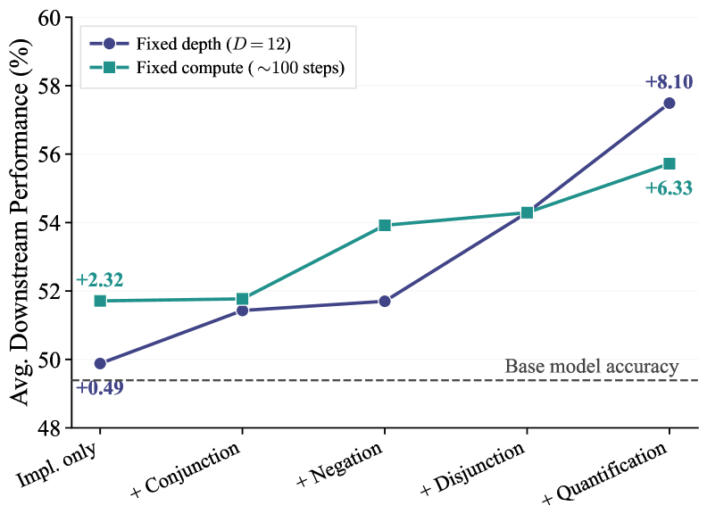
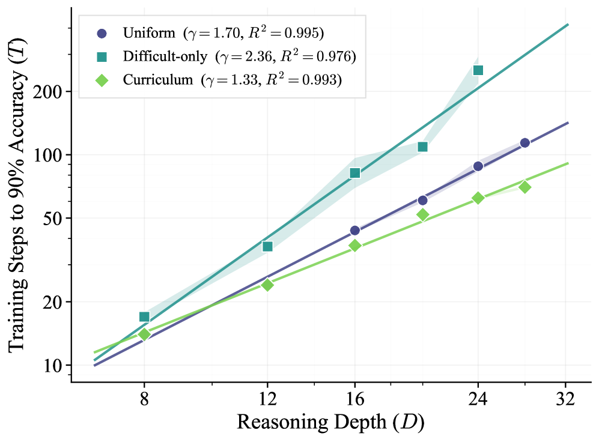

# 다운스트림 전이와 커리큘럼이 만든 학습 효율 차이

> 원본: [arxiv.org/abs/2605.06638](https://arxiv.org/abs/2605.06638)

앞 편까지의 power-law 결과는 합성 환경 안에서의 이야기였다. 자연스럽게 두 질문이 따라온다. 첫째, ScaleLogic 으로 학습한 모델이 실제 수학·과학 벤치마크에서도 성능이 오르는가. 둘째, 같은 표현력·같은 깊이를 학습하더라도 학습 분포를 어떻게 짜느냐에 따라 효율이 달라지는가. 이 편은 이 두 가지를 정면으로 다룬다.

결론부터 말하면, 두 질문 모두 답이 *그렇다* 이고, 그 답이 가리키는 방향이 같다. *얼마나* 학습했는지보다 *무엇* 으로 학습했고 *어떤 순서* 로 학습했는지가 결과를 만든다. 합성 logic 의 정확도 곡선이 일찍 정체되더라도 그것이 곧 다운스트림 정체로 이어지는 것은 아니다. 학습 신호의 *질* 이 다운스트림 ceiling 을 결정하고, 학습 신호의 *순서* 가 그 ceiling 까지 가는 *경로* 를 결정한다.

## 1. 다운스트림 전이 평가 셋업

전이 평가에 쓴 벤치마크는 8개다. 영역도 의도적으로 흩뜨려 놓았다.

- 경시 수학: AIME 2024, AIME 2025, AMC 2023
- 표준 수학: MATH-500, Minerva
- 올림피아드 수학: OlympiadBench (text-only subset)
- 과학·일반 추론: GPQA-Diamond, MMLU-Pro (STEM subset)

각 벤치마크는 Avg@8 (문제마다 8회 독립 샘플링하여 평균) 로 측정하고, 8개 벤치마크의 평균 정확도를 단일 지표로 보고한다. 디코딩은 Qwen 의 공식 권고를 따라 temperature $= 0.6$, top-$p = 0.95$, top-$k = 20$ 이며 응답 길이는 학습 예산과 동일한 8192 토큰이다.

베이스 모델 (학습 전) 의 평균 정확도는 $49.39\%$ 다. 모든 학습 설정은 이 값을 출발점으로 삼는다. 즉 다운스트림 곡선은 $49.39\%$ 라인을 깔고 거기서 얼마나, 어떤 모양으로 올라가는지를 비교하는 작업이다. 합성 환경의 Pass@1 곡선과 달리 8개 벤치마크 평균은 절대 단위로는 잘 움직이지 않는 지표이므로, 수 점 단위의 차이가 실은 의미 있는 신호다.

## 2. 표현력별 다운스트림 곡선의 모양

학습 step 을 가로축에 두고 평균 정확도를 그리면, 표현력 5단계 사이의 차이가 곡선 *모양* 에서부터 다르게 나타난다.

*Avg@8 의 평균을 학습 step (log-x) 대비 그린 결과. Implication-only 와 + Conjunction 은 약 52% 부근에서 일찍 정체되는 반면, + Quantification 은 학습 종료 시점인 414 step 까지 단조 상승하여 60.05% 에 도달한다.*

요점만 정리하면 이렇다.

- **모든 표현력이 베이스보다는 낫다.** 합성 환경에서 배운 추론 스킬이 도메인을 갈아타도 살아남는다.
- **단순 설정은 일찍 plateau 한다.** Implication only 와 + Conjunction 은 약 $52\%$ 근처에서 멈춘다. 이 둘은 추가 step 을 부어도 다운스트림이 더 오르지 않는다.
- **+ Quantification 만이 끝까지 상승한다.** 414 step 시점에서 $60.05\%$, 베이스 대비 +$10.66$ 점이다. 8개 벤치마크 평균이 절대 10점 이상 움직이는 폭은 작지 않다.

여기서 직관에 반하는 점이 하나 있다. 단순한 환경이 학습 자체는 *쉽고 빠르게* 수렴한다. 그런데도 다운스트림 곡선은 더 일찍 멈춘다. 즉 합성 task 의 학습 효율과 다운스트림 전이 능력이 같은 방향이 아니다. 이 어긋남이 §4.3 의 핵심이다. RL 후학습 평가에서 *합성 환경 validation* 만 보면 단순 표현력이 매력적으로 보인다. 적은 step 에서 깔끔하게 수렴하기 때문이다. 그러나 우리가 실제로 신경 써야 할 지표는 그 곡선이 아니라 다운스트림 곡선이며, 두 곡선의 결말은 다르다.

또 하나 짚어둘 점은, $52\%$ plateau 가 단순히 노이즈가 아니라는 사실이다. Implication-only 와 + Conjunction 모두 학습이 끝날 때까지 해당 수준을 넘지 못한다. 표현력 단계가 늘면 plateau 자체가 사라지거나 훨씬 위로 올라간다. 즉 다운스트림 ceiling 은 표현력에 의존한다는 가설이 가능해진다.

## 3. *얼마나* 가 아니라 *무엇* 이 만든 차이

위 곡선만 보면 "+ Quantification 이 더 오래 학습됐기 때문에 잘 됐다" 라고 의심할 수 있다. 학습 step 자체가 다른 까닭이다. 논문은 이 의심을 두 가지 통제로 정리한다.

*같은 표현력 5단계를 가로축에 두고, 두 가지 통제 조건에서 다운스트림 이득 (베이스 대비 점수 차) 을 비교한 결과. 두 조건 모두에서 표현력이 올라갈수록 이득이 단조 증가한다.*

두 조건은 다음과 같다.

- **Fixed depth.** 타겟 추론 깊이를 $D = 12$ 로 고정한다. 즉 task 의 호라이즌은 같은 채로, 표현력만 달라진다 (Implication-only 만 $D = 12$ 가 너무 쉬워 $D = 24$ 로 둔다).
- **Fixed compute.** 학습 step 예산을 약 100 step 부근에 맞춘 체크포인트를 골라 비교한다. 즉 *학습량* 을 같게 두고 표현력만 달라진다.

각 조건에서 표현력 단계별 다운스트림 이득은 단조 증가다.

| 조건 | Implication-only | + Quantification (가장 표현력 큼) |
| --- | --- | --- |
| Fixed depth ($D = 12$) | +$0.49$ pp | +$8.10$ pp |
| Fixed compute (~100 step) | +$2.32$ pp | +$6.33$ pp |

해석은 단순하지만 강하다. *호라이즌을 같게 둬도*, *학습량을 같게 둬도*, 표현력이 풍부한 환경이 다운스트림 이득이 크다. 두 통제는 서로 다른 잠재 교란을 막는다. fixed depth 는 "어려운 문제를 더 많이 봤기 때문 아닌가" 라는 호라이즌 가설을, fixed compute 는 "단지 step 을 더 부었기 때문 아닌가" 라는 예산 가설을 차단한다. 두 통제 모두에서 단조 증가가 유지되므로, 남는 자유변수는 표현력 그 자체뿐이다.

결과적으로 다운스트림 전이는 *what* 이 결정한다. 같은 자원을 단순 task 의 양 늘리기에 쓰는 것보다 더 표현력 있는 task 한 줄을 늘리는 쪽이 효과적이다는 뜻이다. 이 결론은 사내 RL 후학습을 설계할 때 자주 마주치는 트레이드오프와 직접 맞물린다. 어렵고 비싼 데이터 한 줌과, 쉽고 많은 데이터 한 양동이 중에 골라야 할 때, 적어도 *추론 전이* 의 관점에서는 한 줌 쪽의 단가를 다시 계산해 볼 필요가 있다. 표현력 풍부한 instance 한 개의 *학습 신호* 가, 단순 instance 다수가 주는 신호의 합보다 더 멀리 가는 그래디언트를 만든다고 읽어도 무리가 없다.

## 4. 학습 분포: Uniform · Difficult-only · Curriculum

§4.4 는 *무엇* 이 아니라 *어떤 순서* 로 보여줄지를 다룬다. 표현력은 + Conjunction 으로 고정하고, 타겟 깊이는 $D = 24$ 로 둔 채 학습 분포 세 가지를 비교한다.

- **Uniform** (default): 깊이 1 에서 24 까지 균등 분포로 매 step 샘플링한다. 매번 어떤 깊이가 나올지 모른다.
- **Difficult-only**: 오로지 깊이 24 instance 만 사용한다. 가장 어려운 케이스로 직행한다.
- **Curriculum**: 얕은 깊이부터 시작해 정확도가 임계값에 도달하면 다음 깊이를 추가한다 (Stojanovski et al., 2025 의 threshold-triggered scheme). 점진적으로 어려워진다.

각 설정마다 시드 3개로 실험하고, 앞 편에서 본 power-law $T(D) = a D^{\gamma}$ 를 그대로 적합한다.

*log-log 축에서 각 분포가 모두 깔끔한 직선으로 적합되며 ($R^{2} > 0.9$), 분포에 따라 기울기 ($\gamma$) 가 크게 달라진다. shading 은 시드 3개의 log-space 표준편차다.*

세 분포 모두 power-law 자체는 유지한다. 즉 깊이가 늘면 학습 step 이 다항식적으로 증가한다는 1편의 결론은 분포를 바꿔도 성립한다. 다만 *기울기가 다르다*.

| 학습 분포 | 적합 지수 $\gamma$ | 깊이 두 배 시 비용 |
| --- | --- | --- |
| Curriculum | $1.33$ | $\times 2.52$ |
| Uniform (default) | $1.70$ | $\times 3.25$ |
| Difficult-only | $2.36$ | $\times 5.13$ |

Difficult-only 는 분산도 가장 크다. 어려운 깊이 만으로 학습하면 평균 비용도 크고 시드 사이의 결과도 흔들린다. 가장 안정적이고 효율적인 쪽은 점진적으로 깊이를 늘려가는 커리큘럼이다.

이 효과가 + Conjunction 만의 특수 현상이 아니라는 점은 부록에서 추가로 검증한다. 가장 표현력이 큰 + Quantification 에서 동일 비교를 다시 돌리면 uniform 의 $\gamma \approx 2.65$ 가 curriculum 에서 $\gamma \approx 2.40$ 으로 내려간다 (양쪽 모두 $R^{2} > 0.9$). 효과 크기는 + Conjunction 보다 작지만 방향은 같다. 표현력이 더 풍부할수록 절대 비용 자체가 비싸기 때문에, 커리큘럼이 주는 약간의 지수 감소도 실제 step 수로 환산하면 무시 못 할 차이가 된다. 가령 $D = 24$ 와 $D = 48$ 사이에서 $\gamma$ 가 $2.65$ 에서 $2.40$ 으로 내려가면 비용 비율이 $6.27$ 배에서 $5.28$ 배로 줄어든다. 한 사이클 학습 비용이 100 GPU-시간 단위로 잡히는 환경에서는 결코 작지 않다.

## 5. 왜 커리큘럼이 더 효율적인가

저자들은 메커니즘 가설을 학습 다이내믹스 분석에 기반해 제시한다 (부록 I.4). 핵심 관찰은 *long chain-of-thought 행동의 출현 시점* 이다.

- **Curriculum**: 모든 깊이에서 long-CoT 행동이 *비슷한 시점에* 출현한다. 얕은 깊이에서 패턴이 형성되면 깊은 깊이로 자연스럽게 확장된다.
- **Uniform / Difficult-only**: long-CoT 출현이 깊이마다 점점 *늦어진다*. 특히 difficult-only 에서는 깊이 20 과 24 사이에 큰 간격이 벌어진다. 그 전에는 짧은 응답·고엔트로피 영역에 오래 머무른다.

여기서 가설은 다음과 같다. 얕은 instance 가 reasoning pattern 의 *bootstrap* 을 도와준다. 모델이 먼저 useful pattern (예: 가능한 결론마다 증명 시도, 부분 결과 캐싱, 리트라이) 을 짧은 호라이즌에서 학습하고, 깊은 instance 가 들어오면 이미 가지고 있는 패턴을 늘려서 적용한다. 반대로 difficult-only 는 패턴 자체를 깊은 instance 에서 처음부터 익혀야 하므로 short-response 영역에서 빠져나오는 데 더 오래 걸린다. 그것이 큰 $\gamma$ 와 큰 분산으로 그대로 나타난다.

저자들도 이를 *plausible* 한 추정으로 둔다. 메커니즘에 대한 완전한 분석은 future work 로 남겨놓았다. 하지만 RL 후학습 실무로 가져올 만한 시사점은 명확하다. *얕은 깊이를 버리지 마라.* 얕은 데이터는 데이터 양 채우기용이 아니라 reasoning pattern 의 출발점 역할을 한다.

또 한 가지 자연스러운 의문은 "그럼 왜 difficult-only 가 분산까지 큰가" 이다. 가설을 그대로 가져오면, 깊은 instance 만 보여줄 때 모델은 처음 몇 천 step 동안 long-CoT 출현 *전* 구간에서 여러 가지 잘못된 단축 전략 (얕은 패턴 매칭, 임의 선택) 을 시드별로 다르게 시도한다. 어떤 시드에서는 운 좋게 빨리 long-CoT 로 넘어가고, 어떤 시드에서는 한참을 헤맨다. 그 결과가 큰 시드 분산이다. Curriculum 은 이 *탐색 단계* 를 얕은 깊이에서 미리 끝내 놓기 때문에 깊은 깊이로 들어왔을 때 시드 사이의 차이가 줄어든다.

## 6. 두 가지 결과를 같이 읽기

§4.3 과 §4.4 는 분리된 절이지만 결론은 한 줄로 묶인다.

> 같은 자원을 어디에 쓸지가 결과를 만든다. *어떤 표현력* 으로 학습할지 (§4.3), 그리고 *어떤 순서* 로 학습할지 (§4.4) 다.

표현력 축은 ceiling 에 가까운 효과를 만든다. 단순 환경은 다운스트림 약 $52\%$ 라는 천장에 막히지만, + Quantification 은 천장이 훨씬 위에 있다. 한편 분포 축은 ceiling 보다는 *trajectory* 의 효율을 좌우한다. power-law 의 절편이나 ceiling 은 비슷하게 두고도, 어떤 step 예산에서 어떤 깊이까지 도달할 수 있는지가 달라진다.

두 축은 서로 직교한다. 즉 표현력이 풍부한 환경 *위에* 커리큘럼을 얹으면 두 효과가 동시에 들어온다. + Quantification 에서의 부록 결과 ($\gamma$ $2.65 \to 2.40$) 가 이것을 확인해 준다. 단순한 환경에서 커리큘럼 효과만 챙기는 것보다, 표현력 있는 환경에서 커리큘럼까지 같이 챙기는 쪽이 자원 단가가 더 좋다.

실무 메모로 정리하면 다음과 같다.

- *데이터 큐레이션* 은 양보다 표현력 분포부터. + Quantification 류의 작업이 한 줄이라도 들어가는 게 단순 task 무한히 늘리는 것보다 다운스트림 측면에서 낫다. 표현력 부재 환경의 학습은 합성 정확도는 빠르게 올려도 다운스트림 ceiling 이 낮다.
- *학습 스케줄* 은 default uniform 보다 threshold-triggered curriculum 으로. 깊이 임계값을 모니터링해 충족되면 다음 단계 풀어주는 단순한 형태로도 $\gamma$ 가 떨어진다. 복잡한 스케줄러 없이 정확도 게이트 하나로도 효과를 본다.
- *지표 선택* 은 합성 환경 plateau 가 아니라 다운스트림 곡선으로. 합성 task 가 일찍 수렴해도 다운스트림은 그것과 별도로 움직인다. early stopping 기준을 합성 정확도에 두면 표현력의 효과를 과소평가하게 된다.
- *분산 관리* 측면에서 difficult-only 직행은 위험하다. 시드 사이의 결과가 흔들리고 평균 비용도 비싸다. 단일 시드로 결과를 결정짓는 시도는 최소 3 시드 평균이 들어와야 신뢰할 수 있다.
- *Compute 회계* 는 step 단위 (또는 토큰·FLOP) 로 잡되, 학습 분포를 갈아끼울 때마다 power-law fit 을 다시 그려서 $\gamma$ 변화 자체를 트래킹하면 다음 사이클의 예산 산정이 쉬워진다.

다음 편은 마지막 조각을 다룬다. 지금까지 모든 결과는 ScaleLogic 분포 *안* 에서의 일반화였다. 이 학습이 *분포 밖* (out-of-distribution) 으로 어디까지 일반화되는지, 그리고 자연어 수학이 합성 logic 보다 더 어려운 영역은 어디인지가 남아 있다. 그 한계가 우리 실무 결정에 어떻게 영향을 주는지까지 같이 짚는다.

다음 편 → [OOD 일반화의 한계와 우리에게의 시사점](05-ood-and-implications.md)

## 출처

- https://arxiv.org/abs/2605.06638
