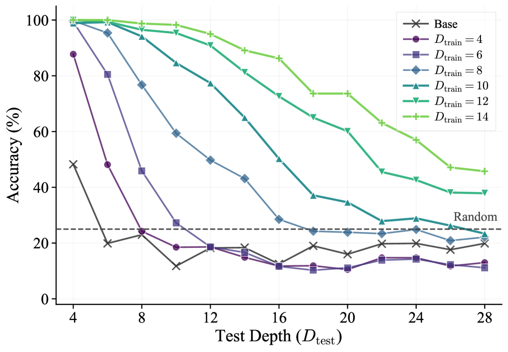
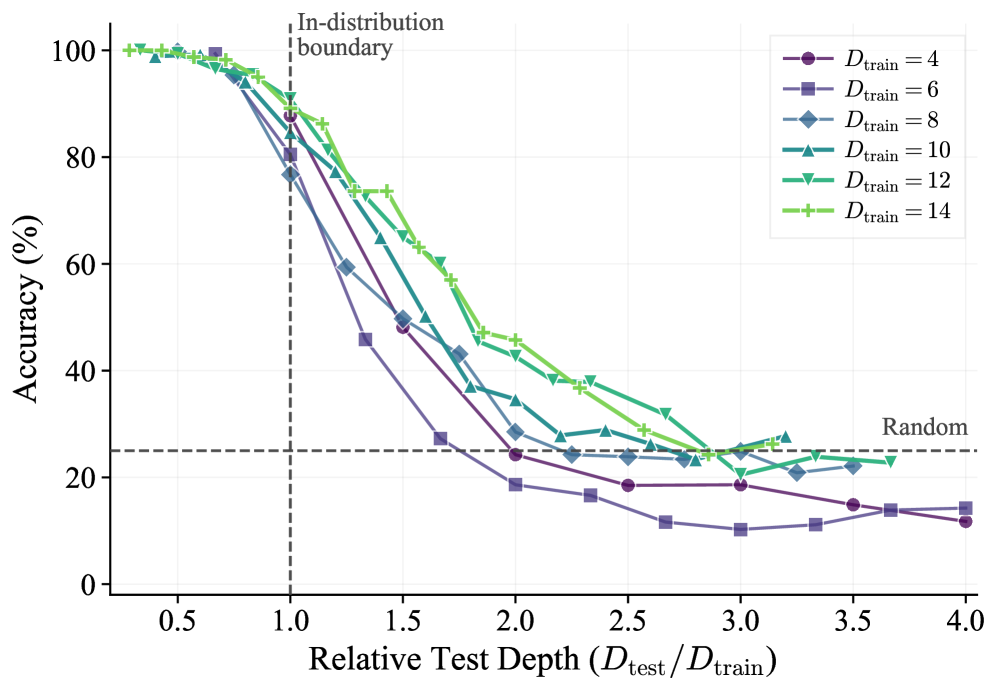

# OOD 일반화의 한계와 우리에게의 시사점

> 원본: [arxiv.org/abs/2605.06638](https://arxiv.org/abs/2605.06638)

앞 네 편에서 우리는 ScaleLogic 위에서 깊이에 대한 power-law, 표현력이 끌어올리는 지수 $\gamma$, 데이터 분포에 따른 학습 동역학, 다운스트림 전이와 커리큘럼의 효과를 차례로 짚었다. 마지막 편은 한 가지 자연스러운 질문으로 시작한다. "학습 깊이 $D_{\mathrm{train}}$ 까지 풀게 만든 모델은 그보다 깊은 문제를 어디까지 풀 수 있는가?" 학습 분포 너머에서의 일반화 (OOD) 는 RL 추론 학습의 실용성을 가르는 지점이다. 본 편은 §4.6 의 OOD 결과를 정리하고, §5 의 결론과 Appendix A 의 한계를 다시 묶은 뒤, 우리가 사내 RL 학습 파이프라인에 가져갈 수 있는 시사점을 짧게 정리한다.

## OOD 일반화: 학습은 horizon 을 얼마나 늘리는가

### 실험 설정

저자들은 + Quantification 환경에서 학습 깊이 $D_{\mathrm{train}} \in \{4, 6, 8, 10, 12, 14\}$ 의 모델을 만든 뒤, 학습 시 한 번도 보지 못한 더 깊은 평가 깊이 $D_{\mathrm{test}}$ 에서 정확도를 측정한다. 평가 깊이가 학습 깊이를 크게 넘어서면 추론 길이도 늘어나기 때문에, 응답 토큰 한도는 평소 사용하던 값에서 32,768 토큰까지 늘렸다. 짧게 끊긴 생성 때문에 정답을 못 만드는 상황과 진짜로 못 푸는 상황을 섞지 않기 위한 안전장치다. 다른 디코딩 설정은 그대로 두고, 보고 지표는 Avg@8 을 쓴다.

이 실험이 답하려는 것은 두 가지다.

- 더 깊게 학습한 모델이 더 깊은 평가에서 더 잘 견디는가
- 학습이 모델의 effective reasoning horizon 자체를 키우는가, 아니면 학습 깊이 부근의 정확도만 끌어올리는가

### 결과 1: 깊이로 학습할수록 더 멀리까지 버틴다

*Figure 8. 학습 깊이별 모델의 test depth 대비 정확도.*

가로축은 평가 깊이 $D_{\mathrm{test}}$, 세로축은 정확도다. 곡선은 학습 깊이 $D_{\mathrm{train}}$ 별로 따로 그려진다. 패턴은 직관과 합치된다.

- 얕게 학습한 모델 ($D_{\mathrm{train}} = 4$ 등) 은 가까운 평가 깊이부터 빠르게 무너진다. 학습 깊이 근처에서는 잘 풀지만, 두세 단계만 더 가도 정확도가 가파르게 떨어진다.
- 중간 깊이 모델 ($D_{\mathrm{train}} = 8, 10$) 은 그 사이의 곡선을 그리며, 학습 깊이를 한 단계만 늘려도 견디는 평가 깊이의 폭이 눈에 띄게 넓어진다.
- 깊게 학습한 모델 ($D_{\mathrm{train}} = 12, 14$) 은 학습 깊이를 넘어서도 한참 동안 높은 정확도를 유지한다. 평가 깊이가 학습 깊이의 두 배 가까이까지 늘어나도 곡선이 완만하게 떨어진다.

결론은 명확하다. 학습은 학습 깊이 근처에서의 정확도만 올려주는 것이 아니라, 모델이 "버틸 수 있는" 추론 깊이의 범위 자체를 확장한다. 즉 학습 깊이를 늘린다는 것은 결국 effective reasoning horizon 을 늘리는 일이다. 동시에 곡선들 사이의 간격은 학습 깊이가 깊어질수록 점점 좁아지는 경향을 보인다. 학습 깊이를 4 에서 8 로 늘릴 때 얻는 OOD 폭의 증가분이, 10 에서 14 로 늘릴 때 얻는 증가분보다 크다는 의미다. 깊이를 늘리는 일에는 한계 효용이 있다는 첫 번째 신호다.

### 결과 2: 그러나 horizon 은 여전히 유한하다

같은 그림에서 한 단계 더 보면, 어떤 곡선도 결국에는 떨어진다. $D_{\mathrm{train}} = 14$ 로 학습한 모델조차 충분히 깊은 평가 깊이에서는 정확도가 무너진다. 학습이 horizon 을 무제한으로 밀어주지는 못한다는 뜻이다.

학습이 늘려준 폭이 얼마나 되는지를 정량화하려면, 가로축을 절대 깊이가 아니라 학습 깊이 대비 상대 깊이로 바꾸는 것이 자연스럽다.

### 결과 3: 정규화하면 frontier 곡선이 드러난다

*Figure 9. 상대 평가 깊이로 정규화한 정확도.*

가로축을 $D_{\mathrm{test}} / D_{\mathrm{train}}$ 으로 바꾸면 가장 깊게 학습한 두 모델 ($D_{\mathrm{train}} \in \{12, 14\}$) 의 곡선이 거의 한 곡선으로 겹친다. 저자들은 이를 frontier curve 라고 부른다. 두 모델의 절대 horizon 은 다르지만, 학습 깊이 단위로 측정한 일반화 폭은 같은 형태의 곡선을 따른다는 의미다.

이 frontier 곡선의 모양은 단순하다.

- $D_{\mathrm{test}} / D_{\mathrm{train}} \approx 1$ 부근에서는 정확도가 학습 분포 수준에 가깝다.
- 비율이 커질수록 단조 감소하고, $D_{\mathrm{test}} / D_{\mathrm{train}} \approx 3.0$ 부근에서 4지선다 random baseline 인 25% 까지 떨어진다.

해석은 한 줄로 정리된다. **충분히 깊게 학습하면 모델은 학습 깊이의 약 3배까지를 한계로 추론 horizon 을 확장한다.** 그 너머는 무작위 추측과 구분되지 않는다. 학습은 horizon 을 선형적으로 늘려주지만, "horizon 자체를 없애 주지" 는 않는다.

frontier 곡선의 형태는 또 한 가지를 시사한다. 가장 깊은 두 모델이 같은 곡선으로 붕괴한다는 것은 학습 분포 안에서 이미 모델의 추론 절차가 *공유 가능한 형태* 로 자리잡았다는 신호다. 절대 깊이는 다르지만 학습 깊이 단위로 측정하면 같은 비율만큼만 일반화한다. 더 얕게 학습한 모델은 곡선이 그 frontier 위에 정확히 얹히지는 않는데, 이는 절차가 충분히 일반화 가능한 형태로 자리잡기 전이라는 해석과 정합한다.

### 왜 이 결과가 중요한가

OOD 일반화 실험은 두 가지 함의가 있다.

- **일반화는 절대값이 아니라 비율로 본다.** 더 깊은 모델이 더 깊은 평가에서 잘 푸는 것은 당연하지만, 학습 깊이 단위로 정규화했을 때 같은 곡선이 나온다는 사실은 일반화 능력을 측정할 보편적인 척도가 존재한다는 것을 시사한다.
- **horizon 은 늘릴 수 있지만 무한히 늘릴 수는 없다.** 학습 단계마다 더 많은 step 을 태우면 다음 1단계의 깊이를 더 풀 수 있지만, 단순 외삽으로 임의의 깊이를 풀 수는 없다. 깊이를 더 풀려면 학습 깊이 자체를 함께 키워야 한다.

이 두 함의는 우리가 흔히 빠지는 함정 — "학습 깊이의 1.1~1.2 배에서만 평가하고 일반화가 잘 된다고 결론짓는" 함정 — 을 정리해 준다. 평가 비율 1.5~2.0 까지 보지 않으면 frontier 곡선의 가파른 부분을 못 본다. 그리고 비율 3.0 너머는 학습으로 메울 수 없다.

## 결론 재구성: 깊이·표현력·전이의 세 축

§5 의 결론은 이 페이퍼 전체를 세 줄로 압축한다. 이 시리즈를 따라 읽었다면 익숙한 문장들이지만, 여기서 한 번 더 정리한다.

- **깊이에 대한 power-law.** 모든 표현력 단계에서 학습 compute $T$ 와 깊이 $D$ 사이에 $T \propto D^{\gamma}$ 가 성립한다. 적합도는 모든 환경에서 $R^2 > 0.99$ 이며, 같은 데이터에 지수 함수를 맞춰보면 더 나쁜 적합을 얻는다. 즉 깊이당 비용은 polynomially 증가하지, 지수적으로 폭발하지는 않는다.
- **표현력에 따른 단조 증가.** 환경의 표현력을 늘릴수록 $\gamma$ 가 단조 증가한다. + Conjunction (상대적으로 단순) 에서는 $\gamma \approx 1.04$ 로 거의 선형 비용이고, 가장 복잡한 + Higher-order 비슷한 단계 (논문의 가장 풍부한 표현력 단계) 에서는 $\gamma \approx 2.60$ 까지 올라간다. 같은 깊이를 한 단계 늘리는 일이 단순 환경에서는 비용을 두 배 정도, 복잡 환경에서는 6배 가까이로 부풀린다.
- **다운스트림 전이는 *what* 으로 결정.** 더 표현력 높은 환경에서 학습한 모델일수록 수학·코드 같은 실제 추론 벤치마크에서 더 큰, 더 compute-효율적인 향상을 얻는다. *얼마나 학습하는가* 가 아니라 *무엇을 학습하는가* 가 전이를 좌우한다.

이 셋을 한 그림으로 묶으면 RL 추론 학습의 cost·capability 곡선이 된다. 깊이는 비용을 polynomially 부풀리고, 표현력은 그 polynomial 의 지수를 끌어올리며, 표현력 자체는 다운스트림에서 더 큰 가치를 돌려준다. 더 어려운 데이터로 학습하는 일은 비싸지만, 그 비용이 다운스트림 일반화의 형태로 회수된다.

## Appendix A 한계: 어디까지 일반화되는가

저자들은 결론 직후 한계를 명시한다. 이 경고를 그대로 옮긴다.

- **단일 모델.** 모든 주요 실험은 Qwen3-4B 한 모델 위에서 수행됐다. Qwen3-8B 로 일부 결과를 재현해 cross-scale consistency 를 확인했지만, 모델 크기가 한 자릿수 이상 차이 나거나 다른 아키텍처에서도 같은 power-law 와 같은 $\gamma$ 추세가 유지되는지는 알 수 없다.
- **제한된 표현력 단계.** 표현력 hierarchy 는 핵심 logical operator 들 (conjunction, quantification, disjunction, negation 등) 을 다루지만, 등호, 고차 추론, 비단조 추론, 다중 entity 관계 같은 구조는 포함하지 않는다. 이런 더 풍부한 fragment 에서는 $\gamma$ 가 다르게 움직일 수 있고, 새로운 스케일 양상이 나타날 수 있다.
- **제한된 깊이 범위.** Power-law 는 각 표현력 단계에서 제한된 깊이 값들로 fitting 한 결과다. 적합도 자체는 매우 높지만 ($R^2 > 0.99$), 깊이 범위를 더 넓혔을 때도 같은 power-law 가 점근적으로 성립한다고 보장할 수는 없다. 저자들은 power-law 적합을 "관측된 영역 내에서의 충실한 경험적 묘사" 로 한정해 부른다.
- **단일 시드.** 메인 스케일 곡선은 단일 시드 결과다. + Conjunction 에서 다중 시드를 돌려본 결과 fitted 지수가 거의 같았지만, 모든 표현력 단계에서 다중 시드 검증이 끝난 것은 아니다.
- **이론적 설명 부재.** $\gamma$ 가 표현력에 따라 단조 증가하는 이유에 대한 이론적 유도는 제시되지 않았다. 저자들 자신이 "principled account 가 향후 과제" 라고 명시한다.

요약하자면, 이 논문이 주는 것은 *깔끔한 경험 법칙* 이지 *증명된 보편 법칙* 이 아니다. 그러나 합성 환경 위에서 깊이·표현력·전이를 한 자리에 묶어 정량화한 작업으로는 매우 드물고, 후속 연구들이 *비교 기준* 으로 삼기에 충분히 단단하다.

## 우리에게의 시사점

마지막으로 사내 RL 학습 실무에 가져갈 만한 점을 짧게 정리한다. 이 부분은 논문 본문이 아니라 편집자 주이므로, 단정 대신 가설 형태로 둔다.

### 1. 데이터 큐레이션의 축을 한 단계 늘려라

지금까지 RL 추론 학습의 데이터 의사결정은 대개 두 축에서 이뤄졌다.

- **양**: 얼마나 많은 prompt 를 모을 것인가
- **도메인**: 수학·코드·과학 중 어디에 무게를 둘 것인가

이 논문의 결과는 세 번째 축, 즉 **표현력 (또는 추론 구조)** 도 의식적으로 설계해야 함을 시사한다. 같은 도메인 안에서도 conjunction 만으로 풀리는 문제와 quantifier·disjunction·negation 까지 들어가는 문제는 학습이 만들어내는 능력이 다르다. 사내 데이터셋을 만들 때, "우리 데이터에 quantifier 가 들어간 추론은 몇 % 인가" 같은 질문을 한 번 던져볼 만하다.

### 2. 합성 환경은 RL 스케일 분석의 표준 도구가 될 수 있다

ScaleLogic 의 가치는 결과 자체보다 결과를 *얻을 수 있는 환경* 을 만들었다는 점에 있다. 합성 환경이 verifiable·controllable·scalable 셋을 동시에 만족하면, RL 학습의 어떤 변수가 무엇을 결정하는지 깨끗하게 분리해 볼 수 있다. 사내에서도 모델·데이터·하이퍼파라미터를 한 번에 비교하기 어려울 때, 작은 합성 환경 하나를 만들어 비교 기준으로 두는 전략이 유효하다. 환경 구축 비용은 한 번 들지만, 이후 모든 실험에서 회수된다.

### 3. 커리큘럼은 단순 직관 이상의 효율 이점이 있다

직전 편에서 다룬 커리큘럼 결과는 "쉬운 것부터" 라는 단순한 직관을 정량화해 준다. 학습 시간·비용 측면에서 같은 최종 정확도를 더 적은 step 으로 도달할 수 있다는 의미는, 사내 GPU 시간이 곧 비용으로 환산되는 환경에서 직접적인 절약이다. 새로운 RL 작업을 설계할 때, 학습 깊이를 처음부터 최댓값으로 두기보다 단계적으로 키우는 스케줄을 기본 옵션으로 고려할 만하다.

### 4. 평가 비율 2~3 배까지 함께 측정하라

OOD 결과의 가장 실무적인 함의다. 모델의 일반화를 평가할 때, 학습 분포 안 또는 그 근처에서만 정확도를 보면 frontier 곡선의 가파른 부분을 보지 못한다. 평가 깊이가 학습 깊이의 2~3배에 해당하는 영역까지 의도적으로 포함시키면, 두 모델이 학습 분포 안에서는 비슷해 보여도 horizon 확장 측면에서 차이가 나는지 드러낼 수 있다. "학습 분포 너머에서 얼마나 더 가는가" 가 곧 그 모델의 진짜 추론 능력에 대한 가장 정직한 척도다.

### 5. 결론은 단정하지 말 것

마지막으로, 논문 자체가 한계를 명시했다는 사실을 잊지 말아야 한다. 단일 모델, 제한된 표현력, 제한된 깊이 범위에서 얻은 power-law 다. "RL 추론 학습은 power-law 를 따른다" 같은 일반 명제로 곧장 점프하지 말고, "이 환경에서 이 모델은 power-law 를 따른다, 그리고 표현력에 따라 지수가 달라진다" 정도의 신중한 진술로 사내 공유 자료를 정리하는 편이 안전하다. 후속 연구에서 더 큰 모델과 더 풍부한 환경의 결과가 쌓이면 이 진술은 자연스럽게 확장될 것이다.

## 시리즈 마무리

다섯 편에 걸쳐 ScaleLogic 의 환경 설계, 깊이의 power-law, 표현력의 단조 증가, 다운스트림 전이와 커리큘럼, 그리고 OOD 일반화의 한계를 살펴봤다. 핵심은 한 줄이다. RL 추론 학습은 *예측 가능한* 비용 곡선을 가지며, 그 곡선의 형태는 우리가 *무엇을* 가르치느냐에 따라 결정된다. 사내 학습 파이프라인을 설계할 때, 이 한 줄을 시작점으로 두고 데이터·환경·평가 세 축을 다시 점검해 볼 만하다.

## 출처

- https://arxiv.org/abs/2605.06638
