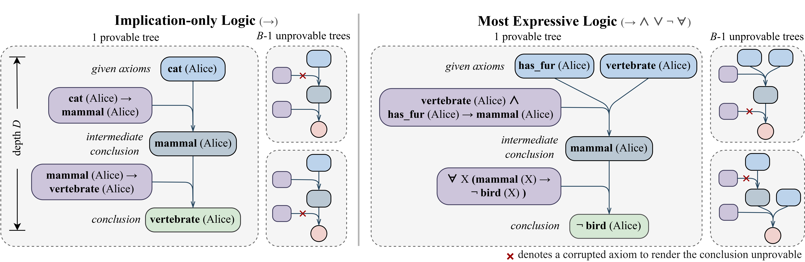

# RL 은 LLM 에게 긴 호흡 추론을 가르칠 수 있을까 — ScaleLogic 으로 본 표현력의 힘

> 원본: [arxiv.org/abs/2605.06638](https://arxiv.org/abs/2605.06638)

수학·코딩 RL 로 훈련한 추론 모델이 한 줄 늘어난 문제 앞에서 갑자기 무너진다. 이 long-horizon 한계가 어디서 오는지 분석하려면 추론 깊이와 논리 구조를 독립적으로 돌릴 수 있는 환경이 필요하다. ScaleLogic 은 그 공백을 메우는 합성 환경이고, 이 환경 위에서 RL 학습이 따르는 power-law 와 다운스트림 전이의 표현력 의존성을 정량화한다.

## 핵심 포인트

- 증명 트리를 거꾸로 짜서 깊이 $D$ 와 논리 표현력 $L$ 을 분리 통제하는 합성 환경 ScaleLogic 을 제안.
- 90% 정확도 도달까지 필요한 학습 step 수 $T$ 가 깊이에 대해 power-law: $T \propto D^{\gamma}$, 모든 환경에서 $R^{2} > 0.99$.
- 지수 $\gamma$ 가 표현력에 따라 단조 증가: Implication-only 1.04 → + Quantification 2.60.
- 다운스트림 8개 벤치마크 평균은 베이스 49.39% 에서 + Quantification 학습 후 60.05% 까지 (+10.66 점), 단순 표현력은 52% 부근에서 일찍 plateau.
- 커리큘럼 학습이 power-law 지수를 크게 낮춤 (+ Conjunction 에서 Uniform 1.70 → Curriculum 1.33).
- OOD 일반화는 학습 깊이의 약 $3 \times$ 까지만 확장 — horizon limit 자체는 사라지지 않는다.

## 한 페이지 요약

LLM 추론 모델은 individual subproblem 은 잘 풀어도 그것을 직렬로 이어 붙이면 일정 horizon 에서 sharp 하게 무너진다. 이 long-horizon 실패를 RL 사후학습이 어떻게 메우는지 분석하려면, 학습 환경이 검증성·확장성·horizon 통제·표현력 통제 네 축을 동시에 만족해야 한다. 수학·코딩 데이터, self-evolving 파이프라인, 단일-task 합성 데이터는 모두 어느 한 축이 비어 있다.

ScaleLogic 은 두 축을 분리 통제하는 합성 multiple-choice 환경이다. 정답 결론에서 출발해 backward 로 증명 트리를 짜고, 매 확장마다 새 술어를 도입해 derivation 을 유일하게 만든다. 정답 트리는 그대로 두고 나머지 후보는 한 axiom 만 손상 (제거 또는 negation flip) 시켜 도출 불가능하게 만든다. 사용 가능한 논리 연산자는 implication-only → + conjunction → + negation → + disjunction → + quantification 의 5단계 strict superset 위계로 끊어져 있어, 새로 추가된 operator 가 학습 동역학에 끼치는 영향을 cleanly attribute 할 수 있다.

*같은 다지선다 형식이지만 사용 가능한 operator 만 다르다. 깊이 $D$ 와 표현력이 그대로 두 독립 축이 된다.*

이 환경 위에서 Qwen3-4B 를 DAPO 로 학습한 결과, 90% 정확도 도달까지 필요한 학습 step $T$ 가 깊이 $D$ 에 대해 깨끗한 power-law $T = a \cdot D^{\gamma}$ 를 따른다 ($R^{2} > 0.99$). 지수 $\gamma$ 는 표현력이 단조 증가하면서 함께 늘어난다 — Implication-only 의 1.04 (사실상 선형) 에서 + Quantification 의 2.60 까지. 깊이 한 단위 늘리는 비용이 표현력에 의해 결정되는 셈이다. 같은 패턴은 GRPO 와 GSPO 에서도 재현되어 (각각 $\gamma$ 2.05, 1.65), 알고리즘 의존이 아니라 task 의 본질적 성질임을 보인다.

다운스트림 전이는 더 흥미롭다. AIME 2024/2025, AMC 2023, MATH-500, Minerva, OlympiadBench, GPQA-Diamond, MMLU-Pro STEM 8개 벤치마크 평균에서, 베이스 모델 49.39% 가 + Quantification 학습 후 60.05% 까지 오른다 (+10.66 점). 반면 Implication-only 와 + Conjunction 은 약 52% 에서 일찍 plateau 한다. 같은 깊이 ($D=12$) 또는 같은 step (~100) 에 맞춰 통제하면 표현력에 따른 단조 이득이 명확하게 분리된다. 즉 다운스트림은 *얼마나* 학습했는지보다 *무엇을* 학습했는지에 더 좌우된다.

학습 분포 자체도 효율을 가른다. + Conjunction / 깊이 $D=24$ 환경에서 uniform 샘플링은 $\gamma=1.70$, 어려운 깊이만 학습하면 $\gamma=2.36$ 으로 가팔라지고 분산이 가장 크다. 반면 깊이를 점진적으로 키우는 커리큘럼은 $\gamma=1.33$ 까지 떨어뜨린다. 같은 결과가 + Quantification 에서도 재현된다. OOD 일반화 측면에서는 더 깊게 학습할수록 풀 수 있는 깊이가 거의 선형으로 늘지만, $D_{\mathrm{test}} / D_{\mathrm{train}} \approx 3$ 부근에서 정확도가 random 수준으로 떨어져 horizon limit 자체는 사라지지 않는다.

종합하면, RL 사후학습은 *얼마나 많이* 가 아니라 *어떤 구조 위에서* 학습했는지가 본질이다. 합성 데이터를 쓸 때 깊이와 표현력을 의식적으로 분리하고, 가능하면 가장 풍부한 표현력 환경에서 커리큘럼으로 학습하는 것이 같은 자원을 가장 멀리 끌고 가는 길이다.

## 자세히 보기

<!-- VERSIONS_START -->
1. [통제된 환경 없이는 long-horizon RL 을 분석할 수 없다](details/01-why-controlled-rl-environment/) — long-horizon 추론이 무너지는 현상과 기존 RL 학습 데이터가 horizon·표현력 통제 축에서 부족한 이유를 정리하고, ScaleLogic 이 이를 어떻게 메우려 하는지 짧게 예고한다.
2. [ScaleLogic — 증명 트리를 거꾸로 짜서 깊이와 표현력을 분리 제어](details/02-scalelogic-construction/) — 정답 결론에서 출발해 backward 로 증명 트리를 짜고 한 axiom 만 손상시켜 오답을 만든다. 깊이 $D$ 와 후보 수 $B$, 그리고 5단계 표현력 위계를 독립 축으로 두면 난이도가 깨끗하게 분리된다.
3. [DAPO 학습 셋업과 깊이에 대한 파워 로 스케일링](details/03-rl-setup-and-power-law/) — GRPO·DAPO 기반 학습 레시피와 ScaleLogic 위에서 관찰되는 학습 비용 $T = a \cdot D^{\gamma}$ 의 깨끗한 파워 로, 그리고 표현력에 따른 지수 변화를 정리한다.
4. [다운스트림 전이와 커리큘럼이 만든 학습 효율 차이](details/04-downstream-transfer-and-curriculum/) — 합성 환경의 표현력이 실제 벤치마크 전이의 크기를 좌우하고, 커리큘럼이 power-law 지수를 낮춰 같은 자원으로 더 깊이 간다.
5. [OOD 일반화의 한계와 우리에게의 시사점](details/05-ood-and-implications/) — 더 깊게 학습하면 풀 수 있는 깊이가 거의 선형으로 늘지만 horizon limit 은 약 3배 확장에 그친다. 표현력·구조 축까지 의식한 데이터 큐레이션과 합성 환경 활용이 RL 스케일 분석의 실무적 출발점이다.
<!-- VERSIONS_END -->

## 출처

- https://arxiv.org/abs/2605.06638
