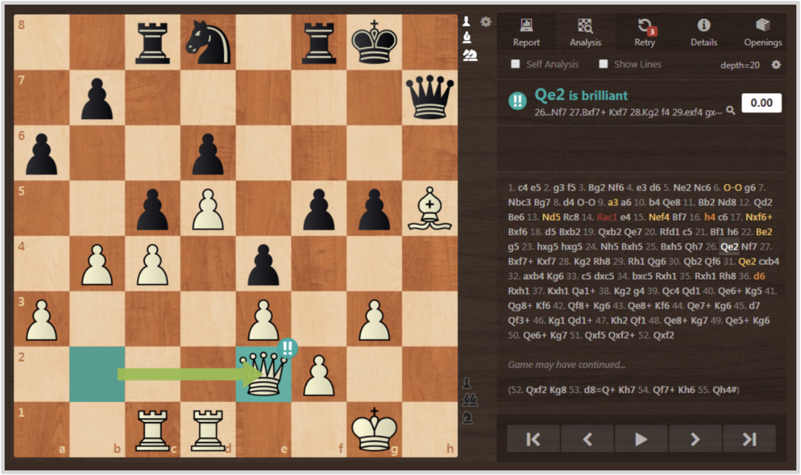

# On-Policy Distillation — 학생 궤적의 매 토큰을 교사가 채점하는 사후학습

> 원본: [thinkingmachines.ai/blog/on-policy-distillation](https://thinkingmachines.ai/blog/on-policy-distillation/)

SFT 는 off-policy/dense, RL 은 on-policy/sparse 라는 두 점에 갇혀 있던 사후학습 지도에서 비어 있던 자리 — on-policy 이면서 dense reward 인 자리 — 를 채우는 방법이다. Thinking Machines Lab 이 Tinker 위에서 구현한 on-policy distillation 은 학생 모델 자신의 rollout 을 sampling 한 뒤 교사 모델이 매 토큰의 reverse KL 로 채점한다. Qwen3 보고서의 결과 (AIME'24 74.4%, RL 1/10 비용) 를 재현하고, 사내 어시스턴트 시나리오에서 catastrophic forgetting 을 회복시키는 데까지 적용된다.

## 핵심 포인트

- 학생 trajectory 의 매 토큰을 $-\mathrm{KL}(\pi_\theta \,\Vert\, \pi_{\mathrm{teacher}})$ 로 advantage 처리. RL importance-sampling loss 위에 한 줄 변경으로 구현.
- Qwen3-8B-Base 학생 + Qwen3-32B 교사: SFT-400K 체크포인트에서 시작해 약 150 step·77K prompt 에 AIME'24 70% 도달. Qwen3 team 보고의 74.4% / 1,800 GPU hr 결과 재현, RL 대비 9~30배 적은 FLOPs.
- 사내 문서로 mid-train 한 Qwen3-8B 의 IF-eval 이 85% → 45% 로 무너지지만, Tulu3 prompt 로 자기 자신을 teacher 로 둔 on-policy distillation phase 를 추가하면 83% 까지 복원하면서 internal QA 도 41% 로 함께 올라간다.
- RL teacher 를 distillation 으로 옮기면 teacher 수준까지 7~10배 빠르게 수렴 (10 step vs 70 step). 짧은 context, 작은 batch 가능까지 합치면 누적 50~100배 절감.
- Reverse KL 은 mode-seeking·unhackable·exposure bias 감소 성질을 동시에 가지며, RL 의 sequence-level KL 과 자연스럽게 호환된다.
- 단일 prompt 만 반복해 학습해도 teacher 수준에 근접 — RL 처럼 정답 memorization 으로 빠지지 않고 teacher 분포를 근사한다.

## 한 페이지 요약

사후학습은 학생이 학습 중 *어떤 분포의 시퀀스* 를 보느냐 (on-policy vs off-policy) 와 *얼마나 dense 한 보상* 을 받느냐 (dense vs sparse) 로 쪼갤 수 있다. SFT 는 off-policy·dense, RL 은 on-policy·sparse 자리에 있고, 두 좋은 성질을 동시에 갖는 자리는 비어 있었다. On-policy distillation 은 그 비어 있던 모서리를 채운다.

핵심은 단순하다. 학생이 자기 분포에서 rollout 을 만들고, 교사 모델이 매 토큰의 reverse KL 로 점수를 매긴다. 학습 식은 $\mathrm{KL}(\pi_\theta \,\Vert\, \pi_{\mathrm{teacher}})$ 의 음수를 토큰별 advantage 로 사용하는 형태이고, 기존 RL 의 importance-sampling loss 함수를 그대로 재활용해 구현 차이는 한 줄 정도다. Discount factor 는 0 — 즉 매 토큰에서 *다음 토큰만* 본다.

*RL 은 시합 결과만 보고, off-policy distillation 은 grandmaster 의 다른 시합을 본다. on-policy distillation 은 grandmaster 가 *내 수* 를 매번 채점하는 셈이다.*

수학 추론 실험은 이 발상의 효과를 깨끗하게 보여준다. Qwen3-8B-Base 학생, Qwen3-32B 교사, OpenThoughts-3 로 400K prompt SFT 한 베이스라인 (AIME'24 60%) 에서 시작한다. SFT 만으로 60% → 70% 를 잡으려면 2M prompt 가량이 필요하다고 추정된다. Qwen3 보고서의 RL 은 같은 자리를 17,920 GPU hr 로 달성한다. 같은 자리에서 출발한 on-policy distillation 은 약 150 step·77K prompt 만에 AIME'24 70% 에 도달하고, 더 끌면 74.4% (RL 의 1,800 GPU hr ≒ $\tfrac{1}{10}$) 까지 간다. FLOPs 기준 절감은 SFT dataset 이 이미 있으면 $9\times$, GPU hour 로는 $18\times$, dataset 까지 새로 만들어야 한다면 $30\times$ 다.

같은 방법이 personalization 에도 깨끗하게 들어맞는다. Qwen3-8B 를 사내 문서로 mid-train 하면 internal QA 는 18% → 43% 로 오르지만 IF-eval 이 85% → 45% 로 무너진다. 30% 비율의 Tulu3 chat data 를 섞으면 IF-eval 은 79% 까지 회복되지만 100% 회복은 어떤 비율로도 불가능하고, 100% chat data 로 SFT 만 돌려도 IF-eval 이 무너진다. 거기에 *같은 모델의 earlier 버전 (Qwen3-8B)* 을 teacher 로 둔 on-policy distillation phase 를 추가하면 IF-eval 이 83% 로 복원되고, internal QA 도 41% 로 (학습 중 손해 없이) 유지된다.

이 효율의 뿌리는 reward 의 dense 함이다. 정보 이론 관점에서 RL 은 episode 당 $O(1)$ bit, distillation 은 $O(N)$ bit ($N$ = 토큰 수) 를 가르친다. 직접 비교 실험 (Qwen3-8B-Base 위에서 DeepMath 로 RL 학습한 결과를 다시 base 모델에 distill) 에서 distillation 은 RL 의 70 step 대비 10 step 으로 teacher 수준에 도달했다. 거기에 짧은 context 로도 학습 가능하고 batch 도 작게 가져갈 수 있어 누적 50~100배 절감으로 이어진다.

또 한 가지 흥미로운 성질은 데이터 효율이다. RL 은 같은 prompt 를 여러 epoch 돌리면 큰 모델일수록 단순 정답 memorization 으로 빠지지만, distillation 은 teacher 의 *분포* 를 근사하므로 그렇지 않다. 한 문제 ($\lim_{x \to \infty} \sqrt{x}\,\bigl(\sqrt[3]{x+1} - \sqrt[3]{x-1}\bigr)$) 만 20 step × batch 256 = 5,120 graded sequence 로 학습해도 teacher 수준에 근접한다.

해석하자면, RL 은 parameter space 가 아니라 *semantic strategy 공간* 을 탐색한다. 좋은 strategy 가 한번 발견되면, distillation 은 그 final strategy 만 모방해도 충분하므로 RL 의 curriculum 을 통째로 거치지 않아도 된다. 또한 KL=0 인 self-distillation 데이터로 SFT 를 돌려도 IF-eval 이 무너진다 — finite batch 의 작은 편차가 시간이 지나면 사실상 off-policy training 으로 변하기 때문이다. 반면 on-policy distillation 은 teacher 가 고정되어 있어 self-distillation setting 에서도 regress 가 없고, 이 점이 continual learning 의 scaffold 로 가는 자연스러운 청사진을 만든다.

## 자세히 보기

<!-- VERSIONS_START -->
1. [SFT 도 RL 도 아닌 제3의 길 — on-policy distillation 이 메우려는 빈틈](details/01-why-on-policy-distillation/) — SFT 의 compounding error 와 RL 의 sparse reward 가 각각 어떤 한계를 만드는지 정리하고, on-policy 샘플링과 dense reward 를 결합한 distillation 의 발상을 체스 비유로 풀어낸다.
2. [학생 궤적을 교사가 토큰 단위로 채점한다 — Reverse KL 과 알고리즘](details/02-reverse-kl-and-algorithm/) — 학생 자신의 rollout 에 대해 교사가 매 토큰의 reverse KL 을 부여하는 per-token 손실을 정의한다. mode-seeking, unhackable, exposure bias 감소 같은 성질과 RL 위에 한 줄 추가로 구현되는 pseudocode 를 본다.
3. [수학 추론 사후학습 — AIME'24 74.4% 를 RL 의 1/10 비용으로](details/03-math-reasoning-experiments/) — Qwen3-8B-Base 학생 + Qwen3-32B 교사 셋업에서 AIME'24 60% → 70% 가 약 150 step·77K prompt 만에 도달하고, 같은 결과를 RL 대비 9~30배 적은 FLOPs 로 얻는다. Qwen3 보고서의 74.4% 도 재현된다.
4. [도메인 지식과 instruction following 을 한 모델에 — 사내 어시스턴트 사례](details/04-personalization-and-forgetting/) — 사내 문서로 mid-train 한 Qwen3-8B 의 instruction following 이 85% → 45% 로 무너지지만, Tulu3 prompt 로 on-policy distillation 을 돌려 83% 까지 복원하면서 knowledge 도 함께 유지된다. LoRA·SFT 의 한계와 함께 결과 표를 본다.
5. [Dense reward 가 만드는 50~100배 절감과 continual learning 의 약속](details/05-compute-efficiency-and-continual-learning/) — 같은 teacher 를 RL 로 학습한 결과를 distillation 으로 옮길 때 7~10배 빠르게 수렴하고, 누적 50~100배 비용 절감이 일어난다. 단일 prompt 만 반복해도 teacher 수준에 근접하고, SFT 가 KL=0 데이터에서도 무너지는 continual learning 한계와 대비된다.
<!-- VERSIONS_END -->

## 출처

- https://thinkingmachines.ai/blog/on-policy-distillation/
