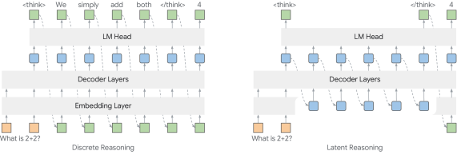

# 왜 잠재 추론인가, 그리고 왜 어려운가

> 원본: [arxiv.org/abs/2505.18454](https://arxiv.org/html/2505.18454v2)

LLM 의 추론 성능은 사실상 chain-of-thought (CoT) 에 묶여 있다. 모델이 정답을 바로 내지 않고, 중간 단계를 토큰으로 한 번 더 풀어 쓰면 점수가 올라간다. 그런데 이 방식은 모든 사고 과정을 vocabulary 라는 좁은 문에 다시 통과시켜야 한다. "잠재 추론 (latent reasoning)" 은 그 문을 열어 보자는 시도다. 토큰으로 다시 토해 내기 전의 hidden state 자체를 다음 스텝의 입력으로 돌려서, 내부에서 더 풍부한 표현으로 사고하게 만들자는 것이다.

이 편은 그 약속이 왜 자연스러운가, 그리고 막상 LLM 에 붙여 보면 왜 잘 안 되는가를 정리한다. 그래야 이후 편에서 다룰 HRPO 의 설계 선택 (게이팅, 강화학습, 하이브리드 입력) 이 왜 그 형태일 수밖에 없는지 보인다.

*이산 토큰 디코딩 (좌) 과 hidden state 기반 잠재 추론 (우) 의 흐름 비교. 좌는 매 스텝 vocabulary 위 분포에서 토큰을 뽑아 다시 입력으로 쓰고, 우는 직전 스텝의 hidden state 를 그대로 (또는 가공해서) 다음 입력으로 흘린다.*

## 자기회귀 추론의 한계

자기회귀 CoT 는 단순하다. 매 스텝 LLM 이 hidden state $h_t$ 를 만들고, LM head 가 $h_t$ 를 vocabulary 위 분포로 사영한 뒤 토큰 하나를 샘플링한다. 그 토큰의 embedding 이 다음 스텝의 입력이 된다.

$$
o_t = \text{Head}(h_t), \quad x_{t+1} \sim \text{softmax}(o_t)
$$

이 구조 자체는 깨끗하지만, 추론용으로 보면 두 가지 비용이 분명하다.

- 정보 압축 손실. $h_t$ 는 보통 수천 차원의 연속 벡터지만 vocabulary 한 토큰으로 강제 압축된다. 모델이 가지고 있던 "확률 분포로서의 사고" 가 단일 선택으로 무너지고, 그 정보는 다음 스텝에 일부도 전달되지 않는다.
- 경로 의존성. 한 번 뽑힌 토큰은 곧장 다음 입력으로 들어간다. 잘못 뽑힌 토큰을 뒤에서 만회하려면 또 다른 토큰을 더 쓰는 길밖에 없다. 시퀀스가 길어질수록 누적된다. 추론 길이 자체가 비용이자 오류원이 된다.
- 표현력의 좁은 문. 매 스텝 vocabulary 라는 이산 집합의 한 원소로 사고를 강제 환원한다. 미세한 확률 차이 (예: 두 가설을 5:5 로 동시에 보고 있는 상태) 는 다음 스텝으로 흘러갈 통로가 없다.

직관적으로 말하면, CoT 는 사고의 흔적을 매 스텝 "한국어 문장" 으로 받아 적도록 강제하는 것과 같다. 받아 적는 행위 자체가 사고를 좁힌다.

## 잠재 추론은 무엇을 약속했나

잠재 추론은 위의 두 비용을 동시에 우회하려는 흐름이다. 추론 중간에는 굳이 토큰으로 사영하지 말고, hidden state 끼리 직접 이어 붙이자는 것이다. 대표적인 라인은 다음과 같다.

- Coconut [Hao et al., 2024]. 마지막 레이어 hidden state 를 "continuous thought" 로 보고, 그대로 다음 스텝의 입력 embedding 자리에 넣어 준다. 추론 구간에서는 토큰 샘플링을 건너뛴다.
- CODI [Shen et al., 2025]. 자기 자신을 teacher 로 둔 self-distillation 으로, 명시적 CoT 토큰 시퀀스에서 학습한 표현을 implicit 잠재 추론으로 옮겨 담는다.
- Depth-recurrent LM [Geiping et al., 2025]. 트랜스포머 블록을 여러 번 재귀적으로 통과시켜 latent variable 을 내부에서 굴린 뒤 최종 상태에서 토큰을 뽑는다. CoT 데이터 자체가 없어도 된다는 장점.
- Pause token / filler token [Goyal et al., 2024; Pfau et al., 2024]. `<pause>` 같은 특수 토큰을 끼워 넣어 추가 연산 스텝을 확보한다. 토큰은 의미가 없고 단지 hidden state 를 한 번 더 굴리기 위한 자리.
- Implicit CoT [Deng et al., 2023, 2024]. 명시적 reasoning trace 를 점진적으로 내재화하도록 학습해, 추론 시 외부에 트레이스를 노출하지 않고도 같은 정답에 도달하게 만든다.

이상 모두의 공통된 약속은 "토큰 디코딩이라는 좁은 문을 추론 구간에서는 잠시 닫고, 모델이 가진 연속 표현으로 더 풍부하게 사고하게 하자" 다.

## 그런데 왜 LLM 에 잘 안 붙는가

문제는 사전학습된 일반 LLM 에 이 잠재 추론을 그대로 얹으면 잘 안 된다는 점이다. 원문은 그 이유를 세 갈래로 정리한다.

### CoT 트레이스 의존

CODI 류의 implicit 잠재 추론은 결국 supervised 한 CoT 트레이스가 있어야 학습이 된다. Coconut 도 multi-stage 학습 과정에서 CoT 토큰 위치를 단계적으로 잠재 표현으로 치환한다. 즉, 잠재 표현을 학습시키기 위한 "지도용 사고 흐름" 이 필요한 셈이다. 도메인이 넓어질수록 이 트레이스 비용이 그대로 학습 비용이 된다.

### 멀티스테이지 학습과 비용

Coconut 은 토큰 추론 -> 일부 토큰만 잠재로 -> 더 많은 토큰을 잠재로, 라는 식으로 단계별 커리큘럼이 필요하다. 단계마다 모델이 완성된 추론 사슬을 잠시 잃어버린다는 부작용도 보고된다 [Shen et al., 2025]. depth-recurrent 모델은 아예 멀티 블록 구조를 scratch 부터 학습한다. 두 경우 모두 "잠재 추론용 학습 파이프라인" 을 따로 들고 가야 한다.

### Manifold mismatch, 학습이 아니라 추론 자체의 문제

가장 까다로운 부분이다. 사전학습 LLM 의 출력 hidden state $h_t$ 와 input embedding $e_t$ 는 사실 같은 공간에 살지 않는다. 토큰 입력 분포에 맞춰 학습된 입력 embedding 의 manifold 가 따로 있고, 디코딩을 거쳐 나온 hidden state 는 그 manifold 바깥 어딘가에 떨어진다. 차원 수가 같다고 같은 공간이 되는 건 아니다 — 매 레이어가 학습 중 본 입력 분포에 맞춰 정렬되어 있을 뿐이다.

Coconut 처럼 $h_t$ 를 그대로 다음 입력에 꽂으면, 모델은 "처음 보는 종류의 입력" 을 받게 된다. 결과는 다음과 같이 깨진다.

- 같은 토큰 반복 (degenerate repetition)
- 의미적으로 이어지지 않는 생성 (incoherence)
- 길이가 늘어날수록 발산하는 hidden state 노름

원문 4.3 절은 이 mismatch 가 그저 학습이 부족해서가 아니라 입력 분포 자체가 달라서 생기는 구조적 현상이라고 본다. 그래서 Coconut 도 한 번에 모든 추론 토큰을 잠재로 바꾸지 못하고 단계별 커리큘럼을 둔 것이다. 이 mismatch 가 결국 학습 비용을 키우고 잠재 추론 도입의 문턱을 높인 셈이다.

## 이상적인 잠재 추론은 무엇을 만족해야 하는가

위 세 가지를 뒤집으면 이상적인 잠재 추론 기법이 만족해야 할 조건이 자연스럽게 나온다. 원문 서론은 다음 네 가지를 명시한다.

- 사전학습 LLM 의 generalizability 를 그대로 활용해야 한다. 즉, 잠재 추론용 모델을 새로 학습하는 게 아니라 기존 LLM 의 내재 능력 위에 얹을 수 있어야 한다.
- 연속 표현을 매끄럽게 통합해야 한다. hidden state 를 입력에 섞을 때 manifold 가 깨지지 않도록, 사영 또는 게이팅 같은 다리가 필요하다.
- interpretability 가 살아 있어야 한다. 추론 전 구간이 hidden state 로만 흐르면 사람이 들여다 볼 길이 없다. 토큰 흐름도 일부는 남겨야 한다.
- CoT 의존을 줄여야 한다. 광범위한 트레이스 라벨 없이도 잠재 추론을 학습시킬 수 있어야 폭넓게 쓰인다.

문제는 이 네 조건이 서로 견인한다는 것이다. CoT 의존을 없애려면 정답 신호만으로 학습할 길을 열어야 하는데 (보통 강화학습), 강화학습은 stochasticity 가 있어야 도는데, 잠재 추론은 stochasticity 를 죽이는 방향이라는 식이다.

## 이 논문의 한 줄 답

원문이 내놓은 한 줄 답은 다음과 같다.

> 강화학습으로 LLM 의 내재 추론 능력을 정답 보상만으로 끌어내되, 추론 구간의 입력은 샘플링된 토큰 embedding 을 기본으로 두고 hidden state 를 게이팅으로 점진적으로 섞는다.

이 한 문장 안에 위 네 조건에 대한 응답이 다 들어 있다.

- "강화학습 + 정답 보상" -> CoT 트레이스 의존 제거.
- "샘플링된 토큰 embedding 기본" -> manifold mismatch 회피, 생성 능력 보존, interpretability 유지.
- "hidden state 게이팅으로 점진적 통합" -> 연속 표현의 매끄러운 통합.
- 전 과정이 사전학습 LLM 위에서 도는 fine-tuning -> generalizability 활용.

이 프레임을 저자들은 hybrid reasoning policy optimization (HRPO) 라고 부른다. "hybrid" 는 토큰과 hidden state 를 동시에 입력으로 쓴다는 뜻이고, "policy optimization" 은 GRPO 계열 on-policy RL 에 기반한다는 뜻이다.

## 5편 시리즈 미리보기

이후 4편에서 같은 구조를 다음 순서로 푼다.

- 2편. 게이팅과 하이브리드 입력. hidden state 를 vocabulary 위 weighted interpolation 으로 사영해 입력 manifold 로 끌어오는 단계와, 학습 가능한 게이트로 토큰 embedding 과 잠재 표현을 섞는 식의 도입.
- 3편. HRPO 의 RL 목적함수. GRPO 의 그룹 단위 advantage 와 outcome-only reward 위에 얹은 strict on-policy 변형, KL 정규화의 처리 방식, ratio clipping 을 뺀 이유.
- 4편. 실험. 지식 집약형 (NQ, TriviaQA, HotpotQA, 2WikiMQA, Bamboogle) 과 추론 집약형 (수학·STEM) 벤치마크에서 HRPO 가 기존 latent reasoning baseline 과 RAG·검색 기반을 어떻게 넘는가.
- 5편. 분석과 시사점. 게이트가 학습 중 어떻게 열리는가, completion length 가 왜 짧아지는가, cross-lingual reasoning 같은 emergent 패턴이 왜 나오는가, 그리고 사내 환경에서 이 접근을 어떻게 받아쓸 수 있는가.

다음 편: [02. 게이팅과 하이브리드 입력](02-gating-and-hybrid-input.md)

## 출처

- Hybrid Latent Reasoning via Reinforcement Learning, arXiv 2505.18454v2. <https://arxiv.org/html/2505.18454v2>
