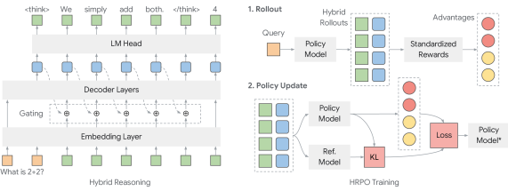

# 게이팅으로 토큰과 hidden state 섞기

> 원본: [arxiv.org/abs/2505.18454](https://arxiv.org/html/2505.18454v2)

이전 편에서 잠재 추론의 동기와 기존 접근의 한계를 봤다. 핵심 질문이 하나 남아있다. 다음 step 의 입력으로 무엇을 넣을 것인가. 토큰을 샘플하면 정보가 깎이고, hidden state 를 그대로 넣으면 모델이 망가진다. HRPO 는 이 둘을 게이트로 섞는다. 이 편은 그 입력 구성 방식만 따라간다.

## 왜 hidden state 를 그대로 못 쓰는가

표기부터 정리하자. 입력 토큰의 임베딩 시퀀스가 들어가면 Transformer 가 매 step 의 hidden state $h_t$ 를 만들고, LM head 가 그 위에서 다음 토큰 분포 $p_t$ 를 뽑는다. 이산 토큰 $y_t$ 는 그 분포에서 샘플된다.

문제는 $h_t$ 자체를 다음 step 의 입력 임베딩으로 그대로 끼워 넣을 때 발생한다. $h_t$ 는 마지막 레이어의 잔차 스트림에서 나온 벡터로, 어휘 토큰 임베딩들이 살고 있는 manifold 와 같은 분포가 아니다. 단순히 norm 이 다른 정도가 아니라 방향성, 분산, 그리고 LayerNorm 이후의 통계 자체가 다르다. 모델은 토큰 임베딩 위에서 학습했기 때문에, 본 적 없는 분포의 벡터가 입력으로 들어오면 attention key/query 가 이상한 패턴을 만들고 생성이 무너진다. 논문에서 직접 실험한 결과도 같다 — hidden state 를 그대로 다음 입력으로 넣은 변형은 무의미한 rollout 만 양산하고 reward 가 0 으로 깔린다.

해결 방향은 단순하다. hidden 의 정보는 살리되, 입력은 반드시 모델이 익숙한 임베딩 공간 안에 두자.

## 1단계: 출력 분포로 embedding 재구성

첫 번째 장치는 interpolated embedding 이다. hidden 을 임의의 사영 행렬로 임베딩 차원에 떨어뜨리는 대신, 이미 가지고 있는 정보 — LM head 가 만든 출력 분포 — 를 가중치로 써서 token embedding 들의 가중합을 만든다.

$$
\tilde{e}_t = \mathrm{Norm}\!\left( \sum_{v \in V} \mathrm{softmax}\!\left(\frac{\ell_t}{\tau}\right)_v \cdot E_v \right)
$$

여기서 $\ell_t$ 는 $h_t$ 에 LM head 를 통과시킨 logits, $\tau$ 는 온도, $E$ 는 LLM 의 토큰 임베딩 행렬, $V$ 는 어휘 집합이다. $\mathrm{Norm}$ 은 결과 벡터의 스케일과 분산을 원래 임베딩 통계에 맞추기 위한 정규화다.

직관은 이렇다. 모델이 "다음 토큰은 아마 A 가 0.4, B 가 0.3, C 가 0.2, 나머지는 잡음 수준" 이라고 판단했다면, 그 분포를 그대로 임베딩 공간에서의 가중평균으로 옮긴다. 결과 벡터 $\tilde{e}_t$ 는 단일 토큰 임베딩이 아니라 후보 토큰들의 혼합이지만, **여전히 토큰 임베딩들의 convex combination 근처에 머문다**. 즉 모델 입장에서 처음 보는 분포가 아니다. 그리고 이 연산 전체가 미분 가능하므로 hidden 으로부터 입력까지 gradient 가 끊김 없이 흐른다.

$\tau$ 는 분포의 날카로움을 조절한다. 작게 잡으면 top 토큰에 질량이 몰려 $\tilde{e}_t$ 가 사실상 단일 토큰 임베딩에 수렴하고, 크게 잡으면 더 많은 토큰의 정보가 섞여 들어온다. 논문에서는 $\tau$ 를 0.5~0.7 부근에서 안정적이라 보고한다.

여기까지만 보면 깔끔해 보인다. 그러나 결정적인 한계가 있다.

## 왜 interpolated embedding 만으로는 부족한가

$\tilde{e}_t$ 는 분포에서 직접 계산된 결정론적 결과다. 같은 hidden 이 들어오면 같은 입력이 나온다. 이게 RL 에서는 치명적이다.

RL rollout 은 stochastic 해야 한다. 정책이 같은 prefix 에서 다른 trajectory 를 만들 수 있어야 advantage 가 변별력을 가지고, 그래야 정책이 더 나은 경로로 이동한다. 그런데 $\tilde{e}_t$ 만으로 입력을 만들면 sampling 단계가 사라진다. 게다가 분포가 평탄한 step 에서는 관련 없는 토큰의 임베딩까지 가중합에 섞여 들어가 일종의 노이즈로 작용한다. 논문에서 $\tilde{e}_t$ 만 사용한 변형을 실험해 보니 학습 초반 몇백 step 은 그럭저럭 따라오다가 reward 가 무너지고 회복이 느렸다. 결정론 + 잡음 누적이 RL 의 탐색을 마비시킨 것이다.

따라서 필요한 것은 두 가지를 동시에 만족시키는 입력이다. 하나, 토큰 sampling 으로 stochasticity 를 확보할 것. 둘, hidden 으로부터 얻은 풍부한 신호를 함께 흘릴 것. 게이팅이 그 합의점이다.

## 2단계: 게이트로 하이브리드 입력 만들기

샘플된 이산 토큰 $y_t$ 의 임베딩을 $e_t = E_{y_t}$ 라 하자. 같은 step 에서 식 (3) 의 사영 임베딩 $\tilde{e}_t$ 도 함께 계산해 둔다. HRPO 는 이 둘을 게이트로 섞는다.

$$
h^{\mathrm{in}}_t = g_t \cdot e_t + (1 - g_t) \cdot g'_t \cdot \tilde{e}_t
$$

게이트 $g_t$ 와 보조 게이트 $g'_t$ 는 모두 sigmoid 기반이다.

$$
g_t = \sigma(\alpha \cdot w^\top h_t), \qquad g'_t = \sigma(w^\top h_t)
$$

여기서 $w$ 는 학습 가능한 벡터, $\alpha$ 는 고정 스케일 상수 (논문은 $\alpha = 8$ 을 사용한다), $\sigma$ 는 sigmoid 다. 결과 $h^{\mathrm{in}}_t$ 가 다음 step 의 입력 임베딩으로 들어간다.

구조를 풀면 이렇다. $g_t$ 는 "이번 step 입력에서 sampled token embedding 의 비중" 이다. 1 에 가까우면 다음 입력은 거의 $e_t$, 즉 표준 autoregressive 디코딩과 같아진다. 0 에 가까우면 잠재 신호 쪽으로 무게가 옮겨간다. $g'_t$ 는 그 잠재 항 $\tilde{e}_t$ 가 실제로 얼마나 살아남을지 다시 한 번 조절하는 attenuator 역할을 한다. 두 게이트 모두 $h_t$ 에 의존하므로 step 마다, 위치마다 비율이 달라진다. 어떤 토큰에서는 모델이 토큰 임베딩에 거의 전적으로 의존하고, 어떤 토큰에서는 잠재 신호를 적극적으로 끌어쓴다.

게이트가 $\alpha$ 라는 스케일을 끼고 있는 이유도 분명하다. sigmoid 는 saturating 함수라 $w^\top h_t$ 가 작은 값에 머물면 결과가 0.5 근처에서 잘 움직이지 않는다. $\alpha = 8$ 같은 큰 상수를 곱하면 sigmoid 가 빠르게 0 또는 1 끝으로 밀려, 학습이 게이트를 분명한 방향으로 끌고 가기 쉬워진다. 동시에 $g'_t$ 는 $\alpha$ 없이 부드러운 영역에 두어 미세 조정 여지를 남긴다.

이 식이 던지는 핵심 메시지는 두 가지다. **입력은 여전히 토큰 임베딩 공간 안에 있다** — $e_t$ 도 $\tilde{e}_t$ 도 토큰 임베딩들의 선형결합이다. **stochasticity 는 보존된다** — $e_t$ 는 분포에서 샘플된 진짜 이산 토큰의 임베딩이므로, rollout 마다 다른 trajectory 가 자연스럽게 생긴다.

## 초기화가 학습 곡선을 가른다

게이트는 학습 대상이지만, 시작점이 매우 중요하다. 처음부터 hidden 비중이 크면 모델이 토큰 임베딩에 익숙해진 기존 능력을 잃고 생성이 망가진다. 반대로 너무 토큰에 치우치면 잠재 신호가 학습되지 않은 채 평범한 RL 로 수렴한다.

논문은 게이트를 학습 초반 sampled token 우세로 시작하도록 초기화한다. 구체적으로 $\alpha \cdot w^\top h_t$ 의 분포가 충분히 큰 양수가 되도록 $w$ 의 초기 norm 을 잡아 $g_t$ 가 $[r_{\min}, 0.999]$ 의 균등 분포에서 뽑힌 값처럼 행동하게 만든다. 즉 초기 $g_t$ 는 거의 1 에 가까워, 학습 시작 시점의 입력은 사실상 $e_t$ 만 들어가는 표준 디코딩과 같다.

여기서 $r_{\min}$ 은 단일 하이퍼파라미터인데, 효과가 크다. 작게 잡을수록 — 예를 들어 $r_{\min} = 0.95$ — 초기부터 hidden 비중에 약간의 여유를 두게 되고, 게이트가 잠재 신호를 더 빨리 끌어들이게 된다. 논문의 ablation 은 $r_{\min} \in \{0.95, 0.98, 0.99\}$ 에서 일관되게 더 작은 $r_{\min}$ 이 knowledge 태스크에서 더 좋은 평균을 냈다고 보고한다. STEM 에서는 양 극단이 좋고 중간이 살짝 떨어지는 bimodal 양상을 보인다 — 토큰에 명확히 의존하거나 잠재에 명확히 의존하는 것이 어중간한 혼합보다 낫다는 해석이다.

학습이 진행되면서 무슨 일이 벌어지는가. 논문이 추적한 hidden ratio — 평균 $(1 - g_t)$ — 는 cosine 학습률 스케줄이 끝물에 접어들어도 꾸준히 증가한다. 즉 모델은 시간이 갈수록 잠재 신호의 비중을 자발적으로 키운다. 동시에 completion 길이는 학습 초기에 늘어났다가 후반에 감소한다. hidden 으로 과거 맥락을 압축해 들고 다니게 되면서 굳이 긴 토큰 시퀀스를 생성할 필요가 줄어든 결과로 해석된다. 작은 $r_{\min}$ 을 쓴 변형에서 이 효과가 가장 두드러진다.

## 어디까지 잠재로 추론하는가

남는 디테일 하나. hybrid reasoning 이 모든 토큰에 적용되는가?

아니다. 이 게이팅은 추론 구간 — 즉 `<think>...</think>` 안 — 에서만 작동한다. 모델이 최종 답을 내놓는 답변 구간은 표준 autoregressive 디코딩으로 돌아간다. 답변 토큰에 게이트를 끼면 사람이 읽거나 채점기가 평가할 텍스트가 잠재 신호로 오염되기 때문이다. 추론 중에는 모델 내부 정보 흐름을 풍부하게 두되, 외부로 내보내는 결과는 깔끔한 이산 토큰으로 마무리한다.

*그림은 학습 가능한 게이트로 sampled token embedding 과 projected hidden 을 섞어 다음 입력을 만드는 hybrid reasoning 의 구조 (좌). 추론 구간에서만 게이팅이 작동하고, 답변 구간은 표준 디코딩으로 빠진다.*

## 왜 이게 plug-and-play 인가

이 설계가 매력적인 이유는 모듈 단위가 매우 작다는 점이다. 학습 가능한 파라미터는 게이트 벡터 $w$ 와, $\tilde{e}_t$ 계산에 쓰이는 사영을 위한 LoRA-급의 가벼운 모듈뿐이다. 베이스 LLM 의 어떤 가중치도 구조적으로 바꿀 필요가 없다. 디코더 레이어 사이에 새 블록을 끼우지 않고, attention 패턴을 손대지도 않는다. 매 step end 에서 hidden $h_t$ 와 logits $\ell_t$ 만 받아 다음 step 입력을 만드는 한 단계를 추가했을 뿐이다.

또한 입력은 항상 LLM 의 native embedding 공간에 정렬되어 있다. $e_t$ 는 정의상 토큰 임베딩이고, $\tilde{e}_t$ 는 토큰 임베딩들의 정규화된 가중합이며, 둘의 convex combination 도 같은 공간 안에 머문다. 모델이 본 적 없는 분포의 벡터가 입력으로 들어올 일이 없다. 이게 hidden 을 그대로 끼웠을 때 rollout 이 무너지던 실험과 대비된다.

이렇게 만든 하이브리드 입력이 RL rollout 의 한 step 을 구성한다. 그 다음 질문은 자명하다. 이런 trajectory 로 정책을 어떻게 업데이트할 것인가. 토큰과 잠재가 섞인 출력에 대해 어떤 reward 와 어떤 log-prob 으로 gradient 를 줄 것인가. 다음 편이 그 RL 목적함수를 다룬다.

다음 편: [03. HRPO 의 RL 목적함수](03-rl-objective-hrpo.md)

## 출처

- Yueeeeeeee et al., *Hybrid Latent Reasoning via Reinforcement Learning*, arXiv:2505.18454v2, 2025. [arxiv.org/abs/2505.18454](https://arxiv.org/html/2505.18454v2)
- 부록 A — 게이트 초기화: $g_t$ 가 $[r_{\min}, 0.999]$ 균등에서 뽑히도록 $w$ 를 초기화, $\alpha = 8$
