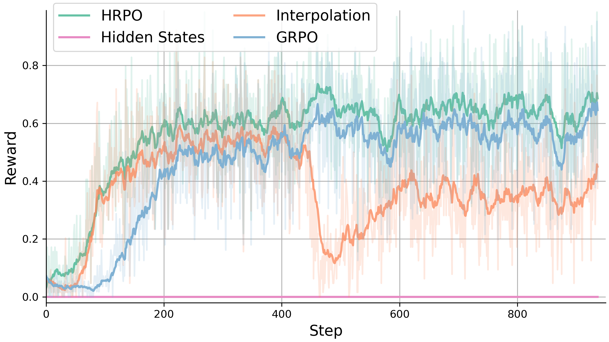
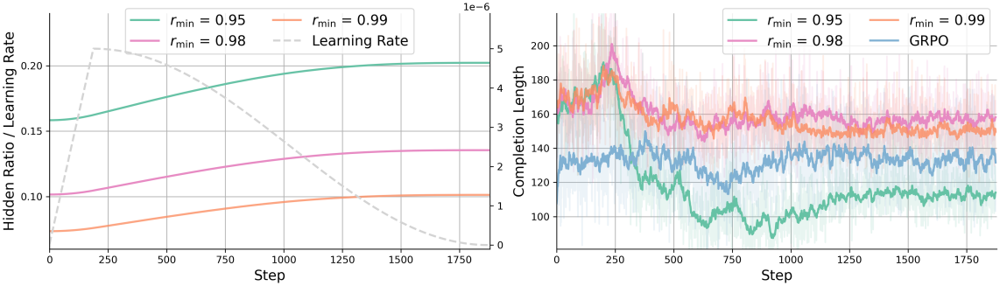
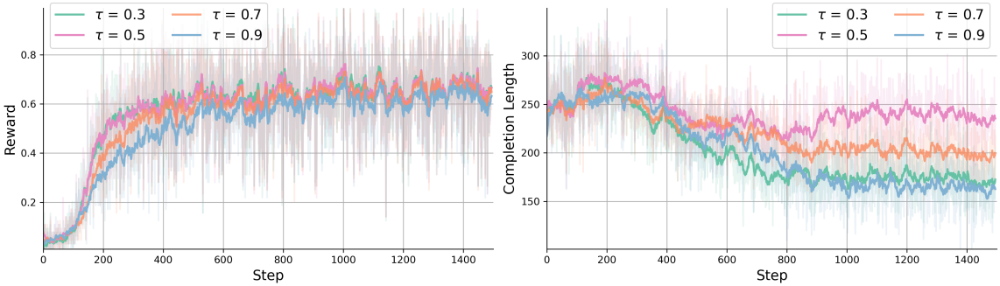

# 분석, 창발 패턴, 그리고 한계

> 원본: [arxiv.org/abs/2505.18454](https://arxiv.org/html/2505.18454v2)

벤치마크 점수만 보고 끝내면 HRPO 가 왜 작동하는지는 알기 어렵다. 이 편은 논문 4.3절의 ablation 과 5절의 정성 분석을 따라가면서 다음을 정리한다. (1) hidden state 를 어떻게 섞느냐가 학습 안정성에 어떤 차이를 만드는가, (2) hybrid 비율과 게이팅·온도 같은 핵심 하이퍼파라미터가 학습 동역학을 어떻게 바꾸는가, (3) 그 결과로 어떤 새로운 추론 패턴이 창발하는가, (4) 무엇이 아직 한계로 남는가.

## 세 가지 잠재 전략 — 왜 hybrid 만 살아남나

먼저 가장 근본적인 질문을 짚어 둔다. "hidden state 를 그냥 다음 스텝 입력으로 넣어 RL 하면 왜 안 되나?" 저자들은 Qwen 1.5B 를 MATH 로 학습하면서 세 가지 변형을 같은 조건에서 비교한다.

- (a) hidden states 단독: 직전 스텝의 마지막 layer hidden state 를 다음 스텝의 입력으로 그대로 넣는다.
- (b) interpolation 단독: 식 (3) 처럼 hidden state 와 sampled token embedding 을 단순 interpolation 한 벡터를 입력으로 넣는다.
- (c) HRPO (full hybrid): 식 (4) 의 학습 가능한 게이트 $g_t$ 로 둘을 섞는다.

*세 잠재 전략과 GRPO baseline 의 reward exponential moving average. hidden state 단독은 학습 내내 0 근처에 머물고, interpolation 은 초반에 따라오다가 후반 붕괴 후 느리게 회복하며, HRPO 만이 GRPO 와 비슷한 안정성을 가지면서 더 빠르게 수렴한다.*

결과는 셋의 갈림이 분명하다. hidden state 단독은 입력 분포가 학습 분포의 embedding 과 다르다는 mismatch 때문에 거의 nonsensical 한 rollout 만 만들어 내고, 보상이 사실상 0 으로 고정된다. interpolation 은 처음 수백 스텝 동안은 HRPO 와 비슷하게 따라오지만, 어느 시점에서 보상이 급격히 무너진 뒤 느리게만 회복한다. 단순 interpolation 이 너무 많은 잡음을 입력에 섞기 때문으로 해석된다. 반면 HRPO 는 GRPO 만큼 안정적이면서 더 빠르게 수렴해, 가장 빠른 단계에서 가장 높은 보상 plateau 에 올라선다.

여기서 끌어낼 메시지는 두 가지다. 첫째, hidden state 를 그대로 입력으로 쓰는 가장 단순한 접근은 LLM 의 사전학습 분포와의 mismatch 때문에 학습 자체가 시작도 못 한다. 둘째, hybrid 입력이라는 발상이 옳더라도 어떻게 섞느냐가 결정적이다. "그냥 절반씩 섞기" 같은 고정 비율은 후반에 무너지고, 학습으로 그 비율을 매 스텝 다시 결정하게 한 HRPO 의 게이팅이 안정성과 수렴 속도를 모두 가져온다.

## Hidden ratio 가 학습 내내 늘어나는 동역학

다음 질문. 학습이 진행되면 모델은 정말 latent 비중을 늘리는가, 아니면 결국 토큰 trajectory 로 돌아가는가? 핵심 지표는 평균 hidden ratio 다. 식 (4) 에서 hybrid 입력은 token embedding 에 가중치 $g_t$, hidden state 에 가중치 $1 - g_t$ 가 붙는다. 즉 hidden ratio 는 한 rollout 의 모든 스텝에 걸친 $1 - g_t$ 의 평균이고, 이 값이 클수록 모델이 그 trajectory 에서 hidden state 쪽에 더 많이 기댔다는 뜻이다.

*좌: 학습 스텝에 따른 hidden ratio (실선) 와 learning rate (점선) — cosine schedule 로 LR 이 줄어드는 동안에도 hidden ratio 는 꾸준히 증가한다. 우: 각 $r_{\min}$ 설정별 completion length — 초반에 늘었다가 후반에 줄고, 그 감소폭은 HRPO 에서 가장 크다.*

knowledge task 에서 Qwen 1.5B 를 학습한 결과를 보면, 세 가지 흐름이 동시에 나타난다.

- 모든 실행에서 hidden ratio 가 학습 내내 단조 증가한다. cosine LR 스케줄로 학습률이 후반에 작아지는 시점에도 ratio 는 멈추지 않고 계속 오른다. RL 의 보상 신호가 "더 latent 쪽으로 가" 라는 방향을 일관되게 누르고 있다는 뜻이다.
- completion length 는 초반에 늘었다가 어느 시점부터 줄어드는 곡선을 그리고, 그 감소폭은 GRPO 보다 HRPO 에서 더 크다. 모델이 같은 보상을 받기 위해 점점 더 적은 토큰만 뽑는 쪽으로 진화한다.
- 게이트 초기화 범위로 $r_{\min} = 0.95$ 를 쓰는, 즉 처음부터 hidden ratio 가 가장 높은 설정에서는 completion length 가 특히 크게 줄어든다. 다른 변형에는 없는 효과다.

마지막 줄이 흥미롭다. 처음부터 hidden 비중을 충분히 열어 둔 모델이 같은 점수를 더 짧은 출력으로 낸다는 것은, hidden state 가 직전 context 를 압축한 채로 다음 스텝에 들어가서 토큰 trajectory 의 일부를 대신해 주고 있다는 직접적인 신호다. RAG 처럼 검색된 context 를 매번 다 받아쓰지 않고 게이트가 알아서 압축한다고 보면 된다. 다음 절의 게이팅 초기화 분석이 이 직관과 정확히 맞물린다.

## 게이팅 초기화 $r_{\min}$ 의 영향

게이트 $g_t$ 는 학습 가능하지만, 어디서 출발하는지가 학습 궤적을 바꾼다. 저자들은 학습 시작 시점의 $g_t$ 를 균등분포 $[\,r_{\min},\, 0.999\,]$ 에서 뽑고, $r_{\min}$ 을 0.95 / 0.98 / 0.99 세 가지로 바꿔 1.5B 모델을 학습한다. $r_{\min}$ 이 낮을수록 학습 초기의 hidden ratio 가 높다.

knowledge 벤치마크 (NQ, TriviaQA, HotpotQA, 2WikiMQA, Bamboogle) 평균은 $r_{\min} = 0.95$ 에서 0.328 로 가장 높고, $r_{\min}$ 을 키울수록 거의 단조롭게 떨어진다 (0.329 → 0.324). 개별 데이터셋 다수도 가장 낮은 $r_{\min}$ 에서 최고 점수를 찍는다. retrieval context 가 들어오는 작업은 "지금 들어와 있는 긴 컨텍스트를 hidden state 로 압축해 가지고 다음 스텝에 흘리는" 능력이 그대로 점수가 되니, 더 일찍·더 강하게 latent 쪽을 열어 둔 모델이 유리하다.

STEM 벤치마크 (GSM8k, MATH, MATH500, MMLU-ST, ARC-C) 평균은 양상이 다르다. $r_{\min} = 0.95$ 와 $r_{\min} = 0.99$ 가 0.612 / 0.614 로 비슷하게 높고, 중간값인 $r_{\min} = 0.98$ 만 0.608 로 미세하게 낮다. 마진 자체는 좁지만, "bimodal" 한 추세선은 분명하다. 저자들의 해석은 단순하고 설득력 있다. 모델은 명시적 토큰 trajectory 에 무게를 두든 latent representation 에 무게를 두든, 한쪽으로 분명히 치우치는 편이 어중간하게 섞는 것보다 낫다. 수학·과학 문제는 한 줄로 끊기는 reasoning chain 이거나, 반대로 context 를 함축적으로 누른 latent 한 방이 풀이가 되는 두 모드가 공존하고, 중간 mix 는 양쪽의 장점을 모두 흐린다.

실무적으로는 작업 성격에 따라 $r_{\min}$ 을 다르게 잡아야 한다는 결론이다. retrieval·multi-hop QA 처럼 컨텍스트 압축이 곧 점수인 영역은 낮게, 수학·과학처럼 풀이 경로가 길게 이어지는 영역은 둘 중 하나 (낮거나 높게) 로 분명히 치우치게. 한 가지 더 짚어 둘 점은, 게이트가 학습 가능한데도 초기화가 이만큼 점수를 흔든다는 사실이다. 즉 RL 단계의 게이트는 시작점에서 멀리 가지 못한다. 학습 가능한 파라미터라고 해서 어디서 출발하든 같은 지점에 안착할 것이라고 가정하면 안 된다는, 일반적인 RL fine-tuning 의 직관과도 맞물린다.

## 온도 $\tau$ 민감도

식 (4) 에 들어가는 또 다른 손잡이는 latent 표현을 만들 때의 softmax 온도 $\tau$ 다. 작은 $\tau$ 는 top 토큰의 확률을 더 뾰족하게 만들어 잡음을 줄이지만, 모델이 가지고 있던 분포 정보를 좁힌다. 큰 $\tau$ 는 반대로 더 많은 토큰에 확률 질량을 흩뿌려 informativeness 를 키운다. 어느 쪽이 학습에 유리한가?

*좌: $\tau \in \{0.3, 0.5, 0.7, 0.9\}$ 별 reward 곡선 — 작은 $\tau$ (0.3, 0.5) 가 더 빨리 수렴하고 더 높은 plateau 에 도달한다. 우: 같은 설정의 completion length — $\tau$ 가 매우 작거나 매우 클 때 모두 완성 길이가 짧아지고, 중간값 (0.5, 0.7) 에서 가장 길다.*

MMLU 에서 1.5B 모델로 본 결과는 두 갈래로 나뉜다. 보상 plateau 자체는 $\tau = 0.3, 0.5$ 가 분명히 우세하다. 작은 $\tau$ 가 더 빠르게 수렴하고 더 높은 보상에 안착한다. completion length 는 정반대 모양으로, $\tau$ 가 매우 작을 때 ($\tau = 0.3$) 와 매우 클 때 ($\tau = 0.9$) 모두 짧아지고, 중간값 ($\tau = 0.5, 0.7$) 에서 가장 길다.

이 비대칭이 흥미롭다. 같은 "짧은 completion" 인데 이유가 다르다. 작은 $\tau$ 에서는 분포가 한 토큰에 쏠리기 때문에 hidden vector 가 명확한 의미를 짊어지고, 모델이 빨리 답을 뽑는다. 큰 $\tau$ 에서는 분포가 평평해지면서 hidden vector 가 더 풍부한 정보를 압축적으로 담아 답을 빠르게 추출한다. 그 사이의 mid-range 만 양쪽 효과가 모두 약해 길이가 늘어진다.

핵심 메시지는 두 가지로 정리된다. 첫째, 보상 plateau 만 보면 HRPO 는 $\tau$ 선택에 비교적 robust 하다. 둘째, 변하는 건 주로 completion 길이이고, 작은 $\tau$ 가 보상과 효율을 동시에 잡는다.

## 창발 추론 패턴 — cross-lingual 과 압축

여기서부터는 정성 분석이다. HRPO 의 출력은 hybrid 이지만, 매 스텝 게이트가 섞은 분포에서 토큰 하나를 sampled token 으로 같이 뽑기 때문에 그 토큰열만 디코드해도 사람이 읽을 만한 trajectory 가 남는다. CoT supervision 을 따로 주지 않았는데도 일관된 흐름이 나온다는 것이 흥미롭다.

저자들이 정리한 (Appendix C, Fig. 17~21) 정답 trajectory 의 네 가지 패턴은 다음과 같다.

- 영어로만 일관성 있게 reasoning. 일반 LLM 출력에서도 흔히 보는 패턴.
- 영어 위주이되 흔치 않은 토큰이 군데군데 들어간 reasoning. 예를 들어 변수 `n` 대신 `%n` 같은 변형이 끼어든다.
- 영어와 중국어가 자연스럽게 한 trajectory 안에서 섞이는 cross-lingual reasoning.
- 흔치 않은 토큰과 비표준적인 단계가 다수 들어가지만 결국 정답에 도달하는 atypical reasoning.

뒤의 세 패턴은 표준적인 reasoning LLM 의 출력에선 거의 안 보이는데 HRPO 학습 모델에서는 두드러진다. 특히 cross-lingual 패턴은 latent representation 이 한 언어의 어휘 경계 안에 갇혀 있지 않다는 정성적 증거로 제시된다. 같은 의미를 표현하는 데 어느 언어의 토큰이 더 짧고 정확하든 게이트가 그쪽을 자유롭게 끌어 쓴다는 그림이다.

여기에 편집자 부연을 한 줄 덧붙인다. 이 cross-lingual 양상이 본질적으로 latent 일반화의 증거인지, 아니면 다국어 사전학습 분포에 이미 들어 있던 영어·중국어 코드스위칭의 잔재가 RL 단계에서 보상 지렛대를 받아 표면으로 올라온 것인지는 이 논문 만으로는 갈리지 않는다. 두 해석은 서로 배타적이지도 않다. 다만 결과가 보여 주는 것은 분명하다. HRPO 의 latent space 가 표준 RL 보다 "더 넓은 토큰 공간" 을 실제로 탐색하게 만든다는 점이다.

또 하나의 인상적인 패턴은 압축이다. 단순하거나 사실 질의에서 HRPO 모델은 보통 LLM 보다 적은 decoding step 으로 정답을 낸다. 직전 절들에서 본 hidden ratio 상승과 completion length 감소가 정성 사례에서도 그대로 확인된다. hidden state 가 직전 컨텍스트를 더 풍부하게 담아 흘려 주기 때문에, 같은 답을 만들기 위해 토큰을 그만큼 덜 풀어 써도 된다.

물론 실패 패턴도 같이 나타난다. Appendix C (Fig. 22~26) 가 정리하는 오류 유형은 네 가지다. 지식이 부족할 때 일어나는 cross-lingual mistake (다국어로 풀려다 사실 자체를 틀림), 정답이지만 사전 정의된 포맷을 어겨 보상이 0 으로 깎인 경우, repetitive loop 가 최대 길이까지 이어지는 경우, cross-lingual reasoning 이 길이 한계에서 잘려 답을 못 마치는 경우. 마지막 두 가지는 본질적으로 출력 포맷·길이 설계의 문제고, format reward 추가나 더 긴 generation budget, 더 큰 모델 등으로 대응할 여지가 분명히 남아 있다.

## 한계와 향후 방향

저자들이 직접 짚어 두는 한계 (5절) 는 솔직한 편이다.

- 추가 연산 오버헤드. hybrid 입력을 매 스텝 만들고, 게이트를 통과시키는 연산이 GRPO 위에 얹힌다. 작은 비용은 아니다.
- on-policy 설계의 처리량 한계. 게이트와 hidden state 의 분포가 정책과 함께 매 업데이트마다 흔들리기 때문에 off-policy buffer 를 그대로 쓰기 어렵다. 대규모 학습 처리량 확보가 다음 과제다.
- 해석성 저하. continuous representation 으로 사고를 흘려 보내면 토큰만 보고 추론 과정을 따라가는 일이 어려워진다. HRPO 는 sampled token 을 같이 뽑기 때문에 어느 정도 trajectory 가 보이는 편이지만, 표준 CoT 의 100% 해석 가능성에는 못 미친다.

향후 방향으로 저자들은 더 단순한 hybrid 설계, off-policy 확장, 그리고 더 진보된 latent reasoning 기법과의 결합을 든다. 정성 분석에서 본 실패 패턴까지 같이 놓고 보면 포맷 보상, 더 긴 generation, 더 보수적인 RL 스케줄 같은 실용적인 손잡이도 의미 있는 다음 단계로 보인다. 한 가지 더 덧붙이면, HRPO 의 hybrid 입력은 KV 캐시 친화적이지 않다. 매 스텝의 입력이 직전 스텝의 hidden state 에 동적으로 의존하기 때문에, 같은 prefix 를 공유하는 다중 rollout 의 캐시 재사용이 표준 RL 만큼 깔끔하지 않다. 대규모 학습 처리량 한계의 상당 부분이 이 구조에서 온다. 단순화·off-policy 화 같은 후속 연구가 이 점을 직접 다뤄야 실서비스 규모로 끌어올릴 수 있다.

이 시리즈를 한 줄로 묶으면 이렇게 된다. HRPO 는 latent reasoning 을 "토큰 trajectory 를 모두 포기하고 잠재 공간으로 가자" 가 아니라 "토큰과 hidden 을 매 스텝 학습된 비율로 같이 쓰자" 로 다시 정의했고, 그 단순한 재정의가 LLM 사전학습 분포와의 mismatch 라는 가장 큰 장애물을 우회하면서 안정적인 RL 학습을 가능하게 했다. 그 결과는 벤치마크 점수만이 아니라 hidden ratio 의 단조 증가, completion 의 압축, cross-lingual 한 reasoning 같은 학습 동역학과 출력 행태 양쪽에서 일관되게 확인된다.

시리즈 처음으로 돌아가기: [01. 왜 잠재 추론인가, 그리고 왜 어려운가](01-why-latent-reasoning.md)

## 출처

- Hybrid Latent Reasoning via Reinforcement Learning, arXiv:2505.18454v2, §4.3 / §5 / Appendix C. <https://arxiv.org/html/2505.18454v2>
