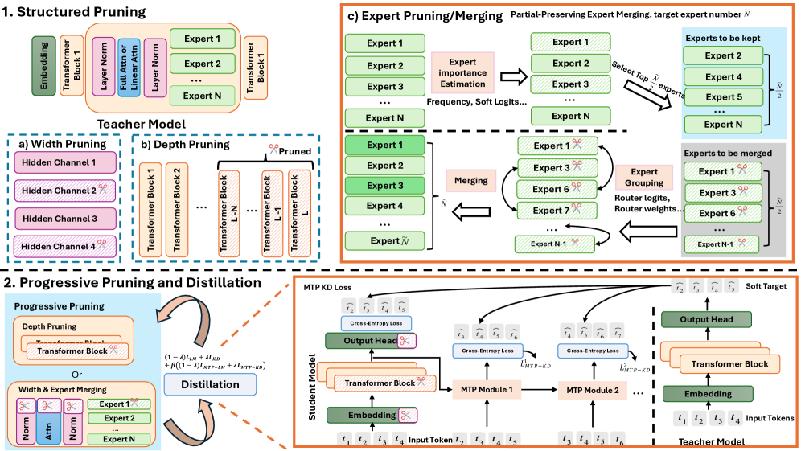

# 깊이·너비·전문가 가지치기 설계

> 원본: [arxiv.org/abs/2605.08738](https://arxiv.org/abs/2605.08738)

이 편은 SlimQwen 의 압축 파이프라인 중 "구조적 가지치기" 부분을 다룬다. teacher 인 Qwen3-Next-80A3B 를 student 인 23A2B 로 줄이는 세 가지 축 — 깊이, 너비, 전문가 — 의 구체적 기준과 수식, 그리고 두 모델 사이에 가장 큰 차이를 만드는 전문가 압축의 핵심 아이디어인 부분 보존 머징 (partial-preservation merging) 까지가 범위다. 증류 손실과 progressive 스케줄은 다음 편에서 다룬다.

## Qwen3-Next 구조 한눈 정리

가지치기 대상을 명확히 잡으려면 base 와 target 의 구조 차이를 먼저 봐야 한다. base 인 80A3B 는 hybrid attention MoE 다. 즉 transformer block 마다 Gated DeltaNet 또는 Gated Attention 중 하나가 들어가는데, 비율로 보면 full attention (Gated Attention) 12 개, linear attention (Gated DeltaNet) 36 개, 총 48 layer 다. 각 MoE 모듈은 routed expert 512 개 + shared expert 1 개를 두고 토큰마다 top-$k = 10$ routed expert 와 1 개 shared expert 를 활성화한다. hidden size 는 $2048$, expert intermediate size 는 $512$.

SlimQwen-23A2B 는 이 구조를 다음과 같이 깎은 결과다.

| 항목 | Qwen3-Next-80A3B | SlimQwen-23A2B |
|---|---|---|
| 총 layer 수 | 48 (Gated Attn 12 + Gated DeltaNet 36) | 36 (Gated Attn 9 + Gated DeltaNet 27) |
| hidden size | 2048 | 1536 |
| MoE routed experts | 512 | 256 |
| MoE shared experts | 1 | 1 |
| 토큰당 활성 routed top-$k$ | 10 | 8 |
| 총 파라미터 | 80B | 23B |
| 활성 파라미터 | 3.8B | 2.0B |

요약하면 세 축을 동시에 줄였다. 깊이는 마지막 25% (48 → 36) 제거, 너비는 hidden $2048 \to 1536$, 전문가는 모듈당 $512 \to 256$ 머징에 top-$k$ 도 $10 \to 8$ 로 조정. activation 기준으로는 약 $\frac{80}{23} \approx 3.4 \times$ 압축이다.

## 깊이 가지치기: 마지막 레이어를 자른다

깊이 압축은 단순하다. $L$ 개 layer 가 순차로 쌓여 있을 때 마지막 $k$ 개를 통째로 버린다.

$$
\text{Prune}(\{f_1, f_2, \dots, f_L\}) = \{f_1, f_2, \dots, f_{L-k}\}
$$

SlimQwen 은 $k / L = 0.25$, 즉 마지막 25% 를 버린다. base 48 layer 중 마지막 12 개를 제거하는데, hybrid 구성을 고려하면 full attention 3 개와 linear attention 9 개가 빠지는 셈이다.

마지막 layer 를 자르는 선택은 "어떤 metric 으로 어떤 위치의 layer 를 자를 것인가" 라는 결정의 답인데, 부록 A.4 의 비교가 그 근거다. 인접 layer 의 활성 cosine 유사도

$$
s_l = \cos\!\big(\bar{h}_l,\ \bar{h}_{l+1}\big)
$$

를 기준으로 가장 비슷한 연속 구간을 잘라내는 "activation similarity" 방식은 보통 중간 layer 를 자르는 경향이 있다. 그러나 24-layer 15A3B teacher 에 4 layer 를 one-shot 으로 잘랐을 때 결과는 마지막 layer 가지치기가 일관되게 더 좋았다. MMLU 기준 teacher 75.62 에서 last-layer 는 73.86 으로 거의 안 떨어지는 반면 activation similarity 는 41.95 까지 무너졌고, 120B 토큰 후속 KD 를 돌려도 last-layer 가 73.02 vs 69.57 로 앞섰다. The Curse of Depth (Sun et al., 2026) 의 관찰 — 마지막 layer 의 기여가 사전학습된 LLM 에서 의외로 작다 — 와 일치하는 결과다.

실무 메모. last-layer pruning 직후 GSM8K 점수가 2.05 까지 떨어진 부록 결과가 눈에 띈다. one-shot 시점에는 추론 체인이 부서지지만 short-window KD 만으로 80% 수준까지 회복되니, "one-shot 평가 점수가 곧 압축 가치" 라는 통념은 MoE 사전학습 스케일에서는 약하다.

## 너비 가지치기: RMSNorm 출력의 활성 통계

너비 가지치기는 hidden dimension 자체를 줄이는데, hybrid attention, MoE, normalization 등 모델 전체에 일관되게 적용된다. 어떤 dim 을 남길지는 calibration 데이터에서 측정한 활성 통계로 정한다.

calibration set 으로 모듈의 출력 $X \in \mathbb{R}^{B \times T \times H}$ 를 얻고, batch 와 sequence 차원으로 평균 절댓값 활성을 모은다.

$$
a_h = \frac{1}{B \cdot T} \sum_{b=1}^{B} \sum_{t=1}^{T} \big| X_{b,t,h} \big|
$$

여기서 $H$ 는 hidden dim, $h$ 는 그 안의 한 채널 인덱스다. SlimQwen 은 이 통계를 RMSNorm 출력 $\hat{x} = \mathrm{RMSNorm}(x)$ 에서 잰다. RMSNorm 정의는

$$
\hat{x}_i = \frac{x_i}{\mathrm{RMS}(x) + \epsilon} \cdot \gamma_i,\qquad \mathrm{RMS}(x) = \sqrt{\frac{1}{H} \sum_{i=1}^{H} x_i^2}
$$

이고, 각 hidden dim 의 importance 는 다음과 같이 정의한다.

$$
\mathcal{I}_h^{\text{width}} = \frac{1}{B \cdot T} \sum_{b=1}^{B} \sum_{t=1}^{T} \big| \hat{x}_{b,t,h} \big|
\tag{5}
$$

목표 hidden size $H'$ 이 주어지면 importance 가 높은 상위 $H'$ 개 dim 만 남기고 나머지 행/열을 삭제한다. 즉 attention 의 $Q, K, V, O$ 행렬, MoE expert 의 $W_{\text{up}}, W_{\text{gate}}, W_{\text{down}}$ 행렬, RMSNorm 의 $\gamma$ 모두에서 같은 채널 인덱스를 일관되게 잘라낸다. SlimQwen-23A2B 는 $H = 2048 \to H' = 1536$ 으로 줄였다.

여기서 RMSNorm 출력을 기준으로 잡는 점이 작지만 중요한 디테일이다. 출력을 그대로 쓰면 layer 별 스케일이 흔들려 dim 간 비교가 깨지지만, RMSNorm 을 통과한 normalized 활성을 쓰면 같은 척도로 정렬 가능하다. calibration set 은 1024 샘플로 작게 잡았는데, 사전학습 분포에서 직접 샘플링하므로 도메인 시프트는 거의 없다.

## 전체 흐름 안에서의 위치

세 축의 가지치기가 어떻게 한 파이프라인에 결합되는지는 다이어그램으로 보는 편이 빠르다.

_구조적 가지치기 (너비·깊이·전문가) 와 점진적 가지치기 + MTP 증류의 전체 흐름. 본 편은 위쪽 절반에 해당한다._

이 편은 그림 위쪽의 "Structured Pruning" 박스 — 즉 depth/width/expert 세 축을 어떻게 깎느냐 — 까지를 다루고, 아래쪽의 progressive 스케줄과 MTP KD 는 다음 편에서 본다.

## 전문가 압축: 중요도 기준 네 가지

MoE 만의 고유한 축이 expert 압축이다. 모듈당 $E$ 개 routed expert 가 있고 토큰마다 router 가 top-$k$ 개를 고르는 구조에서, 어떤 expert 를 살리고 어떤 expert 를 버릴지 판단하는 중요도 metric 부터 정해야 한다.

먼저 표기를 정리한다. 한 MoE layer 의 routed expert 집합을 $\{E_1, \dots, E_M\}$ 이라 하고, router 는 입력 토큰 표현 $h_t \in \mathbb{R}^H$ 에 대해 logit $z_t = \mathrm{Router}(h_t) \in \mathbb{R}^M$ 을 내고 그중 top-$k$ index 집합 $\mathcal{T}_t$ 가 활성화된다. 활성된 expert 의 output 을 $E_i(h_t)$, 정규화된 routing weight 를 $g_{t,i} = \mathrm{softmax}(z_t)_i$ 라 한다. SlimQwen 이 비교한 세 기준은 다음과 같다.

$$
\mathcal{I}_i^{\text{freq}} = \mathbb{E}_t \big[ \mathbb{1}[i \in \mathcal{T}_t] \big]
\tag{6a}
$$

$$
\mathcal{I}_i^{\text{soft}} = \mathbb{E}_t \big[ \mathbb{1}[i \in \mathcal{T}_t] \cdot g_{t,i} \big]
\tag{6b}
$$

$$
\mathcal{I}_i^{\text{REAP}} = \mathbb{E}_t \Big[ \mathbb{1}[i \in \mathcal{T}_t] \cdot g_{t,i} \cdot \big\| E_i(h_t) \big\|_2 \Big]
\tag{7}
$$

세 기준은 점점 정보를 얹는 구조다. frequency 는 단순히 활성 횟수만 본다. soft-logits 는 활성됐을 때의 router 점수까지 곱해 "강하게 선택된 expert" 에 가중치를 준다. REAP (Router-weighted Expert output Activation Pruning) 는 거기에 expert 출력 norm 까지 곱해 "실제로 표현 공간에 큰 기여를 한 expert" 를 골라낸다. $\mathbb{1}[\cdot]$ 는 indicator function 이고, 기댓값은 calibration set 위의 토큰 평균으로 근사한다.

이렇게 importance 가 정해지면 두 가지 압축 방식 중 하나를 쓴다. 그냥 하위 expert 를 삭제하는 expert pruning, 또는 하위 expert 를 상위 expert 에 합치는 expert merging.

## 전문가 머징: 그룹과 인터폴레이션

머징을 하려면 두 가지를 추가로 정의해야 한다. (1) 어떤 expert 들이 한 그룹으로 묶일지, (2) 그룹 안에서 어떻게 가중 평균을 낼지.

그룹은 expert 간 유사도로 정한다. SlimQwen 은 세 가지 유사도 신호를 비교했다.

- **Router logits**: 같은 calibration 토큰 위에서 expert 가 받은 router logit 벡터의 cosine 유사도.
- **Router weights**: $W_{\text{router}}$ 의 expert 별 column 벡터 (즉 expert 를 가리키는 router 가중치 자체) 의 cosine 유사도.
- **Expert vector**: expert MLP 의 첫 레이어 weight 행렬 (또는 $W_{\text{down}}$) 같은 파라미터 벡터의 cosine 유사도.

importance 상위 $E'$ 개 expert 를 "보존 대상" 으로 골라두고, 버려질 각 expert $E_j$ 는 위 유사도 기준으로 가장 가까운 보존 expert 에 자기 importance 를 weight 로 흡수된다. 즉 보존 expert $E_i$ 가 자기 자신 + 흡수한 expert 들의 가중 평균이 된다.

표 2 에서 9 가지 (pruning + merging) × (frequency / soft-logits / REAP) × (router logits / router weights / expert vector) 조합을 400B 토큰 후속 학습 뒤 비교한 결과는 사실상 무승부였다. MMLU·MMLU-Pro·BBH 등 어떤 벤치마크에서도 한 기준이 모든 다른 기준을 압도하지는 않았다. 저자들의 해석은 단순하다. coarse-grained one-shot 압축으로는 어떤 기준을 쓰든 비슷한 사후 평형점에 수렴하므로, 진짜 차이는 "압축 그 자체" 가 아니라 "압축 후 어떤 정보를 남기느냐" 에서 난다. 이 관찰이 다음 절의 부분 보존 머징 동기다.

## 부분 보존 머징: 절반은 그대로, 절반은 흡수

머징의 두 극단을 보자. 한쪽 끝은 top-$E'$ 만 보존하고 나머지는 버리는 순수 pruning 이다. 명확한 expert specialization 은 살아남지만, 단독으로는 중요해 보이지 않아도 다른 expert 와 상보적으로 쓰이던 expert 의 정보는 통째로 날아간다. 반대쪽 끝은 모든 target expert 를 머징으로 만드는 방식이다. 버린 expert 의 정보는 어떻게든 보존되지만, 사전학습이 만든 expert specialization 이 평균화되어 후속 학습이 회복하기 어려운 동질화 (representation homogenization) 가 발생한다.

SlimQwen 의 절충안은 단순하다. **target expert 의 절반은 그대로 보존하고, 나머지 절반만 머징 base 로 써서 버려진 expert 들을 흡수시킨다.** 형식적으로, 목표 expert 수가 $E'$ 일 때 importance 상위 $E'/2$ 개 expert 를 그대로 남긴다.

$$
\mathcal{P} = \mathrm{TopK}\!\big(\{\mathcal{I}_i\}_{i=1}^{M},\ E'/2\big)
$$

여기서 $\mathcal{P}$ 는 보존 expert index 집합, 버려질 expert index 집합은 $\mathcal{D} = \{1, \dots, M\} \setminus \mathcal{P}$. 다음으로 $\mathcal{D}$ 에서 importance 가 다시 상위 $E'/2$ 인 expert 를 골라 merge base 집합 $\mathcal{B} \subset \mathcal{D}$ 로 삼는다. 즉 merge base 는 "버려질 후보 중에서는 그래도 중요했던" expert 들이다. 마지막으로 $\mathcal{B}$ 에 들지 못한 나머지 expert $E_j$ 각각에 대해, $\mathcal{B}$ 안에서 자기와 가장 유사한 partner $E_{i^\ast}$ 를 찾아 가중 평균으로 흡수시킨다.

$$
E_{i^\ast}^{\text{new}} \;=\; \frac{ \mathcal{I}_{i^\ast} \cdot E_{i^\ast} \;+\; \mathcal{I}_j \cdot E_j }{ \mathcal{I}_{i^\ast} + \mathcal{I}_j }
\tag{8}
$$

가중치는 두 expert 의 importance 점수다. 같은 절차로 base 안의 한 expert 가 여러 버려진 expert 를 동시에 흡수할 수도 있고, 이때는 식 (8) 의 합산이 모든 흡수 대상에 대해 누적된다. 최종 압축된 expert 집합은 보존 expert $E'/2$ 개와 머지된 expert $E'/2$ 개로 구성된다. router 쪽 weight 도 같은 인덱스로 잘라 후속 학습에 들어간다 (보존된 expert 의 router column 은 그대로, 머지된 expert 의 column 은 base expert 의 column 으로 대체).

왜 정확히 절반인가. 논문은 이를 "단순하고 대칭적인 설계" 라고 부르며, 직관적 근거를 두 줄로 정리한다. 보존 expert 가 너무 적으면 parameter inheritance — 사전학습된 expert specialization 의 유산 — 가 약해지고, 너무 많으면 그만큼 머징할 여지 (consolidation) 가 줄어 버려진 expert 의 정보를 흡수할 base 가 부족하다. 표 2 에서도 partial-preservation 적용 (Preserve=Yes) 이 MMLU, MMLU-Pro, GSM8K 등 핵심 벤치마크에서 미보존 대비 일관된 향상을 보였다. 다만 저자들도 "이게 최적 비율" 이라고 단정하지는 않는다 — limitation 절에서 다른 비율 탐색은 후속 과제로 남긴다.

## 정리

이 편이 한 일은 결국 base 와 target 사이의 구조 갭을 세 축으로 분해하고, 각 축마다 어떤 기준으로 무엇을 버릴지 정한 것이다.

- 깊이는 "마지막 25% 를 자른다" 라는 한 줄 규칙으로 충분했다. activation similarity 같은 정교한 metric 이 오히려 손해다.
- 너비는 RMSNorm 출력의 활성 절댓값 평균 (식 5) 으로 hidden dim 을 정렬하고 상위 $H'$ 개만 남긴다.
- expert 압축은 frequency / soft-logits / REAP 중 어떤 importance 를 써도, router logits / weights / vector 중 어떤 grouping 을 써도 큰 차이가 없다 — 단, 머징은 target expert 의 절반을 그대로 두고 나머지 절반만 base 로 쓰는 부분 보존 (식 8) 이 일관된 향상을 준다.

다음 단계는 이렇게 만든 23A2B 초기화에 어떤 손실을 얹어 후속 학습을 돌릴 것인가다. SlimQwen 의 답은 MTP 증류 + LM 손실 혼합이며, 이게 다음 편의 주제다.

다음 편: [MTP 증류와 손실 함수 설계](03-mtp-distillation-and-losses.md)

## 출처

- 원논문: <https://arxiv.org/abs/2605.08738>
