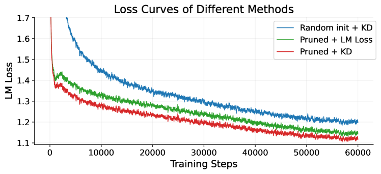

# 어떤 압축 레시피가 실제로 살아남나

> 원본: [arxiv.org/abs/2605.08738](https://arxiv.org/abs/2605.08738)

앞 편들에서 구조적 가지치기, 부분 보존 머징, NTP/MTP 증류 목적을 차례로 깔았다. 이 편은 그 모든 선택지를 같은 토큰 예산 위에 올려놓고 어떤 조합이 실제 벤치마크 위에서 살아남는지를 본다. 원문 4장의 Q1, Q2, Q3 실험 결과를 통합해 정리하고, 점진적 가지치기 (Q4) 는 다음 편으로 미룬다.

## 4.1 실험 셋업

기준 모델은 Qwen3-Next-80A3B 하이브리드 MoE 다. 48개 transformer block 중 12개가 full attention, 36개가 linear attention 이고, full attention 은 16개 query head, 2개 KV head, head dim 256 에 gated attention 을 쓴다. MoE 측면에서는 한 layer 당 routed expert 가 512개, shared expert 가 1개, 토큰당 활성은 routed 10개 + shared 1개다. Intermediate size 512, hidden size 2048, MTP 모듈 포함.

압축 후 타깃은 두 가지다.

- Q1, Q3: 80A3B → 23A2B 로 약 $3.4\times$ 압축. depth 12 block 제거 (full 3, linear 9), hidden 2048 → 1536, expert 512 → 256 머징, 활성 routed 8 + shared 1.
- Q2: 24A2B → 6A1B 압축 (전문가 압축만 분리해 보기 위한 별도 셋업).

학습 예산은 Q1·Q3 가 120B 토큰, Q2 가 400B 토큰. global batch 는 각각 512, 1024. peak LR `4e-4`, 최종 `3e-5` 까지 cosine, warmup 2000 step. KD weight 는 1.0 에서 0.75 까지 linear decay, MTP KD weight 는 0.3 에서 0.1 까지 cosine decay. Calibration set 은 사전학습 데이터에서 1024 샘플.

평가 벤치마크는 일반 지식 (MMLU, MMLU-Pro, MMLU-Redux), 추론 (BBH), 수학 (GSM-8K), 코딩 (EvalPlus), 중국어 (C-Eval, CMMLU). 한 카테고리에만 좋아지고 다른 곳에서 무너지는 패턴을 걸러내기 위해 의도적으로 폭넓다.

## Q1: 가지치기는 더 좋은 초기화인가

첫 질문은 단순하다. 같은 120B 토큰, 같은 KD 학습 레시피를 줬을 때, 모델을 처음부터 학습시키는 것과 80A3B 에서 잘 잘라 23A2B 로 만든 뒤 이어 학습시키는 것 중 어느 쪽이 더 멀리 가는가.

| 방법 | MMLU | MMLU-Pro | MMLU-Redux | BBH | GSM-8K | EvalPlus | C-Eval | CMMLU | 평균 |
|---|---|---|---|---|---|---|---|---|---|
| Qwen3-Next-80A3B (교사) | 85.22 | 62.86 | 84.45 | 85.12 | 90.07 | 74.12 | 90.33 | 89.27 | 82.68 |
| Random init + KD | 65.06 | 34.54 | 65.66 | 56.01 | 73.35 | 58.67 | 70.11 | 69.85 | 61.66 |
| Pruned + LM Loss | 72.76 | 48.24 | 71.89 | 64.94 | 81.84 | 67.05 | 76.51 | 76.51 | 69.96 |
| Pruned + KD | 75.67 | 51.19 | 74.37 | 72.29 | 83.17 | 69.30 | 80.67 | 80.95 | 73.45 |

평균만 봐도 차이가 명확하다. Random init + KD 가 61.66, Pruned + LM 이 69.96, Pruned + KD 가 73.45. 가지치기로 초기화만 바꿔도 +8.3 포인트, KD 까지 얹으면 +11.79 포인트가 같은 토큰 예산 안에서 나온다. 더 인상적인 건 절대 위치다. 23A2B 압축 모델이 교사 대비 86.5% 의 평균 점수를 회복한다 ($73.45 / 82.68$). 활성 파라미터 기준 $3.4\times$ 작아진 채로다.

지식·수학·코딩 어느 카테고리를 봐도 추세가 같다. MMLU 65.06 → 75.67, GSM-8K 73.35 → 83.17, EvalPlus 58.67 → 69.30. 카테고리 한 곳에서만 성능을 뽑아낸 게 아니라는 뜻이고, 이건 가지치기가 "랜덤보다 살짝 나은 시작점" 이 아니라 "이미 학습된 정보를 보존한 채 압축한 초기화" 라는 해석을 뒷받침한다.

_120B 토큰 학습 동안의 LM loss 곡선. Pruned + KD 가 가장 낮은 loss 로 가장 빨리 수렴하며, Random init + KD 는 같은 토큰을 받고도 가장 높이 머문다._

학습 trajectory 도 같은 이야기를 한다. Pruned + KD 는 loss 곡선이 가장 빨리 떨어지고 가장 낮은 곳에서 멈춘다. Random init + KD 는 같은 KD signal 을 받고도 끝까지 가장 위에 머문다. 즉 KD 만으로는 random init 의 핸디캡을 메우지 못하고, KD 의 효과는 좋은 시작점 위에서 가산적으로 작동한다.

## Q2: 전문가 압축 전략은 무엇이 차이를 만드나

두 번째 질문은 가지치기 vs 머징, 그리고 expert 중요도·grouping·부분 보존을 어떻게 조합하느냐다. 셋업은 24A2B → 6A1B, 400B 토큰. 원문 표는 9개 변형 (Pruning vs Merging $\times$ Soft Logits / REAP / Frequency $\times$ Router Weights / Router Logits / Expert Vector $\times$ Preserve Y/N) 을 모두 다루지만, 패턴을 보기엔 대표 row 만으로 충분하다.

| 압축 | 중요도 | Group | Preserve | MMLU | MMLU-Pro | BBH | GSM-8K | EvalPlus |
|---|---|---|---|---|---|---|---|---|
| Expert Pruning | Soft Logits | - | - | 68.74 | 43.23 | 58.97 | 74.30 | 51.69 |
| Expert Pruning | REAP | - | - | 69.11 | 42.76 | 59.00 | 73.69 | 53.59 |
| Expert Merging | Soft Logits | Router Weights | No | 69.05 | 42.62 | 59.12 | 71.08 | 50.35 |
| Expert Merging | Soft Logits | Router Weights | Yes | 69.28 | 44.05 | 59.81 | 74.18 | 48.00 |
| Expert Merging | Frequency | Router Logits | Yes | 68.92 | 42.14 | 60.17 | 72.82 | 48.91 |
| Expert Merging | REAP | Expert Vector | Yes | 69.26 | 42.93 | 59.45 | 73.73 | 55.29 |

표에서 읽어야 할 두 가지가 있다.

- **어떤 한 방법도 전 벤치 1등을 잡지 못한다**. Frequency + Router Logits 가 BBH 60.17 로 가장 높지만 MMLU·MMLU-Pro 에서는 평범하다. REAP pruning 은 EvalPlus 가 살아남지만 GSM-8K 는 떨어진다. 400B 토큰을 들이부어도 method 별 격차는 1~3 점 안쪽이고, 한 자릿수 영역 안에서 뒤집힌다. 결국 충분한 토큰 예산 앞에서는 어떤 one-shot 압축 metric 을 골라도 비슷한 곳으로 수렴한다.
- **부분 보존 머징 (Preserve=Yes) 만 일관된 개선이 있다**. 같은 Soft Logits + Router Weights 셋업에서 Preserve=No (69.05 / 42.62) 와 Yes (69.28 / 44.05) 를 비교하면 MMLU, MMLU-Pro, GSM-8K, BBH 가 같이 올라간다. REAP + Expert Vector 의 Preserve=Yes 변형은 EvalPlus 55.29 로 코딩 벤치 단독 톱이다.

읽기 좋게 정리하면, "어떤 중요도·grouping 을 골랐는가" 보다 "head expert 를 통째로 머지하지 않고 보존하는가" 가 훨씬 큰 신호다. 03 편에서 다룬 부분 보존 머징의 동기 — 가장 중요한 expert 의 weight 를 다른 expert 의 평균으로 흐리게 만들지 말라는 직관 — 가 실험적으로 일관되게 잡힌다.

## Q3: 압축 후 학습 레시피, 어떤 loss 를 켜야 하는가

세 번째 질문은 압축 후 continual pretraining 의 loss 구성이다. 23A2B 모델을 120B 토큰 학습시키면서, NTP KD 만 쓸 때부터 4-term 종합까지 ablation 한다.

| Loss 구성 | MMLU | MMLU-Pro | MMLU-Redux | BBH | GSM-8K | EvalPlus | C-Eval | CMMLU |
|---|---|---|---|---|---|---|---|---|
| NTP KD | 74.16 | 50.97 | 75.85 | 71.63 | 84.27 | 67.32 | 80.00 | 80.24 |
| NTP KD + LM | 74.93 | 51.44 | 74.69 | 73.00 | 82.98 | 66.07 | 79.93 | 80.31 |
| NTP KD + MTP KD | 75.13 | 51.94 | 74.33 | 71.93 | 82.34 | 69.32 | 80.82 | 80.64 |
| NTP KD + LM + MTP Loss | 75.29 | 51.16 | 75.09 | 72.07 | 83.02 | 68.43 | 79.78 | 80.67 |
| NTP KD + LM + MTP Loss + MTP KD | 75.67 | 51.19 | 74.37 | 72.29 | 83.17 | 69.30 | 80.67 | 80.95 |

세 가지 효과가 분리되어 보인다.

- **LM loss 추가의 효과는 지식 벤치에서 크다**. NTP KD 단독 대비 NTP KD + LM 에서 MMLU 74.16 → 74.93, MMLU-Pro 50.97 → 51.44. 03 편에서 KD 한쪽으로만 가면 분포가 narrow 해진다는 우려를 얘기했는데, knowledge-heavy 벤치는 그 영향을 가장 먼저 받는다.
- **MTP KD 의 효과는 종합 점수에서 가장 안정적**. NTP KD → NTP KD + MTP KD 에서 MMLU, MMLU-Pro, EvalPlus, C-Eval, CMMLU 가 같이 오른다. 4-term 종합 (마지막 row) 이 다시 그 위에서 평균 best 를 잡는다. 단일 벤치 1등이 모두 4-term 인 건 아니지만, **regression 이 없는 유일한 구성** 이다.
- **공짜로 얻는 부수효과: speculative decoding 가속**. MTP KD 를 backbone 학습에 끼우면, MTP draft module 의 acceptance rate 가 함께 올라간다. 즉 같은 모델로 추론을 할 때, multi-token speculative decoding 의 draft 수용률이 높아져 wall-clock latency 가 떨어진다.

### MTP KD 가 speculative decoding 에서 보이는 가속

원문 Table 4 는 같은 23A2B 모델을 MTP Loss 만으로 학습한 경우와 MTP KD 를 추가한 경우의 multi-token acceptance rate 를 사전학습 단계 (HumanEval, GSM8K, WMT22) 와 SFT 단계 (RepoQA, MTBench, SpecBench) 에서 비교한다. 핵심 숫자만 옮긴다.

| 단계 | Loss | 벤치 | acc_1 | acc_2 | acc_3 | acc_4 |
|---|---|---|---|---|---|---|
| Pretrain | MTP Loss | GSM8K | 57.62 | 23.64 | 8.02 | 2.37 |
| Pretrain | MTP KD | GSM8K | 75.18 | 45.67 | 22.43 | 10.37 |
| Pretrain | MTP Loss | HumanEval | 56.31 | 24.35 | 9.79 | 4.09 |
| Pretrain | MTP KD | HumanEval | 68.60 | 37.06 | 17.36 | 8.24 |
| SFT | MTP Loss | SpecBench | 55.58 | 27.73 | 12.02 | 4.60 |
| SFT | MTP KD | SpecBench | 59.85 | 32.21 | 15.22 | 6.56 |

여기서 `acc_k` 는 MTP draft module 로 한 번에 $k+1$ 개 토큰을 만들 때 verifier 가 모두 수용한 비율이다. 패턴이 단순하다.

- 모든 벤치, 모든 단계에서 MTP KD 가 일관되게 더 높다.
- **격차는 긴 시퀀스에서 더 벌어진다**. GSM8K 의 acc_1 은 57.62 → 75.18 로 약 1.3배지만, acc_4 는 2.37 → 10.37 로 4배 이상이다. HumanEval, SpecBench 도 같은 형태로 acc_3, acc_4 에서 비례적으로 더 큰 이득이 보인다.

사내 운영 관점에서 acc_4 가 의미하는 것은, multi-token speculative decoding 의 draft 가 네 개 토큰까지 한 번에 받아들여질 확률이다. 이 값이 올라가면 verify 횟수가 줄고, 같은 throughput 으로 latency 가 떨어진다. 즉 MTP KD 는 backbone 평균 점수 (+0.3~0.6) 만 보고 평가하면 차이가 작아 보이지만, 실제 서빙 단계에서 들어오는 이득은 곱셈 형태로 작용한다.

## 정리

세 질문이 만든 그림은 다음과 같다.

- **가지치기는 정보 보존된 초기화다.** 같은 KD 예산을 random init 에 부어도 메워지지 않는 격차가 있고, Pruned + KD 가 trajectory 의 가장 아래에 머문다.
- **expert 압축 metric 자체는 충분한 토큰 앞에서 수렴한다.** 진짜 일관된 신호는 부분 보존 머징 여부다.
- **continual pretraining 의 loss 는 4-term 이 가장 안전하다.** LM 은 지식 벤치를, MTP KD 는 종합 점수와 speculative decoding 의 acceptance rate 를 동시에 들어 올린다.

다음 편에서는 이 결과 위에 한 단계 더 얹는다. 같은 80A3B → 23A2B 압축을 한 번에 하지 않고 단계로 쪼개는 점진적 가지치기 (depth-first / width-first / joint) 가 추가로 얼마나 가져가는지, 그리고 SlimQwen 이라는 최종 모델이 사내 운영 관점에서 의미하는 바를 본다.

다음 편: [SlimQwen 23A2B 와 점진적 가지치기, 그리고 실무 시사점](05-slimqwen-and-takeaways.md)

## 출처

- [arxiv.org/abs/2605.08738](https://arxiv.org/abs/2605.08738)
