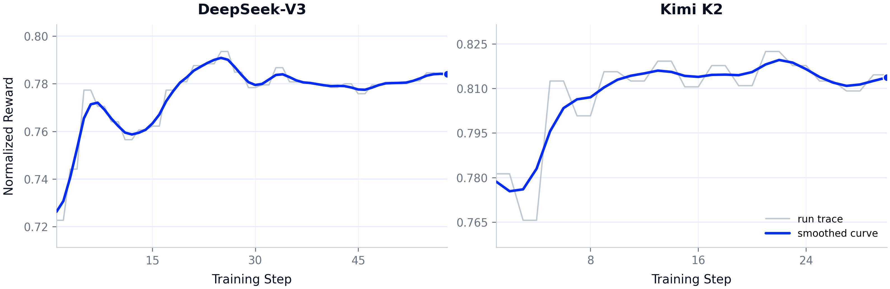
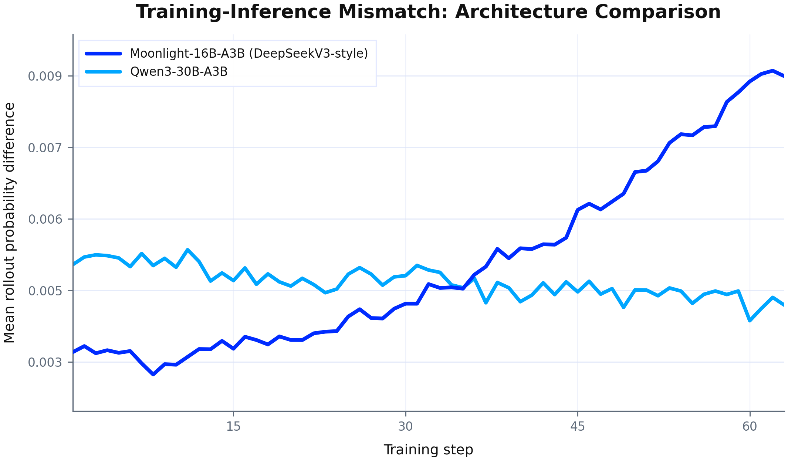
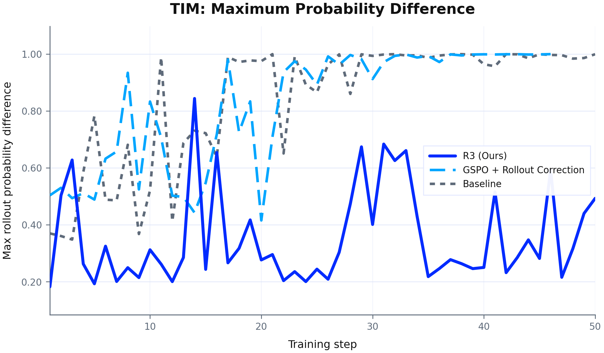
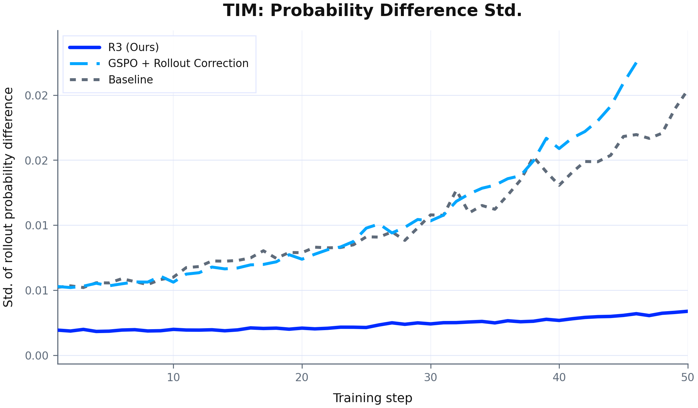
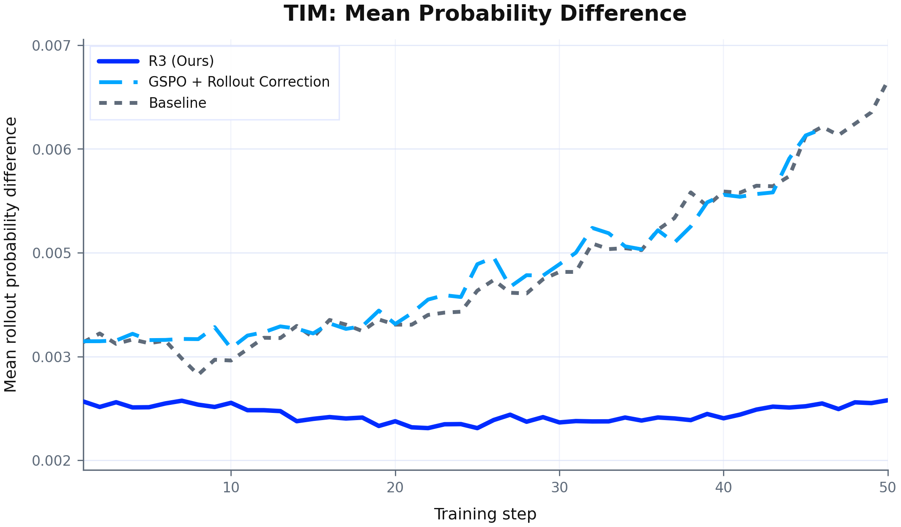
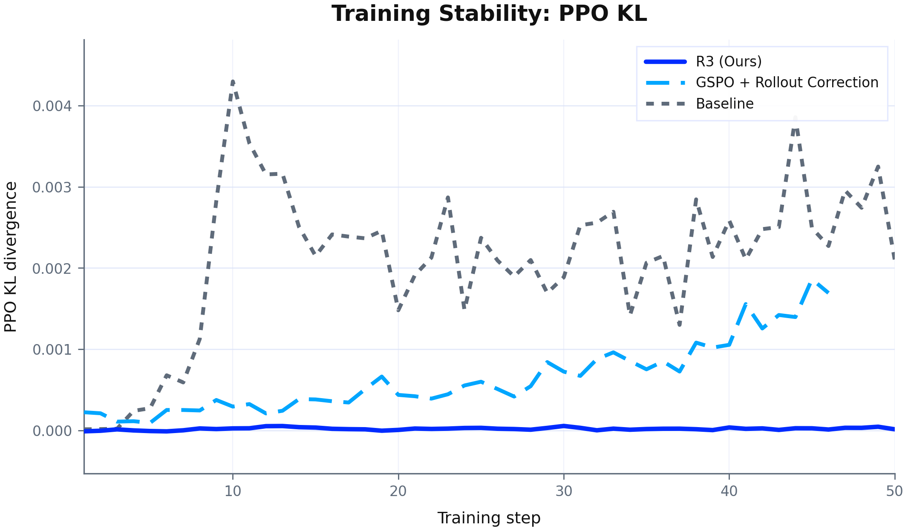
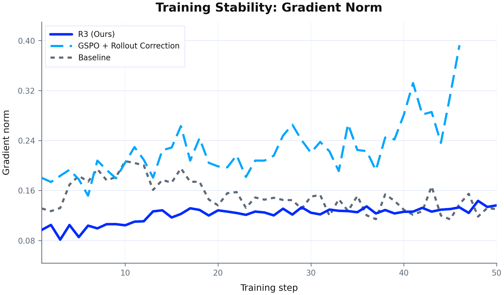
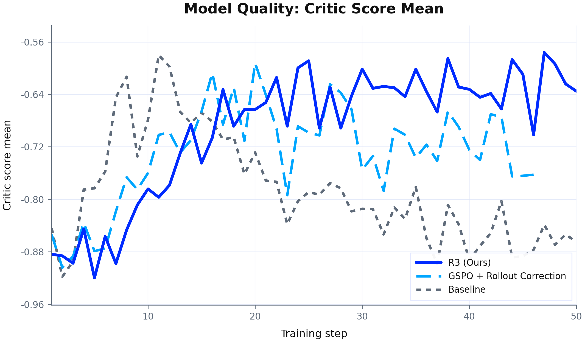
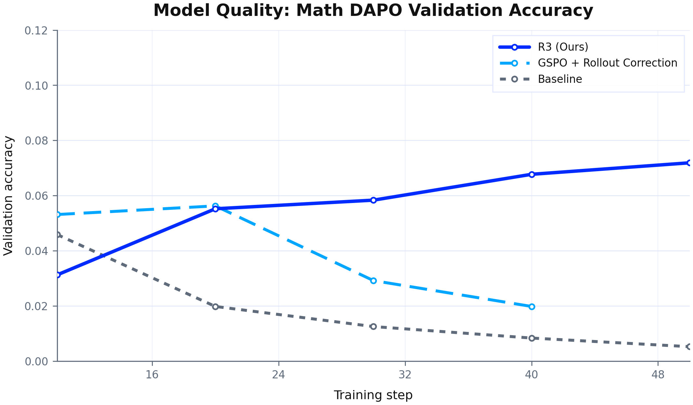
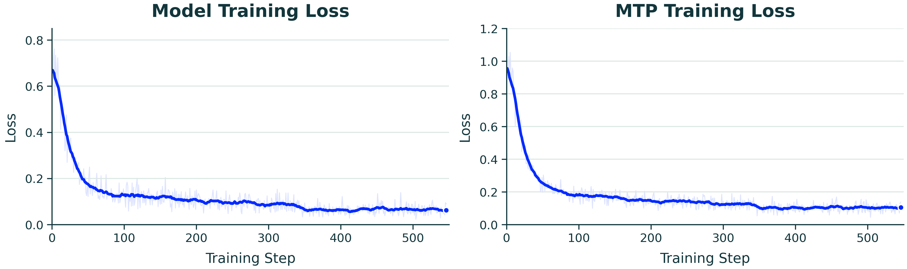

# trillion-scale LoRA RL이 Scale Up을 가능하게 하는 방식

> 원본: [arxiv.org/abs/2606.02437](https://arxiv.org/abs/2606.02437)

Scale Up은 PEFT 기반 개인 모델의 첫 조건이다. 작은 어댑터가 의미 있는 행동 변화를 만들려면, 그 아래의 공유 기반 모델이 이미 넓은 능력과 충분한 trajectory support를 갖고 있어야 한다. 이 장의 핵심은 모델을 크게 만들자는 단순한 주장보다 좁다. 강한 prior를 반복적으로 학습 루프에 넣을 수 있어야 개인화, 도구 사용, 장기 추론, 정책 수정이 지속 가능한 운영 단위가 된다.

논문은 이 조건을 강화학습 관점에서 설명한다. RL은 보상만 좋다고 임의의 능력을 만들어내지 않는다. 현재 정책이 샘플링할 수 있는 궤적 안에서 좋은 행동을 찾고, 그 행동이 충분히 자주 나타날 때 보상 신호로 안정화한다. 따라서 Scale Up은 “더 큰 모델이 더 똑똑하다”가 아니라 “더 강한 prior가 RL이 접근할 수 있는 행동 분포를 넓힌다”는 명제로 읽어야 한다.

## RL은 왜 prior-limited인가

언어 모델 RL에서 정책은 긴 토큰 시퀀스 위의 확률분포다. 어떤 reasoning trace, tool-use pattern, self-verification behavior가 보상 가능하더라도, 현재 모델이 그 행동을 거의 샘플링하지 못하면 학습 신호는 희박해진다. 이때 병목은 reward design만이 아니라 trajectory support다.

정책경사 관점으로 쓰면 업데이트는 대략 다음 구조를 가진다.

$$
\nabla_\theta J(\theta) \approx \mathbb{E}_{\tau \sim \pi_\theta}\left[\nabla_\theta \log \pi_\theta(\tau) A(\tau)\right]
$$

여기서 $\tau$는 샘플링된 trajectory이고, $A(\tau)$는 그 trajectory의 advantage다. 좋은 trajectory가 $\pi_\theta$ 아래에서 충분히 나오지 않으면 기대값 안에 들어오는 유효 신호 자체가 부족하다. 강한 기반 모델은 이 분포를 바꾼다. 완성된 능력을 보장한다기보다, 부분적으로 유용하지만 불안정한 행동에 non-zero probability mass를 준다.

이 관점에서 RL은 capability invention보다 capability selection에 가깝다. DeepSeek-R1-Zero나 Open-Reasoner-Zero류의 결과는 RL이 reasoning behavior를 끌어낼 수 있음을 보여주지만, 동시에 그 behavior가 기반 모델의 prior에 얼마나 의존하는지도 드러낸다. 약한 모델은 보상 가능한 경로를 거의 방문하지 못해 high-variance update에 갇히기 쉽다. 강한 모델은 불완전한 풀이, 검산, 반성, 장기 탐색을 이미 낮은 확률로라도 생성하므로, RL이 이를 증폭하고 정규화할 수 있다.

개인 모델에서는 이 차이가 더 중요하다. 어댑터는 사용자 선호, 도메인 습관, 도구 사용 방식, 일부 기억성 행동을 담을 수 있지만, 세계 지식과 범용 reasoning substrate를 처음부터 만들어내는 장치가 아니다. 공유 prior가 강할수록 작은 local state는 “새 능력의 저장소”가 아니라 “이미 있는 구조를 특정 사람과 상황으로 조향하는 제어면”이 된다.

## LoRA는 강한 prior에 접근하는 예산 장치다

LoRA를 단순히 메모리 절약 기술로 보면 Scale Up의 요지를 놓치기 쉽다. 이 장에서 LoRA의 역할은 “업데이트할 파라미터 수를 줄인다”보다 “고정된 adaptation budget으로 더 강한 prior를 학습 루프에 넣는다”에 가깝다. 작은 모델을 full RL로 학습하면 trainable surface는 넓을 수 있지만, RL이 강화할 latent behavior가 부족할 수 있다. 반대로 큰 모델 위의 작은 LoRA는 trainable parameter 수는 적어도 더 풍부한 prior를 조향한다.

논문이 강조하는 비교 축은 다음처럼 바뀐다.

| 관점 | 기존 질문 | Scale Up 질문 |
|---|---|---|
| 파라미터 | 얼마나 많이 업데이트할 수 있는가 | 주어진 예산에서 얼마나 강한 prior에 접근하는가 |
| 학습 역할 | 어댑터가 task를 얼마나 담는가 | 어댑터가 prior를 얼마나 잘 조향하는가 |
| 운영 단위 | 한 번의 fine-tuning 결과 | 반복 가능한 adapter lifecycle |

이 차이는 full fine-tuning과 LoRA가 같은 최적화가 아니라는 연구들과도 맞물린다. LoRA는 표현 이동, forgetting, update geometry에서 full fine-tuning과 다르게 작동한다. 이것은 새 능력을 완전히 만들어야 하는 상황에서는 제약일 수 있지만, 강한 pretrained representation을 보존하면서 특정 행동을 조절해야 하는 개인 모델에서는 장점이 된다.

논문 속 motivating comparison은 이 논리를 수치로 보여준다. 같은 RL 예산이라고 단정할 수는 없고 모델 크기와 학습 방식이 함께 바뀌므로 인과를 깨끗하게 분리하진 못한다. 그래도 핵심 신호는 분명하다. 1.5B 모델 full RL보다 7B 또는 32B 기반 LoRA RL이 더 적은 trainable parameter로 더 큰 headroom-normalized gain을 보였다. 해석은 “LoRA가 항상 full RL보다 낫다”가 아니라 “고정된 적응 예산에서는 prior strength가 trainable parameter count보다 더 중요할 수 있다”다.

## Kimi K2 1T MoE LoRA RL 사례

Scale Up이 설득력을 얻으려면 강한 prior가 이론적으로 유용하다는 주장만으로는 부족하다. trillion-scale sparse model을 실제 on-policy RL 루프에 넣을 수 있어야 한다. 논문은 Kimi K2급 1T MoE LoRA RL 사례를 이 가능성의 증거로 사용한다. 대상은 총 1.04T parameter, 활성 32.6B parameter 규모의 MoE reasoning model이며, 선택된 dense layer와 expert layer에 LoRA를 붙여 GRPO-style RL을 수행한다.

*원문 Figure 2: 대형 LLM에서 GRPO LoRA 학습이 reward를 안정적으로 끌어올리는 모습을 보여준다.*

이 사례의 의미는 단일 구성 요소의 새로움이 아니라 결합 조건에 있다. rollout은 inference-oriented engine에서 고속 decoding과 KV-cache를 사용한다. training은 Megatron-style backend에서 tensor, pipeline, expert, sequence parallelism을 조합해 gradient와 optimizer state를 처리한다. 어댑터는 base에 비해 작지만, sparse MoE 구조에서는 expert routing, checkpoint shard, adapter placement가 모두 정책의 의미에 영향을 준다.

LoRA는 여기서 세 가지 비용을 줄인다.

- optimizer memory와 gradient communication을 full-parameter RL 대비 크게 줄인다.
- frozen base를 여러 RL run과 downstream variant가 공유하게 한다.
- dense component와 expert component에 선택적으로 붙어 global reasoning과 expert-specific computation 모두에 신호를 넣는다.

논문은 이 설계가 같은 급의 full-parameter RL 대비 약 10% 수준의 compute와 communication footprint로 trillion-scale prior를 RL 루프에 넣을 수 있다고 설명한다. 더 중요한 점은 reward curve가 catastrophic divergence 없이 개선된다는 것이다. 즉 LoRA는 큰 모델을 “저장 가능한 작은 파일”로만 바꾸는 것이 아니라, 큰 prior를 반복 가능한 학습 대상으로 바꾸는 시스템 경계가 된다.

## Scale이 만든 실패면: TIM

큰 prior를 RL에 넣는 순간, 실패 원인은 optimizer나 reward에만 있지 않다. rollout, training, checkpoint conversion, serving runtime이 같은 effective policy를 구현해야 한다. 이 조건이 깨지는 대표 사례가 training-inference mismatch, 즉 TIM이다.

TIM은 rollout을 만든 정책과 training loss를 계산하는 정책이 달라지는 문제다. dense model에서는 training stack과 inference stack의 수치 차이가 작은 perturbation으로 끝날 수 있다. 그러나 MoE에서는 작은 차이가 router decision을 바꾸고, 토큰이 다른 expert를 지나가게 만든다. 이 경우 nominal checkpoint와 adapter는 같아 보여도 실제 computation graph가 달라진다.

*원문 Figure 3: DeepSeekV3-style Moonlight-16B-A3B는 Qwen3-30B-A3B보다 rollout probability mismatch가 더 크게 증가한다.*

정책경사에서는 보통 확률비 $\rho_t$를 통해 rollout policy와 update policy의 차이를 보정한다.

$$
\rho_t = \frac{\pi_\theta(a_t \mid s_t)}{\pi_{\text{old}}(a_t \mid s_t)}
$$

하지만 이 비율은 두 정책이 같은 underlying computation 위에서 비교 가능하다는 전제를 둔다. sparse routing이 달라져 다른 expert path를 통과하면, 이는 단순 확률 보정의 문제가 아니다. 샘플을 만든 계산과 gradient가 흐르는 계산이 달라진다. 논문이 TIM을 algorithmic mismatch로 보는 이유가 여기에 있다.

## Router Replay R3: routing도 policy의 일부다

Router Replay R3는 이 문제를 “routing을 재현해야 할 computation provenance”로 다룬다. rollout 중 선택된 expert id를 기록하고, training에서 가능한 경우 같은 routing path를 replay한다. route id가 없거나 training layout에 매핑할 수 없으면 해당 token을 replayed policy-gradient term에서 제외한다. 잘못된 동등성을 가정하기보다, 신뢰할 수 없는 scoring term을 학습 신호에서 빼는 쪽을 택한다.

R3의 의미는 특정 구현 버그를 고쳤다는 데 그치지 않는다. MoE RL에서 policy는 weight와 adapter만으로 정의되지 않고, 어떤 token이 어떤 expert를 지났는지를 포함한다. 따라서 large-scale LoRA RL의 correctness는 “adapter가 로드된다”가 아니라 “sampled policy, optimized policy, served policy가 같은 adapted behavior를 가리킨다”로 정의되어야 한다.

논문은 R3의 효과를 rollout probability mismatch 세 지표로 먼저 분해한다.

| 지표 | 무엇을 보는가 | R3의 효과 |
|---|---|---|
| maximum difference | 특정 step에서 policy가 크게 벌어지는 spike | spike를 낮게 억제 |
| standard deviation | mismatch의 흔들림과 불안정성 | variance를 낮춤 |
| mean difference | 전체 rollout-training drift | 평균 drift를 낮춤 |

*원문 Figure 4(a). R3는 rollout probability difference의 최대값을 baseline과 rollout correction보다 낮게 유지한다.*

*원문 Figure 4(b). R3는 mismatch의 분산도 낮춘다. 이는 sparse routing 차이가 특정 step에서 갑자기 커지는 현상을 줄인다는 뜻이다.*

*원문 Figure 4(c). 평균 mismatch에서도 R3가 가장 낮은 drift를 유지한다.*

읽는 포인트는 단순하다.

- 평균만 낮아지는 것이 아니라 spike와 variance도 함께 줄어든다.
- 일부 token의 expert path가 크게 달라지는 문제를 줄인다.
- 따라서 policy-gradient term이 다른 computation을 평가하는 위험을 낮춘다.

다음은 training stability다. 여기서도 지표는 두 가지로 나뉜다.

| 지표 | 해석 | 관찰 |
|---|---|---|
| PPO KL | rollout policy와 update policy 사이의 policy-space drift | R3가 거의 0에 가깝게 유지 |
| gradient norm | 업데이트 크기와 variance | R3가 가장 매끈한 흐름 유지 |

*원문 Figure 5(a). R3는 PPO KL divergence를 거의 0에 가까운 낮은 수준으로 유지한다.*

*원문 Figure 5(b). R3는 gradient norm의 drift와 variance도 줄인다.*

마지막은 downstream quality다.

- critic score mean: R3 조건이 더 높은 수준을 유지한다.
- math DAPO validation accuracy: baseline과 rollout correction이 하락하거나 정체되는 동안 R3는 개선된다.
- 결론: TIM 완화가 consistency metric에서 끝나지 않고 실제 learning quality로 이어진다.

*원문 Figure 6(a). R3 조건은 critic score를 더 높은 수준에서 유지한다.*

*원문 Figure 6(b). R3는 math DAPO validation accuracy를 가장 안정적으로 끌어올린다.*

정리하면 R3의 메시지는 다음과 같다.

- routing은 부가 metadata가 아니라 policy semantics의 일부다.
- sparse architecture에서는 on-policy RL의 동등성 조건이 routing까지 확장된다.
- routing semantics를 보존해야 TIM metric, KL, gradient, downstream accuracy가 같은 방향으로 안정화된다.

## GLM5/GLM5.1: sparse architecture와 adapter semantics의 결합 실패

GLM5와 GLM5.1 지원 사례는 다른 종류의 Scale Up 실패를 보여준다. 여기서는 MoE뿐 아니라 Multi-Head Latent Attention, DeepSeek Sparse Attention, Multi-Token Prediction, LoRA target module, training-time distributed execution, inference-time fused kernel, checkpoint bridge가 함께 얽힌다. 각 컴포넌트가 로컬하게 맞아도 전체 시스템은 다른 계산을 구현할 수 있다.

*원문 Figure 7: GLM5.1의 model component와 MTP component에서 LoRA adapter 학습 loss가 함께 감소한다.*

문제는 파일 포맷 변환이 아니라 의미 보존이다. DSA에서는 indexer와 top-k 선택이 어떤 token이 sparse attention에 들어가는지를 결정한다. indexer RoPE layout, normalized query/key input, deterministic top-k, frozen indexer default, long-context THD/CP support 중 하나라도 training과 inference에서 다르면 attention path가 달라진다. MTP는 output head, loss computation, checkpoint conversion을 동시에 건드리므로 adapter가 어떤 경로에 붙었는지에 따라 served behavior가 달라질 수 있다.

generic LoRA wrapper도 항상 안전하지 않다. 일반 linear layer에는 맞는 wrapper가 MLA projection, DSA target module, expert-specific module, fused kernel이 있는 layer에서는 다른 의미를 가질 수 있다. 이때 adapter는 “성공적으로 로드”되지만, 학습된 update와 serving에서 적용되는 update가 같지 않을 수 있다. 개인 모델 관점에서는 치명적이다. 사용자의 선호나 도구 습관을 담은 adapter file이 남아 있어도, runtime이 이를 다른 의미로 해석하면 지속성은 깨진다.

## lifecycle consistency가 Scale Up의 실제 조건이다

Scale Up은 GPU를 많이 쓰는 문제가 아니라 lifecycle consistency 문제다. 강한 prior를 반복 가능한 personalization substrate로 쓰려면 다음 세 정책이 이어져야 한다.

| 단계 | 보존해야 할 의미 |
|---|---|
| rollout policy | trajectory를 실제로 샘플링한 adapter, base, routing, sparse attention path |
| training policy | rollout trajectory의 확률과 advantage를 계산하는 동일한 effective computation |
| serving policy | export된 adapter revision이 사용자 요청에서 재현하는 동일한 adapted behavior |

이 세 항목이 어긋나면 학습은 성공처럼 보일 수 있지만 개인 모델의 지속성은 실패한다. TIM은 rollout과 training 사이의 어긋남이고, GLM5/GLM5.1 사례는 training과 serving 사이의 architecture 및 adapter semantics 어긋남이다. R3, sparse attention correction, adapter target validation, checkpoint bridge 정합성은 모두 같은 문제의 다른 면이다.

논문의 broader claim은 여기서 선명해진다. PEFT는 큰 모델을 싸게 fine-tuning하는 기법이 아니라, 강한 공유 prior 위에 작고 지속적인 local adaptive state를 붙이는 운영 구조다. Scale Up은 이 구조의 첫 축이다. 강한 prior가 있어야 작은 adapter가 높은 레버리지를 갖고, 그 prior가 RL 루프와 serving lifecycle에서 같은 의미로 유지되어야 학습된 행동이 개인 모델의 상태로 남는다.

## Scale Down으로 넘어가는 이유

Scale Up만으로는 충분하지 않다. trillion-scale LoRA RL이 가능하다는 것은 강한 prior를 쓸 수 있다는 뜻이지, 모든 개인 모델 업데이트가 안정적이고 저렴하다는 뜻은 아니다. adaptive unit이 너무 크거나 불안정하면, 강한 prior는 가끔 학습하는 비싼 checkpoint에 머문다. 개인 모델이 되려면 같은 prior 위에서 작은 상태를 자주 쓰고, 평가하고, 되돌리고, 다시 학습할 수 있어야 한다.

그래서 다음 축은 Scale Down이다. 질문은 “얼마나 큰 prior를 쓸 수 있는가”에서 “그 prior를 조향하는 local state를 얼마나 작고 안정적으로 만들 수 있는가”로 이동한다. Scale Up이 capability substrate를 제공한다면, Scale Down은 그 substrate를 지속적으로 쓸 수 있는 운영 구간을 찾는다.

다음 편: [Scale Down: 작은 어댑터를 안정적으로 쓰는 운영 구간](03-scale-down-adapter-regime.md)

## 출처

- [arxiv.org/abs/2606.02437](https://arxiv.org/abs/2606.02437)
