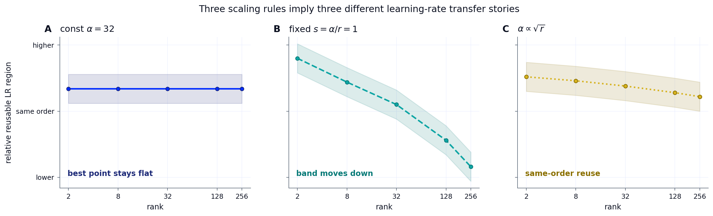
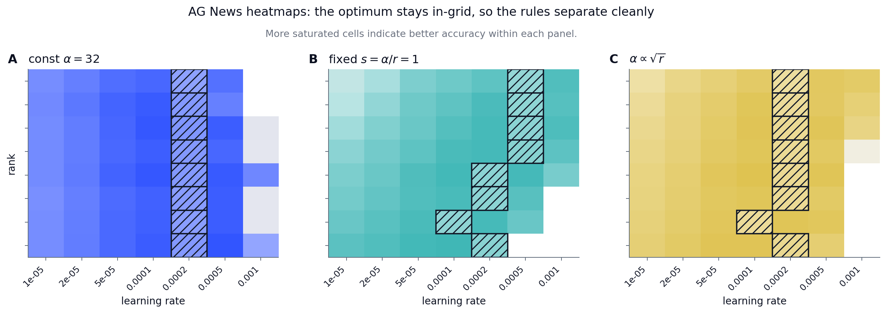
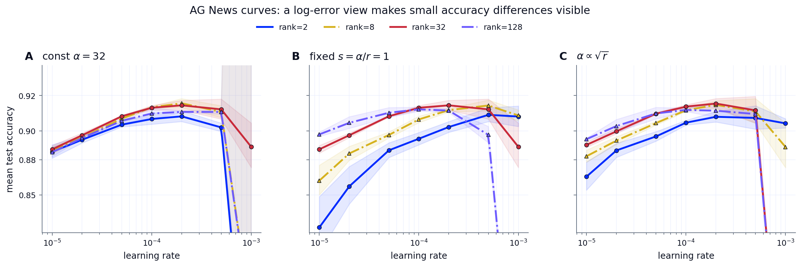
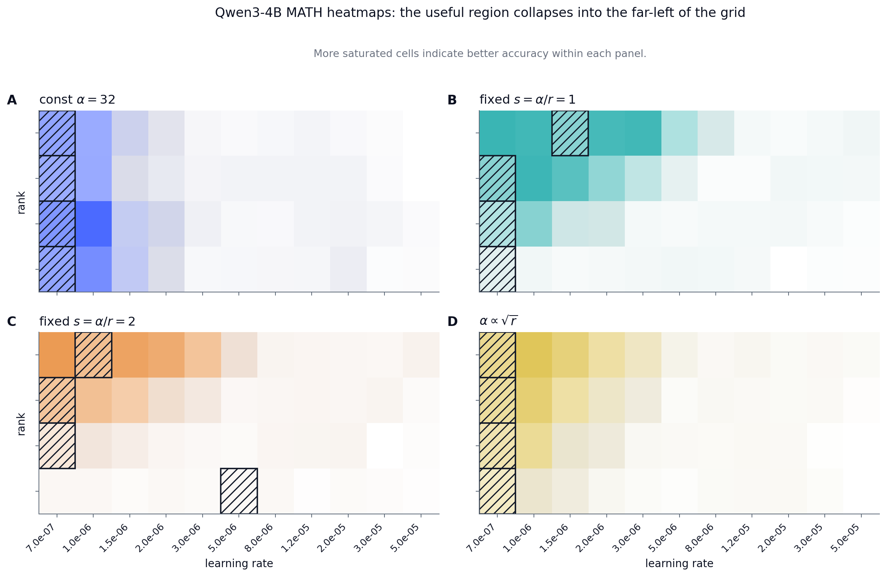
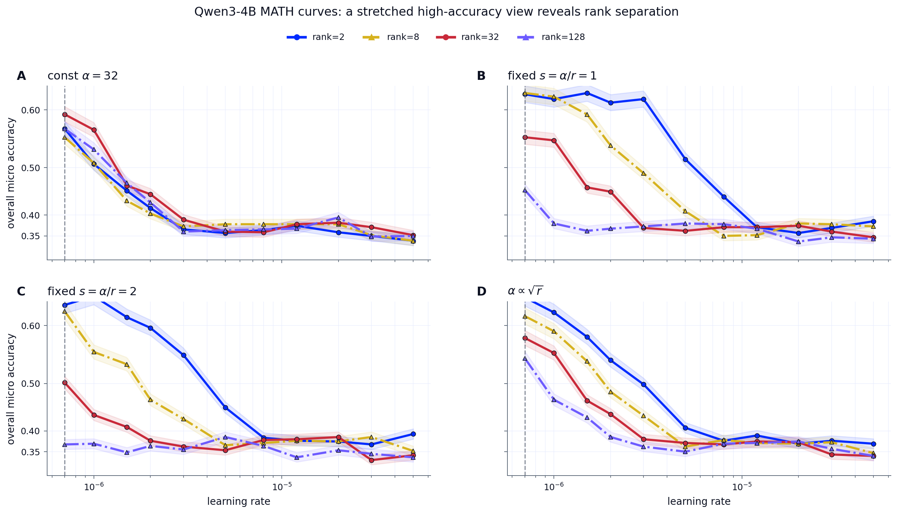

# Scale Down: 작은 어댑터를 안정적으로 쓰는 운영 구간

> 원본: [arxiv.org/abs/2606.02437](https://arxiv.org/abs/2606.02437)

Scale Up이 강한 공유 prior를 확보하는 문제였다면, Scale Down은 그 prior 위에 붙는 로컬 adaptive state를 얼마나 작고 안정적으로 만들 수 있는지 묻는다. 개인화 모델이 한두 번의 실험으로 끝나지 않고 계속 학습, 저장, 평가, 서빙되려면 어댑터는 작아야 하고, 작은 만큼 불안정해지지 않아야 한다.

이 절의 핵심은 "rank를 낮추면 성능이 단조롭게 떨어진다"는 단순한 그림이 아니다. Qwen3-8B PPO sweep은 중간 rank, 초저 rank, 고 rank가 서로 다른 운영 구간이라는 점을 보여준다. 더 작은 어댑터는 비용을 줄이지만, 그 자체로 충분하지 않다. seed 간 안정성, RL에 맞는 초기화, KL 제약 안에서의 업데이트 크기, rank가 바뀌어도 재사용 가능한 하이퍼파라미터 규칙이 함께 필요하다.

## Rank는 용량 노브가 아니라 운영 구간이다

논문은 Qwen3-8B에서 PPO 기반 rank sweep을 수행한다. 실험은 9개 LoRA rank, 4개 batch size, 각 설정당 6개 seed로 구성되어 총 216개 run을 비교한다. 학습은 mixed mathematics corpus의 verifiable reward를 사용하고, 500-step PPO schedule로 고정된다.

관찰된 구간은 세 가지다.

| 구간 | rank | 해석 |
|---|---:|---|
| deployment default | 16, 32 | 평균 gain, downside risk, token efficiency의 균형이 가장 좋다. |
| low-rank frontier | 1-4 | best seed는 강하지만 평균과 seed 안정성이 약하다. |
| high-rank warning | 64 이상 | footprint는 커지지만 best-run frontier는 크게 올라가지 않는다. |

ranks 16/32가 현재 배포 기본값으로 제안되는 이유는 성능이 가장 높아서만이 아니다. 평균 성능이 좋고, seed 간 변동이 상대적으로 작으며, 실패 위험이 낮다. 운영 관점에서 중요한 값은 최고점 하나가 아니라 같은 recipe를 반복했을 때 다시 얻을 수 있는 성능이다.

반대로 ranks 1-4는 실패 구간으로 읽으면 안 된다. low-rank run의 best seed는 ranks 16/32의 best run에 근접한다. 문제는 ceiling이 낮은 것이 아니라, 그 ceiling에 안정적으로 도달하지 못한다는 점이다. 이 차이는 Scale Down의 방향을 바꾼다. rank를 올려서 표현력을 늘리는 대신, 작은 subspace를 더 잘 쓰게 만드는 초기화와 안정화가 핵심 과제가 된다.

## Best-vs-mean separation이 말하는 것

논문이 강조하는 판단 기준은 best score와 mean score의 분리다. best score는 해당 rank가 강한 solution에 도달할 수 있는지를 보여준다. mean score는 그 도달이 seed에 덜 의존하는지를 보여준다. low-rank에서 best frontier가 유지되는데 mean이 떨어진다면, 병목은 순수 capacity보다 optimization reliability에 가깝다.

이 분리는 실제 의사결정에서 중요하다. rank 1이 한 번 잘 된다는 사실만으로 배포 가능한 recipe가 되지는 않는다. 그러나 rank 1이 한 번도 잘 되지 않는 경우와는 전혀 다르다. 전자는 안정화 문제이고, 후자는 표현력 한계 문제다. 논문의 sweep은 전자에 더 가깝다는 증거를 제시한다.

또 하나의 비용 변수는 batch size다. sweep은 PPO step 수를 고정했기 때문에 batch size가 커질수록 소비 token도 같이 늘어난다. 평균 gain은 다소 좋아질 수 있지만, token cost와 downside risk도 함께 증가한다. 따라서 batch size는 단순한 최적화 노브가 아니라 adapter search budget의 일부다.

이 구조는 작은 어댑터의 장점을 다시 정의한다. 작은 어댑터는 한 모델을 싸게 만드는 데서 끝나지 않는다. 더 많은 seed, 더 넓은 ablation, 더 촘촘한 variance 확인을 가능하게 한다. low-rank frontier가 필요한 것도 이 지점이다. 작은 어댑터의 반복 실험 비용이 낮아야, 운 좋은 run과 재현 가능한 regime을 분리할 수 있다.

## RL에서는 초기화도 trust-region 문제다

rank가 극단적으로 작아지면 초기화의 의미가 커진다. rank 1 LoRA는 각 weight matrix에 대해 사실상 하나의 adaptive direction만 가진다. 이 방향이 task signal과 맞지 않으면 다른 방향으로 학습을 분산할 여지가 없다.

표준 LoRA의 업데이트는 보통 다음처럼 쓴다.

$$
\Delta W = \frac{\alpha}{r}BA
$$

rank가 충분히 크면 random direction의 집합이 어느 정도 탐색 여지를 제공한다. 그러나 rank 1에서는 random initialization 하나가 전체 adaptive subspace가 된다. 그래서 pretrained weight의 SVD 구조를 이용해 더 의미 있는 방향을 고르는 접근이 자연스럽다.

문제는 supervised fine-tuning에서 좋은 SVD 기반 초기화가 RL에 그대로 맞지 않는다는 점이다. PiSSA는 principal singular direction을, MiLoRA는 minor singular direction을 사용하지만, RL with verifiable rewards에서는 초기 policy movement가 너무 커지면 rollout policy와 update policy의 간격이 벌어진다. token-level surrogate가 유효하려면 업데이트된 정책 $\pi_\theta$가 rollout을 만든 정책 $\mu$에 충분히 가까워야 한다.

이를 논문은 KL leash로 설명한다. sequence-level importance ratio는 token ratio의 곱으로 분해되기 때문에 길이가 길수록 작은 차이도 크게 증폭된다. 예를 들어 각 token ratio가 1.01이어도 $1.01^{512} \approx 163$이 된다. 그래서 PPO류 objective는 clipping, KL penalty, trust-region에 의존하고, 초기화는 단순한 수렴 속도 문제가 아니라 policy-space 이동량을 관리하는 장치가 된다.

이 관점에서 나쁜 초기화는 두 가지 방식으로 실패한다.

- 의미 없는 방향을 골라 rank 1의 적은 자유도를 낭비한다.
- 의미 있는 방향을 골랐더라도 singular value scaling이 커서 초반 KL budget을 소모한다.

## OLoRA-tail: minor subspace를 쓰되 scale은 낮춘다

OLoRA-tail은 이 문제를 겨냥한 RL-native initialization이다. pretrained weight를 $W_0 = U \Sigma V^\top$로 분해하고, 가장 작은 singular value에 대응하는 tail singular vectors를 사용한다. 핵심은 minor subspace의 geometry는 쓰되, MiLoRA처럼 singular value scaling을 factor에 주입하지 않는다는 점이다.

직관은 간단하다. principal subspace는 pretrained representation의 민감한 축일 가능성이 높다. 이 축을 RL update로 건드리면 작은 parameter movement가 큰 distribution shift를 만들 수 있다. 반면 minor subspace는 상대적으로 inert한 방향이라, policy를 급격히 흔들지 않고 학습 signal을 받을 여지가 있다.

논문은 OLoRA와 OLoRA-tail을 DAPO objective에서 비교한다. OLoRA는 step 100 이후 reward가 무너지고 KL divergence가 크게 증가한다. OLoRA-tail은 reward와 KL을 안정적으로 유지한다. 같은 orthogonal initialization 계열이라도 어느 singular subspace를 쓰고, scaling을 어떻게 제어하는지가 RL에서는 결정적이라는 뜻이다.

rank 16 비교에서도 OLoRA-tail은 LoRA보다 평균 accuracy가 높다. 더 중요한 결과는 rank 1이다. Qwen3-8B에서 OLoRA-tail은 batch size와 무관하게 약 +20% gain을 유지하는 반면, 표준 LoRA는 batch size가 커질수록 +15%에서 -18%까지 악화된다. collapse risk도 표준 LoRA에서 크게 나타난다.

Qwen3-30B-A3B-Instruct에서도 OLoRA-tail의 평균 pass rate는 35.5%로, 표준 LoRA의 24.0%를 11.5 percentage point 앞선다. 이 결과는 "rank 1이 항상 충분하다"는 주장이 아니다. 더 정확한 해석은 rank가 방향의 수를 정하고, 초기화가 그 방향의 사용 가능성을 정한다는 것이다. OLoRA-tail은 trainable weights, optimizer state, checkpoint size, serving footprint를 늘리지 않고 usable capacity를 올린다.

## Hyperparameter transfer: rank, alpha, learning rate를 함께 봐야 한다

Scale Down의 마지막 병목은 tuning 비용이다. 개인화 모델을 수천, 수백만 개 학습해야 한다면 매 어댑터마다 rank, alpha, learning rate를 새로 sweep할 수 없다. 특히 LoRA에서는 세 값이 서로 묶여 있다.

LoRA 업데이트가 $\Delta W = \frac{\alpha}{r}BA$이고, 표준 초기화에서 $A$는 random, $B=0$이라고 하자. learning rate를 $\eta$로 두면 첫 effective movement는 대략 $\eta \alpha / r$ 항의 영향을 받는다. 완전한 AdamW dynamics를 설명하는 식은 아니지만, 초반 업데이트 크기가 rank와 alpha rule에 어떻게 의존하는지 보여주는 proxy로 충분하다.

논문은 세 가지 alpha convention을 비교한다.

| alpha rule | 기대되는 전이 특성 |
|---|---|
| fixed $\alpha/r$ | rank가 커질수록 effective update가 커져 learning rate를 낮춰야 한다. |
| fixed $\alpha$ | rank 증가에 따른 update 변화가 상대적으로 완만하다. |
| $\alpha \propto \sqrt{r}$ | early update의 rank 의존성을 줄여 same-order learning-rate reuse를 돕는다. |

*원문 Figure 16. 세 가지 alpha scaling rule은 rank가 바뀔 때 learning-rate reusable region이 서로 다르게 이동함을 요약한다.*

Figure 17은 AG News에서 이 차이를 더 구체적으로 보여준다.

| 그림 | 읽는 법 | 핵심 관찰 |
|---|---|---|
| heatmap | rank와 learning rate grid에서 좋은 영역의 위치 | alpha rule마다 band 이동 방향이 다름 |
| curve | best-point reuse와 transfer quality를 분리 | 같은 LR 재사용 가능성과 성능 유지는 별개 |

단순 분류 task에서는 fixed $\alpha$가 꽤 평평하게 보인다. 반면 fixed $\alpha/r$은 rank가 커질수록 effective update가 커지므로, 좋은 learning-rate region이 더 낮은 값으로 내려간다.

*원문 Figure 17(a). AG News heatmap은 alpha rule에 따라 rank별 좋은 learning-rate band가 다르게 움직인다는 점을 보여준다.*

*원문 Figure 17(b). 같은 best learning rate를 재사용할 수 있는지와, 재사용했을 때 성능이 유지되는지는 별개의 문제다.*

population-scale PEFT에서 필요한 것은 best point 하나가 아니라 운영 가능한 전이 규칙이다.

- adapter 수가 많아질수록 매번 grid search를 반복하기 어렵다.
- storage나 serving 제약 때문에 rank가 바뀔 수 있다.
- rank가 바뀌어도 같은 order의 learning rate를 쓸 수 있어야 recipe가 플랫폼화된다.

AG News만으로는 결론이 약하다. task가 쉬우면 여러 alpha rule이 비슷하게 작동할 수 있고, reusable band가 넓어 보인다. 그래서 논문은 Qwen3-4B MATH transfer에서 같은 질문을 다시 본다.

| 설정 | band 특성 | rule 차이 |
|---|---|---|
| AG News | 비교적 넓음 | 여러 rule이 비슷하게 보일 수 있음 |
| Qwen3-4B MATH | 훨씬 좁음 | high rank에서 rule 간 차이가 커짐 |

*원문 Figure 18(a). Qwen3-4B MATH heatmap에서는 유용한 learning-rate region이 좁아져 transfer rule 선택이 더 중요해진다.*

*원문 Figure 18(b). harder reasoning setting에서는 square-root alpha rule이 same-order reuse와 high-rank 성능을 더 균형 있게 유지한다.*

Qwen3-4B MATH에서의 결론은 다음과 같다.

- square-root alpha rule: same-order LR reuse와 high-rank 성능을 가장 균형 있게 유지한다.
- fixed $\alpha$: 쉬운 setting에서는 평평하지만, reasoning setting에서는 transfer quality가 약해질 수 있다.
- fixed $\alpha/r$: low rank에서는 강하게 보일 수 있으나, rank가 커질수록 band가 아래로 밀려 재사용성이 떨어진다.

따라서 중요한 것은 "최적 learning rate 하나"가 아니라 reusable band다. 겉으로 같은 rank와 learning rate를 보고 있어도 alpha convention이 다르면 초반 update magnitude가 달라진다. rank만 적은 recipe는 불완전하다.

운영 관점의 결론은 명확하다.

- rank 추천에는 alpha rule이 함께 적혀야 한다.
- learning rate 추천에는 rank context가 필요하다.
- alpha rule에는 rank 변경 시 learning-rate band가 어떻게 이동하는지에 대한 transfer policy가 필요하다.

rsLoRA가 제안한 $\alpha \propto \sqrt{r}$ 규칙은 이론적으로 rank-dependent update magnitude를 완화한다. 논문의 기여는 이 규칙을 더 어려운 reasoning fine-tuning setting에서 검증하고, alpha rule 선택이 이론적 정규화뿐 아니라 실제 transfer quality에 영향을 준다는 점을 보여준 데 있다.

## δ-mem으로 넘어가는 지점

지금까지의 논의는 static LoRA 안에서의 Scale Down이다. 즉 adaptive state는 학습 후 고정된 low-rank parameter patch이고, 핵심 질문은 rank를 얼마나 낮출 수 있는가다. 그러나 개인화 모델에서는 adaptive state가 interaction history를 반영해 계속 바뀌어야 한다.

논문은 이 확장을 위해 δ-mem을 짧게 제시한다. δ-mem은 frozen full-attention Transformer에 compact online associative-memory state를 붙인다. ordinary LoRA가 학습 후 같은 $\Delta W$를 계속 적용한다면, δ-mem은 token 처리 중 이전 memory state를 읽고, attention computation에 low-rank correction을 만들고, delta-rule로 현재 정보를 다시 쓴다.

핵심은 Scale Down이 parameter count만의 문제가 아니라 state design 문제가 된다는 점이다. 같은 trainable budget이라도 언제 쓰는지, 무엇을 쓰는지, state를 하나로 둘지 여러 개로 나눌지에 따라 behavior가 달라진다. 논문은 Qwen3-4B-Instruct에서 δ-mem variant가 평균 score를 base 46.79%에서 51.66%까지 올리고, token-state 및 sequence-state variant가 약 4.87M trainable parameters, 즉 backbone의 약 0.12%만 사용한다고 보고한다.

이 내용은 다음 편의 Context Learning 논의로 이어진다. 작은 어댑터가 안정적으로 학습될 수 있다면, 다음 질문은 무엇을 그 작은 state에 쓸 것인가다. Context Learning은 context-time improvement를 future query-only behavior로 옮기는 write policy로 등장한다.

## 정리

Scale Down의 메시지는 압축률 하나로 정리되지 않는다. 작은 어댑터를 운영하려면 네 가지 조건이 함께 맞아야 한다.

- rank sweep에서 현재 안정적인 기본값은 ranks 16/32다.
- ranks 1-4는 실패 구간이 아니라 best-vs-mean separation이 큰 low-rank frontier다.
- RL-native initialization은 KL leash 안에서 의미 있는 방향을 고르는 문제이며, OLoRA-tail은 rank-1 안정화의 강한 증거를 제공한다.
- rank, alpha, learning rate는 함께 이동해야 하며, square-root alpha rule은 harder reasoning setting에서 재사용 가능한 band를 만드는 실용적 규칙이다.

결국 작은 adaptive state의 목표는 한 번의 benchmark score가 아니다. 강한 공유 prior 위에서 반복 학습 가능한 개인화 단위를 만드는 것이다. 이 단위가 충분히 작고 안정적일 때, 다음 문제는 그 안에 어떤 기억과 행동 state를 쓸 것인지가 된다.

다음 편: [메모리와 Context Learning: 무엇을 파라미터에 쓸 것인가](04-memory-and-context-learning.md)

## 출처

- [arxiv.org/abs/2606.02437](https://arxiv.org/abs/2606.02437)
