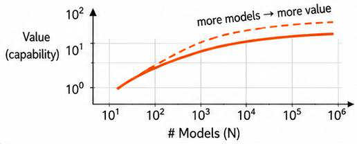
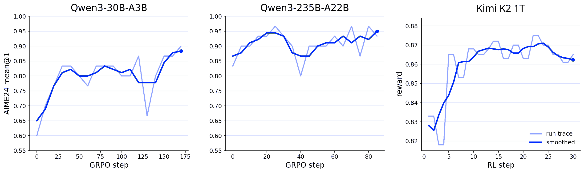

# Scale Out과 MinT: 백만 개 어댑터를 시스템으로 다루기

> 원본: [arxiv.org/abs/2606.02437](https://arxiv.org/abs/2606.02437)

앞선 편들이 한 개인의 어댑터가 무엇을 배울 수 있는지, 또 그 상태를 얼마나 작게 만들 수 있는지를 다뤘다면, 마지막 축인 Scale Out은 질문의 단위를 바꾼다. 이제 핵심은 "어댑터 하나가 유용한가"가 아니라 "많은 어댑터가 동시에 존재할 때 무엇이 가능해지는가"다. 논문은 이 축을 사용자 시뮬레이터, 집단 지능, 그리고 MinT라는 시스템 계층으로 연결한다.

여기서 중요한 점은 Scale Out이 단순한 저장소 크기 문제가 아니라는 것이다. 백만 개의 LoRA 파일을 디스크에 둘 수 있다는 사실만으로는 개인 모델 인프라가 만들어지지 않는다. 각 어댑터가 어떤 기반 모델에 붙는지, 어떤 이력에서 학습됐는지, 어떤 버전이 평가와 서빙에 쓰였는지, 지금 GPU에 있는지 CPU 캐시에 있는지 공유 저장소에만 있는지를 분리해서 관리해야 한다.

## 프롬프트 기반 사용자 시뮬레이터의 붕괴

LLM 기반 사회 시뮬레이션은 보통 하나의 모델에 여러 persona prompt를 붙여 많은 사용자를 흉내 낸다. Generative Agents나 OASIS 같은 계열의 시스템은 이 방식으로 그럴듯한 행동, 기억, 반응을 만들 수 있음을 보여줬다. 그러나 논문이 지적하는 한계는 명확하다. 프롬프트는 행위자의 설명을 바꾸지만, 그 행동을 생성하는 학습된 policy 자체를 바꾸지는 않는다.

이 차이는 반복 상호작용에서 커진다. 여러 persona가 표면적으로는 다른 문체와 입장을 보이더라도, 장기적으로는 같은 기반 모델의 평균적인 응답 성향으로 수렴할 수 있다. 논문은 이를 prompt-based simulator collapse로 본다. 사회 현상에서 중요한 것은 순간적인 말투 차이가 아니라 지속되는 이견, 과거 경험, 선호, 반응 방식, 행동 습관이다.

특히 다음과 같은 현상은 안정적인 이질성이 없으면 잘 재현되지 않는다.

- 에코 체임버와 집단 극화
- 소수 의견의 후퇴 또는 생존
- 선호 전파와 cascade
- 커뮤니티 규범의 형성
- 추천 시스템 개입에 따른 장기 반응
- 도구 사용, 회피, 실패 복구 방식의 차이

논문의 해법은 사용자마다 독립된 LoRA 어댑터를 두는 것이다. 공유 기반 모델은 공통 언어 능력과 추론 능력을 제공하고, per-user adapter는 각 사용자의 이력에서 학습된 policy state를 보존한다. 이 구조에서는 한 모델이 여러 역할을 연기하는 것이 아니라, 하나의 공유 prior 위에 여러 지속적 행위자가 존재한다.

## Per-user Adapter가 만드는 사회적 구조

논문은 OASIS 환경에서 per-user LoRA agent와 shared-base agent를 비교한다. 모집단은 c8 게임 개발 커뮤니티에서 샘플링하고, 사용자 수는 $N \in \{128, 256, 512\}$로 늘린다. LoRA 조건에서는 각 사용자에게 과거 트윗 80개로 학습한 rank-4 어댑터를 붙이고, 대조군은 같은 Qwen3-4B-Instruct 기반 모델에서 모든 agent가 결정을 샘플링한다.

핵심은 노출 조건을 통제했다는 점이다. 추천기, decision prompt, follow graph, stance seed post, 초기 polarization distance를 고정했고, cross-side exposure도 대략 $0.16$에서 $0.18$ 사이로 유지했다. 따라서 결과 차이는 feed가 달랐기 때문이 아니라, 같은 노출에 대해 agent가 어떻게 반응했는지에서 나온다.

결과는 세 층에서 나타난다.

| 층위 | 관찰된 변화 | 해석 |
|---|---:|---|
| 정체성 지속성 | LoRA 조건에서 stance dispersion이 더 큼 | 각 사용자가 같은 평균 policy로 수렴하지 않음 |
| 활동성 | 댓글과 원글 생성이 shared-base보다 많음 | 개인 policy 차이가 행동량과 행동 종류를 바꿈 |
| 토폴로지 | effective interaction communities가 $9.21 \rightarrow 14.85$로 증가 | 단순 이벤트 수가 아니라 상호작용 구조가 커짐 |

within-community side-homophily는 $0.670 \rightarrow 0.583$으로 낮아졌다. 이는 커뮤니티가 원래의 찬반 진영만 따라 나뉘는 것이 아니라, 더 복잡한 co-engagement 구조를 만든다는 뜻이다. 논문은 이 결과를 보편적인 사회 시뮬레이션 법칙으로 단정하지 않는다. 한 커뮤니티, 한 추천 메커니즘, 제한된 seed에서 얻은 결과이기 때문이다. 그래도 Scale Out의 핵심 메커니즘은 분리된다. 시뮬레이션의 단위는 더 이상 prompt가 아니라, 이력과 반응 prior를 가진 persistent actor다.

## 다양성은 샘플링 노이즈가 아니다

Scale Out의 두 번째 주장은 더 직접적이다. 많은 개인 모델이 공존하면, 다양성 자체가 계산 자원이 될 수 있다. 서로 다른 어댑터는 서로 다른 학습 순서, masking, checkpoint timing, stochasticity를 거치며 다른 오류와 다른 풀이 경로를 갖는다. 이 차이를 voting이나 routing으로 모으면 단일 모델의 repeated sampling보다 더 오래 성능이 증가할 수 있다.

논문은 Qwen3-30B 기반에서 여러 LoRA variant를 학습하고, AIME24 문제에 대해 majority vote를 수행한다. Collaboration은 서로 다른 LoRA 모델들의 답을 모으는 조건이고, Repetition은 같은 모델에서 여러 번 샘플링하는 조건이다. 평가와 학습 recipe, answer extraction, correctness pipeline은 고정했고, 빈 답은 투표에서 제외했다.

*원문 Figure 20. Scale Out에서는 모델 수가 단순한 저장 개수가 아니라, 다양성에서 나오는 value의 축이 된다.*

수치가 이 주장을 압축한다. Collaboration accuracy는 $k=1$에서 $0.3644$, $k=10$에서 $0.4267$, $k=100$에서 $0.4633$, $k=198$에서 $0.4867$까지 올라간다. 최종 baseline accuracy $0.3727$ 대비 최대 증가는 약 $+0.1140$이다. 반면 Repetition은 초기에 개선되지만 $k=24$에서 $0.4378$ 정도로 먼저 포화된다. 큰 $k$에서 Collaboration advantage는 약 $+0.0533$까지 벌어진다.

논문은 Collaboration curve가 관찰 구간에서 $k$에 선형이 아니라 $\ln(k)$에 거의 선형이라고 정리한다.

$$
\mathrm{Accuracy}(k) \approx a + b \ln k,\quad R^2 \approx 0.888
$$

이 식을 보편 법칙으로 읽으면 곤란하다. 더 큰 모델, 다른 과제, 다른 adapter 생성 방식에서도 같은 계수가 유지된다는 증거는 아니다. 하지만 연구 대상으로서의 의미는 크다. 이제 정확도를 단일 모델의 함수로만 보는 것이 아니라, 구별되는 adapter population의 크기와 다양성의 함수로 측정할 수 있다.

## 한 모델이 아니라 모델 분포를 최적화하기

이 실험이 PEFT 없이 어려운 이유는 명확하다. 200개의 full checkpoint를 학습하고, 저장하고, 서빙하고, 임의 부분집합을 여러 번 평가하는 것은 비용과 운영 측면에서 부담이 크다. LoRA는 각 variant를 같은 prior의 가벼운 변형으로 만들기 때문에, 모델 분포 자체를 실험할 수 있게 한다.

이 관점에서는 "최고의 모델 하나"만이 목표가 아니다. 운영자는 여러 adapter를 클러스터링하고, 특정 유형의 문제에는 특정 subpopulation을 라우팅하고, vote나 debate를 구성하고, 좋은 subpopulation의 행동을 다시 distill할 수 있다. 개인화도 마찬가지다. 개인별 history가 만든 차이는 단순한 편차가 아니라, 나중에 집단적으로 활용할 수 있는 계산 자산이 된다.

## MinT가 필요한 이유

Scale Out을 실제 시스템으로 만들려면 어댑터를 파일이 아니라 lifecycle object로 봐야 한다. 논문은 이 역할을 MinT로 설명한다. MinT는 Mind Lab의 PEFT population 인프라 예시로, 큰 dense 또는 MoE base를 resident 상태로 유지하고, LoRA adapter를 behavior-carrying policy state로 다룬다.

문제는 세 축 모두에서 생긴다.

| 축 | 시스템 계층이 없을 때의 실패 |
|---|---|
| Scale Up | 강한 prior를 한 번은 학습하지만, rollout, scoring, export, serving 사이에서 같은 policy였는지 추적하지 못함 |
| Scale Down | 학습은 adapter로 했지만 배포 때 full merged checkpoint를 이동해야 해서 population이 base-model copy로 증가함 |
| Scale Out | 많은 adapter file은 있지만, 선택, 적재, eviction, 평가, rollback이 가능한 지속적 identity가 없음 |

MinT의 기본 단위는 raw adapter weight가 아니다. policy record, policy session, adapter revision, serving residency가 분리된다. 논문은 이 관계를 lifecycle 도표로 설명하지만, 여기서는 파일 매핑 혼동을 피하기 위해 표와 개념 중심으로 요약한다.

policy record는 한 adapted behavior의 지속적 identity다. 여기에는 base version, LoRA rank, target modules, checkpoint state, rollout records, exported revisions가 묶인다. policy session은 trainer 위에 일시적으로 복원된 상태이며, adapter tensor, optimizer moment, scheduler position, gradient, rollout metadata를 포함한다. adapter revision은 평가와 서빙에서 선택되는 고정된 PEFT artifact다. serving residency는 이 revision이 공유 저장소에만 있는지, CPU cache에 있는지, GPU batch slot에 올라와 있는지를 나타내는 placement fact일 뿐이다.

이 분리는 개인 모델의 감사 가능성과 rollback 가능성을 만든다. 어떤 행동이 어떤 버전에서 나왔는지, 어떤 base와 호환되는지, 어떤 rollout 기록에서 학습됐는지, 지금 사용자에게 노출 가능한지 추적할 수 있어야 personal model population이 운영 대상이 된다.

## Provenance: 큰 prior를 반복해서 학습하려면

Scale Up 관점에서 MinT의 핵심은 computation provenance다. 강한 기반 모델이 어댑터 학습에 유용하려면, trajectory를 생성한 policy와 학습 시 확률을 계산하는 policy, 그리고 나중에 서빙되는 policy가 같은 adapted behavior를 가리켜야 한다. 특히 MoE 모델에서는 routing decision이 계산 경로 자체를 바꾸기 때문에 이 문제가 더 민감하다.

예를 들어 rollout 중 어떤 token이 특정 expert 경로를 거쳐 생성됐는데, 학습 시 scoring에서는 다른 expert로 라우팅된다면 policy-gradient term은 원래 샘플링된 policy를 평가하지 않는다. MinT는 backend가 route 정보를 노출할 때 expert id를 기록하고, training layout에서 매핑 가능한 경우 이를 replay한다. route id가 없거나 매핑할 수 없으면 해당 token을 동일하다고 가정하지 않고 replayed policy-gradient term에서 제외한다.

Dynamic sparse attention도 비슷한 provenance 경계를 만든다. indexer, top-k path, RoPE layout, query/key normalization, deterministic top-k 여부가 달라지면 rollout과 training scoring의 확률이 어긋난다. MinT는 드러난 mismatch를 고치고, 남는 확률 mismatch는 IcePop-style correction으로 trusted band 밖 token ratio를 mask한다. 이 장치의 목적은 모든 내부 결정을 완벽히 복원하는 것이 아니라, 안전하지 않은 scoring term을 업데이트에 섞지 않는 것이다.

*원문 Figure 26. MinT 평가의 MoE LoRA RL 곡선. 30B와 235B는 AIME24 mean@1, Kimi K2 패널은 1T-class countdown-task LoRA RL reward curve를 보여준다.*

## Adapter-only Mobility: 작은 상태가 실제로 이동해야 한다

Scale Down은 학습 parameter 수가 작다는 말만으로 충분하지 않다. 작은 adaptive state가 trainer에서 sampler, evaluator, serving runtime으로 실제 이동 가능한 artifact여야 한다. MinT는 이 경계를 exported adapter revision으로 둔다. full fine-tuning이나 merge-based LoRA 방식에서는 variant마다 full checkpoint가 이동하지만, MinT에서는 inference engine이 호환되는 base를 이미 들고 있고 adapter revision만 이동한다.

논문이 제시한 handoff 숫자는 직관적이다.

| 모델 | adapter artifact | merged/full artifact | 차이의 의미 |
|---|---:|---:|---|
| Qwen3-4B | rank-32 LoRA 252 MiB | full model 8.061 GB | 배포 단위가 base copy가 아니라 local state가 됨 |
| Qwen3-30B | rank-16 LoRA 1.692 GB | full model 61.084 GB | population 증가가 full checkpoint 증가로 이어지지 않음 |

이 비율 자체는 보편 상수가 아니다. rank, target module, dtype, tensor layout에 따라 달라진다. 중요한 불변식은 이동하는 crossing artifact가 full prior가 아니라 local adaptive state라는 점이다. 그래서 MinT에서 Scale Down은 수학적으로 작은 업데이트일 뿐 아니라, 평가, 서빙, rollback을 통과할 수 있는 작은 시스템 객체가 된다.

## Bounded Residency: 백만 개가 모두 GPU에 있는 것은 아니다

논문이 가장 명확히 선을 긋는 부분은 "million personal models of trillion parameters"의 의미다. 이는 각 사용자가 별도의 trillion-parameter checkpoint를 소유하거나, 하나의 inference engine이 백만 개 adapter를 GPU에 동시에 올린다는 뜻이 아니다. 소수의 강한 trillion-scale base model이 공유 능력을 제공하고, 수많은 경량 adapter revision이 개인의 기억, 선호, skill, policy 일부를 담는 구조다.

MinT는 이를 addressability와 residency의 분리로 구현한다. handoff, residency, readiness는 그림보다 숫자로 읽는 편이 안전하다. 핵심은 adapter revision이 이름 붙은 상태로 존재하되, 요청 시점에는 GPU batch slot, CPU cache, 공유 저장소 중 한 곳에만 놓일 수 있다는 점이다.

서빙 상태는 세 계층으로 나뉜다.

| 계층 | 논문의 측정 또는 bound | 의미 |
|---|---:|---|
| addressable catalog | $10^6$ entry packed adapter catalog | 백만은 동시 GPU residency가 아니라 주소 지정 가능한 population 규모 |
| CPU adapter cache | 512 hotset에서 369개 loaded, 2048 weak-locality에서 550개 loaded | 반복 트래픽을 공유 저장소 접근 전에 흡수 |
| GPU batch slots | 같은 batch window에서 64 distinct adapters | 실제 decode step의 adapter diversity는 가장 작은 창 |
| cold loading | 16 cache miss가 1.375-23.267초 load staircase 형성 | missing policy admission은 명시적 service work |

이 분리는 운영상의 현실을 드러낸다. 백만 개 policy가 존재할 수 있으려면, 모두가 뜨거운 상태일 필요가 없다. 대신 catalog lookup, locality-aware routing, CPU cache, GPU batch slot, cold activation, eviction이 서로 다른 규모로 설계되어야 한다.

## Readiness와 Packed Loading

Scale Out에서 새 adapter를 등록하는 순간 바로 사용자 요청에 노출하면 기존 warm tenant가 피해를 볼 수 있다. 논문은 hot-reload와 readiness gate를 통해 이 문제를 측정한다. admission이 꺼져 있으면 기존 warm traffic의 post-reload TTFT p95가 24.03초까지 올라가고, 20초 초과 stall이 10번 발생한다. admission을 켜면 warm tenant는 보호되지만, 새 cold request가 activation 뒤에서 기다린다.

two-phase readiness는 계약을 바꾼다. adapter를 먼저 등록하고 prewarm한 뒤, 준비된 다음에 사용자에게 노출한다. 측정값에서는 기존 warm TTFT p95가 9.63초로 유지되고 20초 초과 stall은 없으며, ready-path 첫 요청은 load p95 0.00초, TTFT p95 4.60초를 보인다. 대신 prewarm span은 409.04초다. 즉 빠른 등록과 빠른 사용자-visible serving은 같은 사건이 아니다.

또 다른 병목은 byte 크기가 아니라 tensor object fanout이다. packed MoE LoRA는 file size를 110.75 MB에서 105.58 MB로 조금만 줄이지만, tensor object 수를 37,248개에서 672개로 줄인다. 그 결과 tensor read는 54.8배, loader object build는 29.5배 빨라지고, live engine loading은 $N=4,8,16$에서 8.5-8.7배 빨라진다. cold path는 단순 bandwidth 문제가 아니라 representation 문제이기도 하다.

## 결론: 개인 모델은 full checkpoint가 아니라 지속적 identity다

논문의 결론은 PEFT를 cheap fine-tuning으로만 보지 말자는 것이다. PEFT가 중요한 이유는 강한 공유 prior 위에서 작은 adaptive state를 반복적으로 쓰고, 많은 개인 state를 population으로 관리할 수 있게 하기 때문이다. 한 개인 모델은 full checkpoint가 아니라, 공유 base 위에서 이어지는 policy identity다.

따라서 "million personal models of trillion parameters"는 다음과 같이 읽어야 한다.

- trillion-scale base는 일반 추론, 세계 지식, 언어 능력, tool-use prior를 제공한다.
- 개인별 adapter는 반복 경험의 결과 일부, 즉 기억, 선호, skill, policy tendency를 담는다.
- MinT 같은 시스템은 이 adapter를 policy record와 revision으로 이름 붙이고, provenance와 평가 이력을 보존한다.
- serving system은 백만 개를 모두 resident로 두지 않고, addressable catalog와 bounded working set으로 다룬다.

남는 연구 문제도 이 구조에서 나온다. 작은 adapter가 seed와 batch 변화에도 안정적으로 학습되는지, 어떤 경험을 adapter에 쓰고 어떤 사실은 retrieval에 남겨야 하는지, per-user adapter population이 장기 시뮬레이션에서도 heterogeneity를 유지하는지, routing과 voting과 distillation이 model count에 따라 어떻게 scaling되는지는 아직 열린 문제다.

그래도 마지막 메시지는 분명하다. 하나의 보편 assistant에 더 긴 context를 계속 붙이는 것만이 개인화의 전부는 아니다. 강한 foundation model 하나가 많은 persistent personal model instance를 떠받치고, 그 차이들이 사용자 시뮬레이션과 집단 추론의 자원이 되는 구조가 가능하다. Scale Out은 그 구조를 연구 대상으로 만들고, MinT는 그 구조가 시스템적으로 어떤 이름, 버전, 이동성, residency, readiness를 필요로 하는지 보여준다.

## 출처

- 원문: https://arxiv.org/abs/2606.02437
